

 data-protection-list
=============================================

Manual of resistance to surveillance capitalism

# Index

* [0 Comments about fork](#0-comments-about-fork)
* [1 Introduction](#1-introduction)
* [2 Golden rules](#2-golden-rules)
* [3 Computer](#3-computer)
* [3-1 Operating Systems](#3-1-operating-systems)
* [3-2 Services and programs](#3-2-services-and-programs)
* [4 Smartphone](#4-smartphone)
* [4-1 Operating Systems](#4-1-operating-systems)
* [4-2 Applications](#4-2-applications)
* [5 Browsers](#5-browsers)
* [5-1 Firefox](#5-1-firefox)
* [5-2 Tor Browser](#5-2-tor-browser)
* [6 Service instances](#6-service-instances)
* [6-1 Searx](#6-1-searx)
* [6-2 Invidious](#6-2-invidious)
* [6-3 Videoconference](#6-3-videoconference)
* [6-4 DNS Servers](#6-4-dns-servers)
* [7 Additional resources (featured sources)](#7-additional-resources-featured-sources)
* [8 Configurations](#8-configurations)
* [8-1 Operating systems](#8-1-operating-systems)
* [8-2 F-Droid](#8-2-f-droid)
* [8-3 Apps and software](#8-3-apps-and-software)
* [8-4 Firefox](#8-4-firefox)

## 0 Comments about fork

I have seen the need to fork this document of **Valentin Delacour** hosted [here](https://codeberg.org/PrivacyFirst/PrivacyFirst/issues) under his approval and license to give it more visibility, readability, comfort, improvement in some aspects and participation. If someone else forks both his and this one, they should do the same

I think that we should share how much more the better and the knowledge about good practices to follow regarding security, privacy and open source that are detailed are no exception.

We are open to changing the format of this document, for now I have thought that this is a good way, but it could be improved.

I don't consider myself an expert on the subject. In fact I do not follow all the recommendations to the letter. But I would like over time to leave aside services that I think I should not use for various reasons, change ways of accessing certain content, use other strategies, etc.

To actively participate you can:

* [Create pull requests](https://github.com/adgellida/data-protection-list/pulls)
* [Generate your questions or incidents](https://github.com/adgellida/data-protection-list/issues)

I recommend you participate in:

* [Official Telegram Group](https://t.me/privacid)
* [Official Discord Group](https://discord.gg/b9ey65Q) - Although due to various privacy and security reasons we do not recommend it.
* Official Element group - #privacidadlibre:matrix.org - Request invitation

The objective of the group is to collectively promote good customs in terms of privacy, security and also open source/free programs/apps, services and operating systems to resist the collection and exploitation of personal data by private companies.

I think that they take advantage of the ignorance of the majority to do things that they should not and benefit from it behind our backs. The good thing is that there are people who realize it because they understand the subject and share it with the community.

This document has been copied 1: 1 with very slight modifications in version 7/12/2020 and from now on it will undergo modifications following the following strategies:

* Following updates of the original file
* Pull requests from the community
* Own discoveries

The most notable improvements are:

* It encourages a more orderly, effective, public participation
* Images of the apps to better identify them
* Links to them to find them quickly

Now, the document begins. Put on your belt curves are coming!

## 1 Introduction

The main objective of this document is to propose tools and alternatives to protect data and privacy from predation by private companies under the current system of surveillance capitalism. Now, follow the following
recommendations also allows to improve, in certain measures, the protection against other entities such as state services or pirates, for example.

This list is intended for all persons aware or aware of the importance of data protection in our society, regardless of your knowledge of the subject. It is not intended for people needing anonymity total part of their function to risks such as political opponents or some journalists, even if some proposed options might suit them. Effectively, privacy does not necessarily equal anonymity.

The list format was chosen in order to make your query as efficient as possible possible. This approach precludes detailing true explanations. So I invite you to look for the ones they need on their own or in additional resources mentioned in point 6 of the document. With the purpose of proposing the more reputable and practical options without being too stuffy, the list does not have to vocation to be exhaustive and remains subjective despite seeking to have the greatest possible objectivity.

This list proposes a first prioritization (order of appearance and presence or not of parentheses) subjective based on the privacy/usability report in order to help them choose between the different options mentioned. A second prioritization (colors) is based solely on estimated privacy:

🟢green (true respect for privacy)

🔵blue (respect for privacy under conditions or presence of a problematic item)

🔴red (does not guarantee privacy but still being preferable to the GAFAM options)

⚫colorless (lack of elements to form an estimate, or a prioritization is not relevant for entry into question). The presence of an asterisk indicates that the mentioned option is still in development phase.

I hope this document will help you improve the protection of your data personal and those of her close ones. Although being the fruit of several years of searches and experiments, this work obviously remains perfectible.
Any suggestion or comment is then more than welcome to the email: "Privacyfirst@ik.me". Several months after the present version of the document, you must assume that certain information given will be obsolete. The document being
frequently updated, you are invited to get the latest version on the following website: “https://codeberg.org/PrivacyFirst/PrivacyFirst/issues”.

## 2 Golden rules

* Avoid using GAFAM services and programs (Google, Amazon, Facebook, Apple and Microsoft) WHENEVER possible. It is best to remove your eventual accounts.
* Always review all the settings and authorizations of what is used and optimize them to limit the collection of personal data as much as possible.
* Only install the necessary programs/applications as they are potential accesses to your personal data.
* Use free/open source programs (their codes are public and also verifiable) instead of proprietary/closed source whenever possible.
* Favor the popular free options over the unknown ones (they will be more reviewed/reliable).
* If a company offers its services for free, in general, the product it sells is you (your personal data). Due to the model imposed by the surveillance capitalism, pay now or protect them from also being the product.
* Update your programs/operating systems frequently to benefit from the latest fixes for exploitable security flaws and think about replacing the ones that no longer seem to be up to date.
* Don't use third-party antivirus, they are true vacuum cleaners of personal data. Their contribution is negligible as long as good numerical habits are maintained.
Prudence and a good configuration are the best antivirus.
* Privilege Web Apps or shortcuts from the browser to access services instead of applications to install to limit access and the possibilities of collecting
personal information.
* Use temporary emails to create accounts for unimportant sites/services.
* Always disable Wi-Fi, Bluetooth, and geolocation on your smartphone when not in use and don't connect to public Wi-Fi without using a VPN.
* Do not use connected objects (their purpose is to collect as much personal data as possible) or not connect them to the internet when they are essential.

## 3 Computer

### 3-1 Operating Systems

Windows is currently the worst operating system in terms of privacy and security. The only OS that is easy to use and truly protecting data are the free (therefore free) Linux distributions. There is a multitude of them whose characteristics vary considerably. Here is a small selection of those offering the best user experience (always respecting privacy) or guaranteeing the best data protection. It should be remembered that each of them proposes one or more interfaces (desktop) different in terms of experience, resource consumption and appearance. There is abundant documentation online to choose which one layout and desktop environment will best suit the capabilities of your computer and your preferences as well as how to easily install it on his computer.

**Desktop :**

🟢[Linux Mint](https://linuxmint.com) : great for beginners

🟢[MX Linux](https://mxlinux.org) : suits beginners

🟢[Parrot Home OS](https://www.parrotsec.org) : improved security and privacy (confirmed users)

🟢[Zorin OS](https://zorin.com/os) : great for beginners coming from Windows or macOS (commercial support)

🟢[Qubes OS](https://www.qubes-os.org) : extreme security (advanced users)

🟢[Whonix](https://www.whonix.org) : anonymity by Tor and extreme security (advanced users)

**USB live (RAM) :**

🟢[MX Linux](https://mxlinux.org) : suits beginners

🟢[Tails](https://tails.boum.org) : anonymity by Tor (confirmed users)

🟢[Parrot Home OS](https://www.parrotsec.org) : improved security and privacy (confirmed users)

**Raspberry Pi :**

🟢[LibreELEC](https://libreelec.tv) : multimedia center for TV

🟢[Batocera](https://batocera.org) : console emulator, retrogaming

🟢[Raspberry Pi OS](https://www.raspberrypi.org/software) : classic operating system

🟢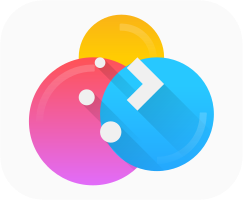[Plasma BigScreen*](https://plasma-bigscreen.org) : multimedia center for TV (voice command with Mycroft AI)

🟢[Nymphcast](http://nyanko.ws/product_nymphcast.php) : free and environmentally friendly alternative to Chromecast

**Hardware :**

The following brands sell computers with Linux preinstalled :

TUXEDO Computers

Slimbook

Librem

System76

Linux Mint

PINE64

ThinkPenguin

Dell (few models)

There are also other lesser-known vendors of computers with Linux preinstalled. Regarding Windows computer vendors
Pre-installed, Dell, Asus, and HP models are reputed to have good Linux compatibility. It is advisable to avoid buying computers that come with an Nvidia graphics card as they are known to suffer from compatibility issues.

### 3-2 Services and programs

Browser :

🔵[Firefox](https://www.mozilla.org)

🟢[Tor Browser](https://www.torproject.org/download)

🟢[LibreWolf*](https://librewolf-community.gitlab.io)

🔴[Brave](https://brave.com)

🔵[Ungoogled Chromium*](https://ungoogled-software.github.io/ungoogled-chromium-binaries/)

🔵[Iridium Browser](https://iridiumbrowser.de)

Search engine :

🔵[DuckDuckGo](https://duckduckgo.com)

🔵[searx.me](https://searx.me)

🔵[Qwant](https://www.qwant.com)

🔵[Swisscows](https://swisscows.com)

🔴[Startpage](https://www.startpage.com) (proxy Google)

⚫[Brave Search](https://search.brave.com/)

Office automation :

🟢[LibreOffice](https://www.libreoffice.org)

🟢[Onlyoffice](https://www.onlyoffice.com)

🟢[Collabora Office - LibreOffice prof.](https://www.collaboraoffice.com)

🟢[Calligra](https://calligra.org)

🟢[CryptPad](https://cryptpad.fr)

Mail :

[Tutanota](https://tutanota.com) 🔵free 🔴paid

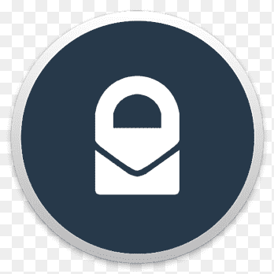[ProtonMail](https://protonmail.com) 🔵free 🔵paid

[Disroot](https://disroot.org/en/services/email) 🔵free

[Posteo](https://posteo.de) 🔵paid

Video platform :

🔵[LBRY - desktop](https://lbry.com)

🔴[Odysee - LBRY web](https://odysee.com)

🟢[PeerTube](https://joinpeertube.org)

Youtube Proxy :

🔵[Invidious](https://invidio.us)

🔵[CloudTube](https://cadence.moe/cloudtube/subscriptions)

🔵[FreeTube](https://freetubeapp.io) (Youtube client)

Instant messaging :

🟢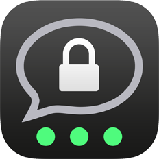[Threema](https://threema.ch/en)

🔵[Signal](https://signal.org)

🟢[Session*](https://getsession.org)

🔴[Telegram](https://telegram.org)

🔵[Element](https://app.element.io)

🔵[Jami](https://jami.net)

🔵[Gajim](https://gajim.org/)

Video conferencing :

🟢[Jitsi Meet](https://meet.jit.si)

🔵[Signal](https://signal.org)

🔵[BigBlueButton](https://bigbluebutton.org)

🟢[Jami](https://jami.net)

🔵[Element](https://app.element.io)

🔵[Whereby](https://whereby.com)

🔴[Telegram](https://telegram.org)

Respectfull social network :

🔵[Mastodon](https://mastodon.social)

🔵[Element](https://app.element.io)

🔴[Telegram*](https://telegram.org)

🔵[PixelFed](https://pixelfed.org)

🔵[Lemmy](https://join.lemmy.ml/)

🔵[Pleroma](https://pleroma.social/)

🔵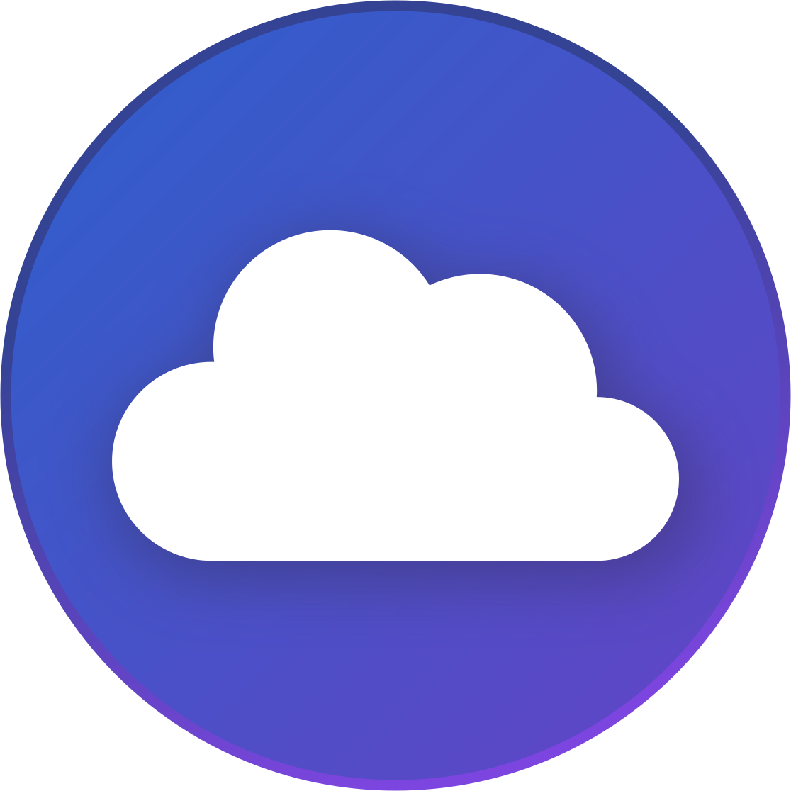[movim](https://movim.eu/)

🔵[Friendica](https://friendi.ca)

Abusive social network proxy :

🔵[Nitter](https://nitter.net) (Twitter)

🔵[Libreddit](https://libredd.it/) (Reddit)

🔵[Bibliogram](https://bibliogram.art) (Instagram)

Translator :

🟢[LibreTranslate](https://libretranslate.com/)

[DeepL](https://www.deepl.com/translator) 🔴free 🔵paid

🟢[Apertium](https://www.apertium.org)

🔴[Lingva Translate](https://lingva.ml) (Google
Translate proxy)

Ad blocker/trackers and network traffic controller :

⚫[Portmaster*](https://safing.io/portmaster)

Password manager :

🟢[KeePassXC](https://keepassxc.org)

🔵[Bitwarden](https://bitwarden.com)

Maps :

🟢[OpenStreetMap](https://www.openstreetmap.org)

🔵[Qwant Maps*](https://www.qwant.com/map)

🔵[DuckDuckGo](https://duckduckgo.com)

🔴[Maps.me](https://maps.me)

VPN :

🟢[ProtonVPN](https://protonvpn.com)

🟢[IVPN](https://www.ivpn.net)

🔵[Mullvad](https://mullvad.net)

🔵[Windscribe](https://windscribe.com/)

Movies and series online :

🔵[Swiss Transfer](https://www.stremio.com) 🔵without account 🔴with account

🟢[IVPN](https://kodi.tv)

File sharing :

🟢[Disroot](https://upload.disroot.org)

🟢[OnionShare](https://onionshare.org)

🟢[Syncthing](https://syncthing.net)

🔵[Tresorit Send](https://tresorit.com/)

🔴[Swiss Transfer](https://swisstransfer.com)

Cloud :

🔵[Kdrive](https://www.infomaniak.com/es/kdrive)

🔵[Kdrive](https://www.https://mega.nz)

🟢[Nextcloud](https://nextcloud.com)

🔴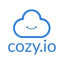[Cozy Cloud](https://cozy.io)

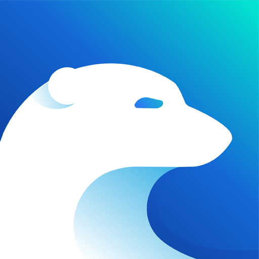[Kdrive](https://icedrive.net) 🔴free 🔵paid

🔴[Disroot](https://cloud.disroot.org)

Peer-to-peer synchronization tool :

🟢[Syncthing](https://syncthing.net)

Schedule :

🟢[Tutanota](https://f-droid.org/es/packages/de.tutao.tutanota)

🟢[ProtonCalendar*](https://protonmail.com)

Temporary mail:

⚫[Temp Mail](https://temp-mail.org)

⚫[Guerrillamail](https://guerrillamail.com)

⚫[EmailOnDeck](https://www.emailondeck.com)

Alias manager for mail :

🟢[forwardemail](https://forwardemail.net)

Collaboration and organization:

🟢[CryptPad](https://cryptpad.fr)

🟢[Mobilizon](https://mobilizon.org/en/)

Wikipedia :

🟢[Elisa](https://wikiless.org) (proxy Wikipedia)

Audio player :

🟢[Elisa](https://elisa.kde.org)

🟢[Audacious](https://audacious-media-player.org)

🟢[Strawberry Music Player](https://www.strawberrymusicplayer.org)

Media player :

🟢[mpv](https://mpv.io)

🟢[VLC](https://www.videolan.org)

Notes :

🟢[Standard Notes](https://standardnotes.org)

🟢[Joplin](https://joplinapp.org)

🟢[Knotes](http://knotesapp.com)

🟢[Gnote](https://wiki.gnome.org/Apps/Gnote)

Antivirus (ClamAV) :

🟢ClamTK (Linux)

🟢ClamWin (Windows)

System cleaning and optimization :

🟢[Stacer](https://oguzhaninan.github.io/Stacer-Web)

🟢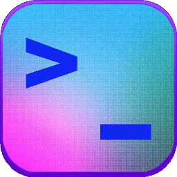[ubunsys](https://github.com/adgellida/ubunsys)

🟢[BleachBit](https://www.bleachbit.org)

Encryption tool :

🟢[VeraCrypt](https://www.veracrypt.fr)

🟢[Cryptomator](https://cryptomator.org)

Metadata suppression :

🟢[ExifCleaner](https://exifcleaner.com)

Image editing and drawing :

🟢[Gimp](http://www.gimp.org)

🟢[Krita](https://krita.org)

🟢[Drawing](https://maoschanz.github.io/drawing)

Photo processing :

🟢[Darktable](https://www.darktable.org)

🟢[RawTherapee](https://rawtherapee.com)

Vector graphics editing :

🟢[Inkscape](https://inkscape.org)

Page layout :

🟢[Scribus](https://www.scribus.net)

Audio editing :

🟢[LMMS](https://www.lmms.io)

🟢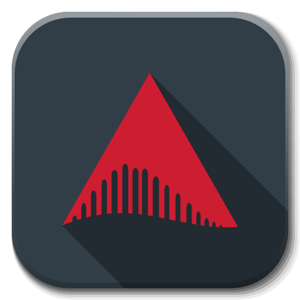[Ardour](https://www.ardour.org)

🔵[Audacity](https://www.audacityteam.org)

Video editing :

🟢[OpenShot](https://www.openshot.org)

🟢[Kdenlive](https://kdenlive.org)

🟢[Avidemux](https://www.avidemux.org)

🟢[Pitivi](http://www.pitivi.org)

🟢[Cinelerra](http://cinelerra.org)

CD/DVD burning :

🟢[k3b](https://apps.kde.org/k3b)

🟢[Brasero](https://wiki.gnome.org/Apps/Brasero)

Transcoding :

🟢[Handbrake](https://handbrake.fr)

🟢[MKV](https://www.matroska.org/index.html)

Connection interface between computer and cell phone :

🟢KDE Connect

🟢Zorin Connect

Windows programs/games under Linux :

⚫[PlayOnLinux](https://www.playonlinux.com)

⚫[Wine](https://www.winehq.org)

⚫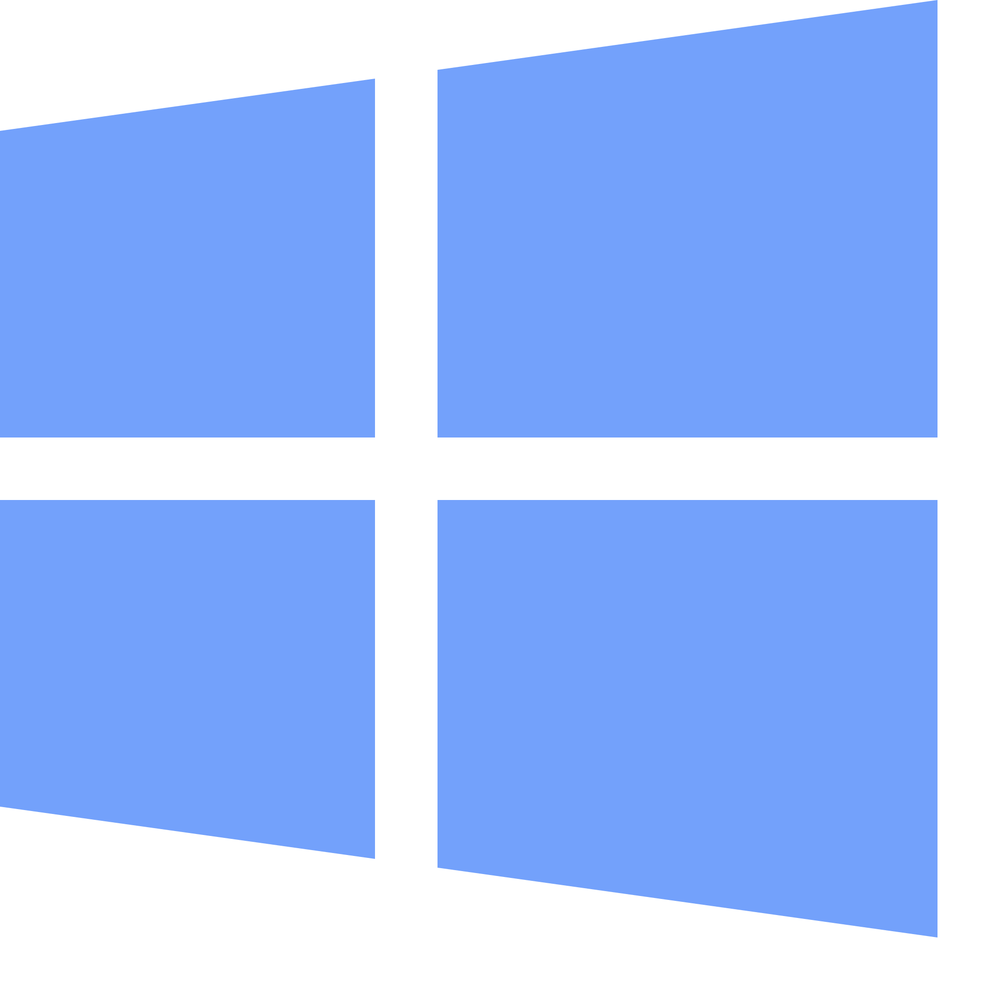[WinApps*](https://github.com/Fmstrat/winapps)

Network traffic analysis:

🟢[Wireshark](https://www.wireshark.org)

All-in-one ecosystem :

🔵Infomaniak

🔵Proton*

🔵Cozy Cloud

## 4 Smartphone

### 4-1 Operating Systems

Android, in its default configuration, is currently the worst operating system in terms of privacy. Its purpose is to continuously send personal data to Google's servers to exploit and sell them. The most recommended solution today is to use a modified version of Android (custom ROM) to respect privacy.

If you do not want to install or buy a smartphone with a respectful operating system (serious error) and you still want to use Android from origin, follow the advice detailed in point 8.1 of this document in order to limit the collection of personal information.

Apple's operating system (iOS), despite its marketing based on respect for privacy, also collects and exploits the personal data of its users in addition to considerably limiting their freedom.

Linux-based options are privacy-friendly and promising in terms of independence, but they don't offer the same security guarantees as Android. Furthermore, in their current state of development, they are not recommended for average users (except for Sailfish OS).

**Android modified for privacy :**

🟢[CalyxOS](https://calyxos.org) : Android degooglized and secure with microG for better compatibility

🟢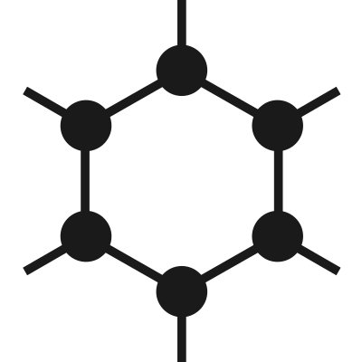[GrapheneOS](https://grapheneos.org) : the most private and secure degooglized Android available

🔵[/e/ OS](https://e.foundation) : Degooglized LineageOS but with microG and integrated services (/e/ account)

🔵[DivestOS](https://divestos.org/) : LineageOS partially enhanced for security and privacy

🔵[LineageOS for microG](https://lineage.microg.org) : LineageOS with microG for better compatibility

🔵[Volla OS](https://volla.online): Safe Android, without Google apps but not totally degooglized

🔵[LineageOS](https://lineageos.org) : Android without Google apps but not totally degooglized

**Linux :**

🔵[Sailfish OS](https://sailfishos.org) (partially proprietary)

🔵[Ubuntu Touch*](https://ubuntu-touch.io)

🔵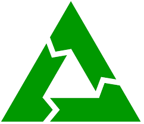[PostmarketOS*](https://postmarketos.org)

🔵[Mobian*](https://mobian-project.org)

🔵[PureOS*](https://pureos.net)

🔵[Manjaro*](https://manjaro.org)

**Preinstalled hardware :**

[Fairphone 3 y 3+](https://www.fairphone.com) : /e/ OS (version only available on project site /e/)

[Gigaset GS290](https://e.foundation/es/e-announces-the-e-gs290-as-the-latest-device-available-with-privacy-friendly-e-os-pre-installed/) : /e/ OS (version only available on project site /e/)

[Volla Phone](https://volla.online) : Volla OS, Ubuntu Touch and others

[Pinephone](https://www.pine64.org/pinephone) : Manjaro and others Linux O.S. compatibles)

Other models with /e/ OS pre-installed are available at the /e/ project site:

https://esolutions.shop/

### 4-2 Applications

The applications proposed for Android and derivatives must be searched first in the free F-Droid application store (guarantee that they do not have third-party trackers) and only if they are not, in Aurora Store, a Google Play proxy allowing access to their free applications anonymously (never connect with a personal Google account, always anonymously).

These stores must be downloaded directly from their official web pages. Remember then to withdraw the authorization to install unknown applications to your browser, for security reasons (settings> applications> browser used).

**Android and derivatives :**

App store :

🟢[F-Droid](https://f-droid.org)

🔵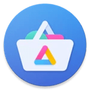[Aurora Store](https://auroraoss.com) (proxy Play Store)

🔵[APKMirror](https://www.apkmirror.com)

Browser :

🟢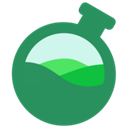[Bromite](https://www.bromite.org/fdroid)

🟢[Tor Browser](https://www.torproject.org/es/download/#android)

🔵[mull](https://github.com/Divested-Mobile/mull)

🔵[Privacy Browser](https://f-droid.org/es/packages/com.stoutner.privacybrowser.standard)

🔵[FOSS Browser](https://f-droid.org/es/packages/de.baumann.browser)

🔵[Ungoogled Chromium](https://uc.droidware.info/fdroid.html)

Instant messaging :

🟢[Threema](https://threema.ch/en)

🔵[Signal](https://signal.org)

🟢[Session*](https://getsession.org)

🔴[Telegram FOSS](https://f-droid.org/packages/org.telegram.messenger/)

🔵[Element](https://app.element.io)

🔵[Jami](https://jami.net)

🟢[Briar](https://briarproject.org)

🔵[Conversations](https://conversations.im)

Video conferencing :

🟢[Jitsi Meet](https://meet.jit.si)

🔵[Signal](https://signal.org)

🟢[Jami](https://jami.net)

🔵[Element](https://app.element.io)

🔵[Whereby](https://whereby.com)

🔴[Telegram FOSS](https://f-droid.org/packages/org.telegram.messenger)

Video platform :

🔴[LBRY](https://lbry.com)

🔴[Newpipe](https://newpipe.schabi.org) (Youtube client)

🟢[Tubelab](https://f-droid.org/en/packages/app.fedilab.tubelab/) (Peertube client)

Ad/Tracker Blocker:

🟢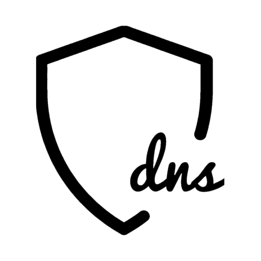[RethinkDNS*](https://play.google.com/store/apps/details?id=com.celzero.bravedns&hl=es&gl=US)

🟢[Blokada](https://f-droid.org/es/packages/org.blokada.alarm)

🟢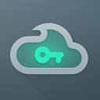[Nebulo](https://play.google.com/store/apps/details?id=com.frostnerd.smokescreen&hl=es&gl=US)

🟢TrackerControl

Maps/GPS navigation:

🔵[Magic Earth](https://www.magicearth.com)

🟢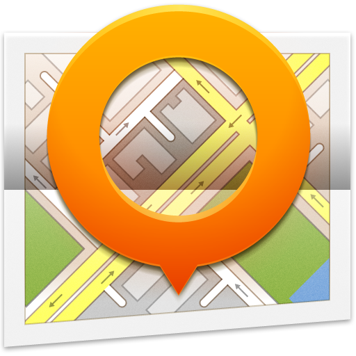[OsmAnd+](https://f-droid.org/es/packages/net.osmand.plus/)

🟢Organic Maps

Mail client :

🔵[Tutanota](https://f-droid.org/es/packages/de.tutao.tutanota)

🔵[ProtonMail](https://protonmail.com)

⚫FairEmail

⚫[K-9 Mail](https://f-droid.org/es/packages/com.fsck.k9)

Alias manager for mail :

🟢[Simple Login](https://simplelogin.io)

🟢[AnonAddy](https://anonaddy.com/)

Password manager client :

🟢[KeePassDX](https://f-droid.org/es/packages/com.kunzisoft.keepass.libre)

🔵[Bitwarden](https://bitwarden.com)

🟢AuthPass

Two-factor authentication :

🟢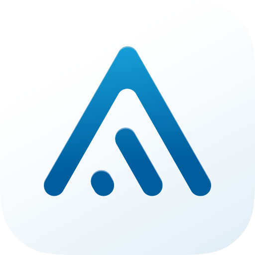[Aegis](https://f-droid.org/es/packages/com.beemdevelopment.aegis)

🟢[andOTP](https://f-droid.org/en/packages/org.shadowice.flocke.andotp)

VPN :

🟢[ProtonVPN](https://protonvpn.com)

🟢[IVPN](https://www.ivpn.net)

🔵[Mullvad](https://mullvad.net)

🔵[Riseup VPN](https://riseup.net/es/vpn)

🔵[Calyx VPN](https://calyx.net/)

Sync tool :

🟢[Syncthing](https://f-droid.org/en/packages/com.nutomic.syncthingandroid)

⚫DAVx5

Cloud :

🔵[Kdrive](https://www.infomaniak.com/es/kdrive)

🔴[Kdrive](https://www.https://mega.nz)

🟢[Nextcloud](https://nextcloud.com)

🔴[Cozy Drive](https://cozy.io)

🔴[Kdrive](https://icedrive.net)

Encryption tool for cloud :

🟢[Cryptomator](https://cryptomator.org)

Connection interface between computer and cell phone :

🟢KDE Connect

🟢Zorin Connect

Respectful social network :

🔵[Tusky](https://f-droid.org/en/packages/com.keylesspalace.tusky) (Mastodon)

🔵[Element](https://f-droid.org/es/packages/im.vector.app) (Matrix)

🔴[Telegram FOSS](https://f-droid.org/packages/org.telegram.messenger)

🔵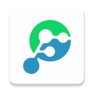[Fedilab](https://f-droid.org/en/packages/fr.gouv.etalab.mastodon) Mastodon, Pleroma...),

🔵PixelDroid (PixelFed)

🔵[Lemmur (Lemmy)](https://lemmy.ml)

Respectful client Facebook :

🔴[Frost for Facebook](https://f-droid.org/es/packages/com.pitchedapps.frost)

🔴WebApps

Respectful client Instagram :

🔴WebApps

🔴Barinsta

Respectful client Twitter :

🔴Fritter

🔴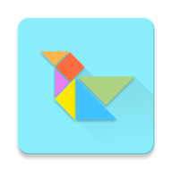[Twidere](https://f-droid.org/es/packages/org.mariotaku.twidere)

🔴WebApps

WebApps creator:

🟢WebApps

Metadata suppression :

🟢[Scrambled Exif](https://f-droid.org/es/packages/com.jarsilio.android.scrambledeggsif)

🟢[ImagePipe](https://f-droid.org/es/packages/de.kaffeemitkoffein.imagepipe)

Office :

🟢[Collabora Office - LibreOffice prof.](https://www.collaboraoffice.com)

🟢LibreOffice

E-book reader :

🟢Librera Reader

🟢KOReader

Finance :

🟢MoneyWallet

🟢Unstoppable Wallet

🟢MoneyBuster

🟢WeeklyBudget

Physical exercise :

🟢Feeel – home workouts

🟢FitoTracker

🟢Workout Time!

Internet radio :

🟢[RadioDroid](https://f-droid.org/es/packages/net.programmierecke.radiodroid2)

🟢Transistor – Simple Radio App

Redirector of content YouTube, Twitter, Instagram and Google Map :

🟢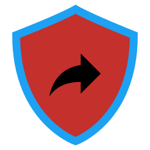[UntrackMe](https://f-droid.org/en/packages/app.fedilab.nitterizeme)

QR code scanner :

⚫QR & Barcode Scanner

RSS Reader:

🟢Feeder

🟢Flym

🟢Handy News Reader

Replacement application system for Android of origin :

Keyboard :

🟢[AnySoftKeyboard](https://anysoftkeyboard.github.io)

🟢[OpenBoard](https://f-droid.org/es/packages/org.dslul.openboard.inputmethod.latin)

🟢[FlorisBoard*](https://github.com/florisboard/florisboard)

Schedule :

🟢[Simple Calendar](https://f-droid.org/es/packages/com.simplemobiletools.calendar.pro)

🟢[Tutanota](https://f-droid.org/es/packages/de.tutao.tutanota)

🟢Proton Calendar*

🟢[Etar](https://f-droid.org/es/packages/ws.xsoh.etar)

Notes :

🟢[Standard Notes](https://play.google.com/store/apps/details?id=com.standardnotes)

🟢Quillnote

🟢[Joplin](https://play.google.com/store/apps/details?id=net.cozic.joplin&utm_source=GitHub&utm_campaign=README&pcampaignid=MKT-Other-global-all-co-prtnr-py-PartBadge-Mar2515-1)

🟢[Nextcloud Notes](https://f-droid.org/es/packages/it.niedermann.owncloud.notes)

Meteorology :

🟢Geometric Weather

🟢Weather

SMS :

🔴[Signal](https://signal.org)

🔴[Simple SMS Messenger](https://f-droid.org/en/packages/com.simplemobiletools.smsmessenger/)

🔴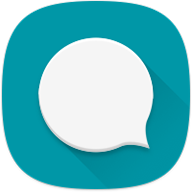[QKSMS](https://f-droid.org/en/packages/com.moez.QKSMS/)

File manager :

🟢[Simple File Manager](https://f-droid.org/es/packages/com.simplemobiletools.filemanager.pro)

🟢Ghost Commander

🟢Material Files

Gallery :

🟢[Simple Gallery](https://f-droid.org/es/packages/com.simplemobiletools.gallery.pro)

Audioplayer :

🟢[Vinyl Music Player](https://f-droid.org/es/packages/com.poupa.vinylmusicplayer)

🟢[Vanilla Music](https://f-droid.org/en/packages/ch.blinkenlights.android.vanilla)

🟢[Music Player GO](https://f-droid.org/es/packages/com.iven.musicplayergo)

PDF :

🟢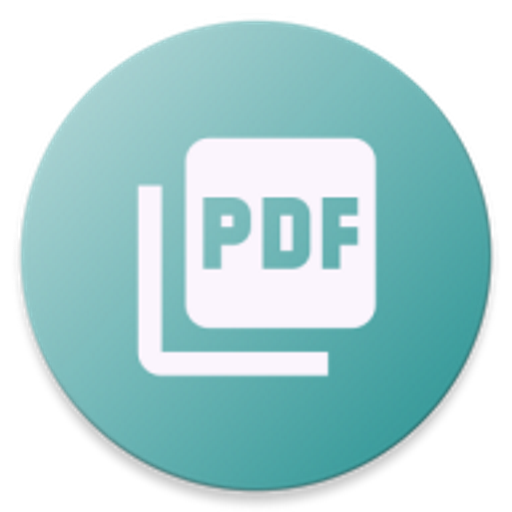[PDF Viewer Plus](https://f-droid.org/es/packages/com.gsnathan.pdfviewer)

🟢Librera Reader

🟢KOReader

🟢[MuPDF Viewer](https://f-droid.org/es/packages/com.artifex.mupdf.viewer.app)

Contacts :

🟢[Open Contacts](https://f-droid.org/es/packages/opencontacts.open.com.opencontacts)

🟢[Simple Contacts](https://f-droid.org/es/packages/com.simplemobiletools.contacts.pro)

Camera :

🟢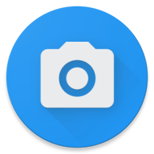[Open Camera](https://f-droid.org/es/packages/net.sourceforge.opencamera)

🟢[Simple Camera](https://f-droid.org/es/packages/com.simplemobiletools.camera)

Voice recorder :

🟢[Audio Recorder](https://f-droid.org/es/packages/com.github.axet.audiorecorder)

🟢[Simple Voice Recorder](https://f-droid.org/es/packages/com.simplemobiletools.voicerecorder)

Call manager : 

🔴[Simple Dialer](https://f-droid.org/es/packages/com.simplemobiletools.dialer)

🔴Emerald Dialer

Calculator :

🟢[Simple Calculator](https://f-droid.org/en/packages/com.simplemobiletools.calculator)

Clock :

🟢[Simple Clock](https://f-droid.org/en/packages/com.simplemobiletools.clock)

Media Player:

🟢[VLC](https://f-droid.org/es/packages/org.videolan.vlc/)

To go further :

Network traffic controller (firewall) :

🟢[RethinkDNS*](https://play.google.com/store/apps/details?id=com.celzero.bravedns&hl=es&gl=US)

🟢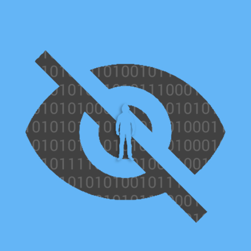[InviZible Pro](https://f-droid.org/en/packages/pan.alexander.tordnscrypt.stable)

🟢[NetGuard](https://f-droid.org/es/packages/eu.faircode.netguard)

Third Party Tracker Developer :

🟢[ClassyShark3xodus](https://f-droid.org/es/packages/com.oF2pks.classyshark3xodus)

🟢[Exodus](https://f-droid.org/en/packages/org.eu.exodus_privacy.exodusprivacy)

Privacy manager for applications :

🟢[App Manager](https://f-droid.org/es/packages/io.github.muntashirakon.AppManager)

🟢[App Warden](https://forum.xda-developers.com/t/app-5-0-warden-app-manager.4122227) (root)

Application stop (background):

🟢[RethinkDNS*](https://play.google.com/store/apps/details?id=com.celzero.bravedns&hl=es&gl=US)

🟢[SuperFreezZ](https://f-droid.org/es/packages/superfreeze.tool.android)

Network anonymization by Tor :

🟢[Orbot Proxy](https://play.google.com/store/apps/details?id=org.torproject.android&hl=es&gl=US)

🟢[InviZible Pro](https://f-droid.org/en/packages/pan.alexander.tordnscrypt.stable)

Applications Isolator :

🟢[Shelter](https://f-droid.org/en/packages/net.typeblog.shelter)

🟢[Insular](https://f-droid.org/en/packages/com.oasisfeng.island.fdroid)

Malware detector:

🟢Hypatia (ClamAV)

Alternative to Chromecast for Raspberry Pi :

🟢Raspicast

Fake Localization :

🟢[Fake Traveler](https://f-droid.org/en/packages/cl.coders.faketraveler)

Replacement of Google Services:

🔵[MicroG GmsCore](https://microg.org)

Microphone usage blocker :

🟢[PilferShush Jammer](https://f-droid.org/en/packages/cityfreqs.com.pilfershushjammer)

### IOS :

Browser :

🔵[Firefox](https://apps.apple.com/us/app/navegador-firefox/id989804926)

🔵[Onion Browser](https://apps.apple.com/us/app/onion-browser/id519296448)

🔵[DuckDuckGo Browser](https://apps.apple.com/us/app/duckduckgo-privacy-browser/id663592361)

🔴[Brave](https://apps.apple.com/us/app/brave-private-web-browser-vpn/id1052879175)

Instant messaging :

🟢[Threema](https://apps.apple.com/us/app/threema-the-secure-messenger/id578665578)

🔵[Signal](https://apps.apple.com/us/app/signal-mensajer%C3%ADa-privada/id874139669)

🟢[Session*](https://apps.apple.com/us/app/session-private-messenger/id1470168868)

🔴[Telegram](https://apps.apple.com/us/app/telegram-messenger/id686449807)

🔵[Element](https://app.element.io)

🔵[Jami](https://apps.apple.com/us/app/jami/id1306951055)

🔵[Monal](https://apps.apple.com/us/app/monal-xmpp-chat/id317711500)

Video conferencing :

🟢[Jitsi Meet](https://apps.apple.com/us/app/jitsi-meet/id1165103905)

🔵[Signal](https://apps.apple.com/us/app/signal-mensajer%C3%ADa-privada/id874139669)

🟢[Jami](https://apps.apple.com/us/app/jami/id1306951055)

🔵[Element](https://app.element.io)

🔵[Whereby](https://apps.apple.com/us/app/whereby-video-meetings/id878583078)

🔴[Telegram](https://apps.apple.com/us/app/telegram-messenger/id686449807)

Video platform :

🔴[Odysee - LBRY web](https://odysee.com)

Ad/Tracker Blocker :

🟢[Blokada](https://apps.apple.com/us/app/blokada/id1508341781)

🟢[DNSCloak](https://apps.apple.com/us/app/dnscloak-secure-dns-client/id1452162351)

🟢[Lockdown](https://apps.apple.com/us/app/lockdown-apps/id1469783711)

Maps / GPS navigation :

🔵Magic Earth

🟢Organic Maps

🔵OsmAnd

Mail client : 

🔵[Tutanota](https://apps.apple.com/us/app/tutanota/id922429609)

🔵[ProtonMail](https://apps.apple.com/us/app/protonmail-correo-cifrado/id979659905)

Alias manager for mail :

🟢[Simple Login](https://apps.apple.com/us/app/simplelogin-anti-spam/id1494359858)

Password manager client :

🟢[Strongbox](https://apps.apple.com/es/app/strongbox-keepass-pwsafe/id897283731) - KeePass & PwSafe

🔵[Bitwarden](https://apps.apple.com/us/app/bitwarden-gestor-de-contrase/id1137397744)

Two-factor authentication :

🟢[Tofu Authenticator](https://apps.apple.com/us/app/tofu-authenticator/id1082229305)

🟢Raivo OTP

VPN:

🔵ProtonVPN

🟢IVPN

🔵Mullvad VPN

🔵Windscribe VPN

Cloud :

🔵[Kdrive](https://www.infomaniak.com/es/kdrive)

🔴[Kdrive](https://apps.apple.com/es/app/mega/id706857885

🟢[Nextcloud](https://nextcloud.com)

🔴[Cozy Drive](https://cozy.io)

🔴[Kdrive](https://apps.apple.com/es/app/icedrive-cloud-storage/id1476402680)

Encryption tool for cloud :

🟢[Cryptomator](https://apps.apple.com/us/app/cryptomator/id953086535)

Respectful social network :

🔵Mastodon for iPhone

🔴[Telegram](https://apps.apple.com/us/app/telegram-messenger/id686449807)

🔵Element (Matrix)

Office :

🟢Collabora Office

🟢LibreOffice

## 5 Browsers

Compartmentalization (using different browsers with different settings, depending on the tasks) is a recommended method to preserve privacy without sacrificing too much browsing comfort.
For example, it would be to use Firefox with a restrictive configuration for general navigation. Then, use another profile of the same Firefox or Firefox ESR, configured in a less restrictive way for sites that do not load correctly or that require a connection to a personal account, and another browser for the consultation of the most recalcitrant sites to a configuration for the privacy protection (Brave or Ungoogled Chromium without settings are ideal for that task). It is also conceivable to use another browser solely dedicated to e-banking or also Tor Browser for anonymous browsing.

### 5-1 Firefox

For Firefox to protect privacy, it needs to be configured appropriately (settings, extensions and about: config). All necessary settings are developed in point 8.3 of the document. These settings also apply to LibreWolf and, to a certain extent, for the mobile version of Firefox (Fennec).

**Extensions :**

Light list :

uBlock Origin - [Chrome](https://chrome.google.com/webstore/detail/ublock-origin/cjpalhdlnbpafiamejdnhcphjbkeiagm) - [Firefox](https://addons.mozilla.org/es/firefox/addon/ublock-origin)

Decentraleyes - [Chrome](https://chrome.google.com/webstore/detail/decentraleyes/ldpochfccmkkmhdbclfhpagapcfdljkj) - [Firefox](https://addons.mozilla.org/es/firefox/addon/decentraleyes)

Cookie AutoDelete - [Chrome](https://chrome.google.com/webstore/detail/cookie-autodelete/fhcgjolkccmbidfldomjliifgaodjagh) - [Firefox](https://addons.mozilla.org/en-US/firefox/addon/cookie-autodelete)

HTTPS Everywhere - [Chrome](https://chrome.google.com/webstore/detail/https-everywhere/gcbommkclmclpchllfjekcdonpmejbdp) - [Firefox](https://addons.mozilla.org/es/firefox/addon/https-everywhere)

Footprint randomization (restrictive) :

uBlock Origin - [Chrome](https://chrome.google.com/webstore/detail/ublock-origin/cjpalhdlnbpafiamejdnhcphjbkeiagm) - [Firefox](https://addons.mozilla.org/es/firefox/addon/ublock-origin)

Decentraleyes - [Chrome](https://chrome.google.com/webstore/detail/decentraleyes/ldpochfccmkkmhdbclfhpagapcfdljkj) - [Firefox](https://addons.mozilla.org/es/firefox/addon/decentraleyes) - Finished development? - Alternative?

Privacy Redirect - [Chrome](https://chrome.google.com/webstore/detail/privacy-redirect/pmcmeagblkinmogikoikkdjiligflglb) - [Firefox](https://addons.mozilla.org/en-US/firefox/addon/privacy-redirect)

CanvasBlocker - [Chrome](https://chrome.google.com/webstore/detail/canvas-blocker-fingerprin/nomnklagbgmgghhjidfhnoelnjfndfpd) - [Firefox](https://addons.mozilla.org/es/firefox/addon/canvasblocker)

[Chameleon](https://github.com/ghostwords/chameleon) Finished development? - Alternative?

### 5-2 Tor Browser

The concept of Tor is to make Internet traffic pass through a network by anonymizing it. In the effort that the fingerprint of your browser (given among others by its configuration) does not betray your identity, Tor browsers are designed to
have the same footprint regardless of users. To avoid making the footprint of your Tor browser unique, no extensions should be installed and no modifications should be made to the "about: config" settings. To preserve the given anonymity, it is also necessary not to connect to accounts that could de facto override it.
The Tor network's anonymization method slows down uploads. Well, it is not recommended to use it for streaming or voluminous downloads.

## 6 Service instances

### 6-1 Searx

Searx is a meta search engine that does not transmit personal data to used search engines. It allows, if one wishes, a very advanced configuration. The different instances (available there: https://searx.space/) do not offer all the same guarantees of privacy protection (IP address log or not, etc.)

🔵https://searx.nobigtech.es : Google results included, IP address, log good UI

🟢https://search.disroot.org : Google results (Startpage), no IP address log, good UI

🟢https://search.disroot.org : Google results included, no IP address log

### 6-2 Invidious

Invidious gives access to YouTube content (proxy) without transmitting the personal data of its users to Google. Unfortunately, its different instances (available there: https://instances.invidio.us/) frequently suffer from problems caused by Google's measures taken to prevent their operation. The Privacy Redirect extension automatically redirects YouTube links to Invidous.
The Invidious instances that currently appear to be the most functional are

⚫https://yewtu.be

### 6-3 Videoconference

**Jitsi Meet :**

🟢[FDN](https://talk.fdn.fr)

🟢[Snopyta](https://talk.snopyta.org)

🟢[Framasoft](https://framatalk.org/accueil)

🟢[Calyx](https://meet.calyx.net)

🔵[Jitsi](https://jitsi.org/jitsi-meet)

🔵[Infomaniak](https://meet.infomaniak.com)

**BigBlueButton :**

🟢[FAImaison](https://bbb.faimaison.net/b)

🟢[Grifon](https://bbb.grifon.fr/b)

🟢[Nixnet](https://meet.nixnet.services/b)

### 6-4 DNS Servers

If you use a VPN, it is advisable not to change your default DNS server, in order not to stand out from your other users. If not, replace the DNS server provided by your internet provider with a respectful one among the recommendations below. Use an encrypted implementation (DoH, DoT, DoQ, DNSCrypt, etc.) whenever possible.

With filters against ads, trackers and malicious domains :

🟢[BlahDNS](https://blahdns.com) (DoH, DoT, DNSCrypt) (Europe and East Asia)

🟢[NixNet](https://docs.nixnet.services/NixNet_DNS) (DoH, DoT) (Europe and North America)

🔵[Adguard](https://adguard.com/en/adguard-dns/overview.html) (DoH, DoT, DNSCrypt) (Europe, North America and East Asia)

🔵[NextDNS](https://nextdns.io)(DoH, DoT, DNSCrypt) (intercontinental)

🔵[LibreDNS](https://libredns.gr)(DoH, DoT) (Europa)

BlahDNS DoH (Alemania) : https://doh-de.blahdns.com/dns-query

BlahDNS DoH (Singapur) : https://doh-sg.blahdns.com/dns-query

BlahDNS DoQ (Finlandia) : quic://dot-fi.blahdns.com:784

NixNet DoH (intercontinental) : https://adblock.any.dns.nixnet.xyz/dns-query

Filters against malicious domains: :

🟢[Quad9](https://www.quad9.net) (DoH, DoT, DNSCrypt) (only block malicious domains)

DoH : https://dns.quad9.net/dns-query

DoT : tls://dns.quad9.net

IPv4 : 9.9.9.9, 149.112.112.112

IPv6 : 2620:fe::fe, 2620:fe::9

Without filters :

🟢[Snopyta](https://snopyta.org) (DoH, DoT) (Europe)

🟢[Digitale Gesellschaft](https://digitalegesellschaft.de) (DoH, DoT) (Europe)

🔵[UncensoredDNS](https://blog.uncensoreddns.org/dns-servers) (DoH) (Europe and North America)

🔵[DNS.Watch](https://dns.watch) (DoH, DNSCrypt)

Snopyta DoH (Finlandia) : https://fi.doh.dns.snopyta.org/dns-query

## 7 Additional resources (featured sources)

**General**

Excellent resources for understanding surveillance capitalism and its threats :

* https://www.nobigtech.es
* The Social Media Dilemma, Jeff Orlowski (film)
* Nothing to Hide, Marc Meillassoux (documentary film)
* The Age of Surveillance Capitalism, Shoshana Zuboff (book)

Excellent tutorials for privacy and data protection :

basic :

* https://spreadprivacy.com/tag/device-privacy-tips
* https://www.vice.com/en_us/article/d3devm/motherboard-guide-to-notgetting-hacked-online-safety-guide

complete :

* https://dt.gl/privacy-cookbook-the-story-so-far/

Great channels about privacy (with tutorials) :

* The Hated One : https://www.youtube.com/channel/UCjr2bPAyPV7t35MvcgT3W8Q
* Techlore : https://www.youtube.com/channel/UCs6KfncB4OV6Vug4o_bzijg

Associations for the defense of privacy (information) :

* https://ssd.eff.org/
* https://www.laquadrature.net/es/
* https://www.eff.org/deeplinks

Associations proposing excellent services respectful of privacy:

* https://disroot.org/es/
* https://komun.org/
* https://framasoft.org/en/
* https://snopyta.org/
* https://www.drycat.fr/en

Excellent site listing respectful services and programs :

* https://www.privacytools.io/

Recommended operators:

* https://www.eff.org/pages/quien-defiende-tus-datos

**Telegram groups and channels (and Matrix)**

Privacidad, protección de datos y más :

* [t.me/privacidadlibre](t.me/privacidadlibre) and #privacidadlibre:matrix.org
* [t.me/techloregroup](t.me/techloregroup) and #techlore:matrix.org
* [t.me/techloreofficial](t.me/techloreofficial) (watch out, pro Apple bias)

Linux y libre :

* [Proyecto tic tac](t.me/grupo_telegram_proyectotictac)
* [LinuxMintEs](t.me/LinuxMintEs)
* [mxantixes](t.me/mxantixes)

**Operating Systems**

Linux :

* [MX Linux](https://mxlinux.org)
* [Linux Mint](https://linuxmint.com)

Privacy-friendly Android :

* [CalyxOS](https://calyxos.org)
* [GrapheneOS](https://grapheneos.org)
* [/e/ OS](https://e.foundation)

*Application compatibility with and without microG : (https://plexus.techlore.tech)

**Firefox**

* [Firefox configuration](https://www.youtube.com/watch?v=tQhWdsFMc24)
* [Firefox basic configuration](https://12bytes.org/articles/tech/firefox/the-firefox-privacy-guide-for-dummies)
* [Firefox advanced configuration](https://12bytes.org/articles/tech/firefox/firefoxgecko-configuration-guide-for-privacy-and-performance-buffs)

## 8 Configurations

### 8-1 Operating systems

**Android**

The following recommendations are imperfect and do not fully guarantee data protection, as it is recommended to use a version of Android modified for privacy instead of Android of origin. That being said, in an effort not to be fully and continuously outlined with Android of origin, follow the following recommendations :

* Avoid all Chinese or Samsung brands and prefer one brand, such as Nokia, proposing "Android One" (ie without additional manufacturer layer)
* Never connect with a Google account
* Use applications to be able to install applications without Google Play Store
* Install and use an application, such as RethinkDNS or Blokada, that allows you to block trackers as well as advertisements and use an encrypted respectful DNS server
* Replace the default keyboard with a respectful one
* Delete (or when it is not possible to deactivate) all harmful applications (Google, third-party antivirus, etc.) or not used
* Block internet access to all applications that are disabled or do not require internet access to function thanks to a firewall application such as RethinkDNS
* Review all application and system authorizations to remove them if they are harmful to privacy or unnecessary

**GrapheneOS**

Take advantage of the function offered only by GrapheneOS to remove the authorization of the access to the sensors (used insidiously for the collection of information and the tracking) to all the commercial or closed source applications and also those that do not need it, as a precaution:

"Settings"> "Apps and notifications"> choose an app> "Permissions"> "Sensors" > "See all apps that have this permission"

**Windows**

The following recommendations are imperfect and do not guarantee data protection, as it is recommended to use a Linux distribution instead of
Windows. That being said, in an effort not to be fully and continuously outlined with Windows, follow the following recommendations :

* Do not use any version prior to Windows 10 as they are vulnerable/insecure
* Never connect with a Microsoft account
* Completely disable Cortana
* Disable activity history
* Go in the settings, under "privacy" and deactivate everything in each of the categories except for the necessary authorizations for the applications used
* Uninstall (or when it is not possible to deactivate) Edge, Microsoft OneDrive, antivirus (except Microsoft Defender) and all unused applications
* Enable random MAC address in Wi-Fi settings
* Preferably use another session than the administrator for daily use
* Install the ShutUp10 program to have more control over privacy

**MX Linux**

Flash plugin :
Enter the following command in the terminal to remove the proprietary Flash plugin :
sudo apt purge --remove adobe-flashplugin flashplugin-installer pepperflashplugin-nonfree

Advert Blocker :
Select all the options except "UNBLOCK" and then confirm.

Wi-Fi configuration :
Right click on the Wi-Fi icon, modify the connections, select the active Wi-Fi,
under Wi-Fi select Cloned MAC Address: Random.
Under IPv6 settings, select IPv6 Confidentiality Extensions : On (preferred temporary address).

### 8-2 F-Droid

In order to find and download some applications from F-Droid, it is necessary to add their repositories. To do this, go to the F-Droid settings, then under "repositories", activate the "Guardian Project" repository and finally press the "+" and enter the desired mentioned addresses :

* Bromite :
https://fdroid.bromite.org/fdroid/repo

* Mull :
https://divestos.org/fdroid/official

* Ungoogled Chromium :
https://www.droidware.info/fdroid/repo

* Newpipe :
https://archive.newpipe.net/fdroid/repo

It may happen that Newpipe stops working due to modifications made by Google on YouTube. In order to quickly benefit from the latest updates by correcting these problems, it is recommended to add Newpipe's own repository.

* Langis (Signal) :
https://gitlab.com/TheCapsLock/fdroid-patched-apps/raw/master/fdroid/repo

Langis is a modified version of Signal to use as a last resort if notifications do not arrive with the classic version of Signal from Aurora Store.

* Session :
https://fdroid.getsession.org/fdroid/repo

* Bitwarden :
https://mobileapp.bitwarden.com/fdroid/repo

Version without the third-party trackers present in the Google Play version.

* Nebulo :
https://fdroid.frostnerd.com/fdroid/repo

* Collabora Office :
https://www.collaboraoffice.com/downloads/fdroid/repo

### 8-3 Apps and software

**Telegram**

Start secret chats so that conversations are end-to-end encrypted
extreme and do not go through the Telegram servers:
contact profiles> the three dots above> start secret chat

Disable link preview in secret chats to avoid requesting links
Telegram servers:

Settings> Privacy and security> Secret chats> Link preview

**Blokada**

Blocklists > enable the following blacklists:

- OISD
- Phishing Army
- DuckDuckGo Tracker Radar
- Exodus Privacy
- Combined Privacy
- URLhaus
- (Goodbye Ads : Samsung or Xiaomi (they only work for the models of those brands))

Encryption > select a DNS server from the following:
DoH: Blah DNS, Digitale Gesellschaft (Europe), (OpenNIC).
((Not encrypted: DNS.Watch, Uncensored DNS, French Data Network (Europe))).

**FreeTube**

Use Invidious as a proxy to avoid transmitting your data to Google:

Settings :
- Player Settings: enable "Proxy Videos Through Invidious"
- Advanced Settings: enter a functional Invidious instance

In case of problem, change the instance or simply deactivate "Proxy Videos
Through Invidious ".

### 8-4 Firefox

**General configuration**

The configuration proposed down there being relatively restrictive in order to protect the privacy of the user, it is recommended to follow the compartmentalization proposed in point 5 of the document and thus use at least one other browser to be able to access the sites less respectful of privacy.

Profiles:

Firefox offers the ability to use several different profiles (settings) at the same time. It is an ideal solution for a quick and simple transition from a restrictive configuration preventing a web page from loading correctly towards a lighter configuration, without having to change the browser. The different settings provided, extensions installed or bookmarks added will be saved in the profile in use.

To access the different Firefox profiles, enter "about:profiles" in the search bar. This page allows you to create new profiles and then launch them in a separate new window at any time.

DNS over HTTPS :

If you use a VPN or if your network or computer is configured to use a respectful and encrypted DNS server globally, you must disable the "DNS over HTTPS" feature enabled by default in Firefox. If this is not the case (if you do not know, it is probably not the case), it is recommended to leave this function activated. Now, it is necessary to change the default DNS server since Cloudflare is a centralizing actor and nefarious for privacy. Instead of the latter, it is recommended to choose a respectful option proposed in point 6.4 of the document, depending on your
preferences and location.

For this: Firefox settings> "General"> down "Network settings"> down "Activate DNS
over HTTPS ".

Here are the rest of the general settings recommended in images:

**Extension settings**

It is important to authorize these extensions to work in private browsing and activate
its automatic updates.

uBlock :
- Settings : activate everything under "Privacy"
- Filter Lists : activate ALL lists, except under “Regions” (only activate for
languages used)
- (Add the lists from filterlists.com: Energized: Ultimate Protection, Xtreme + IP +
Social extension)
- Follow the tutorial on the following web page to set the filtering rules
dynamic (optional but recommended):

https://www.maketecheasier.com/ultimate-ublock-origin-superusers-guide/

Chameleon :

Decentraleyes :
No configuration necessary

CanvasBlocker :
General: - check "Expert mode"
         - Presets > open > Stealth mode
         - Random number generator: non persistent
APIs : check "Protect Window api" + accept captcha exception
Misc : uncheck "Block data URL pages"

ClearURLs :
request types:
beacon,csp_report,font,image,imageset,main_frame,media,object,object_subrequest,
other,ping,script,speculative,stylesheet,sub_frame,web_manifest,websocket,xbl,xml_dtd,xmlhttprequest,xslt

Cookie AutoDelete :
- Automatic Cleaning Options: activate all
- Extension Options: disable "Show notification after cookie cleanup"

Privacy Redirect :
General : - select the desired instances
Advanced : - enable "Always proxy videos through Invidious"
- Select "DASH" under "Invidious video quality"

(HTTPS Everywhere) :
- Only necessary for Firefox versions in which the "HTTPS-Only Mode" not yet implemented: Firefox ESR and mobile (Fennec)
- No configuration necessary

**about:config settings**

Access these settings by entering about: config in the Firefox address bar.
Those various settings improve privacy, security, and performance.
Items in parentheses are generally not desirable in all cases.

accessibility.blockautorefresh = true

((accessibility.force_disabled = 1))

beacon.enabled = false

browser.cache.offline.capacity = 0

browser.cache.offline.enable = false

browser.display.use_document_fonts = 0

browser.send_pings.max_per_link = 0

browser.sessionhistory.max_entries = 15

Maximum number of pages available with "precedent", Firefox lightens

browser.sessionhistory.max_total_viewers = 4

Maximum number of pages loaded with "precedent", Firefox lightens

browser.sessionstore.interval = 50000

browser.sessionstore.privacy_level = 2

(browser.startup.homepage_override.buildID = delete)

browser.urlbar.autofill.enabled = false

(browser.urlbar.maxRichResults = 0)

browser.urlbar.speculativeConnect.enabled = false

browser.urlbar.trimURLs = false

browser.xul.error_pages.expert_bad_cert = true

captivedetect.canonicalURL = delete

device.sensors = false for all elements

dom.allow_cut_copy = false

dom.battery.enabled = false

dom.enable_performance = false

dom.enable_resource_timing = false

dom.event.clipboardevents.enabled = false

dom.event.contextmenu.enabled = false

dom.push = false for all elements + delete addresses and identifiers

dom.serviceWorkers.enabled = false

dom.vr.oculus.enabled = false

dom.webaudio.enabled = false

gamepad = false for all elements

geo = delete all addresses

geo.enabled = false

(gfx.font_rendering.graphite.enabled = false)

google = false for all items + clear addresses

javascript.options.baselinejit = false

javascript.options.ion = false

javascript.options.native_regexp = false

layers.acceleration.force-enabled = true

layout.css.visited_links_enabled = false

mathml.disabled = true

((media.gmp-widevinecdm.enabled = false))

((Disable DRM, yes DRM videos not necessary))

media.navigator.enabled = false

media.video_stats.enabled = false

network.captive-portal-service.enabled = false

network.dnsCacheEntries = 4000

network.dnsCacheExpiration = 43200

network.dnsCacheExpirationGracePeriod = 43200

network.IDN_show_punycode = true

network.http.referer.XOriginPolicy = 0

network.http.referer.XOriginTrimmingPolicy = 2

network.http.referer.spoofSource = true

network.http.referer.trimmingPolicy = 2

network.http.speculative-parallel-limit = 0

network.manage-offline-status = false

normandy = false for all elements + clear addresses and identifiers

pocket = false for all items + clear addresses and identifiers

privacy.clearOnShutdown.offlineApps = true

privacy.spoof_english = 2

privacy.trackingprotection.socialtracking.enabled = true

report (reporter/reporting) = false for all items + delete addresses

safebrowsing = false for all items + clear addresses and identifiers

security.cert_pinning.enforcement_level = 2

security.mixed_content.upgrade_display_content = true

security.OCSP.enabled = 0

security.ssl.enable_false_start = false

security.ssl.enable_ocsp_must_staple = false

security.ssl.enable_ocsp_stapling = false

security.ssl.require_safe_negotiation = true

security.ssl3.rsa_des_ede3_sha = false

security.tls.enable_0rtt_data = false

security.tls.version.min = 3

telemetry = false for all items + clear addresses and identifiers

ui.use_standins_for_native_colors = true

webgl.disabled = true

webgl.enable-debug-renderer-info = false

webgl.enable-webgl2 = false

**Only if Chameleon extension is not used :**

(privacy.resistFingerprinting = true)

(Better to put "false" and fake the fingerprint with Chameleon)

These should be configured directly with Chameleon if it is installed:

media.peerconnection.ice.default_address_only = true

media.peerconnection.ice.no_host = true

((media.peerconnection.enabled = false))

privacy.firstparty.isolate = true