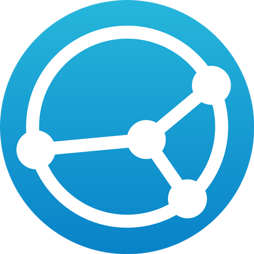

 data-protection-list
=============================================

Manual of resistance to surveillance capitalism - Based on [Valentin Delacour version](https://codeberg.org/PrivacyFirst/PrivacyFirst/issues) - v2022.08.01

# Index

* [0 Comments about fork](#0-comments-about-fork)
* [1 Introduction](#1-introduction)
* [2 Golden rules](#2-golden-rules)
* [3 Computer](#3-computer)
* [3-1 Operating Systems](#3-1-operating-systems)
* [3-2 Services and programs](#3-2-services-and-programs)
* [4 Smartphone](#4-smartphone)
* [4-1 Operating Systems](#4-1-operating-systems)
* [4-2 Applications](#4-2-applications)
* [5 Browsers](#5-browsers)
* [5-1 Extensions](#5-1-extensions)
* [5-2 Tor Browser](#5-2-tor-browser)
* [6 Service instances](#6-service-instances)
* [6-1 Proxies](#6-1-proxies)
* [6-2 Videoconference](#6-2-videoconference)
* [6-3 DNS Servers](#6-3-dns-servers)
* [7 Additional resources (featured sources)](#7-additional-resources-featured-sources)
* [8 Configurations](#8-configurations)
* [8-1 Operating systems for smartphones](#8-1-operating-systems-for-smartphones)
* [8-2 Operating systems for computers](#8-2-operating-systems-for-computers)
* [8-3 Applications](#8-3-applications)
* [8-4 Services and Programs](#8-4-services-and-programs)
* [8-5 Firefox and Add-ons](#8-5-firefox-and-add-ons)

## 0 Comments about fork

I have seen the need to fork this document of **Valentin Delacour** hosted [here](https://codeberg.org/PrivacyFirst/PrivacyFirst/issues) under his approval and license to give it more visibility, readability, comfort, improvement in some aspects and participation. If someone else forks both his and this one, they should do the same.

I think that we should share the more the better and the knowledge about good practices to follow regarding security, privacy and open source that are detailed are no exception.

We are open to changing the format of this document, for now I have thought that this is a good way, but it could be improved.

I don't consider myself an expert on the subject. In fact I do not follow all the recommendations to the letter. But I would like over time to leave aside services that I think I should not use for various reasons, change ways of accessing certain content, use other strategies, etc.

To actively participate you can:

* [Create pull requests](https://github.com/adgellida/data-protection-list/pulls)
* [Generate your questions or incidents](https://github.com/adgellida/data-protection-list/issues)

I recommend you participate in:

* [Official Telegram Group](https://t.me/privacidadlibre)

The objective of the group is to collectively promote good customs in terms of privacy, security and also open source/free programs/apps, services and operating systems to resist the collection and exploitation of personal data by private companies.

I think that they take advantage of the ignorance of the majority to do things that they should not and benefit from it behind our backs. The good thing is that there are people who realize it because they understand the subject and share it with the community.

This document has been copied 1: 1 with very slight modifications in version 7/12/2020 and from now on it will undergo modifications following the following strategies:

* Following updates of the original file
* Pull requests from the community
* Own discoveries

The most notable improvements are:

* It encourages a more orderly, effective, public participation
* Images of the apps to better identify them
* Links to them to find them quickly

Now, the document begins. Put on your belt curves are coming!

## 1 Introduction

The main goal of this document is to promote tools and alternatives in order to protect data and privacy from private companies predation taking place in the framework of surveillance capitalism current system. However, following this document’s recommendations also allows to improve, to some extent, protection against other actors interested in personal data such as State services or pirates.

This list is intended for every person understanding or becoming aware of what is at stake with data protection in our society, independently of one’s knowledge of the subject. It is not intended for individuals needing a total anonymity due to their sensitive functions such as political opponents or some journalists, even if some of the mentioned options could suit them. Indeed, privacy protection isn’t necessarily equivalent to anonymity.

The list format has been chosen in order to make the document’s reading the most efficient possible. Since this method prevents from detailing actual explanations, you are therefore encouraged to look for the ones you consider needed yourselves or in the additional resources in point 7 of the document. The goal being to promote the most reputed and practical options without being encumbered, the list is not intended to be exhaustive and remains subjective although aiming for the greatest impartiality possible.

In order to help to choose between the different options mentioned, this list offers a first subjective hierarchy (apparition order and parenthesis’ presence or not) based on the privacy/user friendliness ratio. A second hierarchy (colours) is solely based on the estimated privacy: 

🟢green (real privacy respect)

🔵blue (respect for privacy under conditions or presence of problematic elements)

🔴red ((does not protect or respect privacy but remains preferable to MAGMA options)

⚫colorless (dependence on external factors or lack of elements to form a relevant estimation). The presence of an asterisk indicates that the mentioned option still hasn’t reached maturity.

I hope this document will help you to improve your personal data protection and your relatives’ one. Although being the result of several years of researches and experiences, this work remains obviously perfectible. Any suggestion or remark is consequently more than welcome to the following email address: "privacyfirst@ik.me". Several months after the present document version, some informations given will be obsolete. This document being frequently updated, you are invited to obtain the latest version on the following webpage: "https://codeberg.org/PrivacyFirst/Data_Protection/issues".

## 2 Golden rules

* Always avoid using MAGMA (Meta, Amazon, Google, Microsoft and Apple) as well as chinese services and programs when possible. It is recommended to delete your accounts and replace them with a respectful alternative.
* Always review all the settings and authorizations of what is used and optimize them to limit the collection of personal data as much as possible.
* Only install the necessary programs/applications as they are potential accesses to your personal data.
* Use free/open source programs (their codes are public and also verifiable) instead of proprietary/closed source whenever possible.
* Favor the popular free options over the unknown ones (they will be more reviewed/reliable).
* If a company offers its services for free, in general, the product it sells is you (your personal data). Due to the model imposed by the surveillance capitalism, pay now or protect them from also being the product.
* Update your programs/operating systems frequently to benefit from the latest fixes for exploitable security flaws and think about replacing the ones that no longer seem to be up to date.
* Don't use third-party antivirus, they are true vacuum cleaners of personal data. Their contribution is negligible as long as good numerical habits are maintained.
Prudence and a good configuration are the best antivirus.
* Privilege Web Apps or shortcuts from the browser to access services instead of applications to install to limit access and the possibilities of collecting
personal information.
* Use temporary emails to create accounts for unimportant sites/services.
* Always disable Wi-Fi, Bluetooth, and geolocation on your smartphone when not in use and don't connect to public Wi-Fi without using a VPN.
* Do not use connected objects (their purpose is to collect as much personal data as possible) or not connect them to the internet when they are essential.

## 3 Computer

### 3-1 Operating Systems

Windows currently is the worst operating system in terms of privacy. The only user friendly and, unlike macOS, truly privacy respectful operating systems are GNU/Linux distributions. There are a multitude of them which characteristics vary greatly. Here is a small selection of the ones offering the best user experience (always privacy respectful) or guaranteeing the best data protection.
Each distribution offers one or several interfaces (desktop environments) that differ in terms of user experience and resource consumption. For security reasons, preferably favour one supporting Wayland such as Gnome or KDE Plasma. An abundant documentation is available online in order to help identifying which distribution and desktop environment will best suit the capacities of your computer and your personal preferences as well as to learn how to easily install it on your computer.

**Desktop :**

🟢[Fedora Workstation](https://getfedora.org/es/workstation) : secure and modern standards (beginner friendly)

🟢[Linux Mint](https://linuxmint.com) : ideal for beginners and great stability

🟢[MX Linux](https://mxlinux.org) : great stability and lightweight (beginner friendly)

🟢[Zorin OS](https://zorin.com/os) : ideal for beginners coming from Windows or macOS

🟢[Parrot Home OS](https://www.parrotsec.org) : system wide anonymity option through Tor (lightweight)

🟢[Fedora Silverblue](https://silverblue.fedoraproject.org) : high security and modern standards (Flatpak centred)

🟢[Qubes OS](https://www.qubes-os.org) : extreme security for advanced users (heavyweight)

🟢[Whonix](https://www.whonix.org) : anonymity through Tor and extreme security (to use in KVM or VirtualBox)

**USB live (RAM) :**

🟢[MX Linux](https://mxlinux.org) : great stability and lightweight (beginner friendly)

🟢[Tails](https://tails.boum.org) : system wide anonymity through Tor and does not leave traces on the hardware

**Raspberry Pi :**

🟢[LibreELEC](https://libreelec.tv) : multimedia center for TV

🟢[Batocera](https://batocera.org) : console emulator, retrogaming and multimedia centre for TV (Kodi)

🟢[Raspberry Pi OS](https://www.raspberrypi.org/software) : classic operating system

🟢[Plasma BigScreen*](https://plasma-bigscreen.org) : multimedia center for TV (voice command with Mycroft AI)

🟢[Nymphcast](http://nyanko.ws/product_nymphcast.php) : free and environmentally friendly alternative to Chromecast

**Hardware :**

The following brands sell computers with Linux preinstalled :

Slimbook

Librem

TUXEDO Computers

Laptop with Linux

Juno Computers

Dell (some models)

Vant

PINE64

System 76

Entroware

Vikings

ThinkPenguin

Other lesser known pre-installed Linux computers sellers exist as well. As for companies selling computers with Windows pre-installed, Dell, Asus, Lenovo and HP models are known to offer a good compatibility with Linux. It is recommended to not buy computers that come with a Nvidia graphic card since they are known to suffer from compatibility problems.

### 3-2 Services and programs

Browser :

🔵[Firefox](https://www.mozilla.org)

🟢[LibreWolf*](https://librewolf-community.gitlab.io)

🟢[Tor Browser](https://www.torproject.org/download)

🔵[Brave](https://brave.com)

🔴[Ungoogled Chromium*](https://ungoogled-software.github.io/ungoogled-chromium-binaries/)

Search engine :

🔵[SearXNG](https://docs.searxng.org)

🔵[Brave Search](https://search.brave.com/)

🔴[DuckDuckGo](https://duckduckgo.com)

🔴[Qwant](https://www.qwant.com)

🔴[Swisscows](https://swisscows.com)

🔵[Mojeek](https://www.mojeek.com)

🔴[Startpage](https://www.startpage.com) (Google proxy)

Instant messaging :

🟢[Threema](https://threema.ch/en)

🔵[Signal](https://signal.org)

🟢[Session*](https://getsession.org)

🟢[Jami](https://jami.net)

🔵[Element](https://app.element.io)

🔴[Telegram](https://telegram.org)

🟢[Cwtch](https://cwtch.im/)

🟢[Briar Desktop](https://briarproject.org/download-briar-desktop/)

Video conferencing :

🔵[Jitsi Meet](https://meet.jit.si)

🟢[Jami](https://jami.net)

🔵[Signal](https://signal.org)

🔵[BigBlueButton](https://bigbluebutton.org)

🔵[Element](https://app.element.io)

🔴[Telegram](https://telegram.org)

🔵[Whereby](https://whereby.com)

Mail :

⚫[ProtonMail](https://protonmail.com)

⚫[Tutanota](https://tutanota.com) ⚫gratuito 🔴de pago

⚫[mailbox.org](https://mailbox.org)

🔴[Disroot](https://disroot.org/en/services/email)

Mail alias manager :

🟢[SimpleLogin](https://simplelogin.io/)

🟢[forwardemail.net](https://forwardemail.net)

# Platforms and services :

Video platform :

🔵[Odysee - LBRY web](https://odysee.com)

🔵[LBRY - desktop](https://lbry.com)

🟢[PeerTube](https://joinpeertube.org)

Youtube :

🔵[Invidious](https://invidio.us)

🔵[Piped](https://piped.kavin.rocks/)

🔴[FreeTube](https://freetubeapp.io)

Translation :

🔵[DeepL](https://www.deepl.com/translator) 🔴gratuito 🔵de pago

🔵[LibreTranslate](https://libretranslate.com)

⚫[Simplytranslate](https://simplytranslate.org)

🔵[Apertium](https://www.apertium.org)

🟢[Firefox Translations(extension)](https://www.apertium.org)

🔴[DuckDuckGo](https://duckduckgo.com) (proxy Microsoft)

🔴[Lingva Translate](https://lingva.ml) (proxy Google)

Maps :

🟢[OpenStreetMap](https://www.openstreetmap.org)

🔵[Qwant Maps](https://www.qwant.com/map)

🔴[DuckDuckGo](https://duckduckgo.com)

🟢[Maps(Gnome)](https://wiki.gnome.org/Apps/Maps)

🟢[Marble(KDE)](https://marble.kde.org)

Respectful social network :

🔵[Mastodon](https://mastodon.social)

🔵[Element](https://app.element.io)

🔴[Telegram*](https://telegram.org)

🔵[PixelFed](https://pixelfed.org)

🔵[Lemmy](https://join.lemmy.ml)

🔵[Pleroma](https://pleroma.social/)

🔵[movim](https://movim.eu)

🔵[Friendica](https://friendi.ca)

Abusive social network proxy :

🔵[Nitter](https://nitter.net) (Twitter)

🔵[Libreddit](https://libredd.it/) (Reddit)

🔵[Bibliogram](https://bibliogram.art) (Instagram)

🔵[ProxiTok](https://proxitok.herokuapp.com) (TikTok)

Wikipedia Proxy :

🟢[Wikiless](https://wikiless.org)

Movies and series streaming :

🔴[Stremio](https://www.stremio.com) 🔵sin cuenta 🔴con cuenta

🟢[Kodi](https://kodi.tv)

Learning platform :

🟢[Moodle](https://moodle.org)

🟢[ILIAS](https://www.ilias.de/en)

🔵[Canvas](https://learn.canvas.net/login/canvas)

All-in-one ecosystem :

🔵Proton

🔴Infomaniak(sin ZKE)

# Privacy :

Ads, trackers and undesired connexions blocker (firewall):

🟢[Portmaster*](https://safing.io/portmaster)

VPN :

🔵[Mullvad](https://mullvad.net)

🔵[ProtonVPN](https://protonvpn.com)

🔵[IVPN](https://www.ivpn.net)

Temporary email :

⚫[Temp Mail](https://temp-mail.org)

⚫[Guerrillamail](https://guerrillamail.com)

⚫[EmailOnDeck](https://www.emailondeck.com)

Encryption tool :

🟢[Picocrypt](https://github.com/HACKERALERT/Picocrypt)

🟢[VeraCrypt](https://www.veracrypt.fr)

🟢[Cryptomator](https://cryptomator.org)

🟢[PeaZip](https://peazip.github.io/)

Metadata eraser :

🟢[Metadata Cleaner](https://www.metacleaner.com)

🟢[ExifCleaner](https://exifcleaner.com)

Blurring or facial recognition resistance :

🟢[PrivacyBlur](https://privacyblur.app/)

🟢[Fawkes(SANDLab)](https://exifcleaner.com)

Network traffic monitor :

🟢[Safing Portmaster](https://safing.io/portmaster)

🟢[Wireshark](https://www.wireshark.org)

# Security :

Password manager :

🟢[KeePassXC](https://keepassxc.org)

🔵[Bitwarden](https://bitwarden.com)

Antivirus (ClamAV) :

🟢ClamTK (Linux)

🟢ClamWin (Windows)

Potentially dangerous files sanitizer :

⚫[Dangerzone](https://dangerzone.rocks)

Flatpak permissions manager :

🟢[Flatseal](https://github.com/tchx84/Flatseal)

# Productivity :

Calendar :

🟢[Tutanota](https://f-droid.org/es/packages/de.tutao.tutanota)

🟢[ProtonCalendar*](https://protonmail.com)

Office suite :

🟢[LibreOffice](https://www.libreoffice.org)

🟢[Onlyoffice](https://www.onlyoffice.com)

🟢[Collabora Office - LibreOffice prof.](https://www.collaboraoffice.com)

🟢[Calligra](https://calligra.org)

🟢[CryptPad](https://cryptpad.fr)

Notes :

🟢[Standard Notes](https://standardnotes.org)

🟢[Joplin](https://joplinapp.org)

🟢[Knotes](http://knotesapp.com)

🟢[Gnote](https://wiki.gnome.org/Apps/Gnote)

PDF reader :

🟢Sumatra PDF

🟢Okular(KDE)

🟢Evince(Gnome)

Collaboration and organization :

🟢[CryptPad](https://cryptpad.fr)

🟢Collabora(profesional)

🟢Skiff

🟢[Mobilizon](https://mobilizon.org/en/)

# Files and data management :

File sharing :

🟢[Disroot](https://upload.disroot.org)

🟢[OnionShare](https://onionshare.org)

🟢[Syncthing](https://syncthing.net)

🔵[Tresorit Send](https://tresorit.com/)

🔴[Swiss Transfer](https://swisstransfer.com)

Cloud :

🔵[Kdrive](https://www.infomaniak.com/es/kdrive)

🔵[Kdrive](https://www.https://mega.nz)

🟢[Nextcloud](https://nextcloud.com)

🔴[Cozy Cloud](https://cozy.io)

[Kdrive](https://icedrive.net) 🔴gratuito 🔵pago

🔴[Disroot](https://cloud.disroot.org)

Backup tool :

🟢Déjà Dup(local)

🟢[Syncthing](https://syncthing.net)

Synchronisation tool :

🟢[Syncthing](https://syncthing.net)

Multimedia streaming (self-hosted) :

🟢Jellyfin

🟢Subsonic

Computer – smartphone connexion :

🟢GSConnect

🟢KDE Connect

🟢Zorin Connect

# Multimedia programs :

Music player :

🟢Music(Gnome)

🟢[Elisa](https://elisa.kde.org)

🔵Lollipop(Gnome)

🟢Rhythmbox

🟢[Audacious](https://audacious-media-player.org)

🟢[Strawberry Music Player](https://www.strawberrymusicplayer.org)

Multimedia player :

🟢[mpv](https://mpv.io)

🟢[VLC](https://www.videolan.org)

🟢Kodi

Graphics editor and drawing :

🟢[Gimp](http://www.gimp.org)

🟢[Krita](https://krita.org)

🟢[Drawing(Gnome)](https://maoschanz.github.io/drawing)

🟢KolourPaint(KDE)

Pictures editor :

🟢[Darktable](https://www.darktable.org)

🟢[RawTherapee](https://rawtherapee.com)

Vectorial drawing :

🟢[Inkscape](https://inkscape.org)

🟢[Karbon](https://calligra.org/karbon)

Layout and edition programm :

🟢[Scribus](https://www.scribus.net)

Audio edition :

🔵[Audacity](https://www.audacityteam.org)

🟢[Ardour](https://www.ardour.org)

🟢[LMMS](https://www.lmms.io)

Video edition :

🟢[Kdenlive](https://kdenlive.org)

🟢[Pitivi](http://www.pitivi.org)

🟢[OpenShot](https://www.openshot.org)

🟢Blender

🟢[Avidemux](https://www.avidemux.org)

🟢Shotcut

CD/DVD burner :

🟢[Brasero](https://wiki.gnome.org/Apps/Brasero)

🟢[k3b](https://apps.kde.org/k3b)

Transcoding :

🟢[Handbrake](https://handbrake.fr)

🟢[MKV](https://www.matroska.org/index.html)

# Miscellaneous: :

Windows programs/games on Linux :

⚫[PlayOnLinux](https://www.playonlinux.com)

⚫[Wine](https://www.winehq.org)

⚫[WinApps*](https://github.com/Fmstrat/winapps)

Cleaning and system optimisation :

🟢[Stacer](https://oguzhaninan.github.io/Stacer-Web)

🟢[ubunsys](https://github.com/adgellida/ubunsys)

🟢[BleachBit](https://www.bleachbit.org)

Internet radio :

🟢[Shortwave(Gnome)](https://apps.gnome.org/app/de.haeckerfelix.Shortwave)

🟢[Radiotray-NG](http://radiotray.sourceforge.net)

🟢[Elisa(KDE)](https://elisa.kde.org)

🔵[Lollypop(Gnome)](https://wiki.gnome.org/Apps/Lollypop)

RSS reader :

🟢[Fluent Reader](https://hyliu.me/fluent-reader)

🟢[Akregator(KDE)](https://apps.kde.org/es/akregator/)

🟢[Feeds(Gnome)](https://gfeeds.gabmus.org)

🟢[RSS Guard](https://github.com/martinrotter/rssguard)

Operating system emulator (virtualization) :

🟢[KVM](https://www.linux-kvm.org/page/Main_Page)

🟢[VirtualBox](https://www.virtualbox.org/)

🟢[Boxes(Gnome)](https://wiki.gnome.org/Apps/Boxes)

## 4 Smartphone

### 4-1 Operating Systems

Android, in its default configuration, is the worst operating system with regard to privacy. Its goal is to continuously send its users’ personal data to Google servers in order to exploit and resell them. The most recommendable solution currently is to use an Android version (custom ROM) modified to respect privacy.

If you do not wish to install or buy a smartphone with a respectful OS (big mistake) and you nevertheless choose to use default Android, follow the few advices detailed in point 8.1 in order to limit as much as possible personal data collection.
Apple’s operating system (iOS), in spite of its marketing revolving around privacy, collects and exploits as well the personal data of its users, in addition to considerably limit their freedom.

Linux based options are privacy respectful and promising it terms of independence although they do not offer the same guarantees as Android regarding security. Furthermore, in their current state of development, they are not recommendable for average users (excepting Sailfish OS).

**Android modified for privacy: :**

🟢[GrapheneOS](https://grapheneos.org) : the most secure and private degoogled Android available

🔵[DivestOS](https://divestos.org/) : degoogled LineageOS partially improved for security and privacy

🔵[CalyxOS](https://calyxos.org) : Android partially degoogled but with microG (better compatibility)

🔵[/e/ OS](https://e.foundation) : partially degoogled LineageOS but with microG and cloud services

🔵[Volla OS](https://volla.online): degoogled LineageOS (locked bootloader)

🔴[LineageOS for microG](https://lineage.microg.org) : LineageOS with microG for a better apps compatibility

🔴[LineageOS](https://lineageos.org) : Android without Google apps but not degoogled (unlocked bootloader)

**Pre-installed hardware :**

🔵[Volla Phone](https://volla.online) : Volla OS (or Ubuntu Touch)

🔵[Fairphone 4](https://www.fairphone.com) : /e/OS with locked bootloader, only available on (https://murena.com)

🔴Teracube 2e : /e/OS with unlocked bootloader, only available on (https://murena.com)

🔴[Pinephone Pro](https://www.pine64.org/pinephone) : Manjaro and other compatible Linux OS

Other /e/OS smartphones with unlocked bootloader available on (https://murena.com)

### 4-2 Applications

The suggested applications for Android (and derived) should be searched in the first place in the Free app store Neo Store (F-Droid), guarantee that no third party tracker is present, and only if they aren’t available there, in Aurora Store, a Google Play respectful client which allows to access anonymously to its free applications. Please see point 8.3 for all necessary explanations.

**Android and derivates :**

# Browsing and communication :

Browser :

🟢[mull](https://github.com/Divested-Mobile/mull)

🟢[Tor Browser](https://www.torproject.org/es/download/#android)

🔵[Bromite](https://www.bromite.org/fdroid)

🔵[FOSS Browser](https://f-droid.org/es/packages/de.baumann.browser)

Instant messenger :

🟢[Threema](https://threema.ch/en)

🔵[Molly(Signal)](https://molly.im)

🟢[Session F-Droid](https://getsession.org)

🟢[Jami](https://jami.net)

🔵[Element](https://app.element.io)

🔴[Telegram FOSS](https://f-droid.org/packages/org.telegram.messenger/)

🟢[Cwtch](https://cwtch.im)

🟢[Briar](https://briarproject.org)

Videoconference :

🔵[Jitsi Meet](https://meet.jit.si)

🔵[Molly(Signal)](https://molly.im)

🟢[Jami](https://jami.net)

🔵[Element](https://app.element.io)

🔴[Telegram FOSS](https://f-droid.org/packages/org.telegram.messenger)

Email client :

⚫[ProtonMail](https://protonmail.com)

🔵[Tutanota](https://f-droid.org/es/packages/de.tutao.tutanota)

⚫[FairEmail](https://email.faircode.eu)

⚫[K-9 Mail](https://f-droid.org/es/packages/com.fsck.k9)

Email aliases manager :

🟢[Simple Login](https://simplelogin.io)

🟢[AnonAddy](https://anonaddy.com/)

# Platforms and services :

Video platform :

🔵LibreTube(proxy YouTube)

🔴[Newpipe](https://newpipe.schabi.org) (🔴cliente Youtube 🟢PeerTube)

🔵Librarian web app(proxy Odysee)

Maps/GPS navigation :

🟢Organic Maps

🟢[OsmAnd+](https://f-droid.org/es/packages/net.osmand.plus/)

🔵[Magic Earth](https://www.magicearth.com)

Translation :

🟢LibreTranslator

🔴DeepL(no oficial)

🔴SimplyTranslate Mobile(proxy Google)

Respectful social network :

🔵[Tusky](https://f-droid.org/en/packages/com.keylesspalace.tusky) (Mastodon)

🔵[Telegram FOSS](https://f-droid.org/packages/org.telegram.messenger)

🔵[Element](https://f-droid.org/es/packages/im.vector.app) (Matrix)

🔵[Fedilab](https://f-droid.org/en/packages/fr.gouv.etalab.mastodon) Mastodon, Pleroma...),

🔵PixelDroid (PixelFed)

🔵[Lemmur (Lemmy)](https://lemmy.ml)

Abusive social network :

⚫Fritter(Twitter sin cuenta)

⚫[Twidere(Twitter)](https://f-droid.org/es/packages/org.mariotaku.twidere)

⚫[Frost(Facebook)](https://f-droid.org/es/packages/com.pitchedapps.frost)

⚫Infinity for Reddit

⚫Twire(Twitch)

⚫Navegador internet

Movies and series streaming :

🟢CloudStream

🟢[Kodi](https://f-droid.org/es/packages/org.xbmc.kodi)

# Privacy :

Ads/trackers blocker :

🟢[RethinkDNS](https://play.google.com/store/apps/details?id=com.celzero.bravedns&hl=es&gl=US)

🟢DoT de Android

🟢TrackerControl

Links redirector and cleaner (abusive => respectful) :

🟢[UntrackMe](https://f-droid.org/en/packages/app.fedilab.nitterizeme)

Network traffic controller (firewall) :

🟢[RethinkDNS](https://play.google.com/store/apps/details?id=com.celzero.bravedns&hl=es&gl=US)

🟢[InviZible Pro](https://f-droid.org/en/packages/pan.alexander.tordnscrypt.stable)

🟢[NetGuard](https://f-droid.org/es/packages/eu.faircode.netguard)

Third party trackers revealer :

🟢[ClassyShark3xodus](https://f-droid.org/es/packages/com.oF2pks.classyshark3xodus)

🟢[Exodus privacy](https://f-droid.org/en/packages/org.eu.exodus_privacy.exodusprivacy)

Network anonymization through Tor :

🟢[Orbot Proxy](https://play.google.com/store/apps/details?id=org.torproject.android&hl=es&gl=US)

🟢[InviZible Pro](https://f-droid.org/en/packages/pan.alexander.tordnscrypt.stable)

VPN :

🔵[Mullvad](https://mullvad.net)

🟢[ProtonVPN](https://protonvpn.com)

🟢[IVPN](https://www.ivpn.net)

🔴[Riseup VPN](https://riseup.net/es/vpn)

🔴[Calyx VPN](https://calyx.net/)

Pictures metadata eraser and blurring :

🟢ExifEraser

🟢[Scrambled Exif](https://f-droid.org/es/packages/com.jarsilio.android.scrambledeggsif)

🟢PrivacyBlur

App isolator :

🟢diferente perfil usuario de Android(

🔵[Insular](https://f-droid.org/en/packages/com.oasisfeng.island.fdroid)

🔵[Shelter](https://f-droid.org/en/packages/net.typeblog.shelter)

Microphone blocker or monitor :

🟢PilferShush Jammer

🟢Vigilante

Google Services replacement :

🔴[MicroG GmsCore](https://microg.org)

🔴GmsCore

# Security :

Password manager :

🟢[KeePassDX](https://f-droid.org/es/packages/com.kunzisoft.keepass.libre)

🔵[Bitwarden](https://bitwarden.com)

🟢AuthPass(KeePass)

Two-factor authentication :

🟢[Aegis](https://f-droid.org/es/packages/com.beemdevelopment.aegis)

🟢[KeePassDX](https://f-droid.org/es/packages/com.kunzisoft.keepass.libre)

Malware scanner :

🟢Hypatia(ClamAV)

# System applications replacement for original Android :

Keyboard: :

🟢[FlorisBoard*](https://github.com/florisboard/florisboard)

🟢[OpenBoard](https://f-droid.org/es/packages/org.dslul.openboard.inputmethod.latin)

Calendar :

🟢Proton Calendar

🟢[Simple Calendar](https://f-droid.org/es/packages/com.simplemobiletools.calendar.pro)

🟢[Tutanota](https://f-droid.org/es/packages/de.tutao.tutanota)

🟢Proton Calendar*

🟢[Etar](https://f-droid.org/es/packages/ws.xsoh.etar)

Camera :

🟢Secure Camera

🟢[Open Camera](https://f-droid.org/es/packages/net.sourceforge.opencamera)

Gallery :

🟢[Simple Gallery](https://f-droid.org/es/packages/com.simplemobiletools.gallery.pro)

File manager :

🟢[Simple File Manager](https://f-droid.org/es/packages/com.simplemobiletools.filemanager.pro)

🟢Material Files

🟢Ghost Commander

Notes :

🟢[Joplin](https://play.google.com/store/apps/details?id=net.cozic.joplin&utm_source=GitHub&utm_campaign=README&pcampaignid=MKT-Other-global-all-co-prtnr-py-PartBadge-Mar2515-1)

🟢SilentNotes

🟢Noto

🟢jtx Board

🔵[Standard Notes](https://play.google.com/store/apps/details?id=com.standardnotes)

🟢Orgzly

🟢[Nextcloud Notes](https://f-droid.org/es/packages/it.niedermann.owncloud.notes)

SMS :

⚫[Simple SMS Messenger](https://f-droid.org/en/packages/com.simplemobiletools.smsmessenger/)

⚫[Signal](https://signal.org)

Weather :

🟢Geometric Weather

🟢Weather

🟢Clima

Audio player :

🟢Metro

🟢[Music Player GO](https://f-droid.org/es/packages/com.iven.musicplayergo)

🟢Auxio

PDF readeer :

🟢Secure PDF Viewer

🟢[MuPDF Viewer](https://f-droid.org/es/packages/com.artifex.mupdf.viewer.app)

Contacts :

🟢[Simple Contacts Pro](https://f-droid.org/es/packages/com.simplemobiletools.contacts.pro)

🟢[Open Contacts](https://f-droid.org/es/packages/opencontacts.open.com.opencontacts)

Audio recorder :

🟢[Audio Recorder](https://f-droid.org/es/packages/com.github.axet.audiorecorder)

🟢[Simple Voice Recorder](https://f-droid.org/es/packages/com.simplemobiletools.voicerecorder)

Phone calls manager : 

⚫[Simple Dialer](https://f-droid.org/es/packages/com.simplemobiletools.dialer)

Calculator :

🟢[Simple Calculator](https://f-droid.org/en/packages/com.simplemobiletools.calculator)

🟢OpenCalc

Clock :

🟢[Simple Clock](https://f-droid.org/en/packages/com.simplemobiletools.clock)

Multimedia player :

🟢[VLC](https://f-droid.org/es/packages/org.videolan.vlc/)

🟢[Kodi](https://f-droid.org/es/packages/org.xbmc.kodi)

# Files and data management :

Synchronisation tool :

🟢[Syncthing](https://f-droid.org/en/packages/com.nutomic.syncthingandroid)

⚫DAVx5(servidor elegido).

File sharing :

🟢[Syncthing](https://f-droid.org/en/packages/com.nutomic.syncthingandroid)

🟢Warpinator(local)

🟢Sharik(local)

Cloud :

🔵Filen

🟢[Nextcloud](https://nextcloud.com)

🔴[Kdrive(sin ZKE)](https://www.infomaniak.com/es/kdrive)

Cloud encryption tool :

🟢[Cryptomator](https://cryptomator.org)

Smartphone – computer connexion :

🟢KDE Connect

🟢Zorin Connect

# Miscellaneous :

Web Apps creator :

🟢Mull

🔵Bromite

QR codes scanner :

⚫Secure Camera

⚫QR & Barcode Scanner

⚫QR Scanner

Office suite :

🟢[Collabora Office - LibreOffice prof.](https://www.collaboraoffice.com)

🟢LibreOffice

RSS feed reader :

🟢Feeder

🟢Read You

🟢News

🟢Handy News Reader

Podcasts manager :

🟢AntennaPod

🟢News

Internet radio :

🟢Transistor – Simple Radio App

Music streaming : 

🟢Finamp(Jellyfin)

🟢Subtracks(Subsonic)

🔴Musify(YouTube)

E-book reader :

🟢Librera Reader

🟢KOReader

Respectful interface for smart devices :

⚫Gadgetbridge

Finances :

🟢Unstoppable Wallet

🟢MoneyBuster

🟢Sushi – Personal Finance

Health and Fitness :

🟢OpenFoodFacts

🟢Feeel – home workouts

🟢FitoTracker

🟢openScale

Launcher :

🟢Simple App Launcher

🟢Discreet Launcher

🔵Neo Launcher

### IOS :

Browser (Safari based) :

⚫[Brave](https://apps.apple.com/us/app/brave-private-web-browser-vpn/id1052879175)

⚫Firefox Focus

⚫[Onion Browser](https://apps.apple.com/us/app/onion-browser/id519296448)

Instant messenger :

🟢[Threema](https://apps.apple.com/us/app/threema-the-secure-messenger/id578665578)

🔵[Signal](https://apps.apple.com/us/app/signal-mensajer%C3%ADa-privada/id874139669)

🟢[Session](https://apps.apple.com/us/app/session-private-messenger/id1470168868)

🟢[Jami](https://apps.apple.com/us/app/jami/id1306951055)

🔵[Element](https://app.element.io)

🔴[Telegram](https://apps.apple.com/us/app/telegram-messenger/id686449807)

Videoconference :

🔵[Signal](https://apps.apple.com/us/app/signal-mensajer%C3%ADa-privada/id874139669)

🟢[Jami](https://apps.apple.com/us/app/jami/id1306951055)

🔵[Element](https://app.element.io)

🔴[Jitsi Meet](https://apps.apple.com/us/app/jitsi-meet/id1165103905)

🔴[Telegram](https://apps.apple.com/us/app/telegram-messenger/id686449807)

Email client : 

🔵[Tutanota](https://apps.apple.com/us/app/tutanota/id922429609)

🔵[ProtonMail](https://apps.apple.com/us/app/protonmail-correo-cifrado/id979659905)

Email aliases manager :

🟢[Simple Login](https://apps.apple.com/us/app/simplelogin-anti-spam/id1494359858)

Video platform :

🔵Piped web app(proxy YouTube)

🔵[Librarian web app(proxy Odysee)](https://odysee.com)

Maps/GPS navigation :

🟢Organic Maps

🔵OsmAnd

🔵Magic Earth

Respectful social network :

🔵Mastodon for iPhone

🔵Element(Matrix)

🔴[Telegram](https://apps.apple.com/us/app/telegram-messenger/id686449807)

Abusive social network :

⚫Navegador internet

Ads/trackers blocker :

🟢[DNSCloak](https://apps.apple.com/us/app/dnscloak-secure-dns-client/id1452162351)

🟢DNS de iOS(ajustes Wi-Fi)

Network anonymization through Tor :

🟢Orbot

VPN:

🔵Mullvad VPN

🔵ProtonVPN

🔵IVPN

Password manager :

⚫[Strongbox(KeePass)](https://apps.apple.com/es/app/strongbox-keepass-pwsafe/id897283731) - KeePass & PwSafe

🔵[Bitwarden](https://apps.apple.com/us/app/bitwarden-gestor-de-contrase/id1137397744)

Two-factor authentication :

⚫[Tofu Authenticator](https://apps.apple.com/us/app/tofu-authenticator/id1082229305)

⚫Raivo OTP

Cloud :

🟢ente Photos

🔵Filen, Nextcloud(auto alojado), (kDrive(sin ZKE))

🟢[Nextcloud(autoalojado)](https://nextcloud.com)

🔵[Kdrive(sin KZE)](https://www.infomaniak.com/es/kdrive)

Cloud encryption tool :

🟢[Cryptomator](https://apps.apple.com/us/app/cryptomator/id953086535)

Office suite :

🟢Collabora Office(LibreOffice)

## 5 Browsers

Compartmentalization (using different browsers, with different configurations, de pending on the tasks) is a recommended method in order to protect privacy without sacrificing too much browsing comfort.
As an example, the use of Firefox with a restrictive configuration (cf. 8.5) for general browsing. Then, the use of LibreWolf or another profile of the same Firefox configured in a less restrictive way for the websites not displaying correctly or or requiring a connexion to a personal account and another browser to access the most recalcitrant websites to privacy protection (Brave or Ungoogled Chromium in their default configurations are ideal for this purpose). We can also think about a browser solely dedicated to e-banking or Tor Browser for anonymous browsing.

### 5-1 Add-ons

Add-ons are extensions used to add features to the browser. It is recommended to install the least possible and only trustworthy ones since they can have access to the entirety of the browsing and that their usage can be identified by visited websites and thus be used for tracking purpose (fingerprinting). Some of the following extensions
are only available for Firefox and its derivatives such as LibreWolf or Mull. Their configurations are detailed in point 8.5.

Recommended extensions :

uBlock Origin - [Chrome](https://chrome.google.com/webstore/detail/ublock-origin/cjpalhdlnbpafiamejdnhcphjbkeiagm) - [Firefox](https://addons.mozilla.org/es/firefox/addon/ublock-origin)

LocalCDN

LibRedirect

KeePassXC

Bitwarden (if used)

CanvasBlocker - [Chrome](https://chrome.google.com/webstore/detail/canvas-blocker-fingerprin/nomnklagbgmgghhjidfhnoelnjfndfpd) - [Firefox](https://addons.mozilla.org/es/firefox/addon/canvasblocker)

### 5-2 Tor Browser

Tor’s concept is to route internet traffic through a network anonymizing it. In order for your browser’s fingerprint (given among others by its configuration) not to reveal your identity by its uniqueness, Tor browsers are designed to have the same fingerprint independently from its users. In order to avoid to make your Tor Browser’s fingerprint
unique, it is recommended not to install add-ons or to make modifications in the "about:config" settings. If you need the anonymity provided, it is obviously necessary as well not to connect to accounts that would compromise it.
Tor network’s anonymization method significantly slows down loadings. Thus, it is not recommended to use it for streaming or sizeable downloads.

## 6 Services Instances

### 6.1 Proxies

The following proxies allow to have access to the content of abusive platforms or services without handing over personal informations to them. However, all their different instances do not necessarily provide the same guarantees regarding privacy protection (IP addresses log or not, etc.). It is recommended to use the browser add-on
LibRedirect (cf. 8.5) in order to automatically redirect links of abusive platforms to a respectful proxy and to distribute the activity between several instances of a same proxy in order to prevent a single one from having access to the whole activity content.When using the smartphone, use the application UntrackMe.

With regard to the :

🔵[Nitter](https://nitter.net) (Twitter)

🔵[Libreddit](https://libredd.it/) (Reddit)

🔵[Bibliogram](https://bibliogram.art) (Instagram)

🔵[ProxiTok](https://proxitok.herokuapp.com) (TikTok)

please refer directly to the lists included in LibRedirect and UntrackMe.

# SearXNG

SearXNG is a FOSS metasearch engine providing the combined results of traditional search engines (Brave Search, Google, Bing, etc.) without giving away the users’ personal data to them. It allows a particularly advanced configuration.

Available instances :    ⚫https://searx.space

Recommanded instances
(no IP log)         :    🟢https://search.sapti.me (Germany)

                         🟢https://search.disroot.org (Netherlands)

                         🟢https://search.privacyguides.net (USA)

# Video Platforms

Piped and Invidious give access to YouTube content without handing over users’ personal data to Google. As for Invidious, depending on the instance, the proxy hiding the IP address isn’t always activated by default. If so, it must be manually activated inthe instance settings.
Librarian gives access to the content of Odysee/LBRY (abusive as well).

Invidious instances :      ⚫https://api.invidious.io

Recommended instances :    🟢https://yewtu.be (Holanda)

                           🟢https://inv.riverside.rocks (EEUU)

Piped instances :          ⚫https://github.com/TeamPiped/Piped/wiki/Instances

Librarian instances :      ⚫https://codeberg.org/librarian/librarian

### 6-2 Videoconference

**Jitsi Meet :**

🟢https://www.kuketz-meet.de : No IP address log (Germany)

🟢https://meet.rollenspiel.monster : No IP address log (Germany)

🟢[Snopyta]https://talk.snopyta.org : No IP address log (Germany)

🔵[Calyx]https://meet.calyx.net : “Temporal” IP address log (United States)

🔵https://www.meet.roflcopter.fr : “Anonymized” IP log (Germany/France)

🔵[Jitsi]https://jitsi.uner.edu.ar : No privacy policy (Argentina)

**BigBlueButton :**

🔵[Grifon](https://bbb.grifon.fr/b) France

🔵[Nixnet](https://meet.nixnet.services/b) UnitedStates

### 6-3 DNS Resolvers

If you use a VPN, it is recommended to not change the default DNS server, in order to not stand out from its other users. Otherwise, replace the DNS server provided by your internet service provider with a respectful among the following recommendations. Always use an encrypted implementation (DoH, DoT, etc.) when it is possible.

🟢AdGuard : advertising, trackers and malicious domains blocking (intercontinental)
DoH : https://dns.adguard.com/dns-query
DoT : dns.adguard.com

🟢Mullvad : advertising, trackers and malicious domains blocking (intercontinental)
DoH : https://adblock.doh.mullvad.net/dns-query
DoT : adblock.doh.mullvad.net

🟢BlahDNS : advertising, trackers and malicious domains blocking (Europe et Asia)
DoH (Alemania) : https://doh-de.blahdns.com/dns-query
DoT (Suiza) : dot-ch.blahdns.com

🟢Control D : advertising, trackers and malicious domains blocking (intercontinental)

🔵Quad9 : malicious domains blocking (intercontinental)

🔵NextDNS : customizable blocking (intercontinental)

## 7 Additional Resources (Main Sources)

**General informations**

Excellent resources to better understand surveillance capitalism and its threats :

- Nothing to Hide, Marc Meillassoux (documental)
- El dilema de las redes sociales, Jeff Orlowski (documental de divulgación)
- La era del capitalismo de la vigilancia, Shoshana Zuboff (libro)
- Diez razones para borrar tus redes sociales de inmediato, Jaron Lanier (libro)

Excellent channel about privacy (with tutorials) :

- The Hated One (LibreTube, Newpipe, Invidious o Piped)

Associations for privacy defence :

- https://www.derechosdigitales.org
- https://r3d.mx
- https://www.laquadrature.net/es
- https://www.eff.org/deeplinks (anglófono)
- https://privacyinternational.org (anglófono)

**Specific informations**

Excellent tutorials for privacy and data protection :

Complete :

- https://ssd.eff.org
- https://privacyguides.org (anglófono)
- https://dt.gl/privacy-cookbook-the-story-so-far-april-2022 (anglófono)

Advanced : 

- https://anonymousplanet-ng.org (anglófono)

Basic :

- https://spreadprivacy.com/tag/device-privacy-tips (pro DuckDuckGo bias)
- https://www.vice.com/en_us/article/d3devm/motherboard-guide-to-not-getting-hacked-online-safety-guide (pro Apple bias)

Android and derivates :

- The excellent GrapheneOS documentation : https://grapheneos.org/faq
- DivestOS : https://divestos.org
- /e/ OS : https://e.foundation
- Apps compatibility with and without microG : https://plexus.techlore.tech

Firefox and derivates configuration :

- https://librewolf.net/docs/faq
- https://github.com/arkenfox/user.js/wiki

VPN use cases and limitations :

- https://www.ivpn.net/blog/why-you-dont-need-a-vpn
- https://www.doineedavpn.com

Comparativos de proveedores de internet/operadores :

- https://www.eff.org/pages/quien-defiende-tus-datos

**Services**

Associations offering excellent privacy respectful services :

- https://disroot.org/es
- https://snopyta.org
- https://framasoft.org/es
- https://www.nobigtech.es

Privacy respect evaluation of different services :

- https://privacyspy.org (anglófono)
- https://tosdr.org

Websites security evaluation tool :

- https://observatory.mozilla.org (anglófono)

**Privacy and FOSS groups**

Telegram :

- [t.me/privacidadlibre](t.me/privacidadlibre) (sala de entrada para el grupo privado)
- [t.me/privateyourtech](t.me/privateyourtech) (anglófono)
- [t.me/grupo_telegram_proyectotictac](t.me/grupo_telegram_proyectotictac)

Matrix :

- #privacidadlibre:matrix.org
- #privacy:matrix.org (anglófono)
- #main:privacyguides.org (anglófono)

## 8 Configurations

### 8-1 Operating Systems for Smartphones

**Global recommendations for Android and derivatives**

- see point 4.2 and 8.3 in order to install applications without using Google Play Store
- verify all applications’ permissions in order to revoke them if they are harmful to pri-
vacy or simply unnecessary :
“Settings” > “Apps” > select the app > “Permissions”
- block the internet access of all unused applications or which do not require internet
access in order to work in the apps’ permissions or when it’s not available, thanks to a
firewall application such as RethinkDNS
- install and use an application, such as RethinkDNS (cf. 8.3), allowing to block trackers
as well as ads and to use a respectful encrypted DNS server (cf. 6.3).
As an inferior alternative, use the built-in Android DoT implementation to set a recom-
mended DNS server (DoT) (cf. 6.3):
“Settings” > “Network & internet” > “Private DNS” > select “Private DNS provider Host-
name” and enter the desired DNS server
- If it is necessary to use abusive applications requiring permissions to function, switch
temporarily to a second user profile (or several ones) in order to totally isolate your
activities and these applications from the rest of your data:
“Settings” > “System” > “Multiple users” > “+ Add user”
To receive notifications across different profiles: “Settings” > “System” > “Multiple
users” > “Send notifications to current user” (repeat for each desired profile)

**Android (original)**

The following measures being insufficient for privacy since the OS is abusive in itself, it
is recommended to use an Android version modified for privacy (cf. 4.1). That being
said, in order to avoid a complete and continuous profiling with original Android:

- avoid all Chinese manufacturers as well as Samsung and favour a brand offering “Android One” (no manufacturer overlay)
- never connect to a Google account
- replace the default applications (especially the keyboard) which can spy on you with the FOSS and respectful ones recommended in point 4.2.
- deactivate all abusive (Google, third party antivirus, etc.) or unused applications and block their internet access (uninstall them when possible)

**GrapheneOS**

GrapheneOS integrates a powerful built-in firewall, directly in the applications’ settings, which allows you to block totally the internet access of the desired applications.
Take this opportunity to deactivate the internet access of all the applications which do not require it in order to work:

“Settings” > “Apps” > select an app > “Permissions” > “Network” > “See all apps with this
permission”

Take as well advantage of the option only offered by GrapheneOS to remove the permission to access sensors (insidiously used to collect informations and for tracking) to all commercial or closed source apps and to the ones that do not need it to work properly, as a precaution:

“Settings” > “Apps” > select an app > “Permissions” > “Sensors” > “See all apps with this
permission”

**CalyxOS**

CalyxOS natively integrates a firewall, the application Datura, which allows you to block the internet access of the desired applications with a high degree of control.
Take this opportunity to deactivate the internet access of all the applications which do not require it in order to work properly.

**/e/OS**

Beware, “ecloud” accounts do not have yet end-to-end encryption (planned). Thus it is strongly advised against using one with personal o important data.

For security reasons, it is advised to install and use the app stores Neo Store (F-Droid)
and Aurora Store (cf. 4.2 and 8.3) instead of /e/OS’s own which is an imperfect implementation.
Likewise, /e/’s default browser which is their own Bromite fork receiving belatedly security updates and with a unique fingerprint, should not be used. Install and use instead a more secure browser such as the ones recommended in the point 4.2.

### 8-2 Operating Systems for Computers

**Windows**

The following recommendations being imperfect and not fully guaranteeing data protection, it is recommended to use a Linux distribution (cf. 3.1) rather than Windows.
That being said, to avoid suffering from a complete and continuous profiling of your activity as well as your person with Windows, follow these recommendations:
- do not use any prior version to Windows 10 since they are vulnerable/insecure
- never connect to a Microsoft account
- fully deactivate Cortana
- deactivate activity history
- go in settings under "privacy" and deactivate everything in every category except the required authorisations for used applications
- uninstall (or when it’s not possible deactivate) Edge, Microsoft OneDrive, anti-viruses (except Microsoft Defender) and all unused applications
- activate random MAC address in Wi-Fi settings
- preferably use a session without admin privileges for daily usage
- install the program O&O ShutUp10++ in order to have more control over privacy
- install the program Portmaster from safing.io in order to fully control (and block) all inbound and outbound connexions with a high degree of control (manually and with preset blacklists to block trackers and ads) and to set a system wide encrypted DNS server (cf. 6.3)

**Linux (general)**

For security reasons, favour the installation of Flatpak programs and set their permissions thanks to the program Flatseal.

Wi-Fi configuration with NetworkManager:

Right click on the Wi-Fi icon > modify connections > select active Wi-Fi > under Wi-Fi select cloned MAC address > Random.
Under IPv6 settings, select IPv6 privacy extensions: Activated (preferred temporary address).

**MX Linux**

Stop Pub (Advert Blocker):
Select all options except "UNBLOCK" and confirm.

### 8-3 Aplicaciones

**Neo Store (F-Droid) and Aurora Store**

These app stores must be downloaded directly from their official source :
https://github.com/NeoApplications/Neo-Store/releases/
https://auroraoss.com.

In order to install them, grant the permission to install unknown applications to your browser when prompted and then, remember to withdraw it for security reasons:
Android “Settings” > “Applications” > browser used > “installation of unknown applications”

Remember not to connect to Aurora Store with a personal Google account. Use in-
stead the anonymous one.

In order to find and install some applications from Neo Store, it is necessary to add
their own repositories. To do that, go in Neo Store settings (top right), then under “repositories” (bottom symbol), add the repositories “DivestOS Official”, “Guardian Project Official” and the other desired ones for applications such as Bromite, Molly (Signal),
NewPipe, Bitwarden or Collabora Office.

**Mull**

During the installation from Neo Store, make sure to select the “DivestOS Official” version instead of the F-Droid one, in order to benefit as quickly as possible from updates
and thus from latest security patches.
Mull is already mostly configured for privacy protection out of the box. However, it is necessary to install the uBlock Origin add-on from the menu and to set it as explained
in point 8.5.

**NewPipe**

During the installation from Neo Store, make sure to select the “NewPipe upstream re-
pository” version instead of the F-Droid one, in order to receive as quickly as possible
the updates fixing possible malfunctions due to YouTube modifications from Google.

To use PeerTube with NewPipe: top left menu > press “YouTube” > select “FramaTube”

**Telegram**

Settings:
- “Privacy and Security” > “Security” > enable “Two-Step Verification” to
protect your account
- “Privacy and Security” > “Secret chats” > disable “Link Previews” in order not to reveal
to Telegram the shared links in secret chats
- “Data and Storage” > disable all under “Automatic media download” in order not to
automatically download malware in public groups or channels

Always use “secret chats” (unavailable for Telegram desktop) in order for the conversa-
tions to be end-to-end encrypted:

Desired contact profile > the three dots at the top on the right > “Start Secret Chat”

**RethinkDNS**

Activate an encrypted DNS resolver (DoH):
- Android “Settings” > “Network & internet” > “Private DNS” > select “Off”
- open RethinkDNS > click on “START” > select “DNS” on top > Select “Other DNS” > select the “+” below > enter the DoH URL of a recommended DNS resolver (cf. 6.3) > click on “ADD” > tick in the list the entry which has just been added

Activate local blocklists to block trackers, ads and more:
click on “DNS” on top > select “On-device blocklists” > click on “Disabled” > confirm
“Download blocklists” > tick the desired blocklists (preferably all the lists under “Security” and “Privacy”) > click on “Apply”

**UntrackMe**

In order to redirect abusive links with UntrackMe, long press a link and select “share link”, then select the app UntrackMe, after click on the desired browser and then select “Always”.

### 8-4 Services and Programs

**LibreWolf**

Since LibreWolf is already optimized for privacy protection, it is recommended not to change its main configuration nor the “about:config” settings in order to prevent altering its fingerprint, thus making it unique.
Notable exception: see point 8.5 under “about:config configuration” to enable “privacy.resistFingerprinting.letterboxing”.

Beware, LibreWolf version for Windows does not automatically receive the updates.
Thus it is important to manually get them from the official website (by reinstalling the installation .exe file), preferably about once a week, in order to benefit from the latest
security patches.

**Brave Search**

Remember to deactivate telemetry (activated by default) :

Settings: “Show more” > “Anonymous usage metrics”

**FreeTube**

The following solution being imperfect, it is recommended to use an Invidious or Piped instance directly from the browser.

Use Invidious as a proxy in order to limit connections to Google servers:

Settings: - Player Settings : activate "Proxy Videos Through Invidious"
- Advanced Settings : enter a functional Invidious instance

In case of malfunction, change Invidious instance or simply deactivate "Proxy Videos
Through Invidious".

### 8-5 Firefox and Add-ons

**General configuration**

In order for Firefox to protect privacy, it is necessary to configure it in an adequate manner. The configuration suggested below being relatively restrictive in order to protect the user’s privacy, it is recommended to practice compartmentalization as described in point 5 of the document and thus to use at least another browser or profile
in order to be able to access the websites most recalcitrant to privacy protection.

Profiles :

Firefox offers the possibility to use several different profiles (configurations) at the same time. It’s the ideal solution to quickly and easily switch from a restrictive configuration preventing a website to load correctly to a more flexible one, without having to switch to a different browser. All the settings made, add-ons installed or bookmarks
added will be saved in the profile in use.
In order to access Firefox’s different profiles, enter "about:profiles" in the URL bar. This page allows you to create new profiles and then to launch them in a new independent window, at any time, by clicking on the button "Launch profile in new browser" under the desired profile.

Language :

In order to prevent being fingerprinted with the use of another language than the
most common amongst Firefox’s users, it is recommended to set “English (United
States)” as the browser’s language.
In order to do that: Top right menu > “Settings” > under “General” > “Language” > click
on the current language > “Search for more languages” > “Select a language to add” >
“English (United States)” > “Add”

Additionally, deactivate “Check your spelling as you type”.

DNS over HTTPS :

If you are using a VPN or that your network or computer are configured to globally
use a respectful and encrypted DNS server, the function "DNS over HTTPS" on by default, should be deactivated in order not to bypass the global setup. If it is not the case (if you don’t know then it’s probably not the case), it is recommended to let this function activated. However, it is necessary to change the default DNS server since Cloudflare is a centralizing actor nefarious for privacy. In place of the latter, it is recommended to choose a respectful option suggested in point 6.3 of the document, depending on your preferences and geographical location.
To do this: "General" > all the way down "Network settings" > "Enable DNS over HTTPS"
> under “Use Provider” select “Custom” > enter the URL of the desired Doh server.

To be continued, the rest of the general recommended configuration with images :

**Add-ons configuration**

It is important to authorize the following add-ons to work in private navigation and to
activate their automatic updates.

uBlock :

- Settings: tick “I am an advanced user” and tick everything under "Privacy"
- Filter Lists: activate ALL lists except under "Regions" (only activate for used lan-
guages)
The lists under “Annoyances” and “Multipurpose” can prevent abusive social networks
from working
- Add the following lists from filterlists.com: Energized: “Actually Legitimate URL
Shortener Tool” (replaces ClearURLs), “Energized Ultimate Protection”, “Energized IP
Extension”, “Energized Social Extension”, (“Energized Xtreme Extension”)
To add a list from filterlists.com : click on the list’s left button > click on "Subscribe" in
the menu appearing
- Follow this website’s tutorial for dynamic filtering rules:
https://www.maketecheasier.com/ultimate-ublock-origin-superusers-guide

LocalCDN :

In the settings go to "Advanced" > under "Generate rule sets for your adblocker" select
uBlock > copy the rules given > open uBlock Origin extension > in its settings go under
"My rules" > paste the copied rules in the part on the right > clic on "Save" > Clic on
"Commit".

LibRedirect :

Settings: - Enable or disable platforms and instances of your choice (cf. 6.)
- “YouTube” > “Default Instances” > only activate “https://yewtube.be“ and
“https://inv.riverside.rocks”

(CanvasBlocker) :

No further configuration required
Note: only use this add-on if “privacy.resistFingerprinting” does not suit you. Other-
wise, it is generally more recommendable to activate this parameter in “about:config”
(cf. following pages) instead of this add-on.

**about:config configuration**

Access to those settings by entering "about:config" in Firefox address bar. Those dif-
ferent settings improve privacy, security and, to some extent, performances. The ele-
ments between parenthesis are not advisable in all cases.
accessibility.blockautorefresh = true
((accessibility.force_disabled = 1))
beacon.enabled = false
browser.backspace_action = 1
browser.cache.offline.capacity = 0
browser.cache.offline.enable = false
browser.display.use_document_fonts = 0
browser.send_pings.max_per_link = 0
browser.sessionhistory.max_entries = 15
Nombre maximum de pages disponibles pour "précédent", allège Firefox
browser.sessionhistory.max_total_viewers = 4
Nombre maximum de pages chargées pour "précédent", allège Firefox
browser.sessionstore.interval = 50000
browser.sessionstore.privacy_level = 2
browser.urlbar.autofill.enabled = false
browser.urlbar.speculativeConnect.enabled = false
browser.urlbar.trimURLs = false
browser.xul.error_pages.expert_bad_cert = true
captivedetect.canonicalURL = supprimer
device.sensors = false pour tous les éléments
dom.allow_cut_copy = false
dom.battery.enabled = false
dom.enable_performance = false
dom.enable_resource_timing = false
dom.event.clipboardevents.enabled = false
dom.event.contextmenu.enabled = false
dom.image-lazy-loading.enabled = false
dom.push = false pour tous les éléments + supprimer les adresses et identifiants
dom.serviceWorkers.enabled= false
dom.vr.oculus.enabled = false
dom.webaudio.enabled = false
gamepad = false pour tous les éléments
geo = supprimer les adresses
geo.enabled = false
(gfx.font_rendering.graphite.enabled = false)
google = false pour tous les éléments + supprimer les adresses
javascript.options.baselinejit = false
javascript.options.ion = false
javascript.options.native_regexp = false
layers.acceleration.force-enabled = true
layout.css.visited_links_enabled = false
mathml.disabled = true
((media.gmp-widevinecdm.enabled = false))
((Désactive DRM, si vidéos DRM pas nécessaires))
media.navigator.enabled = false
media.peerconnection.ice.default_address_only = true
media.peerconnection.ice.no_host = true
((media.peerconnection.enabled = false))
media.video_stats.enabled = false
network.captive-portal-service.enabled = false
network.dnsCacheEntries = 4000
network.dnsCacheExpiration = 43200
network.dnsCacheExpirationGracePeriod = 43200
network.dns.disablePrefetch = true
network.IDN_show_punycode = true
network.http.referer.XOriginPolicy = 0
network.http.referer.XOriginTrimmingPolicy = 2
network.http.referer.spoofSource = true
network.http.referer.trimmingPolicy = 2
network.http.speculative-parallel-limit = 0
network.manage-offline-status = false
network.prefetch-next = false
network.security.esni.enabled = true
normandy = false pour tous les éléments + supprimer les adresses et identifiants
pdfjs.enableScripting = false
pocket = false pour tous les éléments + tout supprimer
privacy.clearOnShutdown.offlineApps = true
privacy.query_stripping.enabled.pbmode = true
privacy.resistFingerprinting = true
(Let "false" if you choose to use CanvasBlocker)
privacy.resistFingerprinting.letterboxing = true
(Manually enter this hidden preference in the search bar to enable it)
privacy.spoof_english = 2
privacy.trackingprotection.enabled = true
privacy.trackingprotection.socialtracking.enabled = true
report (reporter/reporting) = false pour tous les éléments + supprimer les adresses
safebrowsing = false pour tous les éléments + supprimer les adresses et identifiants
security.cert_pinning.enforcement_level = 2
security.mixed_content.upgrade_display_content = true
security.OCSP.enabled = 0
security.ssl.enable_false_start = false
security.ssl.enable_ocsp_must_staple = false
security.ssl.enable_ocsp_stapling = false
security.ssl.require_safe_negotiation = true
security.ssl3.rsa_des_ede3_sha = false
security.tls.enable_0rtt_data = false
security.tls.version.min = 3
telemetry = false pour tous les éléments + supprimer les adresses et identifiants
ui.use_standins_for_native_colors = true
webgl.disabled = true
webgl.enable-debug-renderer-info = false
webgl.enable-webgl2 = false