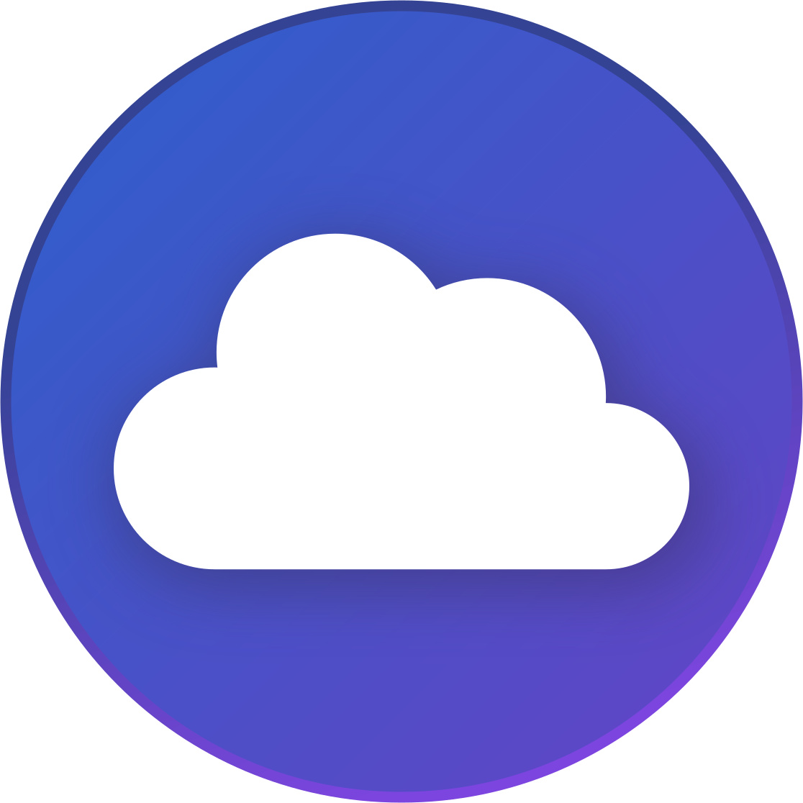
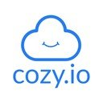
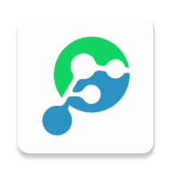
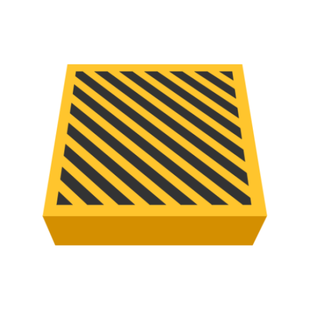

 data-protection-list
=============================================

Manual de resistencia al capitalismo de vigilancia - Basado en la [versión de Valentin Delacour](https://codeberg.org/PrivacyFirst/PrivacyFirst/issues) - v2022.08.01

# Índice

* [0 Comentarios del fork](#0-comentarios-del-fork)
* [1 Introducción](#1-introducción)
* [2 Reglas de oro](#2-reglas-de-oro)
* [3 Computadora](#3-computadora)
* [3-1 Sistemas operativos](#3-1-sistemas-operativos)
* [3-2 Servicios y programas](#3-2-servicios-y-programas)
* [4 Smartphone](#4-smartphone)
* [4-1 Sistemas operativos](#4-1-sistemas-operativos)
* [4-2 Aplicaciones](#4-2-aplicaciones)
* [5-Navegadores](#5-navegadores)
* [5-1 Extensiones](#5-1-extensiones)
* [5-2 Tor Browser](#5-2-tor-browser)
* [6 Instancias de servicios](#6-instancias-de-servicios)
* [6-1 Proxies](#6-1-proxies)
* [6-2 Videoconferencia](#6-2-videoconferencia)
* [6-3 Servidores DNS](#6-3-servidores-dns)
* [7 Recursos adicionales (fuentes destacadas)](#7-recursos-adicionales-fuentes-destacadas)
* [8 Configuraciones](#8-configuraciones)
* [8-1 Sistemas operativos para smartphones](#8-1-sistemas-operativos-para-smartphones)
* [8-2 Sistemas operativos para computadoras](#8-1-sistemas-operativos-para-computadoras)
* [8-3 Aplicaciones](#8-3-aplicaciones)
* [8-4 Servicios y programas](#8-4-servicios-y-programas)
* [8-4 Firefox y extensiones](#8-4-firefox-y-extensiones)

## 0 Comentarios del fork

Me he visto en la necesidad de forkear este documento de **Valentin Delacour** hospedado [aquí](https://codeberg.org/PrivacyFirst/PrivacyFirst/issues) bajo su aprobación y licencia para darle más visibilidad, legibilidad, comodidad, mejora en algunos aspectos y participación. Si otra persona forkea tanto el suyo como este debe hacer lo mismo.

Pienso que debemos compartir cuánto más mejor y los conocimientos sobre las buenas prácticas a seguir referente a la seguridad, privacidad y open source que se detallan no son una excepción.

Estamos abiertos a que este documento se cambie de formato, por ahora he pensado que esta es una buena forma, pero mejorable.

No me considero ningún experto sobre el tema. De hecho no sigo todas las recomendaciones al pie de la letra. Pero sí que me gustaría con el tiempo ir dejando de lado servicios que considero no debería usar por diversas causas, cambiar formas de acceso a cierto contenido, usar otras estrategias, etc.

Para participar activamente puedes:

* [Crear pull requests](https://github.com/adgellida/data-protection-list/pulls)
* [Generar tus cuestiones o incidencias](https://github.com/adgellida/data-protection-list/issues)

Os recomiendo participar en:

* [Official Telegram Group](https://t.me/privacidadlibre)

El objetivo del grupo es promover colectivamente buenas costumbres en cuanto a la privacidad, seguridad y tambien programas/apps, servicios y sistemas operativos open source/libres para resistir a la recolección y explotación de datos personales por empresas privadas.

Yo pienso que se aprovechan del desconocimiento de la mayoría para hacer cosas que no deberían y beneficiarse de ello a nuestras espaldas. Lo bueno es que hay gente que se da cuenta porque entiende del tema y lo comparte con la comunidad.

Este documento ha sido copiado 1:1 con muy ligeras modificaciones en la versión 7/12/2020 y a partir de ahora sufrirá modificaciones siguiendo las siguientes estrategias:

* Siguientes actualizaciones del fichero original
* Pull requests de la comunidad
* Descubrimientos propios

Las mejoras más destacables son:

* Fomenta una participación más ordenada, efectiva, pública.
* Imágenes de las apps para identificarlas mejor.
* Enlaces a las mismas para encontrarlas rápidamente.

Ahora sí, empieza el documento. Póngase el cinturón que vienen curvas!

## 1 Introducción

Este documento tiene como objetivo principal proponer herramientas y alternativas para proteger los datos y la privacidad de la predación de empresas privadas bajo el sistema actual de capitalismo de vigilancia. Ahora bien, seguir las siguientes
recomendaciones permite también mejorar, en ciertas medidas, la protección contra otras entes tales como servicios de Estados o piratas, por ejemplo.

Esta lista se destina a todas las personas conscientes o tomando consciencia de la importancia de la protección de datos en nuestra sociedad, independientemente de sus conocimientos del tema. No se destina a las personas necesitando un anonimato
total de parte de su función a riesgos tales como opositores políticos o algunos periodistas, aún si algunas opciones propuestas podrían convenirles. Efectivamente, la privacidad no necesariamente es igual al anonimato.

El formato de lista fue escogido con el afán de hacer su consulta lo más eficiente posible. Este enfoque impide detallar verdaderas explicaciones. Así que les invito a buscar las que les sean necesarias por sí mismos o en los recursos adicionales
mencionados en el punto 6 del documento. Teniendo el propósito de proponer las opciones más reputadas y prácticas sin estar demasiado cargada, la lista no tiene por vocación ser exhaustiva y permanece subjetiva a pesar de buscar tener la mayor
objetividad posible.

En el afán de ayudarles a escoger entre las diferentes opciones enumeradas, esta lista propone una primera priorización (orden de aparición y presencia o no de paréntesis) subjetiva basada en el reporte privacidad/usabilidad. Una segunda priorización
(colores) se basa unicamente en la privacidad estimada :

🟢verde (verdadero respeto de la privacidad)

🔵azul (respeto de la privacidad bajo condiciones o presencia de elementos problemáticos)

🔴rojo (no protege o no respeta la privacidad pero sigue siendo preferible a las opciones de los MAGMA)

⚫incoloro (la entrada en cuestión depende de factores externos, o falta de elementos para formar una estimación pertinente)

La presencia de un asterisco indica que la opción mencionada todavía no está madura en su estado de desarrollo actual.

Espero que este documento les servirá para mejorar la protección de sus datos personales y de los de sus cercanos. Aunque siendo el fruto de varios años de búsquedas y experimentos, este trabajo permanece obviamente perfectible.
Cualquier sugerencia o comentario es entonces más que bienvenido al correo : “privacyfirst@ik.me”. Varios meses después de la presente versión del documento, se debe asumir que ciertas informaciones dadas serán obsoletas. El documento siendo actualizado frecuentemente, están invitados a conseguir la última versión en la página web siguiente: “https://codeberg.org/PrivacyFirst/PrivacyFirst/issues”.

## 2 Reglas de oro

* Evitar usar servicios y programas de los MAGMA (Meta, Amazon, Google, Microsoft y Apple) así como chinos SIEMPRE que sea posible. Lo más recomendable es eliminar sus eventuales cuentas y reemplazarlas por una alternativa respetuosa.
* Siempre revisar todos los ajustes y autorizaciones de lo que se utiliza y optimizarlos para limitar al máximo la recolección de datos personales.
* Solo instalar los programas/aplicaciones necesarios pues son accesos potenciales a sus datos personales.
* Usar programas libres/open source (sus códigos son públicos y así mismo verificables) en vez de los propietarios/closed source siempre que es posible.
* Favorecer las opciones libres populares a las desconocidas (serán más revisadas/confiables).
* Si una empresa propone sus servicios gratuitamente, en general, el producto que vende es usted (sus datos personales). Por causa del modelo impuesto por el capitalismo de vigilancia, pagar ya ni les protege de también ser el producto.
* Actualizar sus programas/sistemas operativos frecuentemente para beneficiar de los últimos correctivos de fallas de seguridad explotables y pensar en reemplazar los que ya no parecen ser actualizados.
* No usar antivirus de terceros, son verdaderas aspiradoras de datos personales. Su aporte es desdeñable con tal de que se mantengan buenas costumbres numéricas. La prudencia y una buena configuración son los mejores antivirus.
* Privilegiar Web Apps o atajos desde el navegador para acceder a servicios en vez de aplicaciones a instalar para limitar el acceso y las posibilidades de recolección de datos personales.
* Utilizar correos temporales para crear cuentas para sitios/servicios poco importantes.
* Siempre desactivar el Wi-Fi, Bluetooth y geolocalización de su smartphone cuando no están usados y no conectarse a Wi-Fi públicos sin el uso de un VPN.
* No usar objetos conectados (su propósito es recolectar la mayor cantidad posible de datos personales) o no conectarlos a internet cuando son imprescindibles.

## 3 Computadora

### 3-1 Sistemas operativos

Windows actualmente es el peor sistema operativo en términos de privacidad. Los únicos S.O. de fácil uso que, al contrario de macOS, respetan realmente la privacidad son las distribuciones libres GNU/Linux. Existe una multitud cuyas características varían considerablemente. Aquí una pequeña selección de las distribuciones ofreciendo la mejor experiencia para el usuario (siempre respetando la privacidad) o garantizando la mayor protección de datos.
Cabe recordar que cada una de ellas propone una o varias interfaces (entornos de escritorio) diferentes en términos de experiencia de usuario y de consumo de recursos. Por motivos de seguridad, privilegien uno que soporte Wayland tal como
Gnome o KDE Plasma. Existe una abundante documentación en linea para identificar cual distribución y entorno de escritorio convendrán mejor a las capacidades de su computadora y a sus preferencias así como para saber como instalarla fácilmente.

**Desktop :**

🟢[Fedora Workstation](https://getfedora.org/es/workstation) : estándares seguros y modernos (conviene a los principiantes)

🟢[Linux Mint](https://linuxmint.com) : ideal para los principiantes y gran estabilidad

🟢[MX Linux](https://mxlinux.org) : gran estabilidad y bajo consumo (conviene a los principiantes)

🟢[Zorin OS](https://zorin.com/os) : ideal para los principiantes acostumbrados a Windows/macOS

🟢[Parrot](https://www.parrotsec.org) : opción de anonimato global por Tor (bajo consumo de recursos)

🟢[Fedora Silverblue](https://silverblue.fedoraproject.org) : alta seguridad y estándares modernos (centrado en Flatpak)

🟢[Qubes OS](https://www.qubes-os.org) : seguridad extrema para usuarios avanzados (alto consumo de recursos)

🟢[Whonix](https://www.whonix.org) : anonimato global por Tor y seguridad extrema (usar en KVM o VirtualBox)

**USB live (RAM) :**

🟢[MX Linux](https://mxlinux.org) : gran estabilidad y bajo consumo (conviene a los principiantes)

🟢[Tails](https://tails.boum.org) : anonimato global por Tor y no deja rastros en el equipo

**Raspberry Pi :**

🟢[LibreELEC](https://libreelec.tv) : centro multimedia para TV

🟢[Batocera](https://batocera.org) : emulador de consolas, retrogaming y centro multimedia para TV (Kodi)

🟢[Raspberry Pi OS](https://www.raspberrypi.org/software) : sistema operativo clásico

🟢[Plasma BigScreen*](https://plasma-bigscreen.org) : centro multimedia para TV (comando de voz con Mycroft AI)

🟢[Nymphcast*](http://nyanko.ws/product_nymphcast.php) : alternativa libre y respetuosa a Chromecast

**Hardware :**

Las marcas siguientes venden computadoras con Linux preinstalado :

Slimbook

Librem

TUXEDO Computers

Laptop with Linux

Juno Computers

Dell (pocos modelos)

Vant

PINE64

System 76

Entroware

Vikings

ThinkPenguin

También existen otros vendedores menos conocidos de computadoras con Linux preinstalado. En cuanto a los vendedores de computadoras con Windows preinstalado, los modelos de Dell, Asus, Lenovo y HP son reputados por tener una buena compatibilidad con Linux. Es recomendable evitar comprar computadoras que vienen con una tarjeta gráfica Nvidia dado que son conocidas por padecer de problemas de compatibilidad.

### 3-2 Servicios y programas

# Navegación y comunicación :

Navegador :

🔵[Firefox](https://www.mozilla.org)

🟢[LibreWolf*](https://librewolf-community.gitlab.io)

🟢[Tor Browser](https://www.torproject.org/download)

🔵[Brave](https://brave.com)

🔴[Ungoogled Chromium*](https://ungoogled-software.github.io/ungoogled-chromium-binaries/)

Buscador :

🔵[SearXNG](https://docs.searxng.org)

🔵[Brave Search](https://search.brave.com/)

🔴[DuckDuckGo](https://duckduckgo.com)

🔴[Qwant](https://www.qwant.com)

🔴[Swisscows](https://swisscows.com)

🔵[Mojeek](https://www.mojeek.com)

🔴[Startpage](https://www.startpage.com) (proxy Google)

Mensajería instantánea :

🟢[Threema](https://threema.ch/en)

🔵[Signal](https://signal.org)

🟢[Session*](https://getsession.org)

🟢[Jami](https://jami.net)

🔵[Element](https://app.element.io)

🔴[Telegram](https://telegram.org)

🟢[Cwtch](https://cwtch.im)

🟢[Briar Desktop](https://briarproject.org/download-briar-desktop/)

Videoconferencia :

🔵[Jitsi Meet](https://meet.jit.si)

🟢[Jami](https://jami.net)

🔵[Signal](https://signal.org)

🔵[BigBlueButton](https://bigbluebutton.org)

🔵[Element](https://app.element.io)

🔴[Telegram](https://telegram.org)

🔵[Whereby](https://whereby.com)

Correo :

⚫[ProtonMail](https://protonmail.com)

⚫[Tutanota](https://tutanota.com) ⚫gratuito 🔴de pago

⚫[mailbox.org](https://mailbox.org)

🔴[Disroot(sin ZKE)](https://disroot.org/en/services/email)

Gestor de alias de correo :

🟢[SimpleLogin](https://simplelogin.io/)

🟢[forwardemail](https://forwardemail.net)

# Plataformas y servicios :

Plataforma vídeo :

🔵[Odysee - LBRY web](https://odysee.com)

🔵[LBRY - desktop](https://lbry.com)

🟢[PeerTube](https://joinpeertube.org)

Youtube :

🔵[Invidious](https://invidio.us)

🔵[Piped](https://piped.kavin.rocks/)

🔴[FreeTube](https://freetubeapp.io)

Traducción :

🔵[DeepL](https://www.deepl.com/translator) 🔴gratuito 🔵de pago

🔵[LibreTranslate](https://libretranslate.com)

⚫[Simplytranslate](https://simplytranslate.org)

🔵[Apertium](https://www.apertium.org)

🟢[Firefox Translations(extension)](https://www.apertium.org)

🔴[DuckDuckGo](https://duckduckgo.com) (proxy Microsoft)

🔴[Lingva Translate](https://lingva.ml) (proxy Google)

Mapas :

🟢[OpenStreetMap](https://www.openstreetmap.org)

🔵[Qwant Maps](https://www.qwant.com/map)

🔴[DuckDuckGo](https://duckduckgo.com)

🟢[Maps(Gnome)](https://wiki.gnome.org/Apps/Maps)

🟢[Marble(KDE)](https://marble.kde.org)

Red social respetuosa:

🔵[Mastodon](https://mastodon.social)

🔵[Element](https://app.element.io)

🔴[Telegram*](https://telegram.org)

🔵[PixelFed](https://pixelfed.org)

🔵[Lemmy](https://join.lemmy.ml)

🔵[Pleroma](https://pleroma.social/)

🔵[movim](https://movim.eu)

🔵[Friendica](https://friendi.ca)

Proxy de red social abusiva:

🔵[Nitter](https://nitter.net) (Twitter)

🔵[Libreddit](https://libredd.it/) (Reddit)

🔵[Bibliogram](https://bibliogram.art) (Instagram)

🔵[ProxiTok](https://proxitok.herokuapp.com) (TikTok)

Proxy Wikipedia :

🟢[Wikiless](https://wikiless.org)

Películas y series en linea :

🔴[Stremio](https://www.stremio.com) 🔵sin cuenta 🔴con cuenta

🟢[Kodi](https://kodi.tv)

Plataforma de aprendizaje :

🟢[Moodle](https://moodle.org)

🟢[ILIAS](https://www.ilias.de/en)

🔵[Canvas](https://learn.canvas.net/login/canvas)

Ecosistema todo en uno :

🔵Proton

🔴Infomaniak(sin ZKE)

# Privacidad :

Bloqueador de publicidad/rastreadores y controlador de trafico red :

🟢[Portmaster*](https://safing.io/portmaster)

VPN :

🔵[Mullvad](https://mullvad.net)

🔵[ProtonVPN](https://protonvpn.com)

🔵[IVPN](https://www.ivpn.net)

Correo temporal :

⚫[Temp Mail](https://temp-mail.org)

⚫[Guerrillamail](https://guerrillamail.com)

⚫[EmailOnDeck](https://www.emailondeck.com)

Herramienta de cifrado :

🟢[Picocrypt](https://github.com/HACKERALERT/Picocrypt)

🟢[VeraCrypt](https://www.veracrypt.fr)

🟢[Cryptomator](https://cryptomator.org)

🟢[PeaZip](https://peazip.github.io/)

Supresión de metadatos :

🟢[Metadata Cleaner](https://www.metacleaner.com)

🟢[ExifCleaner](https://exifcleaner.com)

Desenfoque o resistencia al reconocimiento facial :

🟢[PrivacyBlur](https://privacyblur.app/)

🟢[Fawkes(SANDLab)](https://exifcleaner.com)

Monitor de trafico de red :

🟢[Safing Portmaster](https://safing.io/portmaster)

🟢[Wireshark](https://www.wireshark.org)

# Seguridad :

Administrador de contraseñas :

🟢[KeePassXC](https://keepassxc.org)

🔵[Bitwarden](https://bitwarden.com)

Antivirus (ClamAV) :

🟢ClamTK (Linux)

🟢ClamWin (Windows)

Convertidor de archivos potencialmente peligrosos :

⚫[Dangerzone](https://dangerzone.rocks)

Gestor de permisos para Flatpak :

🟢[Flatseal](https://github.com/tchx84/Flatseal)

# Productividad :

Agenda :

🟢[Tutanota](https://f-droid.org/es/packages/de.tutao.tutanota)

🟢[ProtonCalendar*](https://protonmail.com)

Ofimática :

🟢[LibreOffice](https://www.libreoffice.org)

🟢[Onlyoffice](https://www.onlyoffice.com)

🟢[Collabora Office - LibreOffice prof.](https://www.collaboraoffice.com)

🟢[Calligra](https://calligra.org)

🟢[CryptPad](https://cryptpad.fr)

Notas :

🟢[Standard Notes](https://standardnotes.org)

🟢[Joplin](https://joplinapp.org)

🟢[Knotes](http://knotesapp.com)

🟢[Gnote](https://wiki.gnome.org/Apps/Gnote)

🟢Lector PDF :

🟢Sumatra PDF

🟢Okular(KDE)

🟢Evince(Gnome)

Colaboración y organización :

🟢[CryptPad](https://cryptpad.fr)

🟢Collabora(profesional)

🟢Skiff

🟢[Mobilizon](https://mobilizon.org/en/)

# Gestión de archivos y datos :

Compartición de archivos :

🟢[Disroot](https://upload.disroot.org)

🟢[OnionShare](https://onionshare.org)

🟢[Syncthing](https://syncthing.net)

🔵[Tresorit Send](https://tresorit.com/)

🔴[Swiss Transfer](https://swisstransfer.com)

Cloud :

🔵[Kdrive](https://www.infomaniak.com/es/kdrive)

🔵[Kdrive](https://www.https://mega.nz)

🟢[Nextcloud](https://nextcloud.com)

🔴[Cozy Cloud](https://cozy.io)

[Kdrive](https://icedrive.net) 🔴gratuito 🔵pago

🔴[Disroot](https://cloud.disroot.org)

Herramienta de copia de respaldo :

🟢Déjà Dup(local)

🟢[Syncthing](https://syncthing.net)

Herramienta de sincronización :

🟢[Syncthing](https://syncthing.net)

Streaming de multimedia (auto alojado) :

🟢Jellyfin

🟢Subsonic

Conexión entre computadora y celular :

🟢GSConnect

🟢KDE Connect

🟢Zorin Connect

# Programas multimedia :

Reproductor audio :

🟢Music(Gnome)

🟢[Elisa](https://elisa.kde.org)

🔵Lollipop(Gnome)

🟢Rhythmbox

🟢[Audacious](https://audacious-media-player.org)

🟢[Strawberry Music Player](https://www.strawberrymusicplayer.org)

Reproductor multimedia :

🟢[mpv](https://mpv.io)

🟢[VLC](https://www.videolan.org)

🟢[Kodi](https://f-droid.org/es/packages/org.xbmc.kodi)

Edición de imágenes y dibujo :

🟢[Gimp](http://www.gimp.org)

🟢[Krita](https://krita.org)

🟢[Drawing(Gnome)](https://maoschanz.github.io/drawing)

🟢KolourPaint(KDE)

Procesamiento de fotografías :

🟢[Darktable](https://www.darktable.org)

🟢[RawTherapee](https://rawtherapee.com)

Edición gráfica vectorial :

🟢[Inkscape](https://inkscape.org)

🟢[Karbon](https://calligra.org/karbon)

Maquetación de páginas :

🟢[Scribus](https://www.scribus.net)

Edición audio :

🔵[Audacity](https://www.audacityteam.org)

🟢[Ardour](https://www.ardour.org)

🟢[LMMS](https://www.lmms.io)

Edición video :

🟢[Kdenlive](https://kdenlive.org)

🟢[Pitivi](http://www.pitivi.org)

🟢[OpenShot](https://www.openshot.org)

🟢Blender

🟢[Avidemux](https://www.avidemux.org)

🟢Shotcut

Grabación de CD/DVD :

🟢[Brasero](https://wiki.gnome.org/Apps/Brasero)

🟢[k3b](https://apps.kde.org/k3b)

Transcodificación :

🟢[Handbrake](https://handbrake.fr)

🟢[MKV](https://www.matroska.org/index.html)

# Otros :

Programas/juegos Windows bajo Linux :

⚫[PlayOnLinux](https://www.playonlinux.com)

⚫[Wine](https://www.winehq.org)

⚫[WinApps*](https://github.com/Fmstrat/winapps)

Limpieza y optimización de sistema :

🟢[Stacer](https://oguzhaninan.github.io/Stacer-Web)

🟢[ubunsys](https://github.com/adgellida/ubunsys)

🟢[BleachBit](https://www.bleachbit.org)

Radio internet :

🟢[Shortwave(Gnome)](https://apps.gnome.org/app/de.haeckerfelix.Shortwave)

🟢[Radiotray-NG](http://radiotray.sourceforge.net)

🟢[Elisa(KDE)](https://elisa.kde.org)

🔵[Lollypop(Gnome)](https://wiki.gnome.org/Apps/Lollypop)

Lector RSS :

🟢[Fluent Reader](https://hyliu.me/fluent-reader)

🟢[Akregator(KDE)](https://apps.kde.org/es/akregator/)

🟢[Feeds(Gnome)](https://gfeeds.gabmus.org)

🟢[RSS Guard](https://github.com/martinrotter/rssguard)

Emulador de sistema operativo (virtualización) :

🟢[KVM](https://www.linux-kvm.org/page/Main_Page)

🟢[VirtualBox](https://www.virtualbox.org/)

🟢[Boxes(Gnome)](https://wiki.gnome.org/Apps/Boxes)

## 4 Smartphone

### 4-1 Sistemas operativos

Android, en su configuración por defecto, es actualmente el peor sistema operativo en cuanto a la privacidad. Su propósito es mandar continuamente datos personales hacia los servidores de Google para explotarlos y venderlos. La solución más recomendable en la actualidad es usar una versión de Android modificada (custom ROM) para respetar la privacidad.

Si no desean instalar o comprar un smartphone con un sistema operativo respetuoso (grave error) y que a pesar de todo desean usar Android de origen, sigan los consejos detallados en el punto 8.1 de este documento en el afán de limitar al máximo la recolección de datos personales.

El sistema operativo de Apple (iOS), a pesar de su marketing basado en el respeto de la privacidad, también recolecta y explota los datos personales de sus usuarios además de limitar considerablemente su libertad.

Las opciones basadas en Linux son respetuosas de la privacidad y prometedoras en términos de independencia pero no ofrecen las mismas garantías en términos de seguridad que Android. Además, en su estado de desarrollo actual, no son recomendables para usuarios promedios (a excepción de Sailfish OS).

**Android modificado para la privacidad :**

🟢[GrapheneOS](https://grapheneos.org) : el Android degooglizado más privado y seguro disponible

🔵[DivestOS](https://divestos.org/) : LineageOS parcialmente mejorado para la seguridad y privacidad

🔵[CalyxOS](https://calyxos.org) : Android degooglizado y seguro con microG (compatibilidad)

🔵[/e/ OS](https://e.foundation) : LineageOS degooglizado pero con microG y servicios cloud

🔵[Volla OS](https://volla.online): LineageOS degooglizado (bootloader cerrado)

🔴[LineageOS for microG](https://lineage.microg.org) : LineageOS con microG para una mejor compatibilidad

🔴[LineageOS](https://lineageos.org) : Android sin Google apps pero no totalmente degooglizado (bootloader abierto)

**Hardware preinstalado :**

🔵[Volla Phone](https://volla.online) : Volla OS (o Ubuntu Touch)

🔵[Fairphone 4](https://www.fairphone.com) : /e/OS con bootloader cerrado, solo disponible en (https://murena.com)

🔴Teracube 2e : /e/OS con bootloader abierto, solo disponible en (https://murena.com)

🔴[Pinephone Pro](https://www.pine64.org/pinephone) : Manjaro y otros S.O. Linux compatibles)

Otros modelos con /e/OS y el bootloader abierto disponibles en (https://murena.com)

### 4-2 Aplicaciones

Las aplicaciones propuestas para Android y derivados se deben buscar primero en la tienda de aplicaciones libres Neo Store (F-Droid), garantía que no tengan rastreadores terceros, y solo si no están ahí, en Aurora Store, un cliente respetuoso de Google Play permitiendo tener acceso a sus aplicaciones gratuitas de manera anónima. Por favor véase el punto 8.3 para todas las explicaciones necesarias.

**Android y derivados :**

# Navegación y comunicación :

Navegador :

🟢[mull](https://github.com/Divested-Mobile/mull)

🟢[Tor Browser](https://www.torproject.org/es/download/#android)

🔵[Bromite](https://www.bromite.org/fdroid)

🔵[FOSS Browser](https://f-droid.org/es/packages/de.baumann.browser)

Mensajería instantánea :

🟢[Threema](https://threema.ch/en)

🔵[Molly(Signal)](https://molly.im)

🟢[Session F-Droid](https://getsession.org)

🟢[Jami](https://jami.net)

🔵[Element](https://app.element.io)

🔴[Telegram FOSS](https://f-droid.org/packages/org.telegram.messenger/)

🟢[Cwtch](https://cwtch.im)

🟢[Briar](https://briarproject.org)

Videoconferencia :

🔵[Jitsi Meet](https://meet.jit.si)

🔵[Molly(Signal)](https://molly.im)

🟢[Jami](https://jami.net)

🔵[Element](https://app.element.io)

🔴[Telegram FOSS](https://f-droid.org/packages/org.telegram.messenger)

Cliente correo :

⚫[ProtonMail](https://protonmail.com)

🔵[Tutanota](https://f-droid.org/es/packages/de.tutao.tutanota)

⚫[FairEmail](https://email.faircode.eu)

⚫[K-9 Mail](https://f-droid.org/es/packages/com.fsck.k9)

Gestor de alias para correo :

🟢[Simple Login](https://simplelogin.io)

🟢[AnonAddy](https://anonaddy.com/)

# Plataformas y servicios :

Plataforma vídeo :

🔵LibreTube(proxy YouTube)

🔴[Newpipe](https://newpipe.schabi.org) (🔴cliente Youtube 🟢PeerTube)

🔵Librarian web app(proxy Odysee)

Mapas/navegación GPS :

🟢Organic Maps

🟢[OsmAnd+](https://f-droid.org/es/packages/net.osmand.plus/)

🔵[Magic Earth](https://www.magicearth.com)

Traducción :

🟢LibreTranslator

🔴DeepL(no oficial)

🔴SimplyTranslate Mobile(proxy Google)

Red social respetuosa :

🔵[Tusky](https://f-droid.org/en/packages/com.keylesspalace.tusky) (Mastodon)

🔵[Telegram FOSS](https://f-droid.org/packages/org.telegram.messenger)

🔵[Element](https://f-droid.org/es/packages/im.vector.app) (Matrix)

🔵[Fedilab](https://f-droid.org/en/packages/fr.gouv.etalab.mastodon) Mastodon, Pleroma...),

🔵PixelDroid (PixelFed)

🔵[Lemmur (Lemmy)](https://lemmy.ml)

Red social abusiva :

⚫Fritter(Twitter sin cuenta)

⚫[Twidere(Twitter)](https://f-droid.org/es/packages/org.mariotaku.twidere)

⚫[Frost(Facebook)](https://f-droid.org/es/packages/com.pitchedapps.frost)

⚫Infinity for Reddit

⚫Twire(Twitch)

⚫Navegador internet

Películas y series en linea :

🟢CloudStream

🟢[Kodi](https://f-droid.org/es/packages/org.xbmc.kodi)

# Privacidad :

Bloqueador de publicidad/rastreadores :

🟢[RethinkDNS](https://play.google.com/store/apps/details?id=com.celzero.bravedns&hl=es&gl=US)

🟢DoT de Android

🟢TrackerControl

Redirector y limpiador de enlaces (abusivo => respetuoso) :

🟢[UntrackMe](https://f-droid.org/en/packages/app.fedilab.nitterizeme)

Control de trafico red (cortafuegos) :

🟢[RethinkDNS](https://play.google.com/store/apps/details?id=com.celzero.bravedns&hl=es&gl=US)

🟢[InviZible Pro](https://f-droid.org/en/packages/pan.alexander.tordnscrypt.stable)

🟢[NetGuard](https://f-droid.org/es/packages/eu.faircode.netguard)

Revelador de rastreadores terceros :

🟢[ClassyShark3xodus](https://f-droid.org/es/packages/com.oF2pks.classyshark3xodus)

🟢[Exodus privacy](https://f-droid.org/en/packages/org.eu.exodus_privacy.exodusprivacy)

Anonimización red por Tor :

🟢[Orbot Proxy](https://play.google.com/store/apps/details?id=org.torproject.android&hl=es&gl=US)

🟢[InviZible Pro](https://f-droid.org/en/packages/pan.alexander.tordnscrypt.stable)

VPN :

🔵[Mullvad](https://mullvad.net)

🟢[ProtonVPN](https://protonvpn.com)

🟢[IVPN](https://www.ivpn.net)

🔴[Riseup VPN](https://riseup.net/es/vpn)

🔴[Calyx VPN](https://calyx.net/)

Supresión de metadatos (Exif) o desenfoque :

🟢ExifEraser

🟢[Scrambled Exif](https://f-droid.org/es/packages/com.jarsilio.android.scrambledeggsif)

🟢PrivacyBlur

Aislador de aplicaciones :

🟢diferente perfil usuario de Android(

🔵[Insular](https://f-droid.org/en/packages/com.oasisfeng.island.fdroid)

🔵[Shelter](https://f-droid.org/en/packages/net.typeblog.shelter)

Bloqueador (o monitor) de micrófono :

🟢PilferShush Jammer

🟢Vigilante

Reemplazo de Google Services :

🔴[MicroG GmsCore](https://microg.org)

🔴GmsCore

# Seguridad :

Administrador de contraseñas :

🟢[KeePassDX](https://f-droid.org/es/packages/com.kunzisoft.keepass.libre)

🔵[Bitwarden](https://bitwarden.com)

🟢AuthPass(KeePass)

Autentificación a dos factores :

🟢[Aegis](https://f-droid.org/es/packages/com.beemdevelopment.aegis)

🟢[KeePassDX](https://f-droid.org/es/packages/com.kunzisoft.keepass.libre)

Detector de malware :

🟢Hypatia(ClamAV)

# Reemplazo de aplicaciones sistema para Android de origen :

Teclado :

🟢[FlorisBoard*](https://github.com/florisboard/florisboard)

🟢[OpenBoard](https://f-droid.org/es/packages/org.dslul.openboard.inputmethod.latin)

Agenda :

🟢Proton Calendar

🟢[Simple Calendar](https://f-droid.org/es/packages/com.simplemobiletools.calendar.pro)

🟢[Tutanota](https://f-droid.org/es/packages/de.tutao.tutanota)

🟢Proton Calendar*

🟢[Etar](https://f-droid.org/es/packages/ws.xsoh.etar)

Cámara :

🟢Secure Camera

🟢[Open Camera](https://f-droid.org/es/packages/net.sourceforge.opencamera)

Galería :

🟢[Simple Gallery](https://f-droid.org/es/packages/com.simplemobiletools.gallery.pro)

Gestor de archivos :

🟢[Simple File Manager](https://f-droid.org/es/packages/com.simplemobiletools.filemanager.pro)

🟢Material Files

🟢Ghost Commander

Notas :

🟢[Joplin](https://play.google.com/store/apps/details?id=net.cozic.joplin&utm_source=GitHub&utm_campaign=README&pcampaignid=MKT-Other-global-all-co-prtnr-py-PartBadge-Mar2515-1)

🟢SilentNotes

🟢Noto

🟢jtx Board

🔵[Standard Notes](https://play.google.com/store/apps/details?id=com.standardnotes)

🟢Orgzly

🟢[Nextcloud Notes](https://f-droid.org/es/packages/it.niedermann.owncloud.notes)

SMS :

⚫[Simple SMS Messenger](https://f-droid.org/en/packages/com.simplemobiletools.smsmessenger/)

⚫[Signal](https://signal.org)

Clima :

🟢Geometric Weather

🟢Weather

🟢Clima

Reproductor de audio :

🟢Metro

🟢[Music Player GO](https://f-droid.org/es/packages/com.iven.musicplayergo)

🟢Auxio

Lector PDF :

🟢Secure PDF Viewer

🟢[MuPDF Viewer](https://f-droid.org/es/packages/com.artifex.mupdf.viewer.app)

Contactos :

🟢[Simple Contacts Pro](https://f-droid.org/es/packages/com.simplemobiletools.contacts.pro)

🟢[Open Contacts](https://f-droid.org/es/packages/opencontacts.open.com.opencontacts)

Grabador audio :

🟢[Audio Recorder](https://f-droid.org/es/packages/com.github.axet.audiorecorder)

🟢[Simple Voice Recorder](https://f-droid.org/es/packages/com.simplemobiletools.voicerecorder)

Gestor de llamadas : 

⚫[Simple Dialer](https://f-droid.org/es/packages/com.simplemobiletools.dialer)

Calculadora :

🟢[Simple Calculator](https://f-droid.org/en/packages/com.simplemobiletools.calculator)

🟢OpenCalc

Reloj :

🟢[Simple Clock](https://f-droid.org/en/packages/com.simplemobiletools.clock)

Reproductor multimedia :

🟢[VLC](https://f-droid.org/es/packages/org.videolan.vlc/)

🟢[Kodi](https://f-droid.org/es/packages/org.xbmc.kodi)

# Gestión de archivos y datos :

Herramienta de sincronización :

🟢[Syncthing](https://f-droid.org/en/packages/com.nutomic.syncthingandroid)

⚫DAVx5(servidor elegido).

Compartición de archivos :

🟢[Syncthing](https://f-droid.org/en/packages/com.nutomic.syncthingandroid)

🟢Warpinator(local)

🟢Sharik(local)

Cloud :

🔵Filen

🟢[Nextcloud](https://nextcloud.com)

🔴[Kdrive(sin ZKE)](https://www.infomaniak.com/es/kdrive)

Herramienta de cifrado para cloud :

🟢[Cryptomator](https://cryptomator.org)

Conexión entre computadora y celular :

🟢KDE Connect

🟢Zorin Connect

# Otros :

Creador de WebApps :

🟢Mull

🔵Bromite

Escáner de códigos QR :

⚫Secure Camera

⚫QR & Barcode Scanner

⚫QR Scanner

Ofimática :

🟢[Collabora Office - LibreOffice prof.](https://www.collaboraoffice.com)

🟢LibreOffice

Lector RSS :

🟢Feeder

🟢Read You

🟢News

🟢Handy News Reader

Gestor de podcasts :

🟢AntennaPod

🟢News

Radio internet :

🟢Transistor – Simple Radio App

Streaming de música : 

🟢Finamp(Jellyfin)

🟢Subtracks(Subsonic)

🔴Musify(YouTube)

Lector de libros electrónicos :

🟢Librera Reader

🟢KOReader

Interfaz respetuosa para aparatos conectados :

⚫Gadgetbridge

Finanzas :

🟢Unstoppable Wallet

🟢MoneyBuster

🟢Sushi – Personal Finance

Salud y deporte :

🟢OpenFoodFacts

🟢Feeel – home workouts

🟢FitoTracker

🟢openScale

Launcher :

🟢Simple App Launcher

🟢Discreet Launcher

🔵Neo Launcher

### IOS :

Navegador (basado en Safari) :

⚫[Brave](https://apps.apple.com/us/app/brave-private-web-browser-vpn/id1052879175)

⚫Firefox Focus

⚫[Onion Browser](https://apps.apple.com/us/app/onion-browser/id519296448)

Mensajería instantánea :

🟢[Threema](https://apps.apple.com/us/app/threema-the-secure-messenger/id578665578)

🔵[Signal](https://apps.apple.com/us/app/signal-mensajer%C3%ADa-privada/id874139669)

🟢[Session](https://apps.apple.com/us/app/session-private-messenger/id1470168868)

🟢[Jami](https://apps.apple.com/us/app/jami/id1306951055)

🔵[Element](https://app.element.io)

🔴[Telegram](https://apps.apple.com/us/app/telegram-messenger/id686449807)

Videoconferencia :

🔵[Signal](https://apps.apple.com/us/app/signal-mensajer%C3%ADa-privada/id874139669)

🟢[Jami](https://apps.apple.com/us/app/jami/id1306951055)

🔵[Element](https://app.element.io)

🔴[Jitsi Meet](https://apps.apple.com/us/app/jitsi-meet/id1165103905)

🔴[Telegram](https://apps.apple.com/us/app/telegram-messenger/id686449807)

Cliente correo : 

🔵[Tutanota](https://apps.apple.com/us/app/tutanota/id922429609)

🔵[ProtonMail](https://apps.apple.com/us/app/protonmail-correo-cifrado/id979659905)

Gestor de alias para correro :

🟢[Simple Login](https://apps.apple.com/us/app/simplelogin-anti-spam/id1494359858)

Plataforma vídeo :

🔵Piped web app(proxy YouTube)

🔵[Librarian web app(proxy Odysee)](https://odysee.com)

Mapas/navegación GPS :

🟢Organic Maps

🔵OsmAnd

🔵Magic Earth

Red social respetuosa :

🔵Mastodon for iPhone

🔵Element(Matrix)

🔴[Telegram](https://apps.apple.com/us/app/telegram-messenger/id686449807)

Red social abusiva :

⚫Navegador internet

Bloqueador publicidad/rastreadores :

🟢[DNSCloak](https://apps.apple.com/us/app/dnscloak-secure-dns-client/id1452162351)

🟢DNS de iOS(ajustes Wi-Fi)

Anonimización red por Tor :

🟢Orbot

VPN:

🔵Mullvad VPN

🔵ProtonVPN

🔵IVPN

Administrador de contraseñas :

⚫[Strongbox(KeePass)](https://apps.apple.com/es/app/strongbox-keepass-pwsafe/id897283731) - KeePass & PwSafe

🔵[Bitwarden](https://apps.apple.com/us/app/bitwarden-gestor-de-contrase/id1137397744)

Autentificación a dos factores :

⚫[Tofu Authenticator](https://apps.apple.com/us/app/tofu-authenticator/id1082229305)

⚫Raivo OTP

Cloud :

🟢ente Photos

🔵Filen, Nextcloud(auto alojado), (kDrive(sin ZKE))

🟢[Nextcloud(autoalojado)](https://nextcloud.com)

🔵[Kdrive(sin KZE)](https://www.infomaniak.com/es/kdrive)

Herramienta de cifrado para la nube :

🟢[Cryptomator](https://apps.apple.com/us/app/cryptomator/id953086535)

Ofimática :

🟢Collabora Office(LibreOffice)

## 5 Navegadores

La compartimentalización (usar diferentes navegadores con diferentes configuraciones, según las tareas) es un método recomendado para preservar la privacidad sin sacrificar demasiado la comodidad de navegación.
Por ejemplo, se trataría de usar Firefox con una configuración restrictiva para la navegación general. Luego, usar LibreWolf, u otro perfil del mismo Firefox configurado de manera menos restrictiva, para los sitios que no cargan correctamente o que requieren una conexión a una cuenta personal y otro navegador para la consulta de los sitios más recalcitrantes a la protección de la privacidad (Brave o Ungoogled Chromium en sus  configuraciónes por defecto son ideales para esa tarea).
También es concebible usar otro navegador unicamente dedicado al e-banking o también Tor Browser para la navegación anónima.

### 5-1 Extensiones

Las extensiones son complementos que sirven para añadir funciones al navegador. Se recomienda instalar la menor cantidad posible y unicamente las confiables dado que pueden tener acceso a la totalidad de su navegación y que su uso puede ser
identificado por las páginas web y servir para el rastreo (fingerprinting). Algunas de las siguientes extensiones solo están disponibles para Firefox y sus derivados como LibreWolf o Mull. Sus diferentes configuraciones son detalladas en el punto 8.5.

Extensiones recomendadas :

uBlock Origin - [Chrome](https://chrome.google.com/webstore/detail/ublock-origin/cjpalhdlnbpafiamejdnhcphjbkeiagm) - [Firefox](https://addons.mozilla.org/es/firefox/addon/ublock-origin)

LocalCDN

LibRedirect

KeePassXC

Bitwarden (en caso de uso)

CanvasBlocker - [Chrome](https://chrome.google.com/webstore/detail/canvas-blocker-fingerprin/nomnklagbgmgghhjidfhnoelnjfndfpd) - [Firefox](https://addons.mozilla.org/es/firefox/addon/canvasblocker)

### 5-2 Tor Browser

El concepto de Tor es hacer pasar el trafico internet por una red anonimizandolo. En el afán de que la huella (fingerprint) de su navegador (dada entre otros por su configuración) no traicione su identidad, los navegadores Tor son concebidos para
tener la misma huella independientemente de los usuarios. Para evitar volver única la huella de su navegador Tor, no se debe instalar ninguna extensión y tampoco realizar modificaciones en los ajustes "about:config". Para preservar el anonimato dado, también es necesario no conectarse a cuentas que podrían de facto anularlo.
El método de anonimización de la red Tor ralentiza los cargamentos. Pues no es recomendado usarlo para el streaming o las descargas voluminosas.

## 6 Instancias de servicios

### 6.1 Proxies

Los proxies siguientes permiten tener acceso al contenido de plataformas o servicios abusivos sin entregarles informaciones personales. Sin embargo, sus diferentes instancias no ofrecen necesariamente las mismas garantías de respeto de la privacidad (log de dirección IP o no, etc.). Se recomienda usar la extensión LibRedirect en el afán de redirigir automáticamente los enlaces de plataformas abusivas hacia un proxy respetuoso y de distribuir la actividad entre varias instancias del mismo para evitar que una sola tenga acceso a todo el contenido consultado. Al usar el smartphone, usar la aplicación UntrackMe.

Con respecto a las instancias de :

🔵[Nitter](https://nitter.net) (Twitter)

🔵[Libreddit](https://libredd.it/) (Reddit)

🔵[Bibliogram](https://bibliogram.art) (Instagram)

🔵[ProxiTok](https://proxitok.herokuapp.com) (TikTok)

por favor referirse directamente a las listas incluidas en LibRedirect y UntrackMe.

# SearXNG

SearXNG es un metabuscador libre que proporciona los resultados combinados de varios buscadores (Brave Search, Google, Bing, etc.) sin transmitirles datos personales. Permite, si uno lo desea, una configuración particularmente avanzada.

Instancias disponibles :    ⚫https://searx.space

Instancias recomendadas
(sin log IP)           :    🟢https://search.sapti.me (Alemania)

                            🟢https://search.disroot.org (Holanda)

                            🟢https://search.privacyguides.net (EEUU)

# Plataformas video

Invidious y Piped dan acceso al contenido de YouTube sin entregar los datos personales del usuario a Google. En el caso de Invidious, dependiendo de la instancia, el proxy escondiendo la dirección IP, no siempre esta activado por defecto. Si procede, activarlo manualmente en los ajustes de la instancia.
En cuanto a Librarian, da acceso al contenido Odysee/LBRY (igualmente abusivo).

Instancias Invidious :      ⚫https://api.invidious.io

Instancias recomendadas :   🟢https://yewtu.be (Holanda)

                            🟢https://inv.riverside.rocks (EEUU)

Instancias Piped :          ⚫https://github.com/TeamPiped/Piped/wiki/Instances

Instancias Librarian :      ⚫https://codeberg.org/librarian/librarian

### 6-2 Videoconferencia

**Jitsi Meet :**

🟢https://www.kuketz-meet.de : Sin log de dirección IP (Alemania)

🟢https://meet.rollenspiel.monster : Sin log de dirección IP (Alemania)

🟢[Snopyta]https://talk.snopyta.org : Sin log de dirección IP (Alemania)

🔵[Calyx]https://meet.calyx.net : Log IP “temporal” (EEUU)

🔵https://www.meet.roflcopter.fr : Log IP “anonimizado” (Alemania/Francia)

🔵[Jitsi]https://jitsi.uner.edu.ar : Sin política de privacidad (Argentina)

**BigBlueButton :**

🔵[Grifon](https://bbb.grifon.fr/b) Francia

🔵[Nixnet](https://meet.nixnet.services/b) EEUU

### 6-3 Servidores DNS

Si usan un VPN, es recomendable no cambiar su servidor DNS por defecto, en el afán de no destacar de sus otros usuarios. En el caso contrario, reemplacen el servidor DNS proporcionado por su proveedor de internet por uno respetuoso entre las recomendaciones a continuación. Usen una implementación cifrada (DoH, DoT, DoQ, DNSCrypt, etc.) siempre que es posible.

🟢AdGuard : bloqueo publicidad, rastreadores y dominios maliciosos (intercontinental)
DoH : https://dns.adguard.com/dns-query
DoT : dns.adguard.com

🟢Mullvad : bloqueo publicidad, rastreadores y dominios maliciosos (intercontinental)
DoH : https://adblock.doh.mullvad.net/dns-query
DoT : adblock.doh.mullvad.net

🟢BlahDNS : bloqueo publicidad, rastreadores y dominios maliciosos (Europa y Asia)
DoH (Alemania) : https://doh-de.blahdns.com/dns-query
DoT (Suiza) : dot-ch.blahdns.com

🟢Control D : bloqueo publicidad, rastreadores y dominios maliciosos (intercontinental)

🔵Quad9 : bloqueo dominios maliciosos (intercontinental)

🔵NextDNS : bloqueo personalizable (intercontinental)

## 7 Recursos adicionales (fuentes destacadas)

**Informaciones generales**

Excelentes recursos para comprender el capitalismo de vigilancia y sus amenazas :

- Nothing to Hide, Marc Meillassoux (documental)
- El dilema de las redes sociales, Jeff Orlowski (documental de divulgación)
- La era del capitalismo de la vigilancia, Shoshana Zuboff (libro)
- Diez razones para borrar tus redes sociales de inmediato, Jaron Lanier (libro)

Excelente cadena anglófona acerca de la privacidad :

- The Hated One (LibreTube, Newpipe, Invidious o Piped)

Asociaciones para la defensa de la privacidad :

- https://www.derechosdigitales.org
- https://r3d.mx
- https://www.laquadrature.net/es
- https://www.eff.org/deeplinks (anglófono)
- https://privacyinternational.org (anglófono)

**Informaciones especificas**

Excelentes tutoriales para la privacidad y la protección de datos :

completo :

- https://ssd.eff.org
- https://privacyguides.org (anglófono)
- https://dt.gl/privacy-cookbook-the-story-so-far-april-2022 (anglófono)

Avanzado : 

- https://anonymousplanet-ng.org (anglófono)

básico :

- https://spreadprivacy.com/tag/device-privacy-tips (anglófono, sesgo pro DuckDuckGo)
- https://www.vice.com/en_us/article/d3devm/motherboard-guide-to-not-getting-hacked-online-safety-guide (anglófono, sesgo Apple)

Android y derivados :

- La excelente documentación de GrapheneOS : https://grapheneos.org/faq
- DivestOS : https://divestos.org
- /e/ OS : https://e.foundation
- Compatibilidad de las aplicaciones con y sin microG : https://plexus.techlore.tech

Configuración Firefox y derivados (anglófono) :

- https://librewolf.net/docs/faq
- https://github.com/arkenfox/user.js/wiki

Utilidad y limitaciones de las VPN (anglófono) :

- https://www.ivpn.net/blog/why-you-dont-need-a-vpn
- https://www.doineedavpn.com

Comparativos de proveedores de internet/operadores :

- https://www.eff.org/pages/quien-defiende-tus-datos

**Servicios**

Asociaciones proponiendo excelentes servicios respetuosos de la privacidad :

- https://disroot.org/es
- https://snopyta.org
- https://framasoft.org/es
- https://www.nobigtech.es

Evaluación del respeto de la privacidad de diferentes servicios (anglófono) :

- https://privacyspy.org (anglófono)
- https://tosdr.org

Herramienta de evaluación de seguridad de sitios web (anglófono) :

- https://observatory.mozilla.org (anglófono)

**Grupos de privacidad y software libre**

Telegram :

- [t.me/privacidadlibre](t.me/privacidadlibre) (sala de entrada para el grupo privado)
- [t.me/privateyourtech](t.me/privateyourtech) (anglófono)
- [t.me/grupo_telegram_proyectotictac](t.me/grupo_telegram_proyectotictac)

Matrix :

- #privacidadlibre:matrix.org
- #privacy:matrix.org (anglófono)
- #main:privacyguides.org (anglófono)

## 8 Configuraciones

### 8-1 Sistemas operativos para smartphones

**Recomendaciones globales para Android y derivados**

- cf. 4.2 y 8.3 para poder instalar aplicaciones sin Google Play Store
- revisar todos los permisos de las aplicaciones para retirarlos si son nefastos para la privacidad o innecesarios :
“Configuración” > “Apps” > seleccionar la aplicación > “Permisos”
- bloquear el acceso internet de todas las aplicaciones no usadas o que no requieren un acceso internet para funcionar en los permisos de las aplicaciones o, cuando no esta disponible, gracias a una aplicación cortafuegos como RethinkDNS
- instalar y usar una aplicación, como RethinkDNS (cf. 8.3), que permite bloquear los rastreadores así como la publicidad y usar un servidor DNS respetuoso cifrado (cf. 6.3).

Como alternativa inferior, usar la implementación DoT nativa de Android para definir un servidor DNS recomendado (DoT) (cf. 6.3) :

“Configuración” > “Internet y redes” > “DNS privado” > seleccionar “Nombre de host del proveedor de DNS privado” y entrar el servidor DNS deseado
- Si se debe absolutamente usar aplicaciones abusivas requiriendo permisos para funcionar, pasar temporalmente a un perfil secundario (o varios) en el afán de aislar totalmente sus actividades y estas aplicaciones del resto de sus datos :
“Configuración” > “Sistema” > “Varios usuarios” > “+ Agregar usuario”
Para recibir las notificaciones entre los perfiles : “Sistema” > “Varios usuarios” > “Send
notifications to current user” (repetir la operación para cada perfil deseado)

**Android de origen**

Las siguientes medidas son insuficientes para la privacidad dado que el SO es abusivo en sí, se recomienda usar una versión de Android modificada (cf. 4.1). Siendo dicho esto, para no estar perfilado de manera completa y continua con Android de origen :

- evitar todos los fabricantes chinos o Samsung y preferir una marca proponiendo
“Android One” (es decir sin capa adicional del fabricante)
- nunca conectarse con una cuenta Google
- reemplazar las aplicaciones de origen (sobre todo el teclado) que pueden recolectar
sus datos por las libres y respetuosas recomendadas en el punto 4.2
- desactivar todas las aplicaciones nefastas (Google, antivirus tercero, etc.) o no usadas y bloquear su acceso internet (desinstalarlas cuando es posible)

**GrapheneOS**

GrapheneOS integra nativamente un potente cortafuegos, directamente desde los ajustes de las aplicaciones, que les permite bloquear totalmente el acceso internet de las aplicaciones deseadas. Aprovechenlo para desactivar el acceso internet de todas las aplicaciones que no lo requieren para funcionar :

“Configuración” > “Apps” > escoger una app > “Permisos” > “Network” > “Ver todas las
apps que tienen este permiso”

Aprovechen también la función oferta unicamente por GrapheneOS para quitarles la autorización del acceso a los sensores (usado insidiosamente para la recolección de informaciones y el rastreo) a todas las aplicaciones comerciales o de código cerrado y
también de las que no lo necesitan, por precaución :

“Configuración” > “Apps“ > escoger una app > “Permisos” > “Sensors” > “Ver todas las
apps que tienen este permiso”

**CalyxOS**

CalyxOS integra nativamente un cortafuegos, la aplicación Datura, que les permite bloquear el acceso internet de las aplicaciones deseadas con un alto grado de control.
Aprovechenlo para desactivar el acceso internet de todas las aplicaciones que no lo requieren para funcionar.

**/e/OS**

Cuidado, las cuentas “ecloud” todavía no tienen cifrado de extremo a extremo (previsto). Por lo tanto, se desaconseja encarecidamente hacer uso de una con datos personales o importantes.
Por motivos de seguridad, se recomienda instalar y usar las tiendas de aplicaciones Neo Store (F-Droid) y Aurora Store (cf. 4.2 y 8.3) en lugar de la propia de /e/OS cuya
implementación es imperfecta.
De igual forma, el navegador por defecto de /e/ que es un fork de Bromite recibiendo tardíamente las actualizaciones de seguridad y con una huella única, no debe ser utilizado. Instalen y usen en su lugar un navegador recomendado (cf. 4.2).

### 8.2 Sistemas operativos para computadoras

**Windows**

Las siguientes recomendaciones son imperfectas y no garantizan la protección de datos, pues es recomendado usar una distribución de Linux (cf. 3.1) en vez de Windows. Siendo dicho esto, en el afán de no estar perfilado de manera completa y
continua con Windows, seguir las siguientes recomendaciones :
- no usar ninguna versión anterior a Windows 10 pues son vulnerables/inseguras
- nunca conectarse con una cuenta Microsoft
- desactivar totalmente Cortana
- desactivar el historial de actividad
- ir en los ajustes, bajo “privacidad” y desactivar todo en cada una de las categorías a excepción de la autorizaciones necesarias para las aplicaciones usadas
- desinstalar (o cuando no es posible desactivar) Edge, Microsoft OneDrive, los antivirus (a excepción de Microsoft Defender) y todas las aplicaciones no usadas
- activar la dirección MAC aleatoria en los ajustes de la Wi-Fi
- preferiblemente usar otra sesión que la administradora para el uso a diario
- instalar el programa O&O ShutUp10++ para tener un mayor control sobre la
privacidad
- instalar el programa Portmaster de safing.io para poder controlar (y bloquear) todas las conexiones entrantes y salientes con un alto grado de control (manualmente y con listas negras predefinidas para bloquear rastreadores y publicidad) y configurar un
servidor DNS cifrado (cf. 6.3) para todo el sistema

**Linux (general)**

Por motivos de seguridad, privilegien la instalación de programas Flatpak en vez de los tradicionales y configuren sus permisos gracias al programa Flatseal.

Configuración Wi-Fi con NetworkManager :

Clic derecho en el icono Wi-Fi, modificar las conexiones, seleccionar el Wi-Fi activo, bajo Wi-Fi seleccionar Dirección MAC clonada : Aleatoria.
Bajo ajustes IPv6, seleccionar Extensiones de confidencialidad IPv6 : Activado
(dirección temporal preferida).

**MX Linux**

Advert Blocker (Bloquear-propaganda) :
Seleccionar todas las opciones a excepción de “UNBLOCK” y luego confirmar.

### 8.3 Aplicaciones

**Neo Store (F-Droid) y Aurora Store**

Estas tiendas de aplicaciones se deben descargar directamente desde sus páginas :
https://github.com/NeoApplications/Neo-Store/releases/
https://auroraoss.com
Para poder instalarlas, conceden el permiso de instalar aplicaciones desconocidas a su navegador cuando se le solicite. Recuerden luego retirarlo por motivos de seguridad :
“Configuración” Android > “Apps” > navegador utilizado > “Instalar apps desconocidas”
Recuerden no conectarse a Aurora Store con una cuenta Google personal. Usar en su lugar la cuenta anónima ofrecida.
Para poder encontrar e instalar algunas aplicaciones desde Neo Store, es necesario agregar sus propios repositorios. Para esto, ir a los ajustes de Neo Store (arriba a la derecha), luego bajo “repositorios” (simbolo abajo), añadir los repositorios “DivestOS
Official”, “Guardian Project Official” y los otros deseados para aplicaciones tales como Bromite, Molly (Signal), NewPipe, Bitwarden o Collabora Office.

**Mull**

Durante la instalación desde Neo Store, asegurarse escoger la versión “DivestOS Official”, en vez de la versión F-Droid, en el afán de beneficiar lo antes posible de las actualizaciones y así mismo de los últimos parches de seguridad.
Mull ya viene en mayor parte configurado para la protección de la privacidad. Sin embargo, es necesario instalar la extensión uBlock Origin desde el menu y configurarla como explicado en el punto 8.5.

**NewPipe**

Durante la instalación desde Neo Store, asegurarse escoger la versión “NewPipe
upstream repository”, en vez de la versión F-Droid, en el afán de recibir lo antes
posible las actualizaciones corrigiendo los posibles fallos de funcionamiento por causa
de modificaciones de Google en YouTube.
Para usar PeerTube con NewPipe : menú arriba a la izquierda > presionar “YouTube” >
seleccionar “FramaTube”

**Telegram**

Ajustes:
- “Privacidad y seguridad” > “Seguridad” > activar “Verificación en dos pasos” para
proteger su cuenta
- “Privacidad y seguridad” > “Chats secretos” > desactivar “Vista previa de enlaces” para
evitar revelar a Telegram los enlaces compartidos en los chats secretos
- “Datos y almacenamiento” > desactivar todo bajo “Autodescarga de multimedia” para
evitar descargar automáticamente malware en los canales o grupos públicos

Siempre usar los “chats secretos” (no disponibles para Telegram desktop) para que una conversación sea cifrada de extremo a extremo :

Perfil del contacto deseado > los tres puntos arriba a la derecha > “Iniciar chat secreto”

**RethinkDNS**

Activar un servidor DNS cifrado (DoH) :
- “Configuración” Android > “Internet y redes” > “DNS privado” > seleccionar “Désactivado”
- abrir RethinkDNS > darle clic en “START” > seleccionar “DNS” arriba > seleccionar “Other DNS” > seleccionar el “+” abajo > entrar la dirección DoH de un servidor DNS
recomendado (cf. 6.3) > darle clic en "ADD" > marcar en la lista la entrada recién añadida

Activar las listas negras locales para bloquear rastreadores, publicidad y más :
seleccionar “DNS” arriba > seleccionar “On-device blocklists” > darle clic en “Disabled” >
confirmar “Download blocklists” > marcar las listas negras deseadas (preferiblemente
todas las listas bajo “Security” y “Privacy”) > darle clic en “Apply”

**UntrackMe**

En el afán de redirigir o limpiar enlaces abusivos con UntrackMe, mantener presionado un enlace y seleccionar “compartir el enlace”, luego escoger la aplicación UntrackMe, después el navegador deseado y luego “Siempre”.

### 8.4 Servicios y programas

**LibreWolf**

Dado que LibreWolf ya es optimizado para la protección de la privacidad. Por lo tanto, se recomienda no cambiar su configuración principal ni los ajustes “about:config” para evitar alterar la huella del navegador y así mismo volverla única.
Excepción destacada : véase el punto 8.5 bajo “Configuración about:config” para activar “privacy.resistFingerprinting.letterboxing”.

Cuidado, la versión de LibreWolf para Windows no recibe automáticamente las actualizaciones. Por lo tanto, es importante ir a buscarlas manualmente desde el sitio oficial (al volver a instalar el archivo de instalación .exe), aproximadamente una vez a
la semana de preferencia, en el afán de beneficiar de los últimos parches de seguridad.

**Brave Search**

Recuerden desactivar la telemetría activada por defecto :

Configuración : “Mostrar más” > “Estadísticas de uso anónimas”

**FreeTube**

La solución siguiente siendo imperfecta, se recomienda usar una instancia de Invidious o Piped directamente desde el navegador.

Usar Invidious como proxy para limitar las conexiones a los servidores de Google :

Settings : - Player Settings : activar "Proxy Videos Through Invidious"
- Advanced Settings : entrar una instancia Invidious funcional
En caso de problema, cambiar de instancia o simplemente desactivar "Proxy Videos Through Invidious".

### 8.5 Firefox y extensiones

**Configuración general**

Para que Firefox respete y proteja la privacidad, es necesario configurarlo de manera adecuada. La configuración propuesta a continuación siendo relativamente restrictiva, es recomendado practicar la compartimentalización (cf. 5.) para poder acceder a los
sitios más recalcitrantes a la protección de la privacidad.

Perfiles :

Firefox ofrece la posibilidad de usar varios perfiles (configuraciones) diferentes al mismo tiempo. Se trata de una solución ideal para una transición rápida y simple desde una configuración restrictiva impidiendo una página web de cargar
correctamente hacia una configuración más ligera, sin tener que cambiar de navegador. Todos los ajustes aportados, extensiones instaladas o marcadores añadidos serán guardados en el perfil en uso.
Para acceder a los diferentes perfiles de Firefox, entrar "about:profiles" en la barra de búsqueda. Esta página les permite crear nuevos perfiles y luego lanzarlos en una nueva ventana independiente, en cualquier momento, al darle clic en el botón “Launch
profile in new browser” bajo el perfil deseado.

Idioma :

Para evitar que la huella del navegador (fingerprint) destaque por causa del uso de un idioma distinto al mayor grupo de usuarios de Firefox, es recomendado definir “Inglés (Estados Unidos)” como idioma :
Menú arriba a la derecha > “Ajustes” > “General” > “Idioma” > dar clic en el idioma actual > “buscar más idiomas” > “Seleccionar un idioma a agregar” > “Inglés (Estados Unidos)” > “Agregar”
Adicionalmente, desactivar “Check your spelling as you type”.

DNS over HTTPS :

Si usan un VPN o si su red o computadora son configurados para usar globalmente un servidor DNS respetuoso y cifrado, se debe desactivar la función "DNS over HTTPS" activada por defecto en Firefox. Si no es el caso (si no lo saben, probablemente no es
el caso), es recomendado dejar esta función activada. Ahora bien, es necesario cambiar el servidor DNS por defecto ya que Cloudflare es un actor centralizador y nefasto para la privacidad. En lugar de este último, es recomendado escoger una
opción respetuosa propuesta en el punto 6.3 del documento, en función de sus preferencias y ubicación.
Para esto : "General" > todo abajo "Network Settings" > "Enable DNS over HTTPS" > bajo “Use Provider” seleccionar “Custom” > entrar la URL del servidor DoH deseado.

A continuación, el resto de la configuración general recomendada en imágenes :

**Configuración de las extensiones**

Es importante autorizar las extensiones siguientes a funcionar en navegación privada
y activar sus actualizaciones automáticas.

uBlock :

- Settings : activar “I am an advanced user” y activar todo bajo “Privacy”
- Filter Lists : activar TODAS las listas, excepto bajo “Regions” (solo activar para los
idiomas usados)
Las listas bajo “Annoyances” y “Multipurpose” pueden impedir el funcionamiento de
redes sociales abusivas
- Agregar las listas siguientes desde filterlists.com : “Actually Legitimate URL Shortener
Tool” (reemplaza ClearURLs), “Energized Ultimate Protection”, “Energized IP Extension”, “Energized Social Extension”, (“Energized Xtreme Extension”)
Para agregar una lista desde filterlists.com : dar clic en el botón de la lista a la izquierda > dar clic en "Subscribe" en el menú habiendo aparecido
- Seguir el tutorial de la página web siguiente para establecer las reglas de filtración
dinámica (opcional pero recomendado) :
https://www.maketecheasier.com/ultimate-ublock-origin-superusers-guide

LocalCDN :

En los ajustes ir bajo “Advanced” > bajo “Generate rule sets for your adblocker” seleccionar uBlock > copiar el conjunto de reglas dadas > abrir la extensión uBlock Origin > en sus ajustes ir bajo “My rules” > pegar en la parte derecha el conjunto de
reglas copiadas > dar clic en “Save” > dar clic en “Commit”.

LibRedirect :

Settings : - activar o desactivar las plataformas e instancias deseadas (cf. 6.)
- “YouTube” > “Default Instances” > solo activar “https://yewtube.be” y
“https://inv.riverside.rocks”

(CanvasBlocker) :
Ninguna configuración adicional necesaria
Nota : solo usar esta extensión si no les conviene “privacy.resistFingerprinting”. En el
caso contrario, es generalmente más recomendable activar este parámetro en
“about:config” (cf. páginas siguientes) en vez de esta extensión.

**Configuraciones about:config**

Acceder a estos ajustes entrando “about:config” en la barra de direcciones de Firefox.
Esas diversas configuraciones mejoran la privacidad, la seguridad y, en cierta medida,
el rendimiento. Los elementos entre paréntesis no suelen ser deseables en todos los
casos.
accessibility.blockautorefresh = true
((accessibility.force_disabled = 1))
beacon.enabled = false
browser.backspace_action = 1
browser.cache.offline.capacity = 0
browser.cache.offline.enable = false
browser.display.use_document_fonts = 0
browser.send_pings.max_per_link = 0
browser.sessionhistory.max_entries = 15
Numero máximo de paginas disponibles con "precedente", aligera Firefox
browser.sessionhistory.max_total_viewers = 4
Numero máximo de paginas cargadas con "precedente", aligera Firefox
browser.sessionstore.interval = 50000
browser.sessionstore.privacy_level = 2
browser.urlbar.autofill.enabled = false
browser.urlbar.speculativeConnect.enabled = false
browser.urlbar.trimURLs = false
browser.xul.error_pages.expert_bad_cert = true
captivedetect.canonicalURL = borrar
device.sensors = false para todos los elementos
dom.allow_cut_copy = false
dom.battery.enabled = false
dom.enable_performance = false
dom.enable_resource_timing = false
dom.event.clipboardevents.enabled = false
dom.event.contextmenu.enabled = false
dom.image-lazy-loading.enabled = false
dom.push = false para todos los elementos + borrar las direcciones e identificadores
dom.serviceWorkers.enabled= false
dom.vr.oculus.enabled = false
dom.webaudio.enabled = false
gamepad = false para todos los elementos
geo = borrar todas las direcciones
geo.enabled = false
(gfx.font_rendering.graphite.enabled = false)
google = false para todos los elementos + borrar las direcciones
javascript.options.baselinejit = false
javascript.options.ion = false
javascript.options.native_regexp = false
layers.acceleration.force-enabled = true
layout.css.visited_links_enabled = false
mathml.disabled = true
((media.gmp-widevinecdm.enabled = false))
((Desactiva DRM, sí videos DRM no necesarios))
media.navigator.enabled = false
media.peerconnection.ice.default_address_only = true
media.peerconnection.ice.no_host = true
((media.peerconnection.enabled = false))
media.video_stats.enabled = false
network.captive-portal-service.enabled = false
network.dnsCacheEntries = 4000
network.dnsCacheExpiration = 43200
network.dnsCacheExpirationGracePeriod = 43200
network.dns.disablePrefetch = true
network.IDN_show_punycode = true
network.http.referer.XOriginPolicy = 0
network.http.referer.XOriginTrimmingPolicy = 2
network.http.referer.spoofSource = true
network.http.referer.trimmingPolicy = 2
network.http.speculative-parallel-limit = 0
network.manage-offline-status = false
network.prefetch-next = false
network.security.esni.enabled = true
normandy = false para todos los elementos + borrar las direcciones e identificadores
pdfjs.enableScripting = false
pocket = false para todos los elementos + borrar las direcciones e identificadores
privacy.clearOnShutdown.offlineApps = true
privacy.query_stripping.enabled.pbmode = true
privacy.resistFingerprinting = true
(Dejar "false" en caso de haber escogido usar CanvasBlocker)
privacy.resistFingerprinting.letterboxing = true
(Entrar manualmente en la barra de búsqueda este parámetro para poder activarlo)
privacy.spoof_english = 2
privacy.trackingprotection.enabled = true
privacy.trackingprotection.socialtracking.enabled = true
report (reporter/reporting) = false para todos los elementos + borrar las direcciones
safebrowsing = false para todos los elementos + borrar direcciones e identificadores
security.cert_pinning.enforcement_level = 2
security.mixed_content.upgrade_display_content = true
security.OCSP.enabled = 0
security.ssl.enable_false_start = false
security.ssl.enable_ocsp_must_staple = false
security.ssl.enable_ocsp_stapling = false
security.ssl.require_safe_negotiation = true
security.ssl3.rsa_des_ede3_sha = false
security.tls.enable_0rtt_data = false
security.tls.version.min = 3
telemetry = false para todos los elementos + borrar las direcciones e identificadores
ui.use_standins_for_native_colors = true
webgl.disabled = true
webgl.enable-debug-renderer-info = false
webgl.enable-webgl2 = false