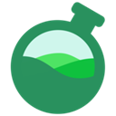
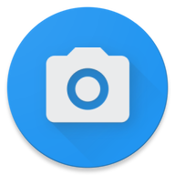
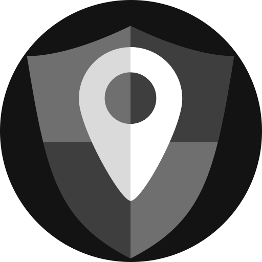
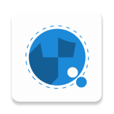

 data-protection-list
=============================================

Manual de resistencia al capitalismo de vigilancia

# Índice

* [0 Comentarios del fork](#0-comentarios-del-fork)
* [1 Introducción](#1-introducción)
* [2 Reglas de oro](#2-reglas-de-oro)
* [3 Computadora](#3-computadora)
* [3-1 Sistemas operativos](#3-1-sistemas-operativos)
* [3-2 Servicios y programas](#3-2-servicios-y-programas)
* [4 Smartphone](#4-smartphone)
* [4-1 Sistemas operativos](#4-1-sistemas-operativos)
* [4-2 Hardware preinstalado](#4-2-hardware-preinstalado)
* [4-3 Aplicaciones](#4-3-aplicaciones)
* [5-Navegadores](#5-navegadores)
* [5-1 Firefox](#5-1-firefox)
* [5-2 Tor Browser](#5-2-tor-browser)
* [6 Instancias de servicios](#6-instancias-de-servicios)
* [6-1 Searx](#6-1-searx)
* [6-2 Invidious](#6-2-invidious)
* [6-3 Videoconferencia](#6-3-videoconferencia)
* [6-4 DNS](#6-4-dns)
* [7 Recursos adicionales y fuentes](#7-recursos-adicionales-y-fuentes)
* [8 Configuraciones](#8-configuraciones)
* [8-1 Computadora](#8-1-computadora)
* [8-2 Smartphone](#8-2-smartphone)
* [8-3 Firefox](#8-3-firefox)

## 0 Comentarios del fork

Me he visto en la necesidad de forkear este documento de **Valentin Delacour** hospedado [aquí](https://codeberg.org/PrivacyFirst/PrivacyFirst/issues) bajo su aprobación y licencia para darle más visibilidad, legibilidad, comodidad, mejora en algunos aspectos y participación. Si alguien forkea alguno de los 2 debe hacer lo mismo.

Pienso que debemos compartir cuánto más mejor y los conocimientos sobre las buenas prácticas a seguir referente a la seguridad, privacidad y open source que se detallan no son una excepción.

Estamos abiertos a que este documento se cambie de formato, por ahora he pensado que esta es una buena forma, pero mejorable.

No me considero ningún experto sobre el tema. De hecho no sigo todas las recomendaciones al pie de la letra. Pero sí que me gustaría con el tiempo ir dejando de lado servicios que considero no debería usar por diversas causas, cambiar formas de acceso a cierto contenido, usar otras estrategias, etc.

Para participar activamente puedes:

* [Crear pull requests](https://github.com/adgellida/data-protection-list/pulls)
* [Generar tus cuestiones o incidencias](https://github.com/adgellida/data-protection-list/issues)

Os recomiendo participar en:

* [Grupo oficial de Telegram](https://t.me/privacid)
* [Grupo oficial de Discord](https://discord.gg/b9ey65Q) - Aunque debido a varias razones de privacidad, seguridad no lo recomendamos.
* Grupo oficial de Element - Pedir invitación

El objetivo del grupo es promover colectivamente buenas costumbres en cuanto a la privacidad, seguridad y tambien programas/apps, servicios y sistemas operativos open source/libres para resistir a la recolección y explotación de datos personales por empresas privadas.

Yo pienso que se aprovechan del desconocimiento de la mayoría para hacer cosas que no deberían y beneficiarse de ello a nuestras espaldas. Lo bueno es que hay gente que se da cuenta porque entiende del tema y lo comparte con la comunidad.

Este documento ha sido copiado 1:1 con muy ligeras modificaciones en la versión 7/12/2020 y a partir de ahora sufrirá modificaciones siguiendo las siguientes estrategias:

- Siguientes actualizaciones del fichero original
- Pull requests de la comunidad
- Descubrimientos propios

Ahora sí, empieza el documento. Póngase el cinturón que vienen curvas!

## 1 Introducción

Este documento tiene como objetivo principal proponer herramientas y alternativas para proteger los datos y la privacidad de la predación de empresas privadas bajo el sistema actual de capitalismo de vigilancia. Ahora bien, seguir las siguientes
recomendaciones permite también mejorar, en ciertas medidas, la protección contra otras entes tales como servicios de Estados o piratas, por ejemplo.

Esta lista se destina a todas las personas conscientes o tomando consciencia de la importancia de la protección de datos en nuestra sociedad, independientemente de sus conocimientos del tema. No se destina a las personas necesitando un anonimato
total de parte de su función a riesgos tales como opositores políticos o algunos periodistas, aún si algunas opciones propuestas podrían convenirles. Efectivamente, la privacidad no necesariamente es igual al anonimato.

El formato de lista fue escogido con el afán de hacer su consulta lo más eficiente posible. Este enfoque impide detallar verdaderas explicaciones. Así que les invito a buscar las que les sean necesarias por sí mismos o en los recursos adicionales
mencionados en el punto 6 del documento. Teniendo el propósito de proponer las opciones más reputadas y prácticas sin estar demasiado cargada, la lista no tiene por vocación ser exhaustiva y permanece subjetiva a pesar de buscar tener la mayor
objetividad posible.

Esta lista propone una primera priorización (orden de aparición y presencia o no de paréntesis) subjetiva basada en el reporte privacidad/usabilidad con el fin de ayudarles a escoger entre las diferentes opciones citadas. Una segunda priorización
(colores) se basa unicamente en la privacidad estimada : verde (verdadero respeto de la privacidad), azul (respeto de la privacidad bajo condiciones o presencia de un elemento problemático), rojo (no garantiza el respeto de la privacidad pero sigue
siendo preferible a las opciones de los GAFAM) e incoloro (falta de elementos para formar una estimación, o una priorización no es pertinente para la entrada en cuestión). La presencia de un asterisco indica que la opción mencionada sigue en
fase de desarrollo.

Espero que este documento les servirá para mejorar la protección de sus datos personales y de los de sus cercanos. Aunque siendo el fruto de varios años de búsquedas y experimentos, este trabajo permanece obviamente perfectible.
Cualquier sugerencia o comentario es entonces más que bienvenido al correo : “privacyfirst@ik.me”. Varios meses después de la presente versión del documento, se debe asumir que ciertas informaciones dadas serán obsoletas. El documento siendo
actualizado frecuentemente, están invitados a conseguir la última versión en la página web siguiente : “https://codeberg.org/PrivacyFirst/PrivacyFirst/issues”.

## 2 Reglas de oro

* Evitar usar servicios y programas de los GAFAM (Google, Amazon, Facebook, Apple y Microsoft) SIEMPRE que sea posible. Lo más recomendable es eliminar sus eventuales cuentas.
* Siempre revisar todos los ajustes y autorizaciones de lo que se utiliza y optimizarlos para limitar al máximo la recolección de datos personales.
* Solo instalar los programas/aplicaciones necesarios pues son accesos potenciales a sus datos personales.
* Usar programas libres/open source (sus códigos son públicos y así mismo verificables) en vez de los propietarios/closed source siempre que es posible.
* Favorecer las opciones libres populares a las desconocidas (serán más revisadas/confiables).
* Si una empresa propone sus servicios gratuitamente, en general, el producto que vende es usted (sus datos personales). Por causa del modelo impuesto por el capitalismo de vigilancia, pagar ya ni les protege de también ser el producto.
* Actualizar sus programas/sistemas operativos frecuentemente para beneficiar de los últimos correctivos de fallas de seguridad explotables y pensar en reemplazar los que ya no parecen ser actualizados.
* No usar antivirus terceros, son verdaderas aspiradoras de datos personales. Su aporte es desdeñable con tal de que se mantengan buenas costumbres numéricas. La prudencia y una buena configuración son los mejores antivirus.
* Privilegiar Web Apps o atajos desde el navegador para acceder a servicios en vez de aplicaciones a instalar para limitar el acceso y las posibilidades de recolección de datos personales.
* Utilizar correos temporales para crear cuentas para sitios/servicios poco importantes.
* Siempre desactivar el Wi-Fi, Bluetooth y geolocalización de su smartphone cuando no están usados y no conectarse a Wi-Fi públicos sin el uso de un VPN.
* No usar objetos conectados (su propósito es recolectar la mayor cantidad posible de datos personales) o no conectarlos a internet cuando son imprescindibles.

## 3 Computadora

### 3-1 Sistemas operativos

Windows es actualmente el peor sistema operativo en términos de privacidad y de seguridad. Los únicos SO fáciles de uso y protegiendo realmente los datos son las distribuciones libres (por lo tanto gratuitas) de Linux. Existe una multitud de ellas cuyas características varían considerablemente. Aquí una pequeña selección de las ofreciendo la mejor experiencia para el usuario (siempre respetando la privacidad) o garantizando la mayor protección de datos.
Cabe recordar que cada una de ellas propone una o varias interfaces (entornos de escritorio) diferentes en términos de experiencia, de consumo de recursos y de apariencia. Existe una documentación abundante en linea para escoger cual distribución y entorno de escritorio convendrán mejor a las capacidades de su computadora y a sus preferencias así como para saber como instalarla fácilmente en su computadora.

**Desktop :**

🟢[Linux Mint](https://linuxmint.com) : ideal para principiantes

🟢[MX Linux](https://mxlinux.org) : conviene a los principiantes

🟢[Solus](https://getsol.us/home) : conviene a los principiantes

🟢[Parrot Home OS](https://www.parrotsec.org) : seguridad y privacidad mejoradas (usuarios confirmados)

🟢[Qubes OS](https://www.qubes-os.org) : seguridad extrema (usuarios avanzados)

🟢[Whonix](https://www.whonix.org) : anonimato por Tor y seguridad extrema (usuarios avanzados)

**USB live (RAM) :**

🟢[MX Linux](https://mxlinux.org) : conviene a los principiantes

🟢[Tails](https://tails.boum.org) : anonimato por Tor (usuarios confirmados)

🟢[Parrot Home OS](https://www.parrotsec.org) : seguridad y privacidad mejoradas (usuarios confirmados)

**Raspberry Pi :**

🟢[Plasma BigScreen*](https://plasma-bigscreen.org) : centro multimedia para TV (comando de voz con Mycroft AI)

🟢[Raspberry Pi OS](https://www.raspberrypi.org/software) : sistema operativo clásico

🟢[LibreELEC](https://libreelec.tv) : centro multimedia para TV

🟢[Batocera](https://batocera.org) : emulador de consolas, retrogaming

🟢[RetroPie](https://retropie.org.uk) : emulador de consolas, retrogaming

### 3-2 Servicios y programas

Navegador :

🔵[Firefox](https://www.mozilla.org)

🟢[Tor Browser](https://www.torproject.org/download)

🟢[LibreWolf*](https://librewolf-community.gitlab.io)

🔵[Iridium Browser](https://iridiumbrowser.de)

🔴[Brave](https://brave.com)

Buscador :

🔵[Qwant](https://www.qwant.com)

🔵[Swisscows](https://swisscows.com)

🔵[searx.me](https://searx.me)

🔴[Startpage](https://www.startpage.com) (proxy Google)

🔴[DuckDuckGo](https://duckduckgo.com)

Ofimática :

🟢[LibreOffice](https://www.libreoffice.org)

🟢[CryptPad](https://cryptpad.fr)

⚫[Onlyoffice](https://www.onlyoffice.com)

Correo :

🔵[Tutanota](https://tutanota.com)

🔵[Protonmail](https://protonmail.com)

🔵[CTemplar](https://ctemplar.com)

🔵[Posteo](https://posteo.de)

Plataforma vídeo :

🔵[Invidious](https://invidio.us) (proxy Youtube)

🔵[CloudTube](https://cadence.moe/cloudtube/subscriptions) (proxy Youtube)

🔵[FreeTube](https://freetubeapp.io) (cliente Youtube/Invidious)

🟢[PeerTube](https://joinpeertube.org)

🔵[LBRY](https://lbry.com)

Mensajería instantánea :

🟢[Signal](https://signal.org)

🔵[Telegram](https://telegram.org)

🔵[Element](https://app.element.io)

⚫[Session*](https://getsession.org)

Videollamadas/videoconferencia :

🟢[Jitsi Meet](https://meet.jit.si)

🟢[Signal](https://signal.org)

🔵[BigBlueButton](https://bigbluebutton.org)

🟢[Jami](https://jami.net)

🔵[Element](https://app.element.io)

🔵[Telegram*](https://telegram.org)

Red social :

🟢[Mastodon](https://mastodon.social)

🟢[Friendica](https://friendi.ca)

🟢[Diaspora](https://diasporafoundation.org)

🟢[PixelFed](https://pixelfed.org)

🔵[Nitter](https://nitter.net) (proxy Twitter)

🔵[Bibliogram](https://bibliogram.art) (proxy Instagram)

Traductor :

🟢[Apertium](https://www.apertium.org)

🔴[DeepL](https://www.deepl.com/translator)

🟢[Bergamot Project*](https://browser.mt)

Mapas :

🟢[OpenStreetMap](https://www.openstreetmap.org)

🔴[Maps.me](https://maps.me)

🟢[Qwant Maps*](https://www.qwant.com/map)

🔴[DuckDuckGo](https://duckduckgo.com)

Compartición de archivos :

🟢[Disroot](https://upload.disroot.org)

🔵[Swiss Transfer](https://swisstransfer.com)

🟢[OnionShare](https://onionshare.org)

Colaboración :

🟢[CryptPad](https://cryptpad.fr)

Administrador de contraseñas :

🟢[Bitwarden](https://bitwarden.com)

🟢[KeePassXC](https://keepassxc.org)

Reproductor multimedia :

🟢[VLC](https://www.videolan.org)

VPN :

🟢[IVPN](https://www.ivpn.net)

🔵[Mullvad](https://mullvad.net)

🔵[ProtonVPN](https://protonvpn.com)

⚫[Firefox VPN*](https://vpn.mozilla.org)

Cloud :

🟢[Disroot](https://cloud.disroot.org) (Nextcloud)

🟢[Cozy Cloud](https://cozy.io)

🟢[Nextcloud](https://nextcloud.com)

🔵[Kdrive](https://www.infomaniak.com/es/kdrive) (Infomaniak)

Correo temporal :

⚫[Temp Mail](https://temp-mail.org)

⚫[Guerrillamail](https://guerrillamail.com)

⚫[EmailOnDeck](https://www.emailondeck.com)

Notas :

🟢[Joplin](https://joplinapp.org)

🟢[Standard Notes](https://standardnotes.org)

Limpieza y optimización de sistema :

🟢[Stacer](https://oguzhaninan.github.io/Stacer-Web)

🟢[ubunsys](https://github.com/adgellida/ubunsys)

🟢[BleachBit](https://www.bleachbit.org)

Edición de imágenes y dibujo :

🟢[Gimp](http://www.gimp.org)

🟢[Drawing](https://maoschanz.github.io/drawing)

🟢[Krita](https://krita.org)

🟢[Darktable](https://www.darktable.org)

🟢[RawTherapee](https://rawtherapee.com)

Edición gráfica vectorial :

🟢[Inkscape](https://inkscape.org)

Maquetación de páginas :

🟢[Scribus](https://www.scribus.net)

Edición audio :

🟢[Audacity](https://www.audacityteam.org)

Edición video :

🟢[OpenShot](https://www.openshot.org)

🟢[Kdenlive](https://kdenlive.org)

🟢[Avidemux](https://www.avidemux.org)

🟢[Pitivi](http://www.pitivi.org)

🟢[Cinelerra](http://cinelerra.org)

Supresión de metadatos :

🟢[ExifCleaner](https://exifcleaner.com)

Herramienta de cifrado :

🟢[VeraCrypt](https://www.veracrypt.fr)

🟢[Cryptomator](https://cryptomator.org)

Análisis de trafico de red :

🟢[Wireshark](https://www.wireshark.org)

Programas/juegos Windows bajo Linux :

⚫[PlayOnLinux](https://www.playonlinux.com)

⚫[Wine](https://www.winehq.org)

⚫[WinApps*](https://github.com/Fmstrat/winapps)

## 4 Smartphone

### 4-1 Sistemas operativos

Android, en su configuración por defecto, es actualmente el peor sistema operativo en cuanto a la privacidad. Su propósito es mandar continuamente datos personales hacia los servidores de Google para explotarlos y venderlos. La solución más recomendable en la actualidad es usar una versión de Android modificada (custom ROM) para respetar la privacidad. Si no desean instalar o comprar un smartphone con un sistema operativo respetuoso (grave error), recuerden que se debe evitar absolutamente todas las marcas chinas y también Samsung. En el afán de no estar perfilado de manera completa y continua, es capital nunca conectarse con una cuenta Google y usar un bloqueador de rastreadores. El sistema operativo de Apple (iOS), a pesar de su marketing basado en el respeto de la privacidad, también recolecta y explota los datos personales de sus usuarios, aunque sin común medida a Android por defecto. Apple controla y limita más sus usuarios que Android pero también ofrece más seguridad y protecciones para la privacidad en contra de terceros.

**Android modificado para la privacidad :**

🟢[CalyxOS](https://calyxos.org) : Android degooglizado y seguro con microG para una mejor compatibilidad

🟢[/e/ OS](https://e.foundation) : LineageOS degooglizado pero con microG y servicios integrados (cuenta /e/)

🟢[GrapheneOS](https://grapheneos.org) : el Android degooglizado más privado y seguro disponible

🔵[LineageOS for microG](https://lineage.microg.org) : LineageOS con microG para una mejor compatibilidad

🔵[Volla OS](https://volla.online): Android seguro, sin Google apps pero no totalmente degooglizado

🔵[LineageOS](https://lineageos.org) : Android sin Google apps pero no totalmente degooglizado

**Linux :**

🟢[UBports](https://ubports.com)

🟢[Postmarket OS*](https://postmarketos.org)

🟢[PureOS*](https://pureos.net)

🟢[Manjaro*](https://manjaro.org)

🟢[Mobian*](https://mobian-project.org)

🔵[Sailfish OS Jolla](https://jolla.com)

Las opciones basadas en Linux, en su estado de desarrollo actual, todavía no son recomendables para usuarios promedios (a excepción de Sailfish OS).

### 4-2 Hardware preinstalado

[Fairphone 3 y 3+](https://www.fairphone.com) : /e/OS (versión solo disponible en el sitio del proyecto /e/)

[Volla Phone](https://volla.online) : Volla OS, UBports, Sailfish OS y otros

[PinePhone](https://www.pine64.org/pinephone) : UBports y otros OS basados en Linux

[Librem 5](https://puri.sm/products/librem-5) : PureOS y otros OS basados en Linux

Otros modelos con /e/OS preinstalado están disponibles en el sitio del proyecto /e/ :

https://esolutions.shop/

### 4-3 Aplicaciones

Las aplicaciones propuestas para Android y derivados deben ser buscadas primero en la tienda de aplicaciones libres F-Droid (garantía que no tengan rastreadores terceros) y solo si no están, en Aurora Store. Estas tiendas deben ser descargadas directamente desde sus páginas web oficiales respectivas.

[F-Droid](https://f-droid.org/en)

[Aurora Store](https://auroraoss.com/downloads.php)

**Android y derivados :**

Tienda de aplicaciones :

🟢[F-Droid](https://f-droid.org)

🔵[Aurora Store](https://auroraoss.com) (proxy Play Store)

🔵[APKMirror](https://www.apkmirror.com)

Navegador :

🟢[Tor Browser](https://www.torproject.org/es/download/#android)

🟢[Bromite](https://www.bromite.org/fdroid)

🔵[Fennec](https://f-droid.org/en/packages/org.mozilla.fennec_fdroid) (Firefox)

🟢[Privacy Browser](https://f-droid.org/es/packages/com.stoutner.privacybrowser.standard)

Mensajería instantánea :

🟢[Signal](https://signal.org)

🔵[Telegram](https://telegram.org)

🔵[Element](https://app.element.io)

🟢[Briar](https://briarproject.org)

🟢[Conversations](https://conversations.im)

⚫[Session*](https://getsession.org)

Videollamadas/videoconferencia :

🟢[Jitsi Meet](https://meet.jit.si)

🟢[Signal](https://signal.org)

🔵[Element](https://app.element.io)

🟢[Jami](https://jami.net)

🔵[Telegram](https://telegram.org)

Plataforma vídeo :

🔴[Newpipe](https://newpipe.schabi.org) (cliente Youtube)

🔵[LBRY](https://lbry.com)

🔴[Skytube](https://skytube-app.com) (cliente Youtube)

Teclado :

🟢[OpenBoard](https://f-droid.org/es/packages/org.dslul.openboard.inputmethod.latin)

🟢[AnySoftKeyboard](https://anysoftkeyboard.github.io)

Mapas/navegación GPS :

🟢[Maps](https://f-droid.org/es/packages/com.github.axet.maps) (OpenStreetMap)

🟢[OsmAnd](https://f-droid.org/es/packages/net.osmand.plus/)

🔵[Magic Earth](https://www.magicearth.com)

Bloqueador de publicidad/rastreadores :

🟢[Blokada](https://f-droid.org/es/packages/org.blokada.alarm)

🟢[Nebulo](https://play.google.com/store/apps/details?id=com.frostnerd.smokescreen&hl=es&gl=US)

🟢[personalDNSfilter](https://www.zenz-solutions.de/personaldnsfilter-wp)

Cliente correo :

🟢[Tutanota](https://f-droid.org/es/packages/de.tutao.tutanota)

🟢[Protonmail](https://protonmail.com)

🟢[CTemplar](https://f-droid.org/es/packages/com.ctemplar.app.fdroid)

🟢[K-9 Mail](https://f-droid.org/es/packages/com.fsck.k9)

Gestor de alias para correo :

🟢[Simple Login](https://simplelogin.io)

Cliente administrador de contraseñas :

🟢[Bitwarden](https://bitwarden.com)

🟢[KeePassDX](https://f-droid.org/es/packages/com.kunzisoft.keepass.libre)

Autentificación a dos factores :

🟢[Aegis](https://f-droid.org/es/packages/com.beemdevelopment.aegis)

🟢[andOTP](https://f-droid.org/en/packages/org.shadowice.flocke.andotp)

Web Apps :

🟢[WebApps](https://f-droid.org/en/packages/com.tobykurien.webapps)

Redirector de contenido Youtube, Twitter, Instagram y Google Map :

🟢[UntrackMe](https://f-droid.org/en/packages/app.fedilab.nitterizeme)

Cliente Mastodon, Friendica, Peertube y PixelFed :

🟢[Fedilab](https://f-droid.org/en/packages/fr.gouv.etalab.mastodon)

🟢[Tusky](https://f-droid.org/en/packages/com.keylesspalace.tusky) (Mastodon)

Cliente respetuoso Facebook/Twitter/Instagram :

🔴[Frost for Facebook](https://f-droid.org/es/packages/com.pitchedapps.frost)

🔴[Twidere](https://f-droid.org/es/packages/org.mariotaku.twidere)

🔴[Barinsta](https://f-droid.org/en/packages/me.austinhuang.instagrabber) (Instagrabber)

Agenda :

🟢[Simple Calendar](https://f-droid.org/es/packages/com.simplemobiletools.calendar.pro)

🟢[Etar](https://f-droid.org/es/packages/ws.xsoh.etar)

Notas :

🟢[Joplin](https://play.google.com/store/apps/details?id=net.cozic.joplin&utm_source=GitHub&utm_campaign=README&pcampaignid=MKT-Other-global-all-co-prtnr-py-PartBadge-Mar2515-1)

🟢[Nextcloud Notes](https://f-droid.org/es/packages/it.niedermann.owncloud.notes)

🟢[Simple Notes](https://f-droid.org/es/packages/com.simplemobiletools.notes.pro)

🟢[Standard Notes](https://play.google.com/store/apps/details?id=com.standardnotes)

Gestor de archivos :

🟢[Simple File Manager](https://f-droid.org/es/packages/com.simplemobiletools.filemanager.pro)

Galería :

🟢[Simple Gallery](https://f-droid.org/es/packages/com.simplemobiletools.gallery.pro)

Reproductor de audio :

🟢[Music Player GO](https://f-droid.org/es/packages/com.iven.musicplayergo)

🟢[Vinyl Music Player](https://f-droid.org/es/packages/com.poupa.vinylmusicplayer)

PDF :

🟢[PDF Viewer Plus](https://f-droid.org/es/packages/com.gsnathan.pdfviewer)

🟢[MuPDF Viewer](https://f-droid.org/es/packages/com.artifex.mupdf.viewer.app)

Contactos :

🟢[Open Contacts](https://f-droid.org/es/packages/opencontacts.open.com.opencontacts)

🟢[Simple Contacts](https://f-droid.org/es/packages/com.simplemobiletools.contacts.pro)

Cámara :

🟢[Open Camera](https://f-droid.org/es/packages/net.sourceforge.opencamera)

🟢[Simple Camera](https://f-droid.org/es/packages/com.simplemobiletools.camera)

Radio :

🟢[RadioDroid](https://f-droid.org/es/packages/net.programmierecke.radiodroid2)

Supresión de metadatos :

🟢[ImagePipe](https://f-droid.org/es/packages/de.kaffeemitkoffein.imagepipe)

🟢[Scrambled Exif](https://f-droid.org/es/packages/com.jarsilio.android.scrambledeggsif)

Para ir más lejos :

Revelador de rastreadores terceros :

🟢[ClassyShark3xodus](https://f-droid.org/es/packages/com.oF2pks.classyshark3xodus)

🟢[Exodus](https://f-droid.org/en/packages/org.eu.exodus_privacy.exodusprivacy)

Parador de aplicaciones (fondo) :

🟢[SuperFreezZ](https://f-droid.org/es/packages/superfreeze.tool.android)

Aislador de aplicaciones :

🟢[Shelter](https://f-droid.org/en/packages/net.typeblog.shelter)

Anonimización red por Tor :

🟢[Orbot Proxy](https://play.google.com/store/apps/details?id=org.torproject.android&hl=es&gl=US)

Simulador de localización :

🟢[Private Location](https://f-droid.org/es/packages/com.wesaphzt.privatelocation)

Reemplazo de Google Services :

🔴[MicroG GmsCore](https://microg.org)

Gestor de privacidad :

🟢[XprivacyLua](https://f-droid.org/es/packages/eu.faircode.xlua)

🟢[App Manager](https://f-droid.org/es/packages/io.github.muntashirakon.AppManager)

🟢[App Warden](https://forum.xda-developers.com/t/app-5-0-warden-app-manager.4122227) (root)

Aislador red de aplicaciones :

🟢[NetGuard](https://f-droid.org/es/packages/eu.faircode.netguard)

Monitor de tráfico red :

🟢[Net Monitor](https://f-droid.org/es/packages/org.secuso.privacyfriendlynetmonitor)

Bloqueador de uso del micrófono :

🟢[PilferShush Jammer](https://f-droid.org/en/packages/cityfreqs.com.pilfershushjammer)

### IOS :

Navegador :

🟢[Onion Browser](https://apps.apple.com/us/app/onion-browser/id519296448)

🔵[Firefox](https://apps.apple.com/us/app/navegador-firefox/id989804926)

🔵[DuckDuckGo Browser](https://apps.apple.com/us/app/duckduckgo-privacy-browser/id663592361)

🔴[Brave](https://apps.apple.com/us/app/brave-private-web-browser-vpn/id1052879175)

Mensajería instantánea :

🟢[Signal](https://apps.apple.com/us/app/signal-mensajer%C3%ADa-privada/id874139669)

🔵[Telegram](https://apps.apple.com/us/app/telegram-messenger/id686449807)

🔵[Element](https://app.element.io)

⚫[Session*](https://apps.apple.com/us/app/session-private-messenger/id1470168868)

Videollamadas/videoconferencia :

🟢[Jitsi Meet](https://apps.apple.com/us/app/jitsi-meet/id1165103905)

🟢[Signal](https://apps.apple.com/us/app/signal-mensajer%C3%ADa-privada/id874139669)

🔵[Element](https://app.element.io)

🟢[Jami](https://apps.apple.com/us/app/jami/id1306951055)

🔵[Telegram](https://apps.apple.com/us/app/telegram-messenger/id686449807)

Bloqueador publicidad/rastreadores :

🟢[Blokada](https://apps.apple.com/us/app/blokada/id1508341781)

🟢[Lockdown](https://apps.apple.com/us/app/lockdown-apps/id1469783711)

🟢[DNSCloak](https://apps.apple.com/us/app/dnscloak-secure-dns-client/id1452162351)

Plataforma vídeo :

🔵[LBRY](https://lbry.tv/)

Cliente correo : 

🟢[Tutanota](https://apps.apple.com/us/app/tutanota/id922429609)

🟢[Protonmail](https://apps.apple.com/us/app/protonmail-correo-cifrado/id979659905)

🟢[CTemplar](https://apps.apple.com/us/app/ctemplar/id1495837525)

Gestor de alias para correro :

🟢[Simple Login](https://apps.apple.com/us/app/simplelogin-anti-spam/id1494359858)

Cliente administrador de contraseñas :

🟢[Bitwarden](https://apps.apple.com/us/app/bitwarden-gestor-de-contrase/id1137397744)

🟢[Strongbox](https://apps.apple.com/es/app/strongbox-keepass-pwsafe/id897283731) - KeePass & PwSafe

Autentificación a dos factores :

🟢[Tofu Authenticator](https://apps.apple.com/us/app/tofu-authenticator/id1082229305)

## 5 Navegadores

La compartimentalización (usar diferentes navegadores con diferentes configuraciones, según las tareas) es un método recomendado para preservar la privacidad sin sacrificar demasiado la comodidad de navegación.
Por ejemplo, se trataría de usar Firefox con una configuración restrictiva para la navegación general. Luego, usar otro perfil del mismo Firefox o Firefox ESR, configurado de manera menos restrictiva para los sitios que no cargan correctamente o que requieren una conexión a una cuenta personal, y otro navegador para la consulta des los sitios más recalcitrantes a una configuración para la protección de la privacidad (Brave o Ungoogled Chromium sin configuración son ideales para esa tarea). También es concebible usar otro navegador unicamente dedicado al e-banking o también Tor Browser para la navegación anónima.

### 5-1 Firefox

Para que Firefox proteja la privacidad, es necesario configurarlo de manera adecuada (ajustes, extensiones y about:config). Todas las configuraciones necesarias están desarrolladas en el punto 8.3 del documento. Estos ajustes también valen para LibreWolf y, en una cierta medida, para la versión móvil de Firefox (Fennec).

**Extensiones :**

Lista completa :

uBlock Origin - [Chrome](https://chrome.google.com/webstore/detail/ublock-origin/cjpalhdlnbpafiamejdnhcphjbkeiagm) - [Firefox](https://addons.mozilla.org/es/firefox/addon/ublock-origin)

uMatrix - [Chrome](https://chrome.google.com/webstore/detail/umatrix/ogfcmafjalglgifnmanfmnieipoejdcf) - [Firefox](https://addons.mozilla.org/es/firefox/addon/umatrix) - Development ended - Alternative?

Decentraleyes - [Chrome](https://chrome.google.com/webstore/detail/decentraleyes/ldpochfccmkkmhdbclfhpagapcfdljkj) - [Firefox](https://addons.mozilla.org/es/firefox/addon/decentraleyes) - Finished development? - Alternative?

[Chameleon](https://github.com/ghostwords/chameleon) Finished development? - Alternative?

CanvasBlocker - [Chrome](https://chrome.google.com/webstore/detail/canvas-blocker-fingerprin/nomnklagbgmgghhjidfhnoelnjfndfpd) - [Firefox](https://addons.mozilla.org/es/firefox/addon/canvasblocker)

Cookie AutoDelete- [Chrome](https://chrome.google.com/webstore/detail/cookie-autodelete/fhcgjolkccmbidfldomjliifgaodjagh) - [Firefox](https://addons.mozilla.org/en-US/firefox/addon/cookie-autodelete)

ClearURLs - [Chrome](https://chrome.google.com/webstore/detail/clearurls/lckanjgmijmafbedllaakclkaicjfmnk) - [Firefox](https://addons.mozilla.org/es/firefox/addon/clearurls)

Privacy Redirect - [Chrome](https://chrome.google.com/webstore/detail/privacy-redirect/pmcmeagblkinmogikoikkdjiligflglb) - [Firefox](https://addons.mozilla.org/en-US/firefox/addon/privacy-redirect)

Lista ligera :

uBlock Origin - [Chrome](https://chrome.google.com/webstore/detail/ublock-origin/cjpalhdlnbpafiamejdnhcphjbkeiagm) - [Firefox](https://addons.mozilla.org/es/firefox/addon/ublock-origin)

Decentraleyes - [Chrome](https://chrome.google.com/webstore/detail/decentraleyes/ldpochfccmkkmhdbclfhpagapcfdljkj) - [Firefox](https://addons.mozilla.org/es/firefox/addon/decentraleyes)

Cookie AutoDelete - [Chrome](https://chrome.google.com/webstore/detail/cookie-autodelete/fhcgjolkccmbidfldomjliifgaodjagh) - [Firefox](https://addons.mozilla.org/en-US/firefox/addon/cookie-autodelete)

HTTPS Everywhere - [Chrome](https://chrome.google.com/webstore/detail/https-everywhere/gcbommkclmclpchllfjekcdonpmejbdp) - [Firefox](https://addons.mozilla.org/es/firefox/addon/https-everywhere)

### 5-2 Tor Browser

El concepto de Tor es hacer pasar el trafico internet por una red anonimizandolo. En el afán de que la huella (fingerprint) de su navegador (dada entre otros por su configuración) no traicione su identidad, los navegadores Tor son concebidos para
tener la misma huella independientemente de los usuarios. Para evitar volver única la huella de su navegador Tor, no se debe instalar ninguna extensión y tampoco realizar modificaciones en los ajustes "about:config". Para preservar el anonimato dado, también es necesario no conectarse a cuentas que podrían de facto anularlo.
El método de anonimización de la red Tor ralentiza los cargamentos. Pues no es recomendado usarlo para el streaming o las descargas voluminosas.

## 6 Instancias de servicios

### 6-1 Searx

Searx es un metabuscador que no transmite datos personales a los buscadores usados. Permite, si uno lo desea, una configuración muy avanzada. Las diferentes instancias (disponibles ahí : https://searx.space/) no ofrecen todas las mismas garantías de protección de la privacidad (log de dirección IP o no, etc.)

🟢https://search.disroot.org : resultados Google por defecto, sin log de dirección IP

🔵https://spot.ecloud.global : interfaz más agradable pero con log de dirección IP

⚫https://searx.xyz : resultados Google (Startpage) por defecto

### 6-2 Invidious

Invidious da acceso al contenido Youtube (proxy) sin transmitir los datos personales de sus usuarios a Google. Lamentablemente, sus diferentes instancias (disponibles ahí : https://instances.invidio.us/) padecen frecuentemente de problemas causados por las medidas de Google tomadas para impedir su funcionamiento.
Las instancias Invidious que parecen actualmente ser las más funcionales son

⚫https://invidious.snopyta.org

⚫https://invidious.xyz

### 6-3 Videoconferencia

**Jitsi Meet :**

🟢[FDN](https://talk.fdn.fr)

🟢[Snopyta](https://talk.snopyta.org)

🟢[/e/](https://visio.ecloud.global)

🟢[Framasoft](https://framatalk.org/accueil)

🟢[Calyx](https://meet.calyx.net)

🔵[Infomaniak](https://meet.infomaniak.com)

🔵[Jitsi](https://jitsi.org/jitsi-meet)

**BigBlueButton :**

🟢[FAImaison](https://bbb.faimaison.net/b)

🟢[Grifon](https://bbb.grifon.fr/b)

🟢[Nixnet](https://meet.nixnet.services/b)

### 6-4 DNS

**Intercontinental :**

Con filtros contra la publicidad, rastreadores y dominios maliciosos :

🟢[NixNet](https://docs.nixnet.services/NixNet_DNS) (DoH, DoT)

🟢[BlahDNS](https://blahdns.com) (DoH, DoT, DNSCrypt)

🔵[Adguard](https://adguard.com/en/adguard-dns/overview.html) (DoH, DoT, DNSCrypt)

🔵[NextDNS](https://nextdns.io) (DoH, DoT, DNSCrypt)

NixNet DoH : https://adblock.any.dns.nixnet.xyz/dns-query
BlahDNS DoH (Japón) : https://doh-jp.blahdns.com/dns-query

Sin filtros :

🟢DNSWatch (no cifrado)

🟢UncensoredDNS (DoT)

DNS.Watch IPv4 : 84.200.69.80, 84.200.70.40
DNS.Watch IPv6 : 2001:1608:10:25::1c04:b12f, 2001:1608:10:25::9249:d69b

**Europa :**

Con filtros contra la publicidad, rastreadores y dominios maliciosos :

🟢[BlahDNS](https://blahdns.com) (DoH, DoT, DNSCrypt)

🟢[LibreDNS](https://libredns.gr) (DoH, DoT)

BlahDNS DoH (Alemania) : https://doh-de.blahdns.com/dns-query
LibreDNS DoH (Alemania) : https://doh.libredns.gr/ads

Sin filtros :

🟢[Snopyta](https://snopyta.org) (DoH, DoT)

🟢[Digitale Gesellschaft](https://digitalegesellschaft.de) (DoH, DoT)

🟢[PowerDNS](https://www.powerdns.com) (DoH)

🟢[FDN](https://www.fdn.fr/actions/dns) (no cifrado)

## 7 Recursos adicionales y fuentes

**General**

Excelentes recursos para comprender el capitalismo de vigilancia y sus amenazas :

https://www.nogafam.es/blog/presentacion

El dilema de las redes sociales, Jeff Orlowski (película)
La era del capitalismo de la vigilancia, Shoshana Zuboff (libro)

Tutoriales fáciles para la privacidad :

https://spreadprivacy.com/tag/device-privacy-tips

Excelentes canales acerca de la privacidad (con tutoriales) :

The Hated One : https://www.youtube.com/channel/UCjr2bPAyPV7t35MvcgT3W8Q

Techlore : https://www.youtube.com/channel/UCs6KfncB4OV6Vug4o_bzijg

Asociaciones para la defensa de la privacidad (informaciones) :

https://www.laquadrature.net/es/
https://www.eff.org/deeplinks

Asociaciones proponiendo excelentes servicios respetuosos de la privacidad :

https://disroot.org/es/
https://framasoft.org/en/
https://snopyta.org/
https://www.drycat.fr/en

Buenas costumbres de protección de datos :

https://www.vice.com/en_us/article/d3devm/motherboard-guide-to-not-getting-hacked-online-safety-guide

Excelente sitio listando servicios y programas respetuosos :

https://www.privacytools.io/

Operadores recomendables :

https://www.eff.org/pages/quien-defiende-tus-datos

**Grupos y canales Telegram**

Privacidad, protección de datos y más :
[t.me/privacid](t.me/privacid)
[t.me/techloregroup](t.me/techloregroup)
[t.me/techloreofficial](t.me/techloreofficial)
[t.me/NoGoolag](t.me/NoGoolag)

Linux y libre :
[Proyecto tic tac](t.me/grupo_telegram_proyectotictac)
[LinuxMintEs](t.me/LinuxMintEs)
[mxantixes](t.me/mxantixes)

**Sistemas operativos**

Linux :

[Linux Mint](https://linuxmint.com)

[MX Linux](https://mxlinux.org)

Android respetuoso de la privacidad :

[CalyxOS](https://calyxos.org/what)

[/e/ OS](https://e.foundation)

**Firefox**

[Configuración Firefox](https://www.youtube.com/watch?v=tQhWdsFMc24)

[Configuración Firefox básica](https://12bytes.org/articles/tech/firefox/the-firefox-privacy-guide-for-dummies)

[Configuración Firefox avanzada](https://12bytes.org/articles/tech/firefox/firefoxgecko-configuration-guide-for-privacy-and-performance-buffs)

## 8 Configuraciones

### 8-1 Computadora

**MX Linux**

Plugin Flash :
Entrar el comando siguiente en la terminal para eliminar el plugin Flash propietario :
sudo apt purge --remove adobe-flashplugin flashplugin-installer pepperflashplugin-nonfree

Advert Blocker (Bloquear-publicidad) :
Seleccionar todas las opciones a excepción de “UNBLOCK” y luego confirmar.

Configuración Wi-Fi :
Clic derecho en el icono Wi-Fi, modificar las conexiones, seleccionar el Wi-Fi activo, bajo Wi-Fi seleccionar Dirección MAC clonada : Aleatoria.
Bajo ajustes IPv6, seleccionar Extensiones de confidencialidad IPv6 : Activado (dirección temporal preferida).

**FreeTube**

Utiliser Invidious comme proxy pour éviter de transmettre ses données à Google :
Settings : - Player Settings : activer "Proxy Videos Through Invidious"
- Advanced Settings : entrer une instance Invidious fonctionnelle

En cas de problème, changer d’instance ou tout simplement désactiver "Proxy Videos
Through Invidious".

### 8-2 Smartphone

**F-Droid**

Para poder encontrar y descargar algunas aplicaciones desde F-Droid, es necesario agregar sus repositorios. Para esto, ir a los ajustes de F-Droid, luego bajo "repositorios", activar el repositorio "Guardian Project" y por fin presionar el "+" y entrar las direcciones mencionadas deseadas.

Bromite : https://fdroid.bromite.org/fdroid/repo

Langis (versión modificada de Signal a utilizar solo si las notificaciones no llegan con la versión clásica de Signal(Aurora Store)) :
https://gitlab.com/TheCapsLock/fdroid-patched-apps/raw/master/fdroid/repo

**Blokada**

Blocklists > activar las listas negras siguientes :
- Energized : Basic (o Blu si memoria RAM inferior a 4gb)
- DuckDuckGo Tracker Radar
- Exodus Privacy
- (Goodbye Ads : Samsung o Xiaomi (solo sirven para los modelos de esas marcas))
Encryption > seleccionar un servidor DNS dentro de los siguientes :
DoH : Blah DNS, Digitale Gesellschaft(Europa), (OpenNIC).
((No cifrado : DNS.Watch, Uncensored DNS, French Data Network(Europa))).

**Newpipe**

Puede suceder que Newpipe deje de funcionar por causa de modificaciones de parte de Google en Youtube. En el afán de beneficiar lo más rápidamente posible y automaticamente de actualizaciones corrigiendo esos problemas, es recomendado instalar Newpipe directamente desde su sitio oficial en vez de F-Droid :
https://newpipe.schabi.org/

### 8-3 Firefox

**Configuración general**

**Configuración de las extensiones**

Es importante autorizar esas extensiones a funcionar en navegación privada y activar
sus actualizaciones automáticas.

uBlock :
- Settings : activar todo bajo “Privacy”
- Filter Lists : activar TODAS las listas, excepto bajo “Regions” (solo activar para los idiomas usados)
- (Agregar las listas de filterlists.com : Energized : Ultimate Protection, Xtreme + IP + Social extension)

Decentraleyes :
Ninguna configuración necesaria

Chameleon :

CanvasBlocker :
General : - marcar "Expert mode"
- Presets > open > Stealth mode
- Random number generator : non persistent
APIs : marcar "Protect Window api" + aceptar excepción captcha
Misc : desmarcar "Block data URL pages"

ClearURLs :
request types:
beacon,csp_report,font,image,imageset,main_frame,media,object,object_subrequest,other,ping,script,speculative,stylesheet,sub_frame,web_manifest,websocket,xbl,xml_dtd,xmlhttprequest,xslt

Cookie AutoDelete :
- Automatic Cleaning Options : activar todo
- Extension Options : desactivar “Show notification after cookie cleanup”

Privacy Redirect :
General : - seleccionar las instancias deseadas
Advanced : - activar “Always proxy videos through Invidious”
- Seleccionar “DASH” bajo “Invidious video quality”

uMatrix :
Tutorial video : https://www.youtube.com/watch?v=TVozpo3zUBk

(HTTPS Everywhere) :
- Solo necesario para las versiones de Firefox en las cuales el “HTTPS-Only Mode” todavía no esta implementado : Firefox ESR y móvil (Fennec)
- Ninguna configuración necesaria

**Configuraciones about:config**

Acceder a estos ajustes entrando about:config en la barra de direcciones de Firefox.
Esas diversas configuraciones mejoran la privacidad, la seguridad y el rendimiento.
Los elementos entre paréntesis no suelen ser deseables en todos los casos.

accessibility.blockautorefresh = true

((accessibility.force_disabled = 1))

beacon.enabled = false

browser.cache.offline.capacity = 0

browser.cache.offline.enable = false

browser.display.use_document_fonts = 0

browser.send_pings.max_per_link = 0

browser.sessionhistory.max_entries = 15

Numero máximo de paginas disponibles con "precedente", aligera Firefox

browser.sessionhistory.max_total_viewers = 4

Numero máximo de paginas cargadas con "precedente", aligera Firefox

browser.sessionstore.interval = 50000

browser.sessionstore.privacy_level = 2

(browser.startup.homepage_override.buildID = borrar)

browser.urlbar.autofill.enabled = false

(browser.urlbar.maxRichResults = 0)

browser.urlbar.speculativeConnect.enabled = false

browser.urlbar.trimURLs = false

browser.xul.error_pages.expert_bad_cert = true

captivedetect.canonicalURL = borrar

device.sensors = false para todos los elementos

dom.allow_cut_copy = false

dom.battery.enabled = false

dom.enable_performance = false

dom.enable_resource_timing = false

dom.event.clipboardevents.enabled = false

dom.event.contextmenu.enabled = false

dom.push = false para todos los elementos + borrar las direcciones e identificadores

dom.serviceWorkers.enabled= false

dom.vr.oculus.enabled = false

dom.webaudio.enabled = false

gamepad = false para todos los elementos

geo = borrar todas las direcciones

geo.enabled = false

(gfx.font_rendering.graphite.enabled = false)

google = false para todos los elementos + borrar las direcciones

javascript.options.baselinejit = false

javascript.options.ion = false

javascript.options.native_regexp = false

layers.acceleration.force-enabled = true

layout.css.visited_links_enabled = false

mathml.disabled = true

((media.gmp-widevinecdm.enabled = false))

((Desactiva DRM, sí videos DRM no necesarias))

media.navigator.enabled = false

media.video_stats.enabled = false

network.captive-portal-service.enabled = false

network.dnsCacheEntries = 4000

network.dnsCacheExpiration = 43200

network.dnsCacheExpirationGracePeriod = 43200

network.IDN_show_punycode = true

network.http.referer.XOriginPolicy = 0

network.http.referer.XOriginTrimmingPolicy = 2

network.http.referer.spoofSource = true

network.http.referer.trimmingPolicy = 2

network.http.speculative-parallel-limit = 0

network.manage-offline-status = false

normandy = false para todos los elementos + borrar las direcciones e identificadores

pocket = false para todos los elementos + borrar las direcciones e identificadores

privacy.clearOnShutdown.offlineApps = true

privacy.spoof_english = 2

privacy.trackingprotection.socialtracking.enabled = true

report (reporter/reporting) = false para todos los elementos + borrar las direcciones

safebrowsing = false para todos los elementos + borrar direcciones e identificadores

security.cert_pinning.enforcement_level = 2

security.mixed_content.upgrade_display_content = true

security.OCSP.enabled = 0

security.ssl.enable_false_start = false

security.ssl.enable_ocsp_must_staple = false

security.ssl.enable_ocsp_stapling = false

security.ssl.require_safe_negotiation = true

security.ssl3.rsa_des_ede3_sha = false

security.tls.enable_0rtt_data = false

security.tls.version.min = 3

telemetry = false para todos los elementos + borrar las direcciones e identificadores

ui.use_standins_for_native_colors = true

webgl.disabled = true

webgl.enable-debug-renderer-info = false

webgl.enable-webgl2 = false

**Solo si no se usa la extensión Chameleon :**

(privacy.resistFingerprinting = true)

(Mejor poner "false" y falsificar el fingerprint con Chameleon)

Estos deberían ser configurados directamente con Chameleon sí esta instalado :

media.peerconnection.ice.default_address_only = true

media.peerconnection.ice.no_host = true

((media.peerconnection.enabled = false))

privacy.firstparty.isolate = true