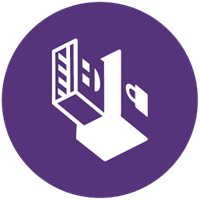
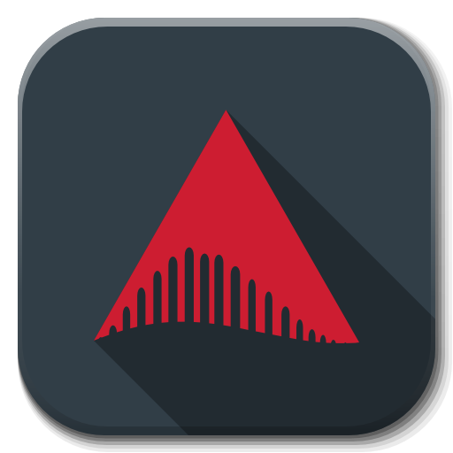
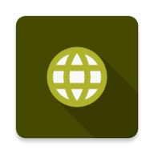
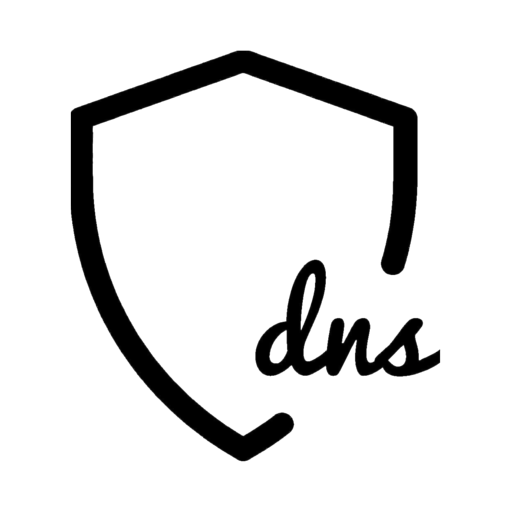
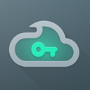
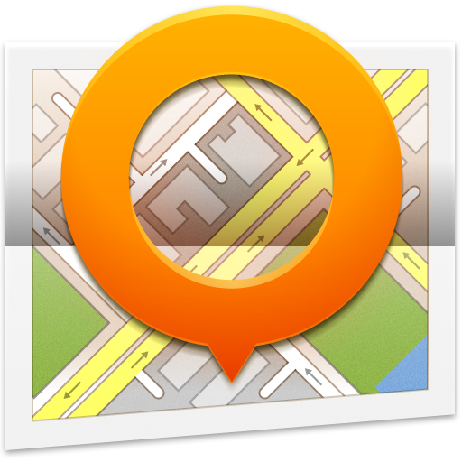
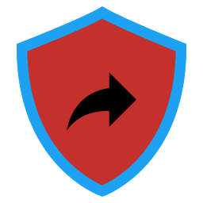

 data-protection-list
=============================================

Manual de resistencia al capitalismo de vigilancia

# Índice

* [0 Comentarios del fork](#0-comentarios-del-fork)
* [1 Introducción](#1-introducción)
* [2 Reglas de oro](#2-reglas-de-oro)
* [3 Computadora](#3-computadora)
* [3-1 Sistemas operativos](#3-1-sistemas-operativos)
* [3-2 Servicios y programas](#3-2-servicios-y-programas)
* [4 Smartphone](#4-smartphone)
* [4-1 Sistemas operativos](#4-1-sistemas-operativos)
* [4-2 Aplicaciones](#4-2-aplicaciones)
* [5-Navegadores](#5-navegadores)
* [5-1 Firefox](#5-1-firefox)
* [5-2 Tor Browser](#5-2-tor-browser)
* [6 Instancias de servicios](#6-instancias-de-servicios)
* [6-1 Searx](#6-1-searx)
* [6-2 Invidious](#6-2-invidious)
* [6-3 Videoconferencia](#6-3-videoconferencia)
* [6-4 Servidores DNS](#6-4-servidores-dns)
* [7 Recursos adicionales (fuentes destacadas)](#7-recursos-adicionales-fuentes-destacadas)
* [8 Configuraciones](#8-configuraciones)
* [8-1 Sistemas operativos](#8-1-sistemas-operativos)
* [8-2 F-Droid](#8-2-f-droid)
* [8-3 Aplicaciones y programas](#8-3-aplicaciones-y-programas)
* [8-4 Firefox](#8-4-firefox)

## 0 Comentarios del fork

Me he visto en la necesidad de forkear este documento de **Valentin Delacour** hospedado [aquí](https://codeberg.org/PrivacyFirst/PrivacyFirst/issues) bajo su aprobación y licencia para darle más visibilidad, legibilidad, comodidad, mejora en algunos aspectos y participación. Si otra persona forkea tanto el suyo como este debe hacer lo mismo

Pienso que debemos compartir cuánto más mejor y los conocimientos sobre las buenas prácticas a seguir referente a la seguridad, privacidad y open source que se detallan no son una excepción.

Estamos abiertos a que este documento se cambie de formato, por ahora he pensado que esta es una buena forma, pero mejorable.

No me considero ningún experto sobre el tema. De hecho no sigo todas las recomendaciones al pie de la letra. Pero sí que me gustaría con el tiempo ir dejando de lado servicios que considero no debería usar por diversas causas, cambiar formas de acceso a cierto contenido, usar otras estrategias, etc.

Para participar activamente puedes:

* [Crear pull requests](https://github.com/adgellida/data-protection-list/pulls)
* [Generar tus cuestiones o incidencias](https://github.com/adgellida/data-protection-list/issues)

Os recomiendo participar en:

* [Official Telegram Group](https://t.me/privacid)
* [Official Discord Group](https://t.me/privacid) - Aunque debido a varias razones de privacidad, seguridad no lo recomendamos.
* [Official Group on Matrix](https://t.me/privacid)- #privacidadlibre:matrix.org - Pedir invitación

El objetivo del grupo es promover colectivamente buenas costumbres en cuanto a la privacidad, seguridad y tambien programas/apps, servicios y sistemas operativos open source/libres para resistir a la recolección y explotación de datos personales por empresas privadas.

Yo pienso que se aprovechan del desconocimiento de la mayoría para hacer cosas que no deberían y beneficiarse de ello a nuestras espaldas. Lo bueno es que hay gente que se da cuenta porque entiende del tema y lo comparte con la comunidad.

Este documento ha sido copiado 1:1 con muy ligeras modificaciones en la versión 7/12/2020 y a partir de ahora sufrirá modificaciones siguiendo las siguientes estrategias:

* Siguientes actualizaciones del fichero original
* Pull requests de la comunidad
* Descubrimientos propios

Las mejoras más destacables son:

* Fomenta una participación más ordenada, efectiva, pública.
* Imágenes de las apps para identificarlas mejor.
* Enlaces a las mismas para encontrarlas rápidamente.

Ahora sí, empieza el documento. Póngase el cinturón que vienen curvas!

## 1 Introducción

Este documento tiene como objetivo principal proponer herramientas y alternativas para proteger los datos y la privacidad de la predación de empresas privadas bajo el sistema actual de capitalismo de vigilancia. Ahora bien, seguir las siguientes
recomendaciones permite también mejorar, en ciertas medidas, la protección contra otras entes tales como servicios de Estados o piratas, por ejemplo.

Esta lista se destina a todas las personas conscientes o tomando consciencia de la importancia de la protección de datos en nuestra sociedad, independientemente de sus conocimientos del tema. No se destina a las personas necesitando un anonimato
total de parte de su función a riesgos tales como opositores políticos o algunos periodistas, aún si algunas opciones propuestas podrían convenirles. Efectivamente, la privacidad no necesariamente es igual al anonimato.

El formato de lista fue escogido con el afán de hacer su consulta lo más eficiente posible. Este enfoque impide detallar verdaderas explicaciones. Así que les invito a buscar las que les sean necesarias por sí mismos o en los recursos adicionales
mencionados en el punto 6 del documento. Teniendo el propósito de proponer las opciones más reputadas y prácticas sin estar demasiado cargada, la lista no tiene por vocación ser exhaustiva y permanece subjetiva a pesar de buscar tener la mayor
objetividad posible.

Esta lista propone una primera priorización (orden de aparición y presencia o no de paréntesis) subjetiva basada en el reporte privacidad/usabilidad con el fin de ayudarles a escoger entre las diferentes opciones citadas. Una segunda priorización
(colores) se basa unicamente en la privacidad estimada :

🟢verde (verdadero respeto de la privacidad)

🔵azul (respeto de la privacidad bajo condiciones o presencia de un elemento problemático)

🔴rojo (no garantiza el respeto de la privacidad pero sigue siendo preferible a las opciones de los GAFAM)

⚫incoloro (falta de elementos para formar una estimación, o una priorización no es pertinente para la entrada en cuestión). La presencia de un asterisco indica que la opción mencionada sigue enfase de desarrollo.

Espero que este documento les servirá para mejorar la protección de sus datos personales y de los de sus cercanos. Aunque siendo el fruto de varios años de búsquedas y experimentos, este trabajo permanece obviamente perfectible.
Cualquier sugerencia o comentario es entonces más que bienvenido al correo : “privacyfirst@ik.me”. Varios meses después de la presente versión del documento, se debe asumir que ciertas informaciones dadas serán obsoletas. El documento siendo
actualizado frecuentemente, están invitados a conseguir la última versión en la página web siguiente : “https://codeberg.org/PrivacyFirst/PrivacyFirst/issues”.

## 2 Reglas de oro

* Evitar usar servicios y programas de los GAFAM (Google, Amazon, Facebook, Apple y Microsoft) SIEMPRE que sea posible. Lo más recomendable es eliminar sus eventuales cuentas.
* Siempre revisar todos los ajustes y autorizaciones de lo que se utiliza y optimizarlos para limitar al máximo la recolección de datos personales.
* Solo instalar los programas/aplicaciones necesarios pues son accesos potenciales a sus datos personales.
* Usar programas libres/open source (sus códigos son públicos y así mismo verificables) en vez de los propietarios/closed source siempre que es posible.
* Favorecer las opciones libres populares a las desconocidas (serán más revisadas/confiables).
* Si una empresa propone sus servicios gratuitamente, en general, el producto que vende es usted (sus datos personales). Por causa del modelo impuesto por el capitalismo de vigilancia, pagar ya ni les protege de también ser el producto.
* Actualizar sus programas/sistemas operativos frecuentemente para beneficiar de los últimos correctivos de fallas de seguridad explotables y pensar en reemplazar los que ya no parecen ser actualizados.
* No usar antivirus de terceros, son verdaderas aspiradoras de datos personales. Su aporte es desdeñable con tal de que se mantengan buenas costumbres numéricas. La prudencia y una buena configuración son los mejores antivirus.
* Privilegiar Web Apps o atajos desde el navegador para acceder a servicios en vez de aplicaciones a instalar para limitar el acceso y las posibilidades de recolección de datos personales.
* Utilizar correos temporales para crear cuentas para sitios/servicios poco importantes.
* Siempre desactivar el Wi-Fi, Bluetooth y geolocalización de su smartphone cuando no están usados y no conectarse a Wi-Fi públicos sin el uso de un VPN.
* No usar objetos conectados (su propósito es recolectar la mayor cantidad posible de datos personales) o no conectarlos a internet cuando son imprescindibles.

## 3 Computadora

### 3-1 Sistemas operativos

Windows es actualmente el peor sistema operativo en términos de privacidad y de seguridad. Los únicos SO fáciles de uso y protegiendo realmente los datos son las distribuciones libres (por lo tanto gratuitas) de Linux. Existe una multitud de ellas cuyas características varían considerablemente. Aquí una pequeña selección de las ofreciendo la mejor experiencia para el usuario (siempre respetando la privacidad) o garantizando la mayor protección de datos.
Cabe recordar que cada una de ellas propone una o varias interfaces (entornos de escritorio) diferentes en términos de experiencia, de consumo de recursos y de apariencia. Existe una documentación abundante en linea para escoger cual distribución y entorno de escritorio convendrán mejor a las capacidades de su computadora y a sus preferencias así como para saber como instalarla fácilmente en su computadora.

**Desktop :**

🟢[Linux Mint](https://linuxmint.com) : ideal para principiantes

🟢[MX Linux](https://mxlinux.org) : conviene a los principiantes

🟢[Parrot Home OS](https://www.parrotsec.org) : seguridad y privacidad mejoradas (usuarios confirmados)

🟢[Zorin OS](https://zorin.com/os) : ideal para principiantes viniendo de Windows o macOS (soporte comercial)

🟢[Qubes OS](https://www.qubes-os.org) : seguridad extrema (usuarios avanzados)

🟢[Whonix](https://www.whonix.org) : anonimato por Tor y seguridad extrema (usuarios avanzados)

**USB live (RAM) :**

🟢[MX Linux](https://mxlinux.org) : conviene a los principiantes

🟢[Tails](https://tails.boum.org) : anonimato por Tor (usuarios confirmados)

🟢[Parrot Home OS](https://www.parrotsec.org) : seguridad y privacidad mejoradas (usuarios confirmados)

**Raspberry Pi :**

🟢[LibreELEC](https://libreelec.tv) : centro multimedia para TV

🟢[Batocera](https://batocera.org) : emulador de consolas, retrogaming

🟢[Raspberry Pi OS](https://www.raspberrypi.org/software) : sistema operativo clásico

🟢[Plasma BigScreen*](https://plasma-bigscreen.org) : centro multimedia para TV (comando de voz con Mycroft AI)

🟢[Nymphcast*](http://nyanko.ws/product_nymphcast.php) : alternativa libre y respetuosa a Chromecast

**Hardware :**

Las marcas siguientes venden computadoras con Linux preinstalado :

TUXEDO Computers

Slimbook

Librem

System76

Linux Mint

PINE64

ThinkPenguin

Dell (pocos modelos)

También existen otros vendedores menos conocidos de computadoras con Linux preinstalado. En cuanto a los vendedores de computadoras con Windows
preinstalado, los modelos de Dell, Asus y HP son reputados por tener una buena compatibilidad con Linux. Es recomendable evitar comprar computadoras que vienen con una tarjeta gráfica Nvidia dado que son conocidas por padecer de problemas de compatibilidad.

### 3-2 Servicios y programas

Navegador :

🔵[Firefox](https://www.mozilla.org)

🟢[Tor Browser](https://www.torproject.org/download)

🟢[LibreWolf*](https://librewolf-community.gitlab.io)

🔴[Brave](https://brave.com)

🔵[Ungoogled Chromium*](https://ungoogled-software.github.io/ungoogled-chromium-binaries/)

🔵[Iridium Browser](https://iridiumbrowser.de)

Buscador :

🔵[DuckDuckGo](https://duckduckgo.com)

🔵[searx.me](https://searx.me)

🔵[Qwant](https://www.qwant.com)

🔵[Swisscows](https://swisscows.com)

🔴[Startpage](https://www.startpage.com) (proxy Google)

⚫[Brave Search](https://search.brave.com/)

Ofimática :

🟢[LibreOffice](https://www.libreoffice.org)

🟢[Onlyoffice](https://www.onlyoffice.com)

🟢[Collabora Office - LibreOffice prof.](https://www.collaboraoffice.com)

🟢[Calligra](https://calligra.org)

🟢[CryptPad](https://cryptpad.fr)

Correo :

[Tutanota](https://tutanota.com) 🔵gratuito 🔴de pago

[ProtonMail](https://protonmail.com) 🔵gratuito 🔵de pago

[Disroot](https://disroot.org/en/services/email) 🔵gratuito

[Posteo](https://posteo.de) 🔵de pago

Plataforma vídeo :

🔵[LBRY - desktop](https://lbry.com)

🔴[Odysee - LBRY web](https://odysee.com)

🟢[PeerTube](https://joinpeertube.org)

Proxy Youtube :

🔵[Invidious](https://invidio.us)

🔵[CloudTube](https://cadence.moe/cloudtube/subscriptions)

🔵[FreeTube](https://freetubeapp.io) (cliente Youtube)

Mensajería instantánea :

🟢[Threema](https://threema.ch/en)

🔵[Signal](https://signal.org)

🟢[Session*](https://getsession.org)

🔴[Telegram](https://telegram.org)

🔵[Element](https://app.element.io)

🔵[Jami](https://jami.net)

🔵[Gajim](https://gajim.org/)

Videoconferencia :

🟢[Jitsi Meet](https://meet.jit.si)

🔵[Signal](https://signal.org)

🔵[BigBlueButton](https://bigbluebutton.org)

🟢[Jami](https://jami.net)

🔵[Element](https://app.element.io)

🔵[Whereby](https://whereby.com)

🔴[Telegram](https://telegram.org)

Red social respetuosa:

🔵[Mastodon](https://mastodon.social)

🔵[Telegram*](https://telegram.org)

🔵[Element](https://app.element.io)

🔵[PixelFed](https://pixelfed.org)

🔵[Lemmy](https://join.lemmy.ml/)

🔵[Pleroma](https://pleroma.social/)

🔵[movim](https://movim.eu/)

🔵[Friendica](https://friendi.ca)

Proxy de red social abusiva:

🔵[Nitter](https://nitter.net) (Twitter)

🔵[Libreddit](https://libredd.it/) (Reddit)

🔵[Bibliogram](https://bibliogram.art) (Instagram)

Traductor :

🟢[LibreTranslate](https://libretranslate.com/)

[DeepL](https://www.deepl.com/translator) 🔴gratuito 🔵de pago

🟢[Apertium](https://www.apertium.org)

🔴[Lingva Translate](https://lingva.ml) (proxy Google
Translate)

Bloqueador de publicidad/rastreadores y controlador de trafico red :

⚫[Portmaster*](https://safing.io/portmaster)

Administrador de contraseñas :

🟢[KeePassXC](https://keepassxc.org)

🔵[Bitwarden](https://bitwarden.com)

Mapas :

🟢[OpenStreetMap](https://www.openstreetmap.org)

🔵[Qwant Maps*](https://www.qwant.com/map)

🔵[DuckDuckGo](https://duckduckgo.com)

🔴[Maps.me](https://maps.me)

VPN :

🟢[ProtonVPN](https://protonvpn.com)

🟢[IVPN](https://www.ivpn.net)

🔵[Mullvad](https://mullvad.net)

🔵[Windscribe](https://windscribe.com/)

Películas y series en linea :

🔵[Stremio](https://www.stremio.com) 🔵sin cuenta 🔴con cuenta

🟢[Kodi](https://kodi.tv)

Compartición de archivos :

🟢[Disroot](https://upload.disroot.org)

🟢[OnionShare](https://onionshare.org)

🟢[Syncthing](https://syncthing.net)

🔵[Tresorit Send](https://tresorit.com/)

🔴[Swiss Transfer](https://swisstransfer.com)

Cloud :

🔵[Kdrive](https://www.infomaniak.com/es/kdrive)

🔵[Kdrive](https://www.https://mega.nz)

🟢[Nextcloud](https://nextcloud.com)

🔴[Cozy Cloud](https://cozy.io)

[Kdrive](https://icedrive.net) 🔴gratuito 🔵pago

🔴[Disroot](https://cloud.disroot.org)

Herramienta de sincronización Peer-to-peer :

🟢[Syncthing](https://syncthing.net)

Agenda :

🟢[Tutanota](https://f-droid.org/es/packages/de.tutao.tutanota)

🟢[ProtonCalendar*](https://protonmail.com)

Correo temporal :

⚫[Temp Mail](https://temp-mail.org)

⚫[Guerrillamail](https://guerrillamail.com)

⚫[EmailOnDeck](https://www.emailondeck.com)

Gestor de alias para correo :

🟢[forwardemail](https://forwardemail.net)

Colaboración y organización:

🟢[CryptPad](https://cryptpad.fr)

🟢[Mobilizon](https://mobilizon.org/en/)

Wikipedia :

🟢[Elisa](https://wikiless.org) (proxy Wikipedia)

Reproductor audio :

🟢[Elisa](https://elisa.kde.org)

🟢[Audacious](https://audacious-media-player.org)

🟢[Strawberry Music Player](https://www.strawberrymusicplayer.org)

Reproductor multimedia :

🟢[mpv](https://mpv.io)

🟢[VLC](https://www.videolan.org)

Notas :

🟢[Standard Notes](https://standardnotes.org)

🟢[Joplin](https://joplinapp.org)

🟢[Knotes](http://knotesapp.com)

🟢[Gnote](https://wiki.gnome.org/Apps/Gnote)

Antivirus (ClamAV) :

🟢ClamTK (Linux)

🟢ClamWin (Windows)

Limpieza y optimización de sistema :

🟢[Stacer](https://oguzhaninan.github.io/Stacer-Web)

🟢[ubunsys](https://github.com/adgellida/ubunsys)

🟢[BleachBit](https://www.bleachbit.org)

Herramienta de cifrado :

🟢[VeraCrypt](https://www.veracrypt.fr)

🟢[Cryptomator](https://cryptomator.org)

Supresión de metadatos :

🟢[ExifCleaner](https://exifcleaner.com)

Edición de imágenes y dibujo :

🟢[Gimp](http://www.gimp.org)

🟢[Krita](https://krita.org)

🟢[Drawing](https://maoschanz.github.io/drawing)

Procesamiento de fotografías :

🟢[Darktable](https://www.darktable.org)

🟢[RawTherapee](https://rawtherapee.com)

Edición gráfica vectorial :

🟢[Inkscape](https://inkscape.org)

🟢[Karbon](https://calligra.org/karbon)

Maquetación de páginas :

🟢[Scribus](https://www.scribus.net)

Edición audio :

🟢[LMMS](https://www.lmms.io)

🟢[Ardour](https://www.ardour.org)

🔵[Audacity](https://www.audacityteam.org)

Edición video :

🟢[OpenShot](https://www.openshot.org)

🟢[Kdenlive](https://kdenlive.org)

🟢[Avidemux](https://www.avidemux.org)

🟢[Pitivi](http://www.pitivi.org)

🟢[Cinelerra](http://cinelerra.org)

Grabación de CD/DVD :

🟢[k3b](https://apps.kde.org/k3b)

🟢[Brasero](https://wiki.gnome.org/Apps/Brasero)

Transcodificación :

🟢[Handbrake](https://handbrake.fr)

🟢[MKV](https://www.matroska.org/index.html)

Interfaz de conexión entre computadora y celular :

🟢KDE Connect

🟢Zorin Connect

Programas/juegos Windows bajo Linux :

⚫[PlayOnLinux](https://www.playonlinux.com)

⚫[Wine](https://www.winehq.org)

⚫[WinApps*](https://github.com/Fmstrat/winapps)

Análisis de trafico de red :

🟢[Wireshark](https://www.wireshark.org)

Ecosistema todo en uno :

🔵Infomaniak

🔵Proton*

🔵Cozy Cloud

## 4 Smartphone

### 4-1 Sistemas operativos

Android, en su configuración por defecto, es actualmente el peor sistema operativo en cuanto a la privacidad. Su propósito es mandar continuamente datos personales hacia los servidores de Google para explotarlos y venderlos. La solución más recomendable en la actualidad es usar una versión de Android modificada (custom ROM) para respetar la privacidad.

Si no desean instalar o comprar un smartphone con un sistema operativo respetuoso (grave error) y que a pesar de todo desean usar Android de origen, sigan los consejos detallados en el punto 8.1 de este documento en el afán de limitar al máximo la recolección de datos personales.

El sistema operativo de Apple (iOS), a pesar de su marketing basado en el respeto de la privacidad, también recolecta y explota los datos personales de sus usuarios además de limitar considerablemente su libertad.

Las opciones basadas en Linux son respetuosas de la privacidad y prometedoras en términos de independencia pero no ofrecen las mismas garantías en términos de seguridad que Android. Además, en su estado de desarrollo actual, no son recomendables para usuarios promedios (a excepción de Sailfish OS).

**Android modificado para la privacidad :**

🟢[CalyxOS](https://calyxos.org) : Android degooglizado y seguro con microG para una mejor compatibilidad

🟢[GrapheneOS](https://grapheneos.org) : el Android degooglizado más privado y seguro disponible

🔵[/e/ OS](https://e.foundation) : LineageOS degooglizado pero con microG y servicios integrados (cuenta /e/)

🔵[DivestOS](https://divestos.org/) : LineageOS parcialmente mejorado para la seguridad y privacidad

🔵[LineageOS for microG](https://lineage.microg.org) : LineageOS con microG para una mejor compatibilidad

🔵[Volla OS](https://volla.online): Android seguro, sin Google apps pero no totalmente degooglizado

🔵[LineageOS](https://lineageos.org) : Android sin Google apps pero no totalmente degooglizado

**Linux :**

🔵[Sailfish OS](https://sailfishos.org) (partialmente proprietario)

🔵[Ubuntu Touch*](https://ubuntu-touch.io)

🔵[PostmarketOS*](https://postmarketos.org)

🔵[Mobian*](https://mobian-project.org)

🔵[PureOS*](https://pureos.net)

🔵[Manjaro*](https://manjaro.org)

**Hardware preinstalado :**

[Fairphone 3 y 3+](https://www.fairphone.com) : /e/ OS (versión solo disponible en el sitio del proyecto /e/)

[Gigaset GS290](https://e.foundation/es/e-announces-the-e-gs290-as-the-latest-device-available-with-privacy-friendly-e-os-pre-installed/) : /e/OS (versión solo disponible en el sitio del proyecto /e/)

[Volla Phone](https://volla.online) : Volla OS, Ubuntu Touch otros compatibles

[Pinephone](https://www.pine64.org/pinephone) : Manjaro y otros S.O. Linux compatibles)

Otros modelos con /e/ OS preinstalado están disponibles en el [sitio del proyecto /e/](https://esolutions.shop)

### 4-2 Aplicaciones

Las aplicaciones propuestas para Android y derivados deben ser buscadas primero en la tienda de aplicaciones libres F-Droid (garantía que no tengan rastreadores terceros) y solo si no están, en Aurora Store, un proxy de Google Play permitiendo tener acceso a sus aplicaciones gratuitas de manera anónima (nunca conectarse con una cuenta Google personal, siempre con la anónima).

Estas tiendas deben ser descargadas directamente desde sus páginas web oficiales. Recuerden luego retirar la autorización de instalar aplicaciones desconocidas a su navegador, por motivos de seguridad (ajustes > aplicaciones > navegador utilizado).

**Android y derivados :**

Tienda de aplicaciones :

🟢[F-Droid](https://f-droid.org)

🔵[Aurora Store](https://auroraoss.com) (proxy Play Store)

🔵[APKMirror](https://www.apkmirror.com)

Navegador :

🟢[Bromite](https://www.bromite.org/fdroid)

🟢[Tor Browser](https://www.torproject.org/es/download/#android)

🔵[mull](https://github.com/Divested-Mobile/mull)

🔵[Privacy Browser](https://f-droid.org/es/packages/com.stoutner.privacybrowser.standard)

🔵[FOSS Browser](https://f-droid.org/es/packages/de.baumann.browser)

🔵[Ungoogled Chromium](https://uc.droidware.info/fdroid.html)

Mensajería instantánea :

🟢[Threema](https://threema.ch/en)

🔵[Signal](https://signal.org)

🟢[Session*](https://getsession.org)

🔴[Telegram FOSS](https://f-droid.org/packages/org.telegram.messenger/)

🔵[Element](https://app.element.io)

🔵[Jami](https://jami.net)

🟢[Briar](https://briarproject.org)

🔵[Conversations](https://conversations.im)

Videoconferencia :

🟢[Jitsi Meet](https://meet.jit.si)

🔵[Signal](https://signal.org)

🟢[Jami](https://jami.net)

🔵[Element](https://app.element.io)

🔵[Whereby](https://whereby.com)

🔴[Telegram FOSS](https://f-droid.org/packages/org.telegram.messenger)

Plataforma vídeo :

🔴[LBRY](https://lbry.com)

🔴[Newpipe](https://newpipe.schabi.org) (cliente Youtube)

🟢[Tubelab](https://f-droid.org/en/packages/app.fedilab.tubelab/) (cliente Peertube)

Bloqueador de publicidad/rastreadores :

🟢[RethinkDNS*](https://play.google.com/store/apps/details?id=com.celzero.bravedns&hl=es&gl=US)

🟢[Blokada](https://f-droid.org/es/packages/org.blokada.alarm)

🟢[Nebulo](https://play.google.com/store/apps/details?id=com.frostnerd.smokescreen&hl=es&gl=US)

🟢TrackerControl

Mapas/navegación GPS :

🔵[Magic Earth](https://www.magicearth.com)

🟢[OsmAnd+](https://f-droid.org/es/packages/net.osmand.plus/)

🟢Organic Maps

Cliente correo :

🔵[Tutanota](https://f-droid.org/es/packages/de.tutao.tutanota)

🔵[ProtonMail](https://protonmail.com)

⚫[FairEmail](https://email.faircode.eu)

⚫[K-9 Mail](https://f-droid.org/es/packages/com.fsck.k9)

Gestor de alias para correo :

🟢[Simple Login](https://simplelogin.io)

🟢[AnonAddy](https://anonaddy.com/)

Cliente administrador de contraseñas :

🟢[KeePassDX](https://f-droid.org/es/packages/com.kunzisoft.keepass.libre)

🔵[Bitwarden](https://bitwarden.com)

🟢AuthPass

Autentificación a dos factores :

🟢[Aegis](https://f-droid.org/es/packages/com.beemdevelopment.aegis)

🟢[andOTP](https://f-droid.org/en/packages/org.shadowice.flocke.andotp)

VPN :

🟢[ProtonVPN](https://protonvpn.com)

🟢[IVPN](https://www.ivpn.net)

🔵[Mullvad](https://mullvad.net)

🔵[Riseup VPN](https://riseup.net/es/vpn)

🔵[Calyx VPN](https://calyx.net/)

Herramienta de sincronización :

🟢[Syncthing](https://f-droid.org/en/packages/com.nutomic.syncthingandroid)

⚫DAVx5

Cloud :

🔵[Kdrive](https://www.infomaniak.com/es/kdrive)

🔴[Kdrive](https://www.https://mega.nz)

🟢[Nextcloud](https://nextcloud.com)

🔴[Cozy Drive](https://cozy.io)

🔴[Kdrive](https://icedrive.net)

Herramienta de cifrado para cloud :

🟢[Cryptomator](https://cryptomator.org)

Interfaz de conexión entre computadora y celular :

🟢KDE Connect

🟢Zorin Connect

Red social respetuosa :

🔵[Tusky](https://f-droid.org/en/packages/com.keylesspalace.tusky) (Mastodon)

🔵[Telegram FOSS](https://f-droid.org/packages/org.telegram.messenger)

🔵[Element](https://f-droid.org/es/packages/im.vector.app) (Matrix)

🔵[Fedilab](https://f-droid.org/en/packages/fr.gouv.etalab.mastodon) Mastodon, Pleroma...),

🔵PixelDroid (PixelFed)

🔵[Lemmur (Lemmy)](https://lemmy.ml)

Cliente respetuoso Facebook :

🔴[Frost for Facebook](https://f-droid.org/es/packages/com.pitchedapps.frost)

🔴WebApps

Cliente respetuoso Instagram :

🔴WebApps

🔴Barinsta

Cliente respetuoso Twitter :

🔴Fritter

🔴[Twidere](https://f-droid.org/es/packages/org.mariotaku.twidere)

🔴WebApps

Creador de WebApps :

🟢WebApps

Películas y series en linea :

🔴[Stremio](https://www.stremio.com)

🟢[Kodi](https://f-droid.org/es/packages/org.xbmc.kodi)

Supresión de metadatos :

🟢[Scrambled Exif](https://f-droid.org/es/packages/com.jarsilio.android.scrambledeggsif)

🟢[ImagePipe](https://f-droid.org/es/packages/de.kaffeemitkoffein.imagepipe)

Ofimática :

🟢[Collabora Office - LibreOffice prof.](https://www.collaboraoffice.com)

🟢LibreOffice

Lector de libros electrónicos :

🟢Librera Reader

🟢KOReader

Finanzas :

🟢MoneyWallet

🟢Unstoppable Wallet

🟢MoneyBuster

🟢WeeklyBudget

Ejercicio físico :

🟢Feeel – home workouts

🟢FitoTracker

🟢Workout Time!

Radio internet :

🟢[RadioDroid](https://f-droid.org/es/packages/net.programmierecke.radiodroid2)

🟢Transistor – Simple Radio App

Redirector de contenido Youtube, Twitter, Instagram y Google Map :

🟢[UntrackMe](https://f-droid.org/en/packages/app.fedilab.nitterizeme)

Escáner de códigos QR :

⚫QR & Barcode Scanner

Lector RSS :

🟢Feeder

🟢Flym

🟢Handy News Reader

Reemplazo de aplicaciones sistema para Android de origen :

Keyboard :

🟢[AnySoftKeyboard](https://anysoftkeyboard.github.io)

🟢[OpenBoard](https://f-droid.org/es/packages/org.dslul.openboard.inputmethod.latin)

🟢[FlorisBoard*](https://github.com/florisboard/florisboard)

Agenda :

🟢[Simple Calendar](https://f-droid.org/es/packages/com.simplemobiletools.calendar.pro)

🟢[Tutanota](https://f-droid.org/es/packages/de.tutao.tutanota)

🟢Proton Calendar*

🟢[Etar](https://f-droid.org/es/packages/ws.xsoh.etar)

Notas :

🟢[Standard Notes](https://play.google.com/store/apps/details?id=com.standardnotes)

🟢Quillnote

🟢[Joplin](https://play.google.com/store/apps/details?id=net.cozic.joplin&utm_source=GitHub&utm_campaign=README&pcampaignid=MKT-Other-global-all-co-prtnr-py-PartBadge-Mar2515-1)

🟢[Nextcloud Notes](https://f-droid.org/es/packages/it.niedermann.owncloud.notes)

Clima :

🟢Geometric Weather

🟢Weather

SMS :

🔴[Signal](https://signal.org)

🔴[Simple SMS Messenger](https://f-droid.org/en/packages/com.simplemobiletools.smsmessenger/)

🔴[QKSMS](https://f-droid.org/en/packages/com.moez.QKSMS/)

Gestor de archivos :

🟢[Simple File Manager](https://f-droid.org/es/packages/com.simplemobiletools.filemanager.pro)

🟢Ghost Commander

🟢Material Files

Galería :

🟢[Simple Gallery](https://f-droid.org/es/packages/com.simplemobiletools.gallery.pro)

Reproductor de audio :

🟢[Vinyl Music Player](https://f-droid.org/es/packages/com.poupa.vinylmusicplayer)

🟢[Vanilla Music](https://f-droid.org/en/packages/ch.blinkenlights.android.vanilla)

🟢[Music Player GO](https://f-droid.org/es/packages/com.iven.musicplayergo)

PDF :

🟢[PDF Viewer Plus](https://f-droid.org/es/packages/com.gsnathan.pdfviewer)

🟢Librera Reader

🟢KOReader

🟢[MuPDF Viewer](https://f-droid.org/es/packages/com.artifex.mupdf.viewer.app)

Contactos :

🟢[Open Contacts](https://f-droid.org/es/packages/opencontacts.open.com.opencontacts)

🟢[Simple Contacts](https://f-droid.org/es/packages/com.simplemobiletools.contacts.pro)

Cámara :

🟢[Open Camera](https://f-droid.org/es/packages/net.sourceforge.opencamera)

🟢[Simple Camera](https://f-droid.org/es/packages/com.simplemobiletools.camera)

Grabador audio :

🟢[Audio Recorder](https://f-droid.org/es/packages/com.github.axet.audiorecorder)

🟢[Simple Voice Recorder](https://f-droid.org/es/packages/com.simplemobiletools.voicerecorder)

Gestor de llamadas : 

🔴[Simple Dialer](https://f-droid.org/es/packages/com.simplemobiletools.dialer)

🔴Emerald Dialer

Calculadora :

🟢[Simple Calculator](https://f-droid.org/en/packages/com.simplemobiletools.calculator)

Reloj :

🟢[Simple Clock](https://f-droid.org/en/packages/com.simplemobiletools.clock)

Reproductor multimedia :

🟢[VLC](https://f-droid.org/es/packages/org.videolan.vlc/)

Para ir más lejos :

Controlador de trafico red (cortafuegos) :

🟢[RethinkDNS*](https://play.google.com/store/apps/details?id=com.celzero.bravedns&hl=es&gl=US)

🟢[InviZible Pro](https://f-droid.org/en/packages/pan.alexander.tordnscrypt.stable)

🟢[NetGuard](https://f-droid.org/es/packages/eu.faircode.netguard)

Revelador de rastreadores terceros :

🟢[ClassyShark3xodus](https://f-droid.org/es/packages/com.oF2pks.classyshark3xodus)

🟢[Exodus](https://f-droid.org/en/packages/org.eu.exodus_privacy.exodusprivacy)

Gestor de privacidad para aplicaciones : 

🟢[App Manager](https://f-droid.org/es/packages/io.github.muntashirakon.AppManager)

🟢[App Warden](https://forum.xda-developers.com/t/app-5-0-warden-app-manager.4122227) (root)

Parador de aplicaciones (fondo) :

🟢[RethinkDNS*](https://play.google.com/store/apps/details?id=com.celzero.bravedns&hl=es&gl=US)

🟢[SuperFreezZ](https://f-droid.org/es/packages/superfreeze.tool.android)

Anonimización red por Tor :

🟢[Orbot Proxy](https://play.google.com/store/apps/details?id=org.torproject.android&hl=es&gl=US)

🟢[InviZible Pro](https://f-droid.org/en/packages/pan.alexander.tordnscrypt.stable)

Aislador de aplicaciones :

🟢[Shelter](https://f-droid.org/en/packages/net.typeblog.shelter)

🟢[Insular](https://f-droid.org/en/packages/com.oasisfeng.island.fdroid)

Detector de malware :

🟢Hypatia (ClamAV)

Alternativa a Chromecast para Raspberry Pi :

🟢Raspicast

Falsificador de localización :

🟢[Fake Traveler](https://f-droid.org/en/packages/cl.coders.faketraveler)

Reemplazo de Google Services :

🔵[MicroG GmsCore](https://microg.org)

Bloqueador de uso del micrófono :

🟢[PilferShush Jammer](https://f-droid.org/en/packages/cityfreqs.com.pilfershushjammer)

### IOS :

Navegador :

🔵[Firefox](https://apps.apple.com/us/app/navegador-firefox/id989804926)

🔵[Onion Browser](https://apps.apple.com/us/app/onion-browser/id519296448)

🔵[DuckDuckGo Browser](https://apps.apple.com/us/app/duckduckgo-privacy-browser/id663592361)

🔴[Brave](https://apps.apple.com/us/app/brave-private-web-browser-vpn/id1052879175)

Mensajería instantánea :

🟢[Threema](https://apps.apple.com/us/app/threema-the-secure-messenger/id578665578)

🔵[Signal](https://apps.apple.com/us/app/signal-mensajer%C3%ADa-privada/id874139669)

🟢[Session*](https://apps.apple.com/us/app/session-private-messenger/id1470168868)

🔴[Telegram](https://apps.apple.com/us/app/telegram-messenger/id686449807)

🔵[Element](https://app.element.io)

🔵[Jami](https://apps.apple.com/us/app/jami/id1306951055)

🔵[Monal](https://apps.apple.com/us/app/monal-xmpp-chat/id317711500)

Videoconferencia :

🟢[Jitsi Meet](https://apps.apple.com/us/app/jitsi-meet/id1165103905)

🔵[Signal](https://apps.apple.com/us/app/signal-mensajer%C3%ADa-privada/id874139669)

🟢[Jami](https://apps.apple.com/us/app/jami/id1306951055)

🔵[Element](https://app.element.io)

🔵[Whereby](https://apps.apple.com/us/app/whereby-video-meetings/id878583078)

🔴[Telegram](https://apps.apple.com/us/app/telegram-messenger/id686449807)

Plataforma vídeo :

🔴[Odysee - LBRY web](https://odysee.com)

Bloqueador publicidad/rastreadores :

🟢[Blokada](https://apps.apple.com/us/app/blokada/id1508341781)

🟢[DNSCloak](https://apps.apple.com/us/app/dnscloak-secure-dns-client/id1452162351)

🟢[Lockdown](https://apps.apple.com/us/app/lockdown-apps/id1469783711)

Mapas/navegación GPS :

🔵Magic Earth

🟢Organic Maps

🔵OsmAnd

Cliente correo : 

🔵[Tutanota](https://apps.apple.com/us/app/tutanota/id922429609)

🔵[ProtonMail](https://apps.apple.com/us/app/protonmail-correo-cifrado/id979659905)

Gestor de alias para correro :

🟢[Simple Login](https://apps.apple.com/us/app/simplelogin-anti-spam/id1494359858)

Cliente administrador de contraseñas :

🟢[Strongbox](https://apps.apple.com/es/app/strongbox-keepass-pwsafe/id897283731) - KeePass & PwSafe

🔵[Bitwarden](https://apps.apple.com/us/app/bitwarden-gestor-de-contrase/id1137397744)

Autentificación a dos factores :

🟢[Tofu Authenticator](https://apps.apple.com/us/app/tofu-authenticator/id1082229305)

🟢Raivo OTP

VPN:

🔵ProtonVPN

🟢IVPN

🔵Mullvad VPN

🔵Windscribe VPN

Cloud :

🔵[Kdrive](https://www.infomaniak.com/es/kdrive)

🔴[MEGA](https://apps.apple.com/es/app/mega/id706857885)

🟢[Nextcloud](https://nextcloud.com)

🔴[Cozy Drive](https://cozy.io)

🔴[Kdrive](https://apps.apple.com/es/app/icedrive-cloud-storage/id1476402680)

Herramienta de cifrado para la nube :

🟢[Cryptomator](https://apps.apple.com/us/app/cryptomator/id953086535)

Red social respetuosa :

🔵Mastodon for iPhone

🔴[Telegram](https://apps.apple.com/us/app/telegram-messenger/id686449807)

🔵Element (Matrix)

Ofimática :

🟢Collabora Office

🟢LibreOffice

## 5 Navegadores

La compartimentalización (usar diferentes navegadores con diferentes configuraciones, según las tareas) es un método recomendado para preservar la privacidad sin sacrificar demasiado la comodidad de navegación.
Por ejemplo, se trataría de usar Firefox con una configuración restrictiva para la navegación general. Luego, usar otro perfil del mismo Firefox o Firefox ESR, configurado de manera menos restrictiva para los sitios que no cargan correctamente o que requieren una conexión a una cuenta personal, y otro navegador para la consulta des los sitios más recalcitrantes a una configuración para la protección de la privacidad (Brave o Ungoogled Chromium sin configuración son ideales para esa tarea). También es concebible usar otro navegador unicamente dedicado al e-banking o también Tor Browser para la navegación anónima.

### 5-1 Firefox

Para que Firefox proteja la privacidad, es necesario configurarlo de manera adecuada (ajustes, extensiones y about:config). Todas las configuraciones necesarias están desarrolladas en el punto 8.3 del documento. Estos ajustes también valen para LibreWolf y, en una cierta medida, para la versión móvil de Firefox (Fennec).

**Extensiones :**

Lista ligera :

uBlock Origin - [Chrome](https://chrome.google.com/webstore/detail/ublock-origin/cjpalhdlnbpafiamejdnhcphjbkeiagm) - [Firefox](https://addons.mozilla.org/es/firefox/addon/ublock-origin)

Decentraleyes - [Chrome](https://chrome.google.com/webstore/detail/decentraleyes/ldpochfccmkkmhdbclfhpagapcfdljkj) - [Firefox](https://addons.mozilla.org/es/firefox/addon/decentraleyes)

Cookie AutoDelete - [Chrome](https://chrome.google.com/webstore/detail/cookie-autodelete/fhcgjolkccmbidfldomjliifgaodjagh) - [Firefox](https://addons.mozilla.org/en-US/firefox/addon/cookie-autodelete)

HTTPS Everywhere - [Chrome](https://chrome.google.com/webstore/detail/https-everywhere/gcbommkclmclpchllfjekcdonpmejbdp) - [Firefox](https://addons.mozilla.org/es/firefox/addon/https-everywhere)

Aleatorización de huella (restrictiva) :

uBlock Origin - [Chrome](https://chrome.google.com/webstore/detail/ublock-origin/cjpalhdlnbpafiamejdnhcphjbkeiagm) - [Firefox](https://addons.mozilla.org/es/firefox/addon/ublock-origin)

Decentraleyes - [Chrome](https://chrome.google.com/webstore/detail/decentraleyes/ldpochfccmkkmhdbclfhpagapcfdljkj) - [Firefox](https://addons.mozilla.org/es/firefox/addon/decentraleyes) - Finished development? - Alternative?

Privacy Redirect - [Chrome](https://chrome.google.com/webstore/detail/privacy-redirect/pmcmeagblkinmogikoikkdjiligflglb) - [Firefox](https://addons.mozilla.org/en-US/firefox/addon/privacy-redirect)

CanvasBlocker - [Chrome](https://chrome.google.com/webstore/detail/canvas-blocker-fingerprin/nomnklagbgmgghhjidfhnoelnjfndfpd) - [Firefox](https://addons.mozilla.org/es/firefox/addon/canvasblocker)

[Chameleon](https://github.com/ghostwords/chameleon) Finished development? - Alternative?

### 5-2 Tor Browser

El concepto de Tor es hacer pasar el trafico internet por una red anonimizandolo. En el afán de que la huella (fingerprint) de su navegador (dada entre otros por su configuración) no traicione su identidad, los navegadores Tor son concebidos para
tener la misma huella independientemente de los usuarios. Para evitar volver única la huella de su navegador Tor, no se debe instalar ninguna extensión y tampoco realizar modificaciones en los ajustes "about:config". Para preservar el anonimato dado, también es necesario no conectarse a cuentas que podrían de facto anularlo.
El método de anonimización de la red Tor ralentiza los cargamentos. Pues no es recomendado usarlo para el streaming o las descargas voluminosas.

## 6 Instancias de servicios

### 6-1 Searx

Searx es un metabuscador que no transmite datos personales a los buscadores usados. Permite, si uno lo desea, una configuración muy avanzada. Las diferentes instancias (disponibles ahí : https://searx.space/) no ofrecen todas las mismas garantías de protección de la privacidad (log de dirección IP o no, etc.)

🔵https://searx.nobigtech.es : Google results included, IP address, log good UI

🟢https://search.disroot.org : Google results (Startpage), no IP address log, good UI

🟢https://search.disroot.org : Google results included, no IP address log

### 6-2 Invidious

Invidious da acceso al contenido Youtube (proxy) sin transmitir los datos personales de sus usuarios a Google. Lamentablemente, sus diferentes instancias (disponibles ahí : https://instances.invidio.us/) padecen frecuentemente de problemas causados por las medidas de Google tomadas para impedir su funcionamiento. La extensión Privacy Redirect redirige automáticamente los enlaces Youtube hacia Invidous.

Las instancias Invidious que parecen actualmente ser las más funcionales son

⚫https://yewtu.be

### 6-3 Videoconferencia

**Jitsi Meet :**

🟢[FDN](https://talk.fdn.fr)

🟢[Snopyta](https://talk.snopyta.org)

🟢[Framasoft](https://framatalk.org/accueil)

🟢[Calyx](https://meet.calyx.net)

🔵[Jitsi](https://jitsi.org/jitsi-meet)

🔵[Infomaniak](https://meet.infomaniak.com)

**BigBlueButton :**

🟢[FAImaison](https://bbb.faimaison.net/b)

🟢[Grifon](https://bbb.grifon.fr/b)

🟢[Nixnet](https://meet.nixnet.services/b)

### 6-4 Servidores DNS

Si usan un VPN, es recomendable no cambiar su servidor DNS por defecto, en el afán de no destacar de sus otros usuarios. En el caso contrario, reemplacen el servidor DNS proporcionado por su proveedor de internet por uno respetuoso entre las recomendaciones a continuación. Usen una implementación cifrada (DoH, DoT, DoQ, DNSCrypt, etc.) siempre que es posible.

Con filtros contra la publicidad, rastreadores y dominios maliciosos :

🟢[BlahDNS](https://blahdns.com) (DoH, DoT, DNSCrypt) (Europa y Asia Oriental)

🟢[NixNet](https://docs.nixnet.services/NixNet_DNS) (DoH, DoT) (Europa y Norteamérica)

🔵[Adguard](https://adguard.com/en/adguard-dns/overview.html) (DoH, DoT, DNSCrypt) (Europa, Norteamérica y Asia Oriental)

🔵[NextDNS](https://nextdns.io)(DoH, DoT, DNSCrypt) (intercontinental)

🔵[LibreDNS](https://libredns.gr)(DoH, DoT) (Europa)

BlahDNS DoH (Alemania) : https://doh-de.blahdns.com/dns-query

BlahDNS DoH (Singapur) : https://doh-sg.blahdns.com/dns-query

BlahDNS DoQ (Finlandia) : quic://dot-fi.blahdns.com:784

NixNet DoH (intercontinental) : https://adblock.any.dns.nixnet.xyz/dns-query

Con filtros contra los dominios maliciosos :

🟢[Quad9](https://www.quad9.net) (DoH, DoT, DNSCrypt) (solo bloquea los dominios maliciosos)

DoH : https://dns.quad9.net/dns-query

DoT : tls://dns.quad9.net

IPv4 : 9.9.9.9, 149.112.112.112

IPv6 : 2620:fe::fe, 2620:fe::9

Sin filtros :

🟢[Snopyta](https://snopyta.org) (DoH, DoT) (Europa)

🟢[Digitale Gesellschaft](https://digitalegesellschaft.de) (DoH, DoT) (Europa)

🔵[UncensoredDNS](https://blog.uncensoreddns.org/dns-servers) (DoH) (Europa y Norteamérica)

🔵[DNS.Watch](https://dns.watch) (DoH, DNSCrypt)

Snopyta DoH (Finlandia) : https://fi.doh.dns.snopyta.org/dns-query

## 7 Recursos adicionales, fuentes destacadas

**General**

Excelentes recursos para comprender el capitalismo de vigilancia y sus amenazas :

* https://www.nobigtech.es
* El dilema de las redes sociales, Jeff Orlowski (película)
* Nothing to Hide, Marc Meillassoux (documental)
* La era del capitalismo de la vigilancia, Shoshana Zuboff (libro)

Excelentes tutoriales para la privacidad y la protección de datos :

básico :

* https://spreadprivacy.com/tag/device-privacy-tips
* https://www.vice.com/en_us/article/d3devm/motherboard-guide-to-notgetting-hacked-online-safety-guide

completo :

* https://dt.gl/privacy-cookbook-the-story-so-far/

Excelentes canales acerca de la privacidad (con tutoriales) :

* The Hated One : https://www.youtube.com/channel/UCjr2bPAyPV7t35MvcgT3W8Q
* Techlore : https://www.youtube.com/channel/UCs6KfncB4OV6Vug4o_bzijg

Asociaciones para la defensa de la privacidad (informaciones) :

* https://ssd.eff.org/
* https://www.laquadrature.net/es/
* https://www.eff.org/deeplinks

Asociaciones proponiendo excelentes servicios respetuosos de la privacidad :

* https://disroot.org/es/
* https://komun.org/
* https://framasoft.org/en/
* https://snopyta.org/
* https://www.drycat.fr/en

Excelente sitio listando servicios y programas respetuosos :

* https://www.privacytools.io/

Comparativos de recomendables :

* https://www.eff.org/pages/quien-defiende-tus-datos

**Grupos y canales Telegram (y Matrix)**

Privacidad, protección de datos y más :

* [t.me/privacidadlibre](t.me/privacidadlibre) y #privacidadlibre:matrix.org
* [t.me/techloregroup](t.me/techloregroup) y #techlore:matrix.org
* [t.me/techloreofficial](t.me/techloreofficial) (cuidado, sesgo pro Apple)

Linux y libre :

* [Proyecto tic tac](t.me/grupo_telegram_proyectotictac)
* [LinuxMintEs](t.me/LinuxMintEs)
* [mxantixes](t.me/mxantixes)

**Sistemas operativos**

Linux :

* [MX Linux](https://mxlinux.org)
* [Linux Mint](https://linuxmint.com)

Android respetuoso de la privacidad :

* [CalyxOS](https://calyxos.org)
* [GrapheneOS](https://grapheneos.org)
* [/e/ OS](https://e.foundation)
* Compatibilidad de las aplicaciones con y sin microG : (https://plexus.techlore.tech)

**Firefox**

* [Configuración Firefox](https://www.youtube.com/watch?v=tQhWdsFMc24)
* [Configuración Firefox básica](https://12bytes.org/articles/tech/firefox/the-firefox-privacy-guide-for-dummies)
* [Configuración Firefox avanzada](https://12bytes.org/articles/tech/firefox/firefoxgecko-configuration-guide-for-privacy-and-performance-buffs)

## 8 Configuraciones

### 8-1 Sistemas operativos

**Android**

Las siguientes recomendaciones son imperfectas y no garantizan totalmente la protección de datos, pues es recomendado usar una versión de Android modificada para la privacidad en vez de Android de origen. Siendo dicho esto, en el afán de no estar perfilado de manera completa y continua con Android de origen, seguir las siguientes recomendaciones :

* Evitar todas las marcas chinas o Samsung y preferir una marca, como Nokia, proponiendo “Android One” (es decir sin capa adicional del fabricante)
* Nunca conectarse con una cuenta Google
* Usar aplicaciones para poder instalar aplicaciones sin Google Play Store
* Instalar y usar una aplicación, como RethinkDNS o Blokada, que permite bloquear los rastreadores así como la publicidad y usar un servidor DNS respetuoso cifrado
* Reemplazar el teclado por defecto por uno respetuoso
* Eliminar (o cuando no es posible desactivar) todas las aplicaciones nefastas (Google, antivirus tercero, etc.) o no usadas
* Bloquear el acceso internet de todas las aplicaciones desactivadas o que no requieren un acceso internet para funcionar gracias a una aplicación firewall como RethinkDNS
* Revisar todas las autorizaciones de aplicaciones y del sistema para retirarlas si son nefastas para la privacidad o innecesarias

**GrapheneOS**

Aprovechen la función oferta unicamente por GrapheneOS para quitarles la autorización del acceso a los sensores (usado insidiosamente para la recolección de informaciones y el rastreo) a todas las aplicaciones comerciales o de código cerrado y también de las que no lo necesitan, por precaución :

“Configuraciones” > “Apps y notificaciones“ > escoger una app > “Permisos” > “Sensors” > “Ver todas las apps que tienen este permiso”

**Windows**

Las siguientes recomendaciones son imperfectas y no garantizan la protección de datos, pues es recomendado usar una distribución de Linux en vez de
Windows. Siendo dicho esto, en el afán de no estar perfilado de manera completa y continua con Windows, seguir las siguientes recomendaciones :

* No usar ninguna versión anterior a Windows 10 pues son vulnerables/inseguras
* Nunca conectarse con una cuenta Microsoft
* Desactivar totalmente Cortana
* Desactivar el historial de actividad
* Ir en los ajustes, bajo “privacidad” y desactivar todo en cada una de las categorías a excepción de la autorizaciones necesarias para las aplicaciones usadas
* Desinstalar (o cuando no es posible desactivar) Edge, Microsoft OneDrive, los antivirus (a excepción de Microsoft Defender) y todas las aplicaciones no usadas
* Activar la dirección MAC aleatoria en los ajustes de la Wi-Fi
* Preferiblemente usar otra sesión que la administradora para el uso a diario
* Instalar el programa ShutUp10 para tener un mayor control sobre la privacidad

**MX Linux**

Plugin Flash :
Entrar el comando siguiente en la terminal para eliminar el plugin Flash propietario :
sudo apt purge --remove adobe-flashplugin flashplugin-installer pepperflashplugin-nonfree

Advert Blocker (Bloquear-publicidad) :
Seleccionar todas las opciones a excepción de “UNBLOCK” y luego confirmar.

Configuración Wi-Fi :
Clic derecho en el icono Wi-Fi, modificar las conexiones, seleccionar el Wi-Fi activo, bajo Wi-Fi seleccionar Dirección MAC clonada : Aleatoria.
Bajo ajustes IPv6, seleccionar Extensiones de confidencialidad IPv6 : Activado (dirección temporal preferida).

### 8-2 F-Droid

Para poder encontrar y descargar algunas aplicaciones desde F-Droid, es necesario agregar sus repositorios. Para esto, ir a los ajustes de F-Droid,luego bajo "repositorios", activar el repositorio "Guardian Project" y por fin presionar el "+" y entrar las direcciones mencionadas deseadas :

* Bromite :
https://fdroid.bromite.org/fdroid/repo

* Mull :
https://divestos.org/fdroid/official

* Ungoogled Chromium :
https://www.droidware.info/fdroid/repo

* Newpipe :
https://archive.newpipe.net/fdroid/repo

Puede suceder que Newpipe deje de funcionar por causa de modificaciones de parte de Google en Youtube. En el afán de beneficiar rápidamente de las últimas actualizaciones corrigiendo esos problemas, es recomendado añadir el propio repositorio de Newpipe.

* Langis (Signal) :
https://gitlab.com/TheCapsLock/fdroid-patched-apps/raw/master/fdroid/repo

Langis es una versión modificada de Signal a utilizar como último recurso si las notificaciones no llegan con la versión clásica de Signal de Aurora Store.

* Session :
https://fdroid.getsession.org/fdroid/repo

* Bitwarden :
https://mobileapp.bitwarden.com/fdroid/repo

Versión sin los rastreadores terceros presentes en la versión de Google Play.

* Nebulo :
https://fdroid.frostnerd.com/fdroid/repo

* Collabora Office :
https://www.collaboraoffice.com/downloads/fdroid/repo

### 8-3 Aplicaciones y programas

**Telegram**

Empezar chats secretos para que las conversaciones sean cifradas de extremo a
extremo y no pasen por los servidores de Telegram :
perfiles de los contactos > los tres puntos arriba > empezar chat secreto

Desactivar la vista previa de enlaces en chats secretos para evitar solicitar los
servidores de Telegram :

Ajustes> Privacidad y seguridad > Chats secretos > Vista previa de enlaces

**Blokada**

Blocklists > activar las listas negras siguientes :

- OISD
- Phishing Army
- DuckDuckGo Tracker Radar
- Exodus Privacy
- Combined Privacy
- URLhaus
- (Goodbye Ads : Samsung o Xiaomi (solo sirven para los modelos de esas marcas))

Encryption > seleccionar un servidor DNS dentro de los siguientes :
DoH : Blah DNS, Digitale Gesellschaft(Europa), (OpenNIC).
((No cifrado : DNS.Watch, Uncensored DNS, French Data Network(Europa))).

**FreeTube**

Utiliser Invidious comme proxy pour éviter de transmettre ses données à Google :

Settings :
- Player Settings : activer "Proxy Videos Through Invidious"
- Advanced Settings : entrer une instance Invidious fonctionnelle

En cas de problème, changer d’instance ou tout simplement désactiver "Proxy Videos
Through Invidious".

### 8-4 Firefox

**Configuración general**

La configuración propuesta ahí abajo siendo relativamente restrictiva en el afán de proteger la privacidad del usuario, es recomendado seguir la compartimentalización propuesta en el punto 5 del documento y así usar por lo menos un otro navegador para poder acceder a los sitios menos respetuosos de la privacidad.

Perfiles :

Firefox ofrece la posibilidad de usar varios perfiles (configuraciones) diferentes al  mismo tiempo. Se trata de una solución ideal para una transición rápida y simple desde una configuración restrictiva impidiendo una página web de cargar correctamente hacia una configuración más ligera, sin tener que cambiar de navegador. Los diferentes ajustes aportados, extensiones instaladas o marcadores añadidos serán guardados en el perfil en uso.

Para acceder a los diferentes perfiles de Firefox, entrar "about:profiles" en la barra de búsqueda. Esta página les permite crear nuevos perfiles y luego lanzarlos en una nueva ventana independiente en cualquier momento.

DNS over HTTPS :

Si usan un VPN o si su red o computadora son configurados para usar globalmente un servidor DNS respetuoso y cifrado, se debe desactivar la función "DNS over HTTPS" activada por defecto en Firefox. Si no es el caso (si no lo saben, probablemente no es el caso), es recomendado dejar esta función activada. Ahora bien, es necesario cambiar el servidor DNS por defecto ya que Cloudflare es un actor centralizador y nefasto para la privacidad. En lugar de este último, es recomendado escoger una opción respetuosa propuesta en el punto 6.4 del documento, en función de sus
preferencias y ubicación.

Para esto : ajustes de Firefox > "General" > abajo "Ajustes red" > abajo "Activar DNS
over HTTPS".

A continuación, el resto de la configuración general recomendada en imágenes :

**Configuración de las extensiones**

Es importante autorizar esas extensiones a funcionar en navegación privada y activar
sus actualizaciones automáticas.

uBlock :
- Settings : activar todo bajo “Privacy”
- Filter Lists : activar TODAS las listas, excepto bajo “Regions” (solo activar para los idiomas usados)
- (Agregar las listas de filterlists.com : Energized : Ultimate Protection, Xtreme + IP + Social extension)
- Seguir el tutorial de la página web siguiente para establecer las reglas de filtración
dinámica (opcional pero recomendado) :

https://www.maketecheasier.com/ultimate-ublock-origin-superusers-guide/

Chameleon :

Decentraleyes :
Ninguna configuración necesaria

CanvasBlocker :
General : - marcar "Expert mode"
          - Presets > open > Stealth mode
          - Random number generator : non persistent
APIs : marcar "Protect Window api" + aceptar excepción captcha
Misc : desmarcar "Block data URL pages"

ClearURLs :
request types:
beacon,csp_report,font,image,imageset,main_frame,media,object,object_subrequest,other,ping,script,speculative,stylesheet,sub_frame,web_manifest,websocket,xbl,xml_dtd,xmlhttprequest,xslt

Cookie AutoDelete :
- Automatic Cleaning Options : activar todo
- Extension Options : desactivar “Show notification after cookie cleanup”

Privacy Redirect :
General : - seleccionar las instancias deseadas
Advanced : - activar “Always proxy videos through Invidious”
- Seleccionar “DASH” bajo “Invidious video quality”

(HTTPS Everywhere) :
- Solo necesario para las versiones de Firefox en las cuales el “HTTPS-Only Mode” todavía no esta implementado : Firefox ESR y móvil (Fennec)
- Ninguna configuración necesaria

**Configuraciones about:config**

Acceder a estos ajustes entrando about:config en la barra de direcciones de Firefox.
Esas diversas configuraciones mejoran la privacidad, la seguridad y el rendimiento.
Los elementos entre paréntesis no suelen ser deseables en todos los casos.

accessibility.blockautorefresh = true

((accessibility.force_disabled = 1))

beacon.enabled = false

browser.cache.offline.capacity = 0

browser.cache.offline.enable = false

browser.display.use_document_fonts = 0

browser.send_pings.max_per_link = 0

browser.sessionhistory.max_entries = 15

Numero máximo de paginas disponibles con "precedente", aligera Firefox

browser.sessionhistory.max_total_viewers = 4

Numero máximo de paginas cargadas con "precedente", aligera Firefox

browser.sessionstore.interval = 50000

browser.sessionstore.privacy_level = 2

(browser.startup.homepage_override.buildID = borrar)

browser.urlbar.autofill.enabled = false

(browser.urlbar.maxRichResults = 0)

browser.urlbar.speculativeConnect.enabled = false

browser.urlbar.trimURLs = false

browser.xul.error_pages.expert_bad_cert = true

captivedetect.canonicalURL = borrar

device.sensors = false para todos los elementos

dom.allow_cut_copy = false

dom.battery.enabled = false

dom.enable_performance = false

dom.enable_resource_timing = false

dom.event.clipboardevents.enabled = false

dom.event.contextmenu.enabled = false

dom.push = false para todos los elementos + borrar las direcciones e identificadores

dom.serviceWorkers.enabled= false

dom.vr.oculus.enabled = false

dom.webaudio.enabled = false

gamepad = false para todos los elementos

geo = borrar todas las direcciones

geo.enabled = false

(gfx.font_rendering.graphite.enabled = false)

google = false para todos los elementos + borrar las direcciones

javascript.options.baselinejit = false

javascript.options.ion = false

javascript.options.native_regexp = false

layers.acceleration.force-enabled = true

layout.css.visited_links_enabled = false

mathml.disabled = true

((media.gmp-widevinecdm.enabled = false))

((Desactiva DRM, sí videos DRM no necesarias))

media.navigator.enabled = false

media.video_stats.enabled = false

network.captive-portal-service.enabled = false

network.dnsCacheEntries = 4000

network.dnsCacheExpiration = 43200

network.dnsCacheExpirationGracePeriod = 43200

network.IDN_show_punycode = true

network.http.referer.XOriginPolicy = 0

network.http.referer.XOriginTrimmingPolicy = 2

network.http.referer.spoofSource = true

network.http.referer.trimmingPolicy = 2

network.http.speculative-parallel-limit = 0

network.manage-offline-status = false

normandy = false para todos los elementos + borrar las direcciones e identificadores

pocket = false para todos los elementos + borrar las direcciones e identificadores

privacy.clearOnShutdown.offlineApps = true

privacy.spoof_english = 2

privacy.trackingprotection.socialtracking.enabled = true

report (reporter/reporting) = false para todos los elementos + borrar las direcciones

safebrowsing = false para todos los elementos + borrar direcciones e identificadores

security.cert_pinning.enforcement_level = 2

security.mixed_content.upgrade_display_content = true

security.OCSP.enabled = 0

security.ssl.enable_false_start = false

security.ssl.enable_ocsp_must_staple = false

security.ssl.enable_ocsp_stapling = false

security.ssl.require_safe_negotiation = true

security.ssl3.rsa_des_ede3_sha = false

security.tls.enable_0rtt_data = false

security.tls.version.min = 3

telemetry = false para todos los elementos + borrar las direcciones e identificadores

ui.use_standins_for_native_colors = true

webgl.disabled = true

webgl.enable-debug-renderer-info = false

webgl.enable-webgl2 = false

**Solo si no se usa la extensión Chameleon :**

(privacy.resistFingerprinting = true)

(Mejor poner "false" y falsificar el fingerprint con Chameleon)

Estos deberían ser configurados directamente con Chameleon sí esta instalado :

media.peerconnection.ice.default_address_only = true

media.peerconnection.ice.no_host = true

((media.peerconnection.enabled = false))

privacy.firstparty.isolate = true