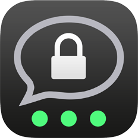
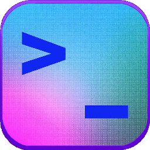

 data-protection-list
=============================================

Manuel de résistance au capitalisme de surveillance - Basé sur la [version de Valentin Delacour](https://codeberg.org/PrivacyFirst/PrivacyFirst/issues)

# Table des matières

* [0 Commentaires sur fork](#0-commentaires-sur-fork)
* [1 Introduction](#1-introduction)
* [2 Règles d’or](#2-règles-d’or)
* [3 Ordinateur](#3-ordinateur)
* [3-1 Systèmes d’exploitation](#3-1-systèmes-d’exploitation)
* [3-2 Services et programmes](#3-2-services-et-programmes)
* [4 Smartphone](#4-smartphone)
* [4-1 Systèmes d’exploitation](#4-1-systèmes-d’exploitation)
* [4-2 Applications](#4-2-applications)
* [5-Navigateurs](#5-navigateurs)
* [5-1 Firefox](#5-1-firefox)
* [5-2 Tor Browser](#5-2-tor-browser)
* [6 Instances de services](#6-instances-de-services)
* [6-1 Searx](#6-1-searx)
* [6-2 Invidious](#6-2-invidious)
* [6-3 Visioconférence](#6-3-visioconférence)
* [6-4 Serveurs DNS](#6-4-serveurs-dns)
* [7 Ressources additionnelles (sources vedettes)](#7-ressources-additionnelles-sources-vedettes)
* [8 Configurations](#8-configurations)
* [8-1 Systèmes d'exploitation](#8-1-systemes-d-exploitation)
* [8-2 F-Droid](#8-2-f-droid)
* [8-3 Applications et programmes](#8-3-applications-et-programmes)
* [8-4 Firefox](#8-4-firefox)

## 0 Commentaires sur fork

J'ai vu la nécessité de forger ce document de **Valentin Delacour** hébergé [ici](https://codeberg.org/PrivacyFirst/PrivacyFirst/issues) sous son approbation et sa licence pour lui donner plus de visibilité, lisibilité, confort, amélioration sous certains aspects et participation. Si quelqu'un d'autre bifurque à la fois le sien et celui-ci, il devrait faire de même.

Je pense que nous devrions partager combien plus, mieux c'est et les connaissances sur les bonnes pratiques à suivre en matière de sécurité, de confidentialité et d'open source qui sont détaillées ne font pas exception.

Nous sommes prêts à changer le format de ce document, pour l'instant j'ai pensé que c'était une bonne façon, mais cela pourrait être amélioré.

Je ne me considère pas comme un expert en la matière. En fait, je ne suis pas toutes les recommandations à la lettre. Mais j'aimerais avec le temps mettre de côté les services que je pense ne pas utiliser pour diverses raisons, changer les moyens d'accéder à certains contenus, utiliser d'autres stratégies, etc.

Pour participer activement, vous pouvez:

* [Créer des demandes d'extraction](https://github.com/adgellida/data-protection-list/pulls)
* [Générez vos questions ou incidents](https://github.com/adgellida/data-protection-list/issues)

Je vous recommande de participer à:

* [Official Telegram Group](https://t.me/privacid)
* [Official Group on Matrix](https://t.me/privacid)- #privacidadlibre:matrix.org - Demander une invitation

L'objectif du groupe est de promouvoir collectivement de bonnes habitudes en matière de confidentialité, de sécurité et également de programmes/applications open source/gratuits, de services et de systèmes d'exploitation pour résister à la collecte et à l'exploitation de données personnelles par des entreprises privées.

Je pense qu’ils profitent de l’ignorance de la majorité pour faire des choses qu’ils ne devraient pas et en tirer profit dans notre dos. La bonne chose est qu'il y a des gens qui le réalisent parce qu'ils comprennent le sujet et le partagent avec la communauté.

Ce document a été copié 1: 1 avec de très légères modifications dans la version 7/12/2020 et subira désormais des modifications suivant les stratégies suivantes:

* Suite aux mises à jour du fichier d'origine
* Extraire les demandes de la communauté
* Propres découvertes

Les améliorations les plus notables sont:

* Elle encourage une participation publique plus ordonnée et efficace.
* Images des applications pour mieux les identifier.
* Liens vers eux pour les trouver rapidement.

Maintenant, le document commence. Mettez votre ceinture, les courbes arrivent!

## 1 Introduction

Ce document a pour but principal de proposer des outils et alternatives pour protéger les données et la vie privée de la prédation des entreprises privées œuvrant dans le cadre du système actuel de capitalisme de surveillance. Toutefois, suivre les recommandations qui suivent permet également d’améliorer, dans une certaine mesure du moins, la protection contre d’autres entités intéressées par les données personnelles
telles que des services d’États ou des pirates, par exemple.

Cette liste est destinée à toute personne consciente ou prenant conscience des enjeux de la protection des données dans notre société, indépendamment de ses connaissances du sujet. Elle ne se destine pas aux personnes nécessitant un anonymat total du fait de leur fonction à risques tels les opposants politiques ou certains journalistes, même si certaines options citées pourraient leur convenir. En effet, le respect de la vie privée n’équivaut pas nécessairement à l’anonymat.

Le format de liste a été choisi afin de rendre sa consultation la plus efficace possible. Cette approche empêche de détailler de véritables explications. Vous êtes donc invités à chercher celles qui vous sont nécessaires par vous-mêmes ou dans les ressources additionnelles mentionnées au point 7 du document. Ayant pour but de proposer les options les plus réputées et pratiques sans être encombrée, la liste n’a pas pour vocation d’être exhaustive et demeure subjective bien que visant la plus grande objectivité possible.

Cette liste propose une première hiérarchisation (ordre d’apparition et présence ou non de parenthèses) subjective basée sur le rapport confidentialité/facilité d’utilisation afin de vous aider à choisir parmi les différentes options citées. Une deuxième
hiérarchisation (couleurs) se base uniquement sur la confidentialité estimée :

🟢 vert (véritable respect de la vie privée)

🔵 bleu (respect de la vie privée sous conditions ou présence d’un élément problématique)

🔴rouge (ne garantit pas le respect de la vie privée mais reste préférable aux options des GAFAM)

⚫incolore (manque d’éléments pour former une estimation pertinente). La présence d’un astérisque indique que l’option mentionnée est encore en phase de développement.

J’espère que ce document vous servira pour améliorer la protection de vos données personnelles et de celles de vos proches. Bien qu’étant le fruit de plusieurs années de recherches et d’expériences, ce travail demeure bien évidemment perfectible. Toute
suggestion ou remarque est donc plus que bienvenue à l’adresse mail suivante : "privacyfirst@ik.me". Plusieurs mois après la présente version du document, certaines informations données seront obsolètes. Le document étant fréquemment actualisé, vous êtes invités à vous procurer la dernière version sur la page web : "https://codeberg.org/PrivacyFirst/PrivacyFirst/issues".

## 2 Règles d’or

* Toujours éviter d’utiliser les services et programmes des GAFAM (Google, Amazon, Facebook, Apple et Microsoft) lorsque c’est possible. Il est recommandé de supprimer vos éventuels comptes.
* Toujours vérifier tous les paramètres et autorisations de ce que l’on utilise et les optimiser afin de limiter au maximum la collecte de données personnelles.
* Installer uniquement les programmes/applications nécessaires, ce sont autant d’accès potentiels à vos données personnelles.
* Utiliser des programmes libres/open source (leurs codes sont publics et donc vérifiables) au lieu des propriétaires/closed source à chaque fois que c’est possible.
* Privilégier les options libres populaires à celles méconnues (elles seront davantage vérifiées/fiables).
* Si une entreprise propose ses services gratuitement, en général, le produit qu’elle vend c’est vous (vos données personnelles). À cause du modèle dicté par le capitalisme de surveillance, payer ne vous protège même plus d’être également le produit.
* Mettre à jour ses programmes/systèmes d’exploitation régulièrement pour profiter des correctifs de failles de sécurité exploitables et penser à remplacer ceux qui ne paraissent plus être mis à jour.
* Ne pas utiliser d’antivirus de tiers qui sont de véritables aspirateurs à données personnelles. Leur apport est négligeable lorsqu’on maintient de bonnes habitudes numériques. La prudence et une bonne configuration sont les meilleurs antivirus).
* Privilégier les Web Apps, ou raccourcis depuis le navigateur, pour accéder aux services désirés au lieu d’applications à installer pour limiter l’accès et donc les possibilités de collecte de données personnelles.
* Utiliser une adresse de courriel temporaire pour créer un compte pour les sites/services peu importants.
* Toujours désactiver le Wi-Fi, le Bluetooth et la géolocalisation de son smartphone lorqu’ils ne sont pas utilisés et ne pas se connecter aux Wi-Fi publics sans VPN.
* Ne pas utiliser d’objets connectés (leur but est de récolter un maximum de données personnelles) ou ne pas les connecter à internet lorsqu’ils sont indispensables.

## 3 Ordinateur

### 3-1 Systèmes d’exploitation

Windows est actuellement le pire système d’exploitation en termes de confidentialité et de sécurité. Les seuls OS faciles d’utilisation et respectant véritablement la vie privée sont des distributions libres (donc gratuites) de Linux. Il en existe une multitude dont les caractéristiques varient grandement. Voici une petite sélection de celles proposant la meilleure expérience pour l’utilisateur (toujours en respectant la vie privée) ou garantissant la meilleure protection des données.
Il faut savoir que chacune d’entre elles propose une ou plusieurs interfaces (environnements de bureau) différentes en termes d’expérience, de consommation de ressources et d’apparence. Il existe une documentation abondante en ligne pour choisir quelle distribution et quel environnement de bureau conviendront le mieux aux capacités de votre ordinateur et à vos préférences ainsi que pour savoir comment l’installer facilement sur votre ordinateur.

**Desktop :**

🟢[Linux Mint](https://linuxmint.com) : idéal pour les débutants

🟢[MX Linux](https://mxlinux.org) :  convient aux débutants

🟢[Parrot Home OS](https://www.parrotsec.org) : sécurité et confidentialité renforcées (utilisateurs confirmés)

🟢[Zorin OS](https://zorin.com/os) : idéal pour les débutants venant de Windows ou macOS (support commercial)

🟢[Qubes OS](https://www.qubes-os.org) : sécurité extrême (utilisateurs avancés)

🟢[Whonix](https://www.whonix.org) : anonymat par Tor et sécurité extrême (utilisateurs avancés)

**USB live (RAM) :**

🟢[MX Linux](https://mxlinux.org) :  convient aux débutants

🟢[Tails](https://tails.boum.org) : anonymat par Tor (utilisateurs confirmés)

🟢[Parrot Home OS](https://www.parrotsec.org) : sécurité et confidentialité renforcées (utilisateurs confirmés)

**Raspberry Pi :**

🟢[LibreELEC](https://libreelec.tv) : centre multimédia pour TV

🟢[Batocera](https://batocera.org) : émulateur de consoles, retrogaming

🟢[Raspberry Pi OS](https://www.raspberrypi.org/software) : système d’exploitation classique

🟢[Plasma BigScreen*](https://plasma-bigscreen.org) : centre multimédia pour TV (commande vocale avec Mycroft AI)

🟢[Nymphcast*](http://nyanko.ws/product_nymphcast.php) : alternative gratuite et écologique au Chromecast

**Hardware :**

Les marques suivantes vendent des ordinateurs avec Linux préinstallé :

TUXEDO Computers

Slimbook

Librem

System76

Linux Mint

PINE64

ThinkPenguin

Dell (quelques modèles)

Il existe également d'autres fournisseurs d'ordinateurs moins connus avec Linux préinstallé. Concernant les fournisseurs d'ordinateurs Windows
Les modèles préinstallés Dell, Asus et HP sont réputés pour avoir une bonne compatibilité Linux. Il est conseillé d'éviter d'acheter des ordinateurs équipés d'une carte graphique Nvidia car ils sont connus pour souffrir de problèmes de compatibilité.

### 3-2 Services et programmes

Navigateur :

🔵[Firefox](https://www.mozilla.org)

🟢[Tor Browser](https://www.torproject.org/download)

🟢[LibreWolf*](https://librewolf-community.gitlab.io)

🔴[Brave](https://brave.com)

🔵[Ungoogled Chromium*](https://ungoogled-software.github.io/ungoogled-chromium-binaries/)

🔵[Iridium Browser](https://iridiumbrowser.de)

Moteur de recherche :

🔵[DuckDuckGo](https://duckduckgo.com)

🔵[searx.me](https://searx.me)

🔵[Qwant](https://www.qwant.com)

🔵[Swisscows](https://swisscows.com)

🔴[Startpage](https://www.startpage.com) (proxy Google)

⚫[Brave Search](https://search.brave.com/)

Bureautique :

🟢[LibreOffice](https://www.libreoffice.org)

🟢[Onlyoffice](https://www.onlyoffice.com)

🟢[Collabora Office - LibreOffice prof.](https://www.collaboraoffice.com)

🟢[Calligra](https://calligra.org)

🟢[CryptPad](https://cryptpad.fr)

Courriel :

[Tutanota](https://tutanota.com) 🔵libre 🔴payer

[ProtonMail](https://protonmail.com) 🔵libre 🔵payer

[Disroot](https://disroot.org/en/services/email) 🔵libre

[Posteo](https://posteo.de) 🔵payer

Plateforme vidéo :

🔵[LBRY - desktop](https://lbry.com)

🔴[Odysee - LBRY web](https://odysee.com)

🟢[PeerTube](https://joinpeertube.org)

Proxy Youtube :

🔵[Invidious](https://invidio.us)

🔵[CloudTube](https://cadence.moe/cloudtube/subscriptions)

🔵[FreeTube](https://freetubeapp.io) (client Youtube)

Messagerie instantanée :

🟢[Threema](https://threema.ch/en)

🔵[Signal](https://signal.org)

🟢[Session*](https://getsession.org)

🔴[Telegram](https://telegram.org)

🔵[Element](https://app.element.io)

🔵[Jami](https://jami.net)

🔵[Gajim](https://gajim.org/)

Visioconférence :

🟢[Jitsi Meet](https://meet.jit.si)

🔵[Signal](https://signal.org)

🔵[BigBlueButton](https://bigbluebutton.org)

🟢[Jami](https://jami.net)

🔵[Element](https://app.element.io)

🔵[Whereby](https://whereby.com)

🔴[Telegram](https://telegram.org)

Réseau social respectueux :

🔵[Mastodon](https://mastodon.social)

🔵[Element](https://app.element.io)

🔴[Telegram*](https://telegram.org)

🔵[PixelFed](https://pixelfed.org)

🔵[Lemmy](https://join.lemmy.ml/)

🔵[Pleroma](https://pleroma.social/)

🔵[movim](https://movim.eu/)

🔵[Friendica](https://friendi.ca)

Proxy abusif de réseau social :

🔵[Nitter](https://nitter.net) (Twitter)

🔵[Libreddit](https://libredd.it/) (Reddit)

🔵[Bibliogram](https://bibliogram.art) (Instagram)

Traduction :

🟢[LibreTranslate](https://libretranslate.com/)

[DeepL](https://www.deepl.com/translator) 🔴libre 🔵payer

🟢[Apertium](https://www.apertium.org)

🔴[Lingva Translate](https://lingva.ml) (proxy Google
Translate)

Bloqueur de publicités/trackers et contrôleur de trafic réseau :

⚫[Portmaster*](https://safing.io/portmaster)

Gestionnaire de mots de passe :

🟢[KeePassXC](https://keepassxc.org)

🔵[Bitwarden](https://bitwarden.com)

Cartes :

🟢[OpenStreetMap](https://www.openstreetmap.org)

🔵[Qwant Maps*](https://www.qwant.com/map)

🔵[DuckDuckGo](https://duckduckgo.com)

🔴[Maps.me](https://maps.me)

VPN :

🟢[ProtonVPN](https://protonvpn.com)

🟢[IVPN](https://www.ivpn.net)

🔵[Mullvad](https://mullvad.net)

🔵[Windscribe](https://windscribe.com/)

Films et séries en ligne :

🔵[Swiss Transfer](https://www.stremio.com) 🔵sans compte 🔴avec compte

🟢[IVPN](https://kodi.tv)

Partage de fichiers :

🟢[Disroot](https://upload.disroot.org)

🟢[OnionShare](https://onionshare.org)

🟢[Syncthing](https://syncthing.net)

🔵[Tresorit Send](https://tresorit.com/)

🔴[Swiss Transfer](https://swisstransfer.com)

Cloud :

🔵[Kdrive](https://www.infomaniak.com/es/kdrive)

🔵[Kdrive](https://www.https://mega.nz)

🟢[Nextcloud](https://nextcloud.com)

🔴[Cozy Cloud](https://cozy.io)

[Kdrive](https://icedrive.net) 🔴libre 🔵payer

🔴[Disroot](https://cloud.disroot.org)

Outil de synchronisation peer-to-peer :

🟢[Syncthing](https://syncthing.net)

Agenda :

🟢[Tutanota](https://f-droid.org/es/packages/de.tutao.tutanota)

🟢[ProtonCalendar*](https://protonmail.com)

Courriel temporaire :

⚫[Temp Mail](https://temp-mail.org)

⚫[Guerrillamail](https://guerrillamail.com)

⚫[EmailOnDeck](https://www.emailondeck.com)

Gestionnaire d'alias pour le courrier :

🟢[forwardemail](https://forwardemail.net)

Collaboration et organisation :

🟢[CryptPad](https://cryptpad.fr)

🟢[Mobilizon](https://mobilizon.org/en/)

Wikipedia :

🟢[Elisa](https://wikiless.org) (proxy Wikipedia)

Lecteur audio :

🟢[Elisa](https://elisa.kde.org)

🟢[Audacious](https://audacious-media-player.org)

🟢[Strawberry Music Player](https://www.strawberrymusicplayer.org)

Lecteur multimédia :

🟢[mpv](https://mpv.io)

🟢[VLC](https://www.videolan.org)

Notes :

🟢[Standard Notes](https://standardnotes.org)

🟢[Joplin](https://joplinapp.org)

🟢[Knotes](http://knotesapp.com)

🟢[Gnote](https://wiki.gnome.org/Apps/Gnote)

Antivirus (ClamAV) :

🟢ClamTK (Linux)

🟢ClamWin (Windows)

Nettoyage et optimisation de système :

🟢[Stacer](https://oguzhaninan.github.io/Stacer-Web)

🟢[ubunsys](https://github.com/adgellida/ubunsys)

🟢[BleachBit](https://www.bleachbit.org)

Outil de chiffrement :

🟢[VeraCrypt](https://www.veracrypt.fr)

🟢[Cryptomator](https://cryptomator.org)

Suppression de métadonnées :

🟢[ExifCleaner](https://exifcleaner.com)

Traitement d’image et dessin :

🟢[Gimp](http://www.gimp.org)

🟢[Krita](https://krita.org)

🟢[Drawing](https://maoschanz.github.io/drawing)

Traitement des photos :

🟢[Darktable](https://www.darktable.org)

🟢[RawTherapee](https://rawtherapee.com)

Dessin vectoriel :

🟢[Inkscape](https://inkscape.org)

Mise en page, édition (PAO) :

🟢[Scribus](https://www.scribus.net)

Édition audio :

🟢[LMMS](https://www.lmms.io)

🟢[Ardour](https://www.ardour.org)

🔵[Audacity](https://www.audacityteam.org)

Édition vidéo :

🟢[OpenShot](https://www.openshot.org)

🟢[Kdenlive](https://kdenlive.org)

🟢[Avidemux](https://www.avidemux.org)

🟢[Pitivi](http://www.pitivi.org)

🟢[Cinelerra](http://cinelerra.org)

Gravure de CD/DVD :

🟢[k3b](https://apps.kde.org/k3b)

🟢[Brasero](https://wiki.gnome.org/Apps/Brasero)

Transcodage :

🟢[Handbrake](https://handbrake.fr)

🟢[MKV](https://www.matroska.org/index.html)

Interface de connexion entre ordinateur et téléphone portable :

🟢KDE Connect

🟢Zorin Connect

Programmes/jeux Windows sous Linux :

⚫[PlayOnLinux](https://www.playonlinux.com)

⚫[Wine](https://www.winehq.org)

⚫[WinApps*](https://github.com/Fmstrat/winapps)

Analyse de trafic réseau :

🟢[Wireshark](https://www.wireshark.org)

Écosystème tout-en-un :

🔵Infomaniak

🔵Proton*

🔵Cozy Cloud

## 4 Smartphone

### 4-1 Systèmes d’exploitation

Android, dans sa configuration par défaut, est actuellement le pire système d’exploitation quant au respect de la vie privée. Son but est d’envoyer en permanence les données personnelles de ses utilisateurs aux serveurs Google afin de les exploiter et les revendre. La solution la plus recommandable actuellement en d’utiliser une version d’Android modifiée (custom ROM) pour respecter la vie privée.

Si vous ne souhaitez pas installer ou acheter un smartphone avec un OS respectueux (grave erreur) et que vous souhaitez tout de même utiliser Android stock, suivez les conseils détaillés au point 8.1 de ce document afin de limiter au maximum la collecte de données personnelles.

Le système d'exploitation d'Apple (iOS), malgré sa commercialisation basée sur le respect de la vie privée, collecte et exploite également les données personnelles de ses utilisateurs en plus de limiter considérablement leur liberté.

Les options basées sur Linux sont respectueuses de la vie privée et prometteuses en termes d'indépendance, mais elles n'offrent pas les mêmes garanties de sécurité qu'Android. De plus, dans leur état de développement actuel, ils ne sont pas recommandés pour les utilisateurs moyens (sauf pour Sailfish OS).

**Android modifié pour la vie privée :**

🟢[CalyxOS](https://calyxos.org) : Android dégooglisé et sûr avec microG pour une meilleure compatibilité

🟢[GrapheneOS](https://grapheneos.org) : l’Android dégooglisé le plus confidentiel et sécurisé disponible

🔵[/e/ OS](https://e.foundation) : LineageOS dégooglisé mais avec microG et services intégrés (compte /e/)

🔵[DivestOS](https://divestos.org/) : LineageOS partiellement amélioré pour la sécurité et la confidentialité

🔵[LineageOS for microG](https://lineage.microg.org) : LineageOS avec microG pour une meilleure compatibilité

🔵[Volla OS](https://volla.online): Android sûr, sans Google Apps mais pas totalement dégooglisé

🔵[LineageOS](https://lineageos.org) : Android sans Google apps mais pas totalement dégooglisé

**Linux :**

🔵[Sailfish OS](https://sailfishos.org) (partiellement propriétaire)

🔵[Ubuntu Touch*](https://ubuntu-touch.io)

🔵[PostmarketOS*](https://postmarketos.org)

🔵[Mobian*](https://mobian-project.org)

🔵[PureOS*](https://pureos.net)

🔵[Manjaro*](https://manjaro.org)

**Matériel préinstallé :**

[Fairphone 3 y 3+](https://www.fairphone.com) : /e/ OS (version disponible uniquement sur le site du projet /e/)

[Gigaset GS290](https://e.foundation/es/e-announces-the-e-gs290-as-the-latest-device-available-with-privacy-friendly-e-os-pre-installed/) : /e/ OS (version disponible uniquement sur le site du projet /e/)

[Volla Phone](https://volla.online) : Volla OS, Ubuntu Touch avec autres

[Pinephone](https://www.pine64.org/pinephone) : Manjaro avec autres S.O. Linux compatibles)

D'autres modèles avec /e/ OS pré-installé sont disponibles sur [le site /e/ project](https://esolutions.shop)

### 4-2 Applications

Les applications proposées pour Android et dérivés doivent être recherchées au préalable dans la boutique d'applications gratuite F-Droid (garantir qu'elles ne disposent pas de trackers tiers) et uniquement si elles ne sont pas, dans Aurora Store, un proxy Google Play permettant d'accéder à leur applications gratuites de manière anonyme (ne jamais se connecter avec un compte Google personnel, toujours de manière anonyme).

Ces magasins doivent être téléchargés directement à partir de leurs pages Web officielles. Pensez alors à retirer l'autorisation d'installer des applications inconnues sur votre navigateur, pour des raisons de sécurité (paramètres > applications > navigateur utilisé).

**Android et dérivés :**

Magasin d’applications :

🟢[F-Droid](https://f-droid.org)

🔵[Aurora Store](https://auroraoss.com) (proxy Play Store)

🔵[APKMirror](https://www.apkmirror.com)

Navigateur :

🟢[Bromite](https://www.bromite.org/fdroid)

🟢[Tor Browser](https://www.torproject.org/es/download/#android)

🔵[mull](https://github.com/Divested-Mobile/mull)

🔵[Privacy Browser](https://f-droid.org/es/packages/com.stoutner.privacybrowser.standard)

🔵[FOSS Browser](https://f-droid.org/es/packages/de.baumann.browser)

🔵[Ungoogled Chromium](https://uc.droidware.info/fdroid.html)

Messagerie instantanée :

🟢[Threema](https://threema.ch/en)

🔵[Signal](https://signal.org)

🟢[Session*](https://getsession.org)

🔴[Telegram FOSS](https://f-droid.org/packages/org.telegram.messenger/)

🔵[Element](https://app.element.io)

🔵[Jami](https://jami.net)

🟢[Briar](https://briarproject.org)

🔵[Conversations](https://conversations.im)

Visioconférence :

🟢[Jitsi Meet](https://meet.jit.si)

🔵[Signal](https://signal.org)

🟢[Jami](https://jami.net)

🔵[Element](https://app.element.io)

🔵[Whereby](https://whereby.com)

🔴[Telegram FOSS](https://f-droid.org/packages/org.telegram.messenger)

Plateforme vidéo :

🔴[LBRY](https://lbry.com)

🔴[Newpipe](https://newpipe.schabi.org) (client Youtube)

🟢[Tubelab](https://f-droid.org/en/packages/app.fedilab.tubelab/) (client Peertube)

Bloqueur de publicité/pisteurs :

🟢[RethinkDNS*](https://play.google.com/store/apps/details?id=com.celzero.bravedns&hl=es&gl=US)

🟢[Blokada](https://f-droid.org/es/packages/org.blokada.alarm)

🟢[Nebulo](https://play.google.com/store/apps/details?id=com.frostnerd.smokescreen&hl=es&gl=US)

🟢TrackerControl

Cartes/navigation GPS :

🔵[Magic Earth](https://www.magicearth.com)

🟢[OsmAnd+](https://f-droid.org/es/packages/net.osmand.plus/)

🟢Organic Maps

Client courriel :

🔵[Tutanota](https://f-droid.org/es/packages/de.tutao.tutanota)

🔵[ProtonMail](https://protonmail.com)

⚫[FairEmail](https://email.faircode.eu)

⚫[K-9 Mail](https://f-droid.org/es/packages/com.fsck.k9)

Gestionnaire d’alias pour courriel  :

🟢[Simple Login](https://simplelogin.io)

🟢[AnonAddy](https://anonaddy.com/)

Client gestionnaire de mots de passe :

🟢[KeePassDX](https://f-droid.org/es/packages/com.kunzisoft.keepass.libre)

🔵[Bitwarden](https://bitwarden.com)

🟢AuthPass

Authentification à deux facteurs :

🟢[Aegis](https://f-droid.org/es/packages/com.beemdevelopment.aegis)

🟢[andOTP](https://f-droid.org/en/packages/org.shadowice.flocke.andotp)

VPN :

🟢[ProtonVPN](https://protonvpn.com)

🟢[IVPN](https://www.ivpn.net)

🔵[Mullvad](https://mullvad.net)

🔵[Riseup VPN](https://riseup.net/es/vpn)

🔵[Calyx VPN](https://calyx.net/)

Outil de synchronisation :

🟢[Syncthing](https://f-droid.org/en/packages/com.nutomic.syncthingandroid)

⚫DAVx5

Cloud :

🔵[Kdrive](https://www.infomaniak.com/es/kdrive)

🔴[Kdrive](https://www.https://mega.nz)

🟢[Nextcloud](https://nextcloud.com)

🔴[Cozy Drive](https://cozy.io)

🔴[Kdrive](https://icedrive.net)

Outil de chiffrement pour le cloud :

🟢[Cryptomator](https://cryptomator.org)

Interface de connexion entre ordinateur et téléphone portable :

🟢KDE Connect

🟢Zorin Connect

Réseau social respectueux :

🔵[Tusky](https://f-droid.org/en/packages/com.keylesspalace.tusky) (Mastodon)

🔵[Element](https://f-droid.org/es/packages/im.vector.app) (Matrix)

🔴[Telegram FOSS](https://f-droid.org/packages/org.telegram.messenger)

🔵[Fedilab](https://f-droid.org/en/packages/fr.gouv.etalab.mastodon) Mastodon, Pleroma...),

🔵PixelDroid (PixelFed)

🔵[Lemmur (Lemmy)](https://lemmy.ml)

Client respectueux Facebook :

🔴[Frost for Facebook](https://f-droid.org/es/packages/com.pitchedapps.frost)

🔴WebApps

Client respectueux Instagram :

🔴WebApps

🔴Barinsta

Client respectueux Twitter :

🔴Fritter

🔴[Twidere](https://f-droid.org/es/packages/org.mariotaku.twidere)

🔴WebApps

WebApps createur :

🟢WebApps

Suppression de métadonnées :

🟢[Scrambled Exif](https://f-droid.org/es/packages/com.jarsilio.android.scrambledeggsif)

🟢[ImagePipe](https://f-droid.org/es/packages/de.kaffeemitkoffein.imagepipe)

Bureautique :

🟢[Collabora Office - LibreOffice prof.](https://www.collaboraoffice.com)

🟢LibreOffice

Lecteur ebook :

🟢Librera Reader

🟢KOReader

La finance :

🟢MoneyWallet

🟢Unstoppable Wallet

🟢MoneyBuster

🟢WeeklyBudget

Exercice physique :

🟢Feeel – home workouts

🟢FitoTracker

🟢Workout Time!

Radio internet :

🟢[RadioDroid](https://f-droid.org/es/packages/net.programmierecke.radiodroid2)

🟢Transistor – Simple Radio App

Redirecteur de contenu Youtube, Twitter, Instagram et Google Map :

🟢[UntrackMe](https://f-droid.org/en/packages/app.fedilab.nitterizeme)

Scanner de codes QR :

⚫QR & Barcode Scanner

Lecteur RSS :

🟢Feeder

🟢Flym

🟢Handy News Reader

Système d'application de remplacement pour Android d'origine: :

Keyboard :

🟢[AnySoftKeyboard](https://anysoftkeyboard.github.io)

🟢[OpenBoard](https://f-droid.org/es/packages/org.dslul.openboard.inputmethod.latin)

🟢[FlorisBoard*](https://github.com/florisboard/florisboard)

Agenda :

🟢[Simple Calendar](https://f-droid.org/es/packages/com.simplemobiletools.calendar.pro)

🟢[Tutanota](https://f-droid.org/es/packages/de.tutao.tutanota)

🟢Proton Calendar*

🟢[Etar](https://f-droid.org/es/packages/ws.xsoh.etar)

Notes :

🟢[Standard Notes](https://play.google.com/store/apps/details?id=com.standardnotes)

🟢Quillnote

🟢[Joplin](https://play.google.com/store/apps/details?id=net.cozic.joplin&utm_source=GitHub&utm_campaign=README&pcampaignid=MKT-Other-global-all-co-prtnr-py-PartBadge-Mar2515-1)

🟢[Nextcloud Notes](https://f-droid.org/es/packages/it.niedermann.owncloud.notes)

Météorologie :

🟢Geometric Weather

🟢Weather

SMS :

🔴[Signal](https://signal.org)

🔴[Simple SMS Messenger](https://f-droid.org/en/packages/com.simplemobiletools.smsmessenger/)

🔴[QKSMS](https://f-droid.org/en/packages/com.moez.QKSMS/)

Gestionnaire de fichiers :

🟢[Simple File Manager](https://f-droid.org/es/packages/com.simplemobiletools.filemanager.pro)

🟢Ghost Commander

🟢Material Files

Galerie :

🟢[Simple Gallery](https://f-droid.org/es/packages/com.simplemobiletools.gallery.pro)

Lecteur audio :

🟢[Vinyl Music Player](https://f-droid.org/es/packages/com.poupa.vinylmusicplayer)

🟢[Vanilla Music](https://f-droid.org/en/packages/ch.blinkenlights.android.vanilla)

🟢[Music Player GO](https://f-droid.org/es/packages/com.iven.musicplayergo)

Lecteur PDF :

🟢[PDF Viewer Plus](https://f-droid.org/es/packages/com.gsnathan.pdfviewer)

🟢Librera Reader

🟢KOReader

🟢[MuPDF Viewer](https://f-droid.org/es/packages/com.artifex.mupdf.viewer.app)

Contacts :

🟢[Open Contacts](https://f-droid.org/es/packages/opencontacts.open.com.opencontacts)

🟢[Simple Contacts](https://f-droid.org/es/packages/com.simplemobiletools.contacts.pro)

Caméra :

🟢[Open Camera](https://f-droid.org/es/packages/net.sourceforge.opencamera)

🟢[Simple Camera](https://f-droid.org/es/packages/com.simplemobiletools.camera)

Enregistreur audio :

🟢[Audio Recorder](https://f-droid.org/es/packages/com.github.axet.audiorecorder)

🟢[Simple Voice Recorder](https://f-droid.org/es/packages/com.simplemobiletools.voicerecorder)

Gestionnaire d'appels : 

🔴[Simple Dialer](https://f-droid.org/es/packages/com.simplemobiletools.dialer)

🔴Emerald Dialer

Calculator :

🟢[Simple Calculator](https://f-droid.org/en/packages/com.simplemobiletools.calculator)

Clock :

🟢[Simple Clock](https://f-droid.org/en/packages/com.simplemobiletools.clock)

Lecteur multimédia :

🟢[VLC](https://f-droid.org/es/packages/org.videolan.vlc/)

Pour aller plus loin :

Contrôleur de trafic réseau (pare-feu) :

🟢[RethinkDNS*](https://play.google.com/store/apps/details?id=com.celzero.bravedns&hl=es&gl=US)

🟢[InviZible Pro](https://f-droid.org/en/packages/pan.alexander.tordnscrypt.stable)

🟢[NetGuard](https://f-droid.org/es/packages/eu.faircode.netguard)

Révélateur de pisteurs tiers :

🟢[ClassyShark3xodus](https://f-droid.org/es/packages/com.oF2pks.classyshark3xodus)

🟢[Exodus](https://f-droid.org/en/packages/org.eu.exodus_privacy.exodusprivacy)

Gestionnaire de confidentialité pour les applications :

🟢[App Manager](https://f-droid.org/es/packages/io.github.muntashirakon.AppManager)

🟢[App Warden](https://forum.xda-developers.com/t/app-5-0-warden-app-manager.4122227) (root)

Stoppeur d’applications (arrière plan) :

🟢[RethinkDNS*](https://play.google.com/store/apps/details?id=com.celzero.bravedns&hl=es&gl=US)

🟢[SuperFreezZ](https://f-droid.org/es/packages/superfreeze.tool.android)

Anonymisation réseau par Tor :

🟢[Orbot Proxy](https://play.google.com/store/apps/details?id=org.torproject.android&hl=es&gl=US)

🟢[InviZible Pro](https://f-droid.org/en/packages/pan.alexander.tordnscrypt.stable)

Isolateur d’applications :

🟢[Shelter](https://f-droid.org/en/packages/net.typeblog.shelter)

🟢[Insular](https://f-droid.org/en/packages/com.oasisfeng.island.fdroid)

Détecteur de malware :

🟢Hypatia (ClamAV)

Alternative au Chromecast pour Raspberry Pi :

🟢Raspicast

Falsification de localisation :

🟢[Fake Traveler](https://f-droid.org/en/packages/cl.coders.faketraveler)

Remplacement de Google Services :

🔵[MicroG GmsCore](https://microg.org)

Bloqueur d’usage du micro :

🟢[PilferShush Jammer](https://f-droid.org/en/packages/cityfreqs.com.pilfershushjammer)

### IOS :

Navigateur :

🔵[Firefox](https://apps.apple.com/us/app/navegador-firefox/id989804926)

🔵[Onion Browser](https://apps.apple.com/us/app/onion-browser/id519296448)

🔵[DuckDuckGo Browser](https://apps.apple.com/us/app/duckduckgo-privacy-browser/id663592361)

🔴[Brave](https://apps.apple.com/us/app/brave-private-web-browser-vpn/id1052879175)

Messagerie instantanée :

🟢[Threema](https://apps.apple.com/us/app/threema-the-secure-messenger/id578665578)

🔵[Signal](https://apps.apple.com/us/app/signal-mensajer%C3%ADa-privada/id874139669)

🟢[Session*](https://apps.apple.com/us/app/session-private-messenger/id1470168868)

🔴[Telegram](https://apps.apple.com/us/app/telegram-messenger/id686449807)

🔵[Element](https://app.element.io)

🔵[Jami](https://apps.apple.com/us/app/jami/id1306951055)

🔵[Monal](https://apps.apple.com/us/app/monal-xmpp-chat/id317711500)

Visioconférence :

🟢[Jitsi Meet](https://apps.apple.com/us/app/jitsi-meet/id1165103905)

🔵[Signal](https://apps.apple.com/us/app/signal-mensajer%C3%ADa-privada/id874139669)

🟢[Jami](https://apps.apple.com/us/app/jami/id1306951055)

🔵[Element](https://app.element.io)

🔵[Whereby](https://apps.apple.com/us/app/whereby-video-meetings/id878583078)

🔴[Telegram](https://apps.apple.com/us/app/telegram-messenger/id686449807)

Plateforme vidéo :

🔴[Odysee - LBRY web](https://odysee.com)

Bloqueur de publicité/pisteurs :

🟢[Blokada](https://apps.apple.com/us/app/blokada/id1508341781)

🟢[DNSCloak](https://apps.apple.com/us/app/dnscloak-secure-dns-client/id1452162351)

🟢[Lockdown](https://apps.apple.com/us/app/lockdown-apps/id1469783711)

Cartes / Navigation GPS :

🔵Magic Earth

🟢Organic Maps

🔵OsmAnd

Client courriel : 

🔵[Tutanota](https://apps.apple.com/us/app/tutanota/id922429609)

🔵[ProtonMail](https://apps.apple.com/us/app/protonmail-correo-cifrado/id979659905)

Gestionnaire d’alias pour courriel :

🟢[Simple Login](https://apps.apple.com/us/app/simplelogin-anti-spam/id1494359858)

Client gestionnaire de mots de passe :

🟢[Strongbox](https://apps.apple.com/es/app/strongbox-keepass-pwsafe/id897283731) - KeePass & PwSafe

🔵[Bitwarden](https://apps.apple.com/us/app/bitwarden-gestor-de-contrase/id1137397744)

Authentification à deux facteurs :

🟢[Tofu Authenticator](https://apps.apple.com/us/app/tofu-authenticator/id1082229305)

🟢Raivo OTP

VPN:

🔵ProtonVPN

🟢IVPN

🔵Mullvad VPN

🔵Windscribe VPN

Cloud :

🔵[Kdrive](https://www.infomaniak.com/es/kdrive)

🔴[MEGA](https://apps.apple.com/es/app/mega/id706857885)

🟢[Nextcloud](https://nextcloud.com)

🔴[Cozy Drive](https://cozy.io)

🔴[Kdrive](https://apps.apple.com/es/app/icedrive-cloud-storage/id1476402680)

Outil de chiffrement pour le cloud :

🟢[Cryptomator](https://apps.apple.com/us/app/cryptomator/id953086535)

Réseau social respectueux :

🔵Mastodon for iPhone

🔴[Telegram](https://apps.apple.com/us/app/telegram-messenger/id686449807)

🔵Element (Matrix)

Bureautique :

🟢Collabora Office

🟢LibreOffice

## 5 Navigateurs

La compartimentation (utiliser différents navigateurs, avec différentes configurations, selon les tâches) est une méthode recommandée pour préserver la vie privée sans trop sacrifier le confort de navigation.
À titre d’exemple, il s’agirait d’utiliser Firefox avec une configuration restrictive pour la navigation générale. Ensuite, utiliser un autre profil du même Firefox ou Firefox ESR, configuré de manière moins restrictive pour les sites ne s’affichant pas correctement ou nécessitant une connexion à un compte personnel, et un autre navigateur pour la consultation des sites les plus récalcitrants à une configuration pour la protection de la confidentialité (Brave ou Ungoogled Chromium sans configuration sont idéaux pour ce cas de figure). On peut également imaginer un autre navigateur uniquement dédié au e-banking ou encore Tor Browser pour la navigation anonyme.

### 5-1 Firefox

Pour que Firefox protège la vie privée, il est nécessaire de le configurer de manière adéquate (paramètres, extensions et about:config). Toutes les configurations nécessaires (restrictives) sont détaillées au point 8.3 du document. Ces réglages sont également valables pour LibreWolf et, dans une certaine mesure, pour la version mobile. 

**Extensions :**

Liste légère :

uBlock Origin - [Chrome](https://chrome.google.com/webstore/detail/ublock-origin/cjpalhdlnbpafiamejdnhcphjbkeiagm) - [Firefox](https://addons.mozilla.org/es/firefox/addon/ublock-origin)

Decentraleyes - [Chrome](https://chrome.google.com/webstore/detail/decentraleyes/ldpochfccmkkmhdbclfhpagapcfdljkj) - [Firefox](https://addons.mozilla.org/es/firefox/addon/decentraleyes)

Cookie AutoDelete - [Chrome](https://chrome.google.com/webstore/detail/cookie-autodelete/fhcgjolkccmbidfldomjliifgaodjagh) - [Firefox](https://addons.mozilla.org/en-US/firefox/addon/cookie-autodelete)

HTTPS Everywhere - [Chrome](https://chrome.google.com/webstore/detail/https-everywhere/gcbommkclmclpchllfjekcdonpmejbdp) - [Firefox](https://addons.mozilla.org/es/firefox/addon/https-everywhere)

Randomisation de l'empreinte (restrictive) :

uBlock Origin - [Chrome](https://chrome.google.com/webstore/detail/ublock-origin/cjpalhdlnbpafiamejdnhcphjbkeiagm) - [Firefox](https://addons.mozilla.org/es/firefox/addon/ublock-origin)

Decentraleyes - [Chrome](https://chrome.google.com/webstore/detail/decentraleyes/ldpochfccmkkmhdbclfhpagapcfdljkj) - [Firefox](https://addons.mozilla.org/es/firefox/addon/decentraleyes) - Finished development? - Alternative?

Privacy Redirect - [Chrome](https://chrome.google.com/webstore/detail/privacy-redirect/pmcmeagblkinmogikoikkdjiligflglb) - [Firefox](https://addons.mozilla.org/en-US/firefox/addon/privacy-redirect)

CanvasBlocker - [Chrome](https://chrome.google.com/webstore/detail/canvas-blocker-fingerprin/nomnklagbgmgghhjidfhnoelnjfndfpd) - [Firefox](https://addons.mozilla.org/es/firefox/addon/canvasblocker)

[Chameleon](https://github.com/ghostwords/chameleon) Finished development? - Alternative?

### 5-2 Tor Browser

Le concept de Tor est de faire passer le trafic internet par un réseau l’anonymisant. Dans le but que l’empreinte (fingerprint) de votre navigateur (donnée entre autres par sa configuration) ne trahisse pas votre identité, les navigateurs Tor sont conçus
pour avoir, au possible, la même empreinte indépendamment des utilisateurs. Pour éviter de rendre l’empreinte de votre navigateur Tor unique, il ne faut pas installer des extensions ou de faire des modifications dans les paramètres "about:config". Si
vous tenez à l’anonymat fourni, il est également nécessaire de ne pas se connecter à des comptes pouvant de fait le compromettre.
La méthode d’anonymisation du réseau Tor ralentit les chargements. Il n’est donc pas recommandé de l’utiliser pour le streaming ou les téléchargements volumineux.

## 6 Instances de services

### 6-1 Searx

Searx est un métamoteur qui ne transmet pas de données personnelles aux moteurs de recherche utilisés. Il permet, si on le souhaite, une configuration très avancée. Les différentes instances (disponibles ici : https://searx.space/) n’offrent pas toutes les
mêmes garanties de protection de la vie privée (log d’adresses IP ou non, etc.).

🔵https://searx.nobigtech.es : Google results included, IP address, log good UI

🟢https://search.disroot.org : Google results (Startpage), no IP address log, good UI

🟢https://search.disroot.org : Google results included, no IP address log

### 6-2 Invidious

Invidious donne accès au contenu Youtube (proxy) sans transmettre les données personnelles à Google. Malheureusement, ses différentes instances (disponibles ici : https://instances.invidio.us/) rencontrent fréquemment des problèmes dus aux mesures prises par Google pour empêcher leur fonctionnement. L'extension Privacy Redirect redirige automatiquement les liens YouTube vers Invidous.

Les instances Invidious qui semblent actuellement être les plus fonctionnelles sont

⚫https://yewtu.be

### 6-3 Visioconférence

**Jitsi Meet :**

🟢[FDN](https://talk.fdn.fr)

🟢[Snopyta](https://talk.snopyta.org)

🟢[Framasoft](https://framatalk.org/accueil)

🟢[Calyx](https://meet.calyx.net)

🔵[Jitsi](https://jitsi.org/jitsi-meet)

🔵[Infomaniak](https://meet.infomaniak.com)

**BigBlueButton :**

🟢[FAImaison](https://bbb.faimaison.net/b)

🟢[Grifon](https://bbb.grifon.fr/b)

🟢[Nixnet](https://meet.nixnet.services/b)

### 6-4 Serveurs DNS

Si vous utilisez un VPN, il est conseillé de ne pas changer votre serveur DNS par défaut, afin de ne pas vous démarquer de vos autres utilisateurs. Sinon, remplacez le serveur DNS fourni par votre fournisseur d'accès Internet par un serveur respectueux parmi les recommandations ci-dessous. Utilisez une implémentation cryptée (DoH, DoT, DoQ, DNSCrypt, etc.) dans la mesure du possible.

Avec filtrage contre publicité, pisteurs et domaines malicieux :

🟢[BlahDNS](https://blahdns.com) (DoH, DoT, DNSCrypt) (Europe et Asie de l'Est)

🟢[NixNet](https://docs.nixnet.services/NixNet_DNS) (DoH, DoT) (Europe et Amérique du Nord)

🔵[Adguard](https://adguard.com/en/adguard-dns/overview.html) (DoH, DoT, DNSCrypt) (Europe, Amérique du Nord et Asie de l'Est)

🔵[NextDNS](https://nextdns.io)(DoH, DoT, DNSCrypt) (intercontinental)

🔵[LibreDNS](https://libredns.gr)(DoH, DoT) (Europe)

BlahDNS DoH (Alemania) : https://doh-de.blahdns.com/dns-query

BlahDNS DoH (Singapur) : https://doh-sg.blahdns.com/dns-query

BlahDNS DoQ (Finlandia) : quic://dot-fi.blahdns.com:784

NixNet DoH (intercontinental) : https://adblock.any.dns.nixnet.xyz/dns-query

Filtres contre les domaines malveillants :

🟢[Quad9](https://www.quad9.net) (DoH, DoT, DNSCrypt) (blocs uniquement les domaines malveillants)

DoH : https://dns.quad9.net/dns-query

DoT : tls://dns.quad9.net

IPv4 : 9.9.9.9, 149.112.112.112

IPv6 : 2620:fe::fe, 2620:fe::9

Sans filtres :

🟢[Snopyta](https://snopyta.org) (DoH, DoT) (Europe)

🟢[Digitale Gesellschaft](https://digitalegesellschaft.de) (DoH, DoT) (Europe)

🔵[UncensoredDNS](https://blog.uncensoreddns.org/dns-servers) (DoH) ((Europe et Amérique du Nord)

🔵[DNS.Watch](https://dns.watch) (DoH, DNSCrypt)

Snopyta DoH (Finlandia) : https://fi.doh.dns.snopyta.org/dns-query

## 7 Ressources additionnelles (sources vedettes)

**Général**

Excellentes ressources pour mieux comprendre le capitalisme de surveillance et ses menaces :

* https://www.nobigtech.es

* Derrière nos écrans de fumée, Jeff Orlowski (film)

* Nothing to Hide,, Marc Meillassoux (documental)

* L’Âge du capitalisme de surveillance, Shoshana Zuboff (livre)

Excellents tutoriels pour la confidentialité et la protection des données : 

basique :

* https://spreadprivacy.com/tag/device-privacy-tips

* https://www.vice.com/en_us/article/d3devm/motherboard-guide-to-notgetting-hacked-online-safety-guide

plein :

* https://dt.gl/privacy-cookbook-the-story-so-far/

Excellentes chaînes à propos de la confidentialité (avec tutoriels) :

* The Hated One : https://www.youtube.com/channel/UCjr2bPAyPV7t35MvcgT3W8Q
 
* Techlore : https://www.youtube.com/channel/UCs6KfncB4OV6Vug4o_bzijg

Associations pour la défense de la vie privée (informations) :

* https://ssd.eff.org/

* https://www.laquadrature.net/es/

* https://www.eff.org/deeplinks

Associations proposant d’excellents services respectant la vie privée :

* https://disroot.org/es/

* https://komun.org/

* https://framasoft.org/en/

* https://snopyta.org/

* https://www.drycat.fr/en

Excellent site répertoriant les services et programmes respectueux : :

* https://www.privacytools.io/

Opérateurs recommandés :

* https://www.eff.org/pages/quien-defiende-tus-datos

**Groupes et canaux Telegram (et Matrix)**

Respect de la vie privée et autres :

* [t.me/privacidadlibre](t.me/privacidadlibre) et #privacidadlibre:matrix.org
* [t.me/techloregroup](t.me/techloregroup) et #techlore:matrix.org
* [t.me/techloreofficial](t.me/techloreofficial) (attention, biais pro Apple)

Linux et autres :

* [Proyecto tic tac](t.me/grupo_telegram_proyectotictac)
* [LinuxMintEs](t.me/LinuxMintEs)
* [mxantixes](t.me/mxantixes)

**Systèmes d’exploitation**

Linux :

* [MX Linux](https://mxlinux.org)
* [Linux Mint](https://linuxmint.com)

Android respectueux de la vie privée :

* [CalyxOS](https://calyxos.org)
* [GrapheneOS](https://grapheneos.org)
* [/e/ OS](https://e.foundation)
* Compatibilité des applications avec et sans microG : (https://plexus.techlore.tech)

**Firefox**

* [Configuration Firefox](https://www.youtube.com/watch?v=tQhWdsFMc24)
* [Configuration Firefox basique](https://12bytes.org/articles/tech/firefox/the-firefox-privacy-guide-for-dummies)
* [Configuration Firefox avancée](https://12bytes.org/articles/tech/firefox/firefoxgecko-configuration-guide-for-privacy-and-performance-buffs)

## 8 Configurations

### 8-1 Systèmes d'exploitation

**Android**

Les recommandations suivantes sont imparfaites et ne garantissent pas entièrement la protection des données, car il est recommandé d'utiliser une version d'Android modifiée pour la confidentialité au lieu d'Android d'origine. Cela étant dit, dans un effort pour ne pas être entièrement et continuellement décrit avec Android d'origine, suivez les recommandations suivantes :

* Éviter toutes les marques chinoises ou Samsung et préférez une marque, comme Nokia, proposant "Android One" (c'est-à-dire sans couche constructeur supplémentaire)
* Ne vous connectez jamais avec un compte Google
* Utiliser des applications pour pouvoir installer des applications sans Google Play Store
* Installer e utiliser une application, telle que RethinkDNS ou Blokada, qui vous permet de bloquer les trackers ainsi que les publicités et d'utiliser un serveur DNS respectueux crypté
* Remplacer le clavier par défaut par un respectueux
* Supprimer (ou lorsqu'il n'est pas possible de désactiver) toutes les applications nuisibles (Google, antivirus tiers, etc.) ou non utilisées
* Bloquer l'accès Internet à toutes les applications qui sont désactivées ou ne nécessitent pas d'accès Internet pour fonctionner grâce à une application de pare-feu telle que RethinkDNS
* Passer en revue toutes les autorisations d'application et de système pour les supprimer si elles sont nuisibles à la vie privée ou inutiles

**GrapheneOS**

Profitez de la fonction offerte uniquement par GrapheneOS pour supprimer l'autorisation d'accès aux capteurs (utilisés insidieusement pour la collecte d'informations et le traçage) à toutes les applications commerciales ou fermées et aussi celles qui n'en ont pas besoin, par précaution :

"Paramètres"> "Applications et notifications"> choisissez une application> "Autorisations"> "Capteurs" > "Voir toutes les applications qui ont cette autorisation"

**Windows**

Les recommandations suivantes sont imparfaites et ne garantissent pas la protection des données, car il est recommandé d'utiliser une distribution Linux au lieu de Windows. Cela étant dit, dans un effort pour ne pas être entièrement et continuellement décrit avec Windows, suivez les recommandations suivantes :

* N'utiliser aucune version antérieure à Windows 10 car elles sont vulnérables/non sécurisées
* Ne vous connecter jamais avec un compte Microsoft
* Désactiver complètement Cortana
* Désactiver l'historique des activités
* Allez dans les paramètres, sous «vie privée» et désactivez tout dans chacune des catégories à l'exception des autorisations nécessaires pour les applications utilisées
* Désinstaller (ou lorsqu'il n'est pas possible de désactiver) Edge, Microsoft OneDrive, antivirus (sauf Microsoft Defender) et toutes les applications inutilisées
* Activer l'adresse MAC aléatoire dans les paramètres Wi-Fi
* Utiliser de préférence une autre session que l'administrateur pour une utilisation quotidienne
* Installer le programme ShutUp10 pour avoir plus de contrôle sur la confidentialité

**MX Linux**

Plugin Flash :
Entrer la commande suivante dans le terminal pour supprimer le plugin Flash propriétaire :
sudo apt purge --remove adobe-flashplugin flashplugin-installer pepperflashplugin-nonfree

Stop Pub (Advert Blocker) :
Sélectionner toutes les options sauf "UNBLOCK" puis valider.

Configuration Wi-Fi :
Clic droit sur l’icône Wi-Fi, modifier les connections, sélectionner le Wi-Fi actif, sous Wi-Fi sélectionner Adresse MAC clonée : Aléatoire.
Sous paramètres IPv6, sélectionner Extensions de confidentialité IPv6 : Activé (adresse temporaire préférée)

### 8-2 F-Droid

Afin de trouver et télécharger certaines applications de F-Droid, il est nécessaire d'ajouter leurs référentiels. Pour ce faire, allez dans les paramètres du F-Droid, puis sous "référentiels", activez le référentiel "Guardian Project" et enfin appuyez sur le "+" et saisissez les adresses mentionnées souhaitées :

* Bromite :
https://fdroid.bromite.org/fdroid/repo

* Mull :
https://divestos.org/fdroid/official

* Ungoogled Chromium :
https://www.droidware.info/fdroid/repo

* Newpipe :
https://archive.newpipe.net/fdroid/repo

Il se peut que Newpipe cesse de fonctionner en raison de modifications apportées par Google sur YouTube. Afin de bénéficier rapidement des dernières mises à jour en corrigeant ces problèmes, il est recommandé d'ajouter le propre référentiel de Newpipe.

* Langis (Signal) :
https://gitlab.com/TheCapsLock/fdroid-patched-apps/raw/master/fdroid/repo

Langis est une version modifiée de Signal à utiliser en dernier recours si les notifications n'arrivent pas avec la version classique de Signal d'Aurora Store.

* Session :
https://fdroid.getsession.org/fdroid/repo

* Bitwarden :
https://mobileapp.bitwarden.com/fdroid/repo

Version sans les trackers tiers présents dans la version Google Play.

* Nebulo :
https://fdroid.frostnerd.com/fdroid/repo

* Collabora Office :
https://www.collaboraoffice.com/downloads/fdroid/repo

### 8-3 Applications et programmes

**Telegram**

Démarrez des discussions secrètes pour que les conversations soient chiffrées de bout en bout
extrême et ne pas passer par les serveurs Telegram:
profils de contact> les trois points ci-dessus> démarrer un chat secret

Désactivez l'aperçu des liens dans les discussions secrètes pour éviter de demander des liens
Serveurs Telegram:

Paramètres> Confidentialité et sécurité> Chats secrets> Aperçu du lien

**Blokada**

Blocklists > activer les listes noires suivantes :

- OISD
- Phishing Army
- DuckDuckGo Tracker Radar
- Exodus Privacy
- Combined Privacy
- URLhaus
- (Goodbye Ads : Samsung ou Xiaomi (uniquement pour les modèles de ces marques))

Encryption > sélectionner un serveur DNS parmi les suivants :
DoH : Blah DNS, Digitale Gesellschaft(Europe), (OpenNIC).
((Non chiffré : DNS.Watch, Uncensored DNS, French Data Network(Europe))).

**FreeTube**

Usar Invidious como proxy para evitar transmitir sus datos a Google :

Settings :
- Player Settings : activar "Proxy Videos Through Invidious"
- Advanced Settings : entrar una instancia Invidious funcional

En caso de problema, cambiar de instancia o simplemente desactivar "Proxy Videos
Through Invidious".

### 8-4 Firefox

**Configuration générale**

La configuration proposée là bas étant relativement restrictive afin de protéger la vie privée de l'utilisateur, il est recommandé de suivre le cloisonnement proposé au point 5 du document et ainsi d'utiliser au moins un autre navigateur pour pouvoir accéder aux sites moins respectueux des intimité. .

Profils :

Firefox offre la possibilité d'utiliser plusieurs profils (paramètres) différents en même temps. C'est une solution idéale pour une transition rapide et simple d'une configuration restrictive empêchant une page web de se charger correctement vers une configuration plus légère, sans avoir à changer de navigateur. Les différents paramètres fournis, les extensions installées ou les favoris ajoutés seront enregistrés dans le profil en cours d'utilisation.

Pour accéder aux différents profils de Firefox, saisissez "about:profiles" dans la barre de recherche. Cette page vous permet de créer de nouveaux profils puis de les lancer dans une nouvelle fenêtre séparée à tout moment.

DNS over HTTPS :

Si vous utilisez un VPN ou si votre réseau ou votre ordinateur est configuré pour utiliser un serveur DNS respectueux et crypté globalement, vous devez désactiver la fonctionnalité "DNS sur HTTPS" activée par défaut dans Firefox. Si ce n'est pas le cas (si vous ne le savez pas, ce n'est probablement pas le cas), il est recommandé de laisser cette fonction activée. Désormais, il faut changer le serveur DNS par défaut puisque Cloudflare est un acteur centralisateur et néfaste pour la confidentialité. Au lieu de cette dernière, il est recommandé de choisir une option respectueuse proposée au point 6.4 du document, en fonction de votre
préférences et emplacement.

Pour cela : Paramètres Firefox> "Général"> bas "Paramètres réseau"> bas "Activer DNS
sur HTTPS".

Voici le reste des paramètres généraux recommandés en images :

**Configuration des extensions**

Il est important d’autoriser ces extensions à fonctionner en navigation privée et d’activer leurs mises à jour automatiques.

uBlock :
- Settings : tout cocher sous "Privacy"
- Filter Lists : ajouter TOUTES les listes sauf sous "Regions" (seulement activer pour les langues utilisées)
- (Ajouter les listes de filterlists.com : Energized : Ultimate Protection, Xtreme + IP + Social extension)
- Suivez le tutoriel sur la page Web suivante pour définir les règles de filtrage
dynamique (facultatif mais recommandé):

https://www.maketecheasier.com/ultimate-ublock-origin-superusers-guide/

Chameleon :

Decentraleyes :
Aucune configuration requise

CanvasBlocker :
General : - cocher "Expert mode"
- Presets > open > Stealth mode
- Random number generator : non persistent
APIs : cocher "Protect Window api" + accepter l’exception captcha
Misc : décocher "Block data URL pages"

ClearURLs :
request types:
beacon,csp_report,font,image,imageset,main_frame,media,object,object_subrequest, other,ping,script,speculative,stylesheet,sub_frame,web_manifest,websocket,xbl,xml_dtd,xmlhttprequest,xslt

Cookie AutoDelete :
- Automatic Cleaning Options : tout activer
- Extension Options : désactiver “Show notification after cookie cleanup”

Privacy Redirect :
General : - sélectionner les instances souhaitées
Advanced : - activer “Always proxy videos through Invidious“
- sélectionner “DASH“ sous “Invidious video quality“

(HTTPS Everywhere) :
- Seulement nécessaire pour les versions de Firefox où le “HTTPS-Only Mode“ n’est pas encore implémenté : Firefox ESR et mobile (Fennec)
- Aucune configuration requise

**Configuration about:config**

Accéder à ces paramètres en entrant about:config dans la barre d’adresse de Firefox.
Ces diverses configurations amélioreront la confidentialité, la sécurité et les performances.
Les éléments entre parenthèses ne sont pas souhaitables pour tous les cas.

accessibility.blockautorefresh = true

((accessibility.force_disabled = 1))

beacon.enabled = false

browser.cache.offline.capacity = 0

browser.cache.offline.enable = false

browser.display.use_document_fonts = 0

browser.send_pings.max_per_link = 0

browser.sessionhistory.max_entries = 15

 Nombre maximum de pages disponibles pour "précédent", allège Firefox

browser.sessionhistory.max_total_viewers = 4

 Nombre maximum de pages chargées pour "précédent", allège Firefox

browser.sessionstore.interval = 50000

browser.sessionstore.privacy_level = 2

(browser.startup.homepage_override.buildID = supprimer)

browser.urlbar.autofill.enabled = false

(browser.urlbar.maxRichResults = 0)

browser.urlbar.speculativeConnect.enabled = false

browser.urlbar.trimURLs = false

browser.xul.error_pages.expert_bad_cert = true

captivedetect.canonicalURL = supprimer

device.sensors = false pour tous les éléments

dom.allow_cut_copy = false

dom.battery.enabled = false

dom.enable_performance = false

dom.enable_resource_timing = false

dom.event.clipboardevents.enabled = false

dom.event.contextmenu.enabled = false

dom.push = false pour tous les éléments + supprimer les adresses et identifiants

dom.serviceWorkers.enabled= false

dom.vr.oculus.enabled = false

dom.webaudio.enabled = false

gamepad = false pour tous les éléments

geo = supprimer les adresses

geo.enabled = false

(gfx.font_rendering.graphite.enabled = false)

google = false pour tous les éléments + supprimer les adresses

javascript.options.baselinejit = false

javascript.options.ion = false

javascript.options.native_regexp = false

layers.acceleration.force-enabled = true

layout.css.visited_links_enabled = false

mathml.disabled = true

((media.gmp-widevinecdm.enabled = false))

((Désactive DRM, si vidéos DRM pas nécessaires))

media.navigator.enabled = false

media.video_stats.enabled = false

network.captive-portal-service.enabled = false

network.dnsCacheEntries = 4000

network.dnsCacheExpiration = 43200

network.dnsCacheExpirationGracePeriod = 43200

network.IDN_show_punycode = true

network.http.referer.XOriginPolicy = 0

network.http.referer.XOriginTrimmingPolicy = 2

network.http.referer.spoofSource = true

network.http.referer.trimmingPolicy = 2

network.http.speculative-parallel-limit = 0

network.manage-offline-status = false

normandy = false pour tous les éléments + supprimer les adresses et identifiants

pocket = false pour tous les éléments + tout supprimer

privacy.clearOnShutdown.offlineApps = true

privacy.spoof_english = 2

privacy.trackingprotection.socialtracking.enabled = true

report (reporter/reporting) = false pour tous les éléments + supprimer les adresses

safebrowsing = false pour tous les éléments + supprimer les adresses et identifiants

security.cert_pinning.enforcement_level = 2

security.mixed_content.upgrade_display_content = true

security.OCSP.enabled = 0

security.ssl.enable_false_start = false

security.ssl.enable_ocsp_must_staple = false

security.ssl.enable_ocsp_stapling = false

security.ssl.require_safe_negotiation = true

security.ssl3.rsa_des_ede3_sha = false

security.tls.enable_0rtt_data = false

security.tls.version.min = 3

telemetry = false pour tous les éléments + supprimer les adresses et identifiants

ui.use_standins_for_native_colors = true

webgl.disabled = true

webgl.enable-debug-renderer-info = false

webgl.enable-webgl2 = false

**Seulement si l’on utilise pas l’extension Chameleon :**

(privacy.resistFingerprinting = true)

(Il vaut mieux laisser "false" et falsifier l’empreinte avec Chameleon))

Ceux-ci devraient être directement configurés avec Chameleon s’il est installé :

media.peerconnection.ice.default_address_only = true

media.peerconnection.ice.no_host = true

((media.peerconnection.enabled = false))

privacy.firstparty.isolate = true