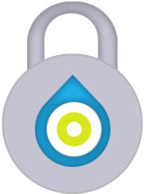
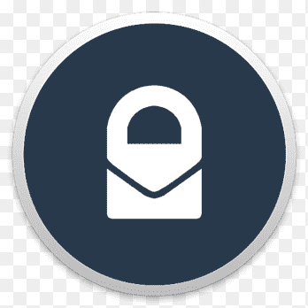
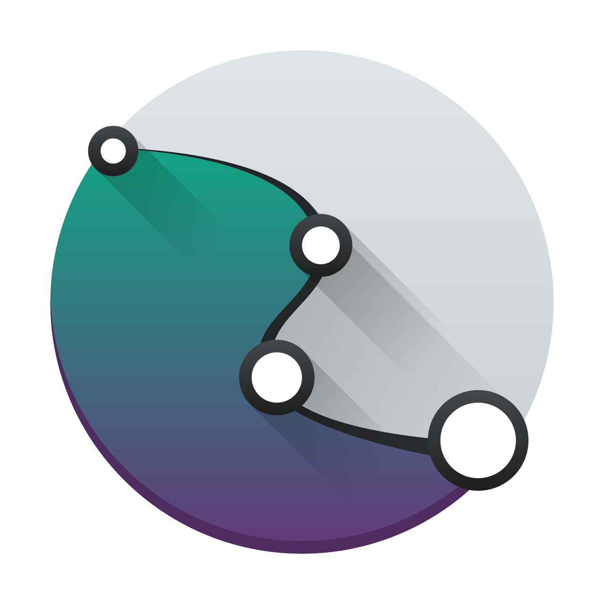

 data-protection-list
=============================================

Manuel de résistance au capitalisme de surveillance - Basé sur la [version de Valentin Delacour](https://codeberg.org/PrivacyFirst/PrivacyFirst/issues) - v2022.08.01

# Table des matières

* [0 Commentaires sur fork](#0-commentaires-sur-fork)
* [1 Introduction](#1-introduction)
* [2 Règles d’or](#2-règles-d’or)
* [3 Ordinateur](#3-ordinateur)
* [3-1 Systèmes d’exploitation](#3-1-systèmes-d’exploitation)
* [3-2 Services et programmes](#3-2-services-et-programmes)
* [4 Smartphone](#4-smartphone)
* [4-1 Systèmes d’exploitation](#4-1-systèmes-d’exploitation)
* [4-2 Applications](#4-2-applications)
* [5-Navigateurs](#5-navigateurs)
* [5-1 Extensions](#5-1-extensions)
* [5-2 Tor Browser](#5-2-tor-browser)
* [6 Instances de services](#6-instances-de-services)
* [6-1 Proxies](#6-1-proxies)
* [6-2 Visioconférence](#6-2-Visioconferénce)
* [6-3 Résolveurs DNS](#6-3-résolveurs-dns)
* [7 Ressources additionnelles (sources principales)](#7-ressources-additionnelles-sources-principales)
* [8 Configurations](#8-configurations)
* [8-1 Systèmes d'exploitation pour smartphones](#8-1-systemes-d-exploitation-pour-smartphones)
* [8-2 Systèmes d'exploitation pour ordinateurs](#8-2-systemes-d-exploitation-pour-ordinateurs)
* [8-3 Applications](#8-3-applications)
* [8-4 Services et programmes](#8-4-services-et-programmes)
* [8-5 Firefox et extensions](#8-5-firefox-et-extensions)

## 0 Commentaires sur fork

J'ai vu la nécessité de forger ce document de **Valentin Delacour** hébergé [ici](https://codeberg.org/PrivacyFirst/PrivacyFirst/issues) sous son approbation et sa licence pour lui donner plus de visibilité, lisibilité, confort, amélioration sous certains aspects et participation. Si quelqu'un d'autre bifurque à la fois le sien et celui-ci, il devrait faire de même.

Je pense que nous devrions partager combien plus, mieux c'est et les connaissances sur les bonnes pratiques à suivre en matière de sécurité, de confidentialité et d'open source qui sont détaillées ne font pas exception.

Nous sommes prêts à changer le format de ce document, pour l'instant j'ai pensé que c'était une bonne façon, mais cela pourrait être amélioré.

Je ne me considère pas comme un expert en la matière. En fait, je ne suis pas toutes les recommandations à la lettre. Mais j'aimerais avec le temps mettre de côté les services que je pense ne pas utiliser pour diverses raisons, changer les moyens d'accéder à certains contenus, utiliser d'autres stratégies, etc.

Pour participer activement, vous pouvez:

* [Créer des demandes d'extraction](https://github.com/adgellida/data-protection-list/pulls)
* [Générez vos questions ou incidents](https://github.com/adgellida/data-protection-list/issues)

Je vous recommande de participer à:

* [Official Telegram Group](https://t.me/privacidadlibre)

L'objectif du groupe est de promouvoir collectivement de bonnes habitudes en matière de confidentialité, de sécurité et également de programmes/applications open source/gratuits, de services et de systèmes d'exploitation pour résister à la collecte et à l'exploitation de données personnelles par des entreprises privées.

Je pense qu’ils profitent de l’ignorance de la majorité pour faire des choses qu’ils ne devraient pas et en tirer profit dans notre dos. La bonne chose est qu'il y a des gens qui le réalisent parce qu'ils comprennent le sujet et le partagent avec la communauté.

Ce document a été copié 1: 1 avec de très légères modifications dans la version 7/12/2020 et subira désormais des modifications suivant les stratégies suivantes:

* Suite aux mises à jour du fichier d'origine
* Extraire les demandes de la communauté
* Propres découvertes

Les améliorations les plus notables sont:

* Elle encourage une participation publique plus ordonnée et efficace.
* Images des applications pour mieux les identifier.
* Liens vers eux pour les trouver rapidement.

Maintenant, le document commence. Mettez votre ceinture, les courbes arrivent!

## 1 Introduction

Ce document a pour but principal de proposer des outils et alternatives pour protéger les données et la vie privée de la prédation des entreprises privées œuvrant dans le cadre du système actuel de capitalisme de surveillance. Toutefois, suivre les recommandations qui suivent permet également d’améliorer, dans une certaine mesure du moins, la protection contre d’autres entités intéressées par les données personnelles telles que des services d’États ou des pirates, par exemple.

Cette liste est destinée à toute personne consciente ou prenant conscience des enjeux de la protection des données dans notre société, indépendamment de ses connaissances du sujet. Elle ne se destine pas aux personnes nécessitant un anonymat total du fait de leur fonction à risques tels les opposants politiques ou certains journalistes, même si certaines options citées pourraient leur convenir. En effet, le respect de la vie privée n’équivaut pas nécessairement à l’anonymat.

Le format de liste a été choisi afin de rendre sa consultation la plus efficace possible. Cette approche empêchant de détailler de véritables explications, vous êtes donc invités à chercher celles qui vous sont nécessaires par vous-mêmes ou dans les ressources additionnelles mentionnées au point 7 du document. Ayant pour but de proposer les options les plus réputées et pratiques sans être encombrée, la liste n’a pas pour vocation d’être exhaustive et demeure subjective bien que visant la plus grande objectivité possible.

Afin de vous aider à choisir parmi les différentes options citées, cette liste propose une première hiérarchisation (ordre d’apparition et présence ou non de parenthèses) subjective basée sur le rapport confidentialité/facilité d’utilisation. Une deuxième hiérarchisation (couleurs) se base uniquement sur la confidentialité estimée:

🟢vert (véritable respect de la vie privée)

🔵bleu  (respect de la vie privée sous conditions ou présence d’éléments problématiques)

🔴rouge (ne protège ou ne respecte pas la vie privée mais demeure préférable aux options des MAGMA)

⚫incolore (dépendance de facteurs externes ou manque d’éléments pour former une estimation pertinente). La présence d’un astérisque indique que l’option mentionnée n’est pas encore arrivée à maturité.

J’espère que ce document vous servira pour améliorer la protection de vos données personnelles et de celles de vos proches. Bien qu’étant le fruit de plusieurs années de recherches et d’expériences, ce travail demeure bien évidemment perfectible. Toute suggestion ou remarque est donc plus que bienvenue à l’adresse mail suivante: "privacyfirst@ik.me". Plusieurs mois après la présente version du document, certaines informations données seront obsolètes. Le document étant fréquemment actualisé, vous êtes invités à vous procurer la dernière version sur la page web: "https://codeberg.org/PrivacyFirst/Data_Protection/issues".

## 2 Règles d’or

* Toujours éviter d’utiliser les services et programmes des MAGMA (Meta, Amazon, Google, Microsoft et Apple) de même que chinois lorsque c’est possible. Il est recommandé de supprimer vos éventuels comptes.
* Toujours vérifier tous les paramètres et autorisations de ce que l’on utilise et les optimiser afin de limiter au maximum la collecte de données personnelles.
* Installer uniquement les programmes/applications nécessaires, ce sont autant d’accès potentiels à vos données personnelles.
* Utiliser des programmes libres/open source (leurs codes sont publics et donc vérifiables) au lieu des propriétaires/closed source à chaque fois que c’est possible.
* Privilégier les options libres populaires à celles méconnues (elles seront davantage vérifiées/fiables).
* Si une entreprise propose ses services gratuitement, en général, le produit qu’elle vend c’est vous (vos données personnelles). À cause du modèle dicté par le capitalisme de surveillance, payer ne vous protège même plus d’être également le produit.
* Mettre à jour ses programmes/systèmes d’exploitation régulièrement pour profiter des correctifs de failles de sécurité exploitables et penser à remplacer ceux qui ne paraissent plus être mis à jour.
* Ne pas utiliser d’antivirus de tiers qui sont de véritables aspirateurs à données personnelles. Leur apport est négligeable lorsqu’on maintient de bonnes habitudes numériques. La prudence et une bonne configuration sont les meilleurs antivirus).
* Privilégier les Web Apps, ou raccourcis depuis le navigateur, pour accéder aux services désirés au lieu d’applications à installer pour limiter l’accès et donc les possibilités de collecte de données personnelles.
* Utiliser une adresse de courriel temporaire pour créer un compte pour les sites/services peu importants.
* Toujours désactiver le Wi-Fi, le Bluetooth et la géolocalisation de son smartphone lorqu’ils ne sont pas utilisés et ne pas se connecter aux Wi-Fi publics sans VPN.
* Ne pas utiliser d’objets connectés (leur but est de récolter un maximum de données personnelles) ou ne pas les connecter à internet lorsqu’ils sont indispensables.

## 3 Ordinateur

### 3-1 Systèmes d’exploitation

Windows est actuellement le pire système d’exploitation en termes de confidentialité. Les seuls OS faciles d’utilisation qui, au contraire de macOS, respectent véritablement la vie privée sont des distributions libres GNU/Linux. Il en existe une multitude dont les caractéristiques varient grandement. Voici une petite sélection de celles proposant la meilleure expérience pour l’utilisateur (toujours en respectant la vie privée) ou garantissant la meilleure protection des données.
Chaque distribution propose une ou plusieurs interfaces (environnements de bureau) différentes en termes d’expérience utilisateur et de consommation de ressources. Pour des raisons de sécurité, privilégiez un qui supporte Wayland, tel que Gnome ou Plasma. Il existe une documentation abondante en ligne afin d’identifier quelle distribution et quel environnement de bureau conviendront le mieux aux capacités de votre ordinateur et à vos préférences ainsi que pour savoir comment l’installer facilement.

**Desktop :**

🟢[Fedora Workstation](https://getfedora.org/es/workstation) : Standards sécurisés et modernes (convient aux débutants)

🟢[Linux Mint](https://linuxmint.com) : idéale pour les débutants et grande stabilité

🟢[MX Linux](https://mxlinux.org) :  très stable et basse consommation (convient aux débutants)

🟢[Zorin OS](https://zorin.com/os) : idéale pour les débutants habitués à Windows ou macOS

🟢[Parrot Home OS](https://www.parrotsec.org) : option d’anonymat global par Tor (basse consommation de ressources)

🟢[Fedora Silverblue](https://silverblue.fedoraproject.org) : haute sécurité et standards modernes (centré sur Flatpak)

🟢[Qubes OS](https://www.qubes-os.org) : sécurité extrême pour utilisateurs avancés (haute consommation)

🟢[Whonix](https://www.whonix.org) : anonymat global par Tor et sécurité extrême (utiliser dans KVM/VirtualBox)

**USB live (RAM) :**

🟢[MX Linux](https://mxlinux.org) :  très stable et basse consommation (convient aux débutants)

🟢[Tails](https://tails.boum.org) : anonymat global par Tor et ne laisse pas de traces sur l’équipement

**Raspberry Pi :**

🟢[LibreELEC](https://libreelec.tv) : centre multimédia pour TV

🟢[Batocera](https://batocera.org) : émulateur de consoles, retrogaming et centre multimédia pour TV (Kodi)

🟢[Raspberry Pi OS](https://www.raspberrypi.org/software) : système d’exploitation classique

🟢[Plasma BigScreen*](https://plasma-bigscreen.org) : centre multimédia pour TV (commande vocale avec Mycroft AI)

🟢[Nymphcast*](http://nyanko.ws/product_nymphcast.php) : alternative gratuite et écologique au Chromecast

**Hardware :**

Les marques suivantes vendent des ordinateurs avec Linux préinstallé :

Slimbook

Librem

TUXEDO Computers

Laptop with Linux

Juno Computers

Dell (quelques modèles)

Vant

PINE64

System 76

Entroware

Vikings

ThinkPenguin

Il existe également d’autres vendeurs d’ordinateurs avec Linux préinstallé moins connus. Quant aux fabricants d’ordinateurs avec Windows préinstallé, les modèles de Dell, Asus, Lenovo et HP sont réputés pour offrir une bonne compatibilité avec Linux.
Il est recommandé d’éviter d’acheter des ordinateurs avec une carte graphique Nvidia dans la mesure où ils sont connus pour souffrir de problèmes de compatibilité.

### 3-2 Services et programmes

Navigateur :

🔵[Firefox](https://www.mozilla.org)

🟢[LibreWolf*](https://librewolf-community.gitlab.io)

🟢[Tor Browser](https://www.torproject.org/download)

🔵[Brave](https://brave.com)

🔴[Ungoogled Chromium*](https://ungoogled-software.github.io/ungoogled-chromium-binaries/)

Moteur de recherche :

🔵[SearXNG](https://docs.searxng.org)

🔵[Brave Search](https://search.brave.com/)

🔴[DuckDuckGo](https://duckduckgo.com)

🔴[Qwant](https://www.qwant.com)

🔴[Swisscows](https://swisscows.com)

🔵[Mojeek](https://www.mojeek.com)

🔴[Startpage](https://www.startpage.com) (proxy Google)

Messagerie instantanée :

🟢[Threema](https://threema.ch/en)

🔵[Signal](https://signal.org)

🟢[Session*](https://getsession.org)

🟢[Jami](https://jami.net)

🔵[Element](https://app.element.io)

🔴[Telegram](https://telegram.org)

🟢[Cwtch](https://cwtch.im/)

🟢[Briar Desktop](https://briarproject.org/download-briar-desktop/)

Visioconférence :

🔵[Jitsi Meet](https://meet.jit.si)

🟢[Jami](https://jami.net)

🔵[Signal](https://signal.org)

🔵[BigBlueButton](https://bigbluebutton.org)

🔵[Element](https://app.element.io)

🔴[Telegram](https://telegram.org)

🔵[Whereby](https://whereby.com)

Courriel :

⚫[ProtonMail](https://protonmail.com)

⚫[Tutanota](https://tutanota.com) ⚫gratuito 🔴de pago

⚫[mailbox.org](https://mailbox.org)

🔴[Disroot](https://disroot.org/en/services/email)

Gestionnaire d'alias de messagerie :

🟢[SimpleLogin](https://simplelogin.io/)

🟢[forwardemail.net](https://forwardemail.net)

# Plateformes et services :

Plateforme vidéo :

🔵[Odysee - LBRY web](https://odysee.com)

🔵[LBRY - desktop](https://lbry.com)

🟢[PeerTube](https://joinpeertube.org)

Youtube :

🔵[Invidious](https://invidio.us)

🔵[Piped](https://piped.kavin.rocks/)

🔴[FreeTube](https://freetubeapp.io)

Traduction :

🔵[DeepL](https://www.deepl.com/translator) 🔴gratuito 🔵de pago

🔵[LibreTranslate](https://libretranslate.com)

⚫[Simplytranslate](https://simplytranslate.org)

🔵[Apertium](https://www.apertium.org)

🟢[Firefox Translations(extension)](https://www.apertium.org)

🔴[DuckDuckGo](https://duckduckgo.com) (proxy Microsoft)

🔴[Lingva Translate](https://lingva.ml) (proxy Google)

Cartes :

🟢[OpenStreetMap](https://www.openstreetmap.org)

🔵[Qwant Maps](https://www.qwant.com/map)

🔴[DuckDuckGo](https://duckduckgo.com)

🟢[Maps(Gnome)](https://wiki.gnome.org/Apps/Maps)

🟢[Marble(KDE)](https://marble.kde.org)

Réseau social respectueux :

🔵[Mastodon](https://mastodon.social)

🔵[Element](https://app.element.io)

🔴[Telegram*](https://telegram.org)

🔵[PixelFed](https://pixelfed.org)

🔵[Lemmy](https://join.lemmy.ml)

🔵[Pleroma](https://pleroma.social/)

🔵[movim](https://movim.eu)

🔵[Friendica](https://friendi.ca)

Proxy de réseau social abusif :

🔵[Nitter](https://nitter.net) (Twitter)

🔵[Libreddit](https://libredd.it/) (Reddit)

🔵[Bibliogram](https://bibliogram.art) (Instagram)

🔵[ProxiTok](https://proxitok.herokuapp.com) (TikTok)

Proxy Wikipedia :

🟢[Wikiless](https://wikiless.org)

Films et séries en ligne :

🔴[Stremio](https://www.stremio.com) 🔵sin cuenta 🔴con cuenta

🟢[Kodi](https://kodi.tv)

Plateforme d’apprentissage :

🟢[Moodle](https://moodle.org)

🟢[ILIAS](https://www.ilias.de/en)

🔵[Canvas](https://learn.canvas.net/login/canvas)

Écosystème tout-en-un :

🔵Proton

🔴Infomaniak(sin ZKE)

# Confidentialité :

Bloqueur de publicité, pisteurs et connexions non souhaitées :

🟢[Portmaster*](https://safing.io/portmaster)

VPN :

🔵[Mullvad](https://mullvad.net)

🔵[ProtonVPN](https://protonvpn.com)

🔵[IVPN](https://www.ivpn.net)

Courriel temporaire :

⚫[Temp Mail](https://temp-mail.org)

⚫[Guerrillamail](https://guerrillamail.com)

⚫[EmailOnDeck](https://www.emailondeck.com)

Outil de chiffrement :

🟢[Picocrypt](https://github.com/HACKERALERT/Picocrypt)

🟢[VeraCrypt](https://www.veracrypt.fr)

🟢[Cryptomator](https://cryptomator.org)

🟢[PeaZip](https://peazip.github.io/)

Suppression de métadonnées :

🟢[Metadata Cleaner](https://www.metacleaner.com)

🟢[ExifCleaner](https://exifcleaner.com)

Floutage ou résistance à la reconnaissance faciale :

🟢[PrivacyBlur](https://privacyblur.app/)

🟢[Fawkes(SANDLab)](https://exifcleaner.com)

Moniteur de trafic réseau :

🟢[Safing Portmaster](https://safing.io/portmaster)

🟢[Wireshark](https://www.wireshark.org)

# Sécurité :

Gestionnaire de mots de passe :

🟢[KeePassXC](https://keepassxc.org)

🔵[Bitwarden](https://bitwarden.com)

Antivirus (ClamAV) :

🟢ClamTK (Linux)

🟢ClamWin (Windows)

Convertisseur de fichiers potentiellement dangereux:

⚫[Dangerzone](https://dangerzone.rocks)

Gestionnaire de permissions pour Flatpak :

🟢[Flatseal](https://github.com/tchx84/Flatseal)

# Productivité :

Agenda :

🟢[Tutanota](https://f-droid.org/es/packages/de.tutao.tutanota)

🟢[ProtonCalendar*](https://protonmail.com)

Bureautique :

🟢[LibreOffice](https://www.libreoffice.org)

🟢[Onlyoffice](https://www.onlyoffice.com)

🟢[Collabora Office - LibreOffice prof.](https://www.collaboraoffice.com)

🟢[Calligra](https://calligra.org)

🟢[CryptPad](https://cryptpad.fr)

Notes :

🟢[Standard Notes](https://standardnotes.org)

🟢[Joplin](https://joplinapp.org)

🟢[Knotes](http://knotesapp.com)

🟢[Gnote](https://wiki.gnome.org/Apps/Gnote)

Lecteur PDF :

🟢Sumatra PDF

🟢Okular(KDE)

🟢Evince(Gnome)

Collaboration et organisation :

🟢[CryptPad](https://cryptpad.fr)

🟢Collabora(profesional)

🟢Skiff

🟢[Mobilizon](https://mobilizon.org/en/)

# Gestion de fichiers et données :

Partage de fichiers :

🟢[Disroot](https://upload.disroot.org)

🟢[OnionShare](https://onionshare.org)

🟢[Syncthing](https://syncthing.net)

🔵[Tresorit Send](https://tresorit.com/)

🔴[Swiss Transfer](https://swisstransfer.com)

Cloud :

🔵[Kdrive](https://www.infomaniak.com/es/kdrive)

🔵[Kdrive](https://www.https://mega.nz)

🟢[Nextcloud](https://nextcloud.com)

🔴[Cozy Cloud](https://cozy.io)

[Kdrive](https://icedrive.net) 🔴gratuito 🔵pago

🔴[Disroot](https://cloud.disroot.org)

Outil de copie de sauvegarde :

🟢Déjà Dup(local)

🟢[Syncthing](https://syncthing.net)

Outil de synchronisation :

🟢[Syncthing](https://syncthing.net)

Streaming de multimédia (auto-hébergé) :

🟢Jellyfin

🟢Subsonic

Connexion entre ordinateur et smartphone :

🟢GSConnect

🟢KDE Connect

🟢Zorin Connect

# Programmes multimédia :

Lecteur de musique :

🟢Music(Gnome)

🟢[Elisa](https://elisa.kde.org)

🔵Lollipop(Gnome)

🟢Rhythmbox

🟢[Audacious](https://audacious-media-player.org)

🟢[Strawberry Music Player](https://www.strawberrymusicplayer.org)

Lecteur multimédia :

🟢[mpv](https://mpv.io)

🟢[VLC](https://www.videolan.org)

🟢Kodi

Édition/retouche d’images et dessin :

🟢[Gimp](http://www.gimp.org)

🟢[Krita](https://krita.org)

🟢[Drawing(Gnome)](https://maoschanz.github.io/drawing)

🟢KolourPaint(KDE)

Traitement de photos :

🟢[Darktable](https://www.darktable.org)

🟢[RawTherapee](https://rawtherapee.com)

Dessin vectoriel :

🟢[Inkscape](https://inkscape.org)

🟢[Karbon](https://calligra.org/karbon)

Mise en page, édition (PAO) :

🟢[Scribus](https://www.scribus.net)

Édition audio :

🔵[Audacity](https://www.audacityteam.org)

🟢[Ardour](https://www.ardour.org)

🟢[LMMS](https://www.lmms.io)

Édition vidéo :

🟢[Kdenlive](https://kdenlive.org)

🟢[Pitivi](http://www.pitivi.org)

🟢[OpenShot](https://www.openshot.org)

🟢Blender

🟢[Avidemux](https://www.avidemux.org)

🟢Shotcut

Graveur de CD/DVD :

🟢[Brasero](https://wiki.gnome.org/Apps/Brasero)

🟢[k3b](https://apps.kde.org/k3b)

Transcodage :

🟢[Handbrake](https://handbrake.fr)

🟢[MKV](https://www.matroska.org/index.html)

# Divers :

Programmes/jeux Windows avec Linux :

⚫[PlayOnLinux](https://www.playonlinux.com)

⚫[Wine](https://www.winehq.org)

⚫[WinApps*](https://github.com/Fmstrat/winapps)

Nettoyage et optimisation de système  :

🟢[Stacer](https://oguzhaninan.github.io/Stacer-Web)

🟢[ubunsys](https://github.com/adgellida/ubunsys)

🟢[BleachBit](https://www.bleachbit.org)

Radio internet :

🟢[Shortwave(Gnome)](https://apps.gnome.org/app/de.haeckerfelix.Shortwave)

🟢[Radiotray-NG](http://radiotray.sourceforge.net)

🟢[Elisa(KDE)](https://elisa.kde.org)

🔵[Lollypop(Gnome)](https://wiki.gnome.org/Apps/Lollypop)

Lecteur de flux RSS :

🟢[Fluent Reader](https://hyliu.me/fluent-reader)

🟢[Akregator(KDE)](https://apps.kde.org/es/akregator/)

🟢[Feeds(Gnome)](https://gfeeds.gabmus.org)

🟢[RSS Guard](https://github.com/martinrotter/rssguard)

Émulateur de système d’exploitation (virtualisation) :

🟢[KVM](https://www.linux-kvm.org/page/Main_Page)

🟢[VirtualBox](https://www.virtualbox.org/)

🟢[Boxes(Gnome)](https://wiki.gnome.org/Apps/Boxes)

## 4 Smartphone

### 4-1 Systèmes d’exploitation

Android, dans sa configuration par défaut, est le pire système d’exploitation quant au respect de la vie privée. Son but est d’envoyer en permanence les données personnelles de ses utilisateurs aux serveurs Google afin de les exploiter et les revendre. La solution la plus recommandable actuellement est d’utiliser une version d’Android modifiée (custom ROM) pour respecter la vie privée.

Si vous ne souhaitez pas installer ou acheter un smartphone avec un OS respectueux (grave erreur) et que vous choisissez malgré tout d’utiliser Android d’origine, suivez les quelques conseils détaillés au point 8.1 de ce document afin limiter au maximum la collecte de données personnelles.

Le système d’exploitation d’Apple (iOS), malgré son marketing basé sur le respect de la vie privée, collecte et exploite également les données personnelles de ses utilisateurs en plus de limiter considérablement leur liberté.

Les options basées sur Linux sont respectueuses de la vie privée et prometteuses en termes d’indépendance mais n’offrent pas les mêmes garanties en termes de sécurité qu’Android. De plus, dans leur état de développement actuel, elles ne sont pas recommandables pour des utilisateurs moyens (à l’exception de Sailfish OS).

**Android modifié pour la vie privée :**

🟢[GrapheneOS](https://grapheneos.org) : l’Android dégooglisé le plus sécurisé et confidentiel disponible

🔵[DivestOS](https://divestos.org/) : LineageOS dégooglisé et en partie amélioré pour la sécurité et la vie privée

🔵[CalyxOS](https://calyxos.org) : Android partiellement dégooglisé mais avec microG (compatibilité)

🔵[/e/ OS](https://e.foundation) : LineageOS partiellement dégooglisé avec microG et services cloud

🔵[Volla OS](https://volla.online): LineageOS dégooglisé (bootloader verrouillé)

🔴[LineageOS for microG](https://lineage.microg.org) : LineageOS avec microG pour une meilleure compatibilité

🔴[LineageOS](https://lineageos.org) : Android sans Gapps mais pas dégooglisé (bootloader déverrouillé)

**Hardware préinstallé :**

🔵[Volla Phone](https://volla.online) : Volla OS (ou Ubuntu Touch)

🔵[Fairphone 4](https://www.fairphone.com) : /e/OS avec bootloader verrouillé, seulement disponible sur (https://murena.com))

🔴Teracube 2e : /e/OS, bootloader déverrouillé, seulement disponible sur (https://murena.com))

🔴[Pinephone Pro](https://www.pine64.org/pinephone) : Manjaro et autres OS Linux compatibles

Autres appareils avec /e/OS et le bootloader déverrouillé disponibles sur (https://murena.com)

### 4-2 Applications

Les applications proposées pour Android et dérivés doivent en premier lieu être cherchées dans le magasin d’applications libres Neo Store (F-Droid), garantie qu’aucun pisteur tiers n’est présent, et seulement si elles ne s’y trouvent pas, sur Aurora Store, un client respectueux de Google Play qui permet d’avoir accès à ses applications gratuites de manière anonyme. Se référer au point 8.3 pour toutes les explications nécessaires.

**Android et dérivés :**

# Navigation et communication :

Navigateur :

🟢[mull](https://github.com/Divested-Mobile/mull)

🟢[Tor Browser](https://www.torproject.org/es/download/#android)

🔵[Bromite](https://www.bromite.org/fdroid)

🔵[FOSS Browser](https://f-droid.org/es/packages/de.baumann.browser)

Messagerie instantanée :

🟢[Threema](https://threema.ch/en)

🔵[Molly(Signal)](https://molly.im)

🟢[Session F-Droid](https://getsession.org)

🟢[Jami](https://jami.net)

🔵[Element](https://app.element.io)

🔴[Telegram FOSS](https://f-droid.org/packages/org.telegram.messenger/)

🟢[Cwtch](https://cwtch.im)

🟢[Briar](https://briarproject.org)

Visioconférence :

🔵[Jitsi Meet](https://meet.jit.si)

🔵[Molly(Signal)](https://molly.im)

🟢[Jami](https://jami.net)

🔵[Element](https://app.element.io)

🔴[Telegram FOSS](https://f-droid.org/packages/org.telegram.messenger)

Client courriel :

⚫[ProtonMail](https://protonmail.com)

🔵[Tutanota](https://f-droid.org/es/packages/de.tutao.tutanota)

⚫[FairEmail](https://email.faircode.eu)

⚫[K-9 Mail](https://f-droid.org/es/packages/com.fsck.k9)

Gestionnaire d’alias pour courriel :

🟢[Simple Login](https://simplelogin.io)

🟢[AnonAddy](https://anonaddy.com/)

# Plateformes et services  :

Plateforme vidéo :

🔵LibreTube(proxy YouTube)

🔴[Newpipe](https://newpipe.schabi.org) (🔴cliente Youtube 🟢PeerTube)

🔵Librarian web app(proxy Odysee)

Cartes/navigation GPS :

🟢Organic Maps

🟢[OsmAnd+](https://f-droid.org/es/packages/net.osmand.plus/)

🔵[Magic Earth](https://www.magicearth.com)

Traduction :

🟢LibreTranslator

🔴DeepL(no oficial)

🔴SimplyTranslate Mobile(proxy Google)

Réseau social respectueux :

🔵[Tusky](https://f-droid.org/en/packages/com.keylesspalace.tusky) (Mastodon)

🔵[Telegram FOSS](https://f-droid.org/packages/org.telegram.messenger)

🔵[Element](https://f-droid.org/es/packages/im.vector.app) (Matrix)

🔵[Fedilab](https://f-droid.org/en/packages/fr.gouv.etalab.mastodon) Mastodon, Pleroma...),

🔵PixelDroid (PixelFed)

🔵[Lemmur (Lemmy)](https://lemmy.ml)

Réseau social abusif :

⚫Fritter(Twitter sin cuenta)

⚫[Twidere(Twitter)](https://f-droid.org/es/packages/org.mariotaku.twidere)

⚫[Frost(Facebook)](https://f-droid.org/es/packages/com.pitchedapps.frost)

⚫Infinity for Reddit

⚫Twire(Twitch)

⚫Navegador internet

Films et séries en ligne :

🟢CloudStream

🟢[Kodi](https://f-droid.org/es/packages/org.xbmc.kodi)

# Confidentialité :

Bloqueur de publicité/pisteurs :

🟢[RethinkDNS](https://play.google.com/store/apps/details?id=com.celzero.bravedns&hl=es&gl=US)

🟢DoT de Android

🟢TrackerControl

Redirecteur et nettoyeur de liens (abusif => respectueux) :

🟢[UntrackMe](https://f-droid.org/en/packages/app.fedilab.nitterizeme)

Contrôleur de trafic réseau (pare-feu) :

🟢[RethinkDNS](https://play.google.com/store/apps/details?id=com.celzero.bravedns&hl=es&gl=US)

🟢[InviZible Pro](https://f-droid.org/en/packages/pan.alexander.tordnscrypt.stable)

🟢[NetGuard](https://f-droid.org/es/packages/eu.faircode.netguard)

Révélateur de pisteurs tiers :

🟢[ClassyShark3xodus](https://f-droid.org/es/packages/com.oF2pks.classyshark3xodus)

🟢[Exodus privacy](https://f-droid.org/en/packages/org.eu.exodus_privacy.exodusprivacy)

Anonymisation réseau par Tor :

🟢[Orbot Proxy](https://play.google.com/store/apps/details?id=org.torproject.android&hl=es&gl=US)

🟢[InviZible Pro](https://f-droid.org/en/packages/pan.alexander.tordnscrypt.stable)

VPN :

🔵[Mullvad](https://mullvad.net)

🟢[ProtonVPN](https://protonvpn.com)

🟢[IVPN](https://www.ivpn.net)

🔴[Riseup VPN](https://riseup.net/es/vpn)

🔴[Calyx VPN](https://calyx.net/)

Suppression de métadonnées et floutage :

🟢ExifEraser

🟢[Scrambled Exif](https://f-droid.org/es/packages/com.jarsilio.android.scrambledeggsif)

🟢PrivacyBlur

Isolateur d’applications :

🟢diferente perfil usuario de Android(

🔵[Insular](https://f-droid.org/en/packages/com.oasisfeng.island.fdroid)

🔵[Shelter](https://f-droid.org/en/packages/net.typeblog.shelter)

Bloqueur (ou moniteur) de microphone :

🟢PilferShush Jammer

🟢Vigilante

Remplacement de Google Services :

🔴[MicroG GmsCore](https://microg.org)

🔴GmsCore

# Sécurité :

Gestionnaire de mots de passe :

🟢[KeePassDX](https://f-droid.org/es/packages/com.kunzisoft.keepass.libre)

🔵[Bitwarden](https://bitwarden.com)

🟢AuthPass(KeePass)

Authentification à deux facteurs :

🟢[Aegis](https://f-droid.org/es/packages/com.beemdevelopment.aegis)

🟢[KeePassDX](https://f-droid.org/es/packages/com.kunzisoft.keepass.libre)

Détecteur de malware :

🟢Hypatia(ClamAV)

# Remplacement d’applications système pour Android d’origine :

Clavier :

🟢[FlorisBoard*](https://github.com/florisboard/florisboard)

🟢[OpenBoard](https://f-droid.org/es/packages/org.dslul.openboard.inputmethod.latin)

Agenda :

🟢Proton Calendar

🟢[Simple Calendar](https://f-droid.org/es/packages/com.simplemobiletools.calendar.pro)

🟢[Tutanota](https://f-droid.org/es/packages/de.tutao.tutanota)

🟢Proton Calendar*

🟢[Etar](https://f-droid.org/es/packages/ws.xsoh.etar)

Caméra :

🟢Secure Camera

🟢[Open Camera](https://f-droid.org/es/packages/net.sourceforge.opencamera)

Galerie :

🟢[Simple Gallery](https://f-droid.org/es/packages/com.simplemobiletools.gallery.pro)

Gestionnaire de fichiers :

🟢[Simple File Manager](https://f-droid.org/es/packages/com.simplemobiletools.filemanager.pro)

🟢Material Files

🟢Ghost Commander

Notes :

🟢[Joplin](https://play.google.com/store/apps/details?id=net.cozic.joplin&utm_source=GitHub&utm_campaign=README&pcampaignid=MKT-Other-global-all-co-prtnr-py-PartBadge-Mar2515-1)

🟢SilentNotes

🟢Noto

🟢jtx Board

🔵[Standard Notes](https://play.google.com/store/apps/details?id=com.standardnotes)

🟢Orgzly

🟢[Nextcloud Notes](https://f-droid.org/es/packages/it.niedermann.owncloud.notes)

SMS :

⚫[Simple SMS Messenger](https://f-droid.org/en/packages/com.simplemobiletools.smsmessenger/)

⚫[Signal](https://signal.org)

Météo :

🟢Geometric Weather

🟢Weather

🟢Clima

Lecteur audio :

🟢Metro

🟢[Music Player GO](https://f-droid.org/es/packages/com.iven.musicplayergo)

🟢Auxio

Lecteur PDF :

🟢Secure PDF Viewer

🟢[MuPDF Viewer](https://f-droid.org/es/packages/com.artifex.mupdf.viewer.app)

Contacts :

🟢[Simple Contacts Pro](https://f-droid.org/es/packages/com.simplemobiletools.contacts.pro)

🟢[Open Contacts](https://f-droid.org/es/packages/opencontacts.open.com.opencontacts)

Enregistreur audio :

🟢[Audio Recorder](https://f-droid.org/es/packages/com.github.axet.audiorecorder)

🟢[Simple Voice Recorder](https://f-droid.org/es/packages/com.simplemobiletools.voicerecorder)

Gestionnaire d’appels téléphoniques : 

⚫[Simple Dialer](https://f-droid.org/es/packages/com.simplemobiletools.dialer)

Calculatrice :

🟢[Simple Calculator](https://f-droid.org/en/packages/com.simplemobiletools.calculator)

🟢OpenCalc

Horloge :

🟢[Simple Clock](https://f-droid.org/en/packages/com.simplemobiletools.clock)

Lecteur multimédia :

🟢[VLC](https://f-droid.org/es/packages/org.videolan.vlc/)

🟢[Kodi](https://f-droid.org/es/packages/org.xbmc.kodi)

# Gestion de fichiers et données :

Outil de synchronisation :

🟢[Syncthing](https://f-droid.org/en/packages/com.nutomic.syncthingandroid)

⚫DAVx5(servidor elegido).

Partage de fichiers :

🟢[Syncthing](https://f-droid.org/en/packages/com.nutomic.syncthingandroid)

🟢Warpinator(local)

🟢Sharik(local)

Cloud :

🔵Filen

🟢[Nextcloud](https://nextcloud.com)

🔴[Kdrive(sin ZKE)](https://www.infomaniak.com/es/kdrive)

Outil de chiffrement pour cloud :

🟢[Cryptomator](https://cryptomator.org)

Connexion entre smartphone et ordinateur :

🟢KDE Connect

🟢Zorin Connect

# Divers :

Creador de WebApps :

🟢Mull

🔵Bromite

Scanner de QR codes :

⚫Secure Camera

⚫QR & Barcode Scanner

⚫QR Scanner

Bureautique :

🟢[Collabora Office - LibreOffice prof.](https://www.collaboraoffice.com)

🟢LibreOffice

Lecteur de flux RSS :

🟢Feeder

🟢Read You

🟢News

🟢Handy News Reader

Gestionnaire de podcasts :

🟢AntennaPod

🟢News

Radio internet :

🟢Transistor – Simple Radio App

Streaming de musique : 

🟢Finamp(Jellyfin)

🟢Subtracks(Subsonic)

🔴Musify(YouTube)

Lecteur de livres électroniques :

🟢Librera Reader

🟢KOReader

Interface respectueuse pour appareils connectés :

⚫Gadgetbridge

Finances :

🟢Unstoppable Wallet

🟢MoneyBuster

🟢Sushi – Personal Finance

Santé et sport :

🟢OpenFoodFacts

🟢Feeel – home workouts

🟢FitoTracker

🟢openScale

Launcher :

🟢Simple App Launcher

🟢Discreet Launcher

🔵Neo Launcher

### IOS :

Navigateur (basé sur Safari) :

⚫[Brave](https://apps.apple.com/us/app/brave-private-web-browser-vpn/id1052879175)

⚫Firefox Focus

⚫[Onion Browser](https://apps.apple.com/us/app/onion-browser/id519296448)

Messagerie instantanée :

🟢[Threema](https://apps.apple.com/us/app/threema-the-secure-messenger/id578665578)

🔵[Signal](https://apps.apple.com/us/app/signal-mensajer%C3%ADa-privada/id874139669)

🟢[Session](https://apps.apple.com/us/app/session-private-messenger/id1470168868)

🟢[Jami](https://apps.apple.com/us/app/jami/id1306951055)

🔵[Element](https://app.element.io)

🔴[Telegram](https://apps.apple.com/us/app/telegram-messenger/id686449807)

Visioconférence :

🔵[Signal](https://apps.apple.com/us/app/signal-mensajer%C3%ADa-privada/id874139669)

🟢[Jami](https://apps.apple.com/us/app/jami/id1306951055)

🔵[Element](https://app.element.io)

🔴[Jitsi Meet](https://apps.apple.com/us/app/jitsi-meet/id1165103905)

🔴[Telegram](https://apps.apple.com/us/app/telegram-messenger/id686449807)

Client courriel : 

🔵[Tutanota](https://apps.apple.com/us/app/tutanota/id922429609)

🔵[ProtonMail](https://apps.apple.com/us/app/protonmail-correo-cifrado/id979659905)

Gestionnaire d’alias pour courriel :

🟢[Simple Login](https://apps.apple.com/us/app/simplelogin-anti-spam/id1494359858)

Plateforme vidéo :

🔵Piped web app(proxy YouTube)

🔵[Librarian web app(proxy Odysee)](https://odysee.com)

Cartes/navigation GPS :

🟢Organic Maps

🔵OsmAnd

🔵Magic Earth

Réseau social respectueux :

🔵Mastodon for iPhone

🔵Element(Matrix)

🔴[Telegram](https://apps.apple.com/us/app/telegram-messenger/id686449807)

Réseau social abusif :

⚫Navegador internet

Bloqueur de publicité/pisteurs :

🟢[DNSCloak](https://apps.apple.com/us/app/dnscloak-secure-dns-client/id1452162351)

🟢DNS de iOS(ajustes Wi-Fi)

Anonymisation réseau par Tor :

🟢Orbot

VPN:

🔵Mullvad VPN

🔵ProtonVPN

🔵IVPN

Gestionnaire de mots de passe :

⚫[Strongbox(KeePass)](https://apps.apple.com/es/app/strongbox-keepass-pwsafe/id897283731) - KeePass & PwSafe

🔵[Bitwarden](https://apps.apple.com/us/app/bitwarden-gestor-de-contrase/id1137397744)

Authentification à deux facteurs :

⚫[Tofu Authenticator](https://apps.apple.com/us/app/tofu-authenticator/id1082229305)

⚫Raivo OTP

Cloud :

🟢ente Photos

🔵Filen, Nextcloud(auto alojado), (kDrive(sin ZKE))

🟢[Nextcloud(autoalojado)](https://nextcloud.com)

🔵[Kdrive(sin KZE)](https://www.infomaniak.com/es/kdrive)

Outil de chiffrement pour cloud :

🟢[Cryptomator](https://apps.apple.com/us/app/cryptomator/id953086535)

Bureautique :

🟢Collabora Office(LibreOffice)

## 5 Navigateurs

La compartimentation (utiliser différents navigateurs, avec différentes configurations, selon les tâches) est une méthode recommandée pour préserver la vie privée sans trop sacrifier le confort de navigation.

À titre d’exemple, il s’agirait d’utiliser Firefox avec une configuration restrictive (cf. 8.5) pour la navigation générale. Ensuite, utiliser LibreWolf, ou un autre profil du même Firefox configuré de manière moins restrictive, pour les sites ne s’affichant pas correctement ou nécessitant une connexion à un compte personnel et un autre navigateur
pour la consultation des sites les plus récalcitrants à la protection de la vie privée (Brave ou Ungoogled Chromium dans leurs configurations par défaut sont idéaux pour ce cas de figure). On peut également imaginer un autre navigateur uniquement dédié à l’e-banking ou encore Tor Browser pour la navigation anonyme.

### 5-1 Extensions

Les extensions sont des compléments servant à ajouter des fonctions au navigateur. Il est recommandé d’en installer le moins possible et uniquement celles de confiance dans la mesure où elles peuvent avoir accès à l’intégralité de votre navigation et que leur utilisation peut être identifiée par les sites consultés et servir à vous pister (finger-
printing). Certaines de ces extensions sont uniquement disponibles pour Firefox et ses dérivés tels que Librewolf ou Mull. Leurs configurations sont détaillées au point 8.5.

Extensions recommandées :

uBlock Origin - [Chrome](https://chrome.google.com/webstore/detail/ublock-origin/cjpalhdlnbpafiamejdnhcphjbkeiagm) - [Firefox](https://addons.mozilla.org/es/firefox/addon/ublock-origin)

LocalCDN

LibRedirect

KeePassXC

Bitwarden (en caso de uso)

CanvasBlocker - [Chrome](https://chrome.google.com/webstore/detail/canvas-blocker-fingerprin/nomnklagbgmgghhjidfhnoelnjfndfpd) - [Firefox](https://addons.mozilla.org/es/firefox/addon/canvasblocker)

### 5-2 Tor Browser

Le concept de Tor est de faire passer le trafic internet par un réseau l’anonymisant.
Dans le but que l’empreinte (fingerprint) de votre navigateur (donnée entre autres par sa configuration) ne trahisse pas votre identité par sa singularité, les navigateurs Tor sont conçus pour avoir la même empreinte indépendamment des utilisateurs. Pour éviter de rendre l’empreinte de votre navigateur Tor unique, il est déconseillé d’installer des extensions ou de faire des modifications dans les paramètres "about:config". Si vous tenez à l’anonymat fourni, il est également nécessaire de ne pas se connecter à des comptes pouvant de fait le compromettre.
La méthode d’anonymisation du réseau Tor ralentit les chargements. Il n’est donc pas recommandé de l’utiliser pour le streaming ou les téléchargements volumineux.

## 6 Instances de services

### 6.1 Proxies

Les proxies à continuation permettent d’avoir accès au contenu de plateformes ou services abusifs sans livrer d’information personnelle à ces derniers. Toutefois, leurs différentes instances n’offrent pas nécessairement les mêmes garanties de respect de la vie privée (log d’adresses IP ou non, etc.). Il est recommandé d’utiliser l’extension pour
navigateur LibRedirect pour rediriger automatiquement les liens de plateformes abusives vers un proxy respectueux et de répartir l’activité entre plusieurs instances d’un même proxy afin d’éviter qu’une seule ait accès à tout le contenu consulté. Pour le smartphone, utilisez l’application UntrackMe

En ce qui concerne les instances de :

🔵[Nitter](https://nitter.net) (Twitter)

🔵[Libreddit](https://libredd.it/) (Reddit)

🔵[Bibliogram](https://bibliogram.art) (Instagram)

🔵[ProxiTok](https://proxitok.herokuapp.com) (TikTok)

prière de se référer directement aux listes incluses dans LibRedirect et UntrackMe.

# SearXNG

SearXNG est un métamoteur libre fournissant les résultats combinés de différents moteurs de recherche (Brave Search, Google, Bing, etc.) sans leurs transmettre d’information personnelle. Il permet une configuration particulièrement avancée.

Instances disponibles :     ⚫https://searx.space

Instances recommandées
(sans log IP)           :   🟢https://search.sapti.me (Alemania)

                            🟢https://search.disroot.org (Holanda)

                            🟢https://search.privacyguides.net (EEUU)

# Plateformes vidéo

Invidious et Piped donnent accès au contenu YouTube sans livrer les données personnelles des utilisateurs à Google. Dans le cas d’Invidious, selon l’instance, le proxy servant à masquer l’adresse IP n’est pas toujours activé par défaut. Le cas échéant, il faut donc l’activer manuellement dans les paramètres de l’instance.
Librarian, quant à lui, donne accès au contenu Odysee/LBRY (également abusif).

Instances Invidious :      ⚫https://api.invidious.io

Instances recomendadas :   🟢https://yewtu.be (Holanda)

                           🟢https://inv.riverside.rocks (EEUU)

Instances Piped :          ⚫https://github.com/TeamPiped/Piped/wiki/Instances

Instances Librarian :      ⚫https://codeberg.org/librarian/librarian

### 6-2 Visioconférence

**Jitsi Meet :**

🟢https://www.kuketz-meet.de : Sans log d’adresse IP (Allemagne)

🟢https://meet.rollenspiel.monster : Sans log d’adresse IP (Allemagne)

🟢[Snopyta]https://talk.snopyta.org : Sans log d’adresse IP (Allemagne)

🔵[Calyx]https://meet.calyx.net : Log IP "provisoire" (États-Unis)

🔵https://www.meet.roflcopter.fr : Log IP "anonymisé" (Allemagne/France)

🔵[Jitsi]https://jitsi.uner.edu.ar : Sans politique de confidentialité (Argentine)

**BigBlueButton :**

🔵[Grifon](https://bbb.grifon.fr/b) France

🔵[Nixnet](https://meet.nixnet.services/b) États-Unis

### 6-3 Résolveurs DNS

Si vous utilisez un VPN, il est recommandé de ne pas changer le résolveur DNS par défaut, dans le but de en pas se démarquer de ses autres utilisateurs. Dans le cascontraire, remplacez le résolveur DNS fourni par votre fournisseur d’accès internet par un respectueux parmi les recommandations ci-dessous. Utilisez toujours une implémentation chiffrée (DoH, DoT, etc.) lorsque cela est possible.

🟢AdGuard : filtrage publicité, pisteurs et domaines malicieux (intercontinental)
DoH : https://dns.adguard.com/dns-query
DoT : dns.adguard.com

🟢Mullvad : filtrage publicité, pisteurs et domaines malicieux (intercontinental)
DoH : https://adblock.doh.mullvad.net/dns-query
DoT : adblock.doh.mullvad.net

🟢BlahDNS : filtrage publicité, pisteurs et domaines malicieux (Europe et Asie)
DoH (Alemania) : https://doh-de.blahdns.com/dns-query
DoT (Suiza) : dot-ch.blahdns.com

🟢Control D : filtrage publicité, pisteurs et domaines malicieux (intercontinental)

🔵Quad9 : bloqueo dominios maliciosos (intercontinental)

🔵NextDNS : bloqueo personalizable (intercontinental)

## 7 Ressources additionnelles (sources principales)

**Informations générales**

Excellentes ressources pour mieux comprendre le capitalisme de surveillance et ses menaces :

- Nothing to Hide, Marc Meillassoux (documental)
- El dilema de las redes sociales, Jeff Orlowski (documental de divulgación)
- La era del capitalismo de la vigilancia, Shoshana Zuboff (libro)
- Diez razones para borrar tus redes sociales de inmediato, Jaron Lanier (libro)

Excellente chaîne anglophone à propos de la confidentialité :

- The Hated One (LibreTube, Newpipe, Invidious o Piped)

Associations pour la défense de la vie privée :

- https://www.derechosdigitales.org
- https://r3d.mx
- https://www.laquadrature.net/es
- https://www.eff.org/deeplinks (anglophone)
- https://privacyinternational.org (anglophone)

**Informations spécifiques**

Excellents tutoriels pour la confidentialité et la protection des données :

Complet :

- https://ssd.eff.org
- https://privacyguides.org (anglophone)
- https://dt.gl/privacy-cookbook-the-story-so-far-april-2022 (anglophone)

Avancé : 

- https://anonymousplanet-ng.org (anglanglophoneófono)

Basique :

- https://spreadprivacy.com/tag/device-privacy-tips (anglophone, biais pro DuckDuckGo)
- https://www.vice.com/en_us/article/d3devm/motherboard-guide-to-not-getting-hacked-online-safety-guide (anglophone, biais pro Apple)

Android et dérivés :

- L’excellente documentation de GrapheneOS : https://grapheneos.org/faq
- DivestOS : https://divestos.org
- /e/ OS : https://e.foundation
- Compatibilité des applications avec et sans microG : https://plexus.techlore.tech

Configuration Firefox et dérivés (anglophone) :

- https://librewolf.net/docs/faq
- https://github.com/arkenfox/user.js/wiki

Utilité et limites des VPN (anglophone) :

- https://www.ivpn.net/blog/why-you-dont-need-a-vpn
- https://www.doineedavpn.com

**Services**

Associations proposant d’excellents services respectant la vie privée :

- https://disroot.org/es
- https://snopyta.org
- https://framasoft.org/es
- https://www.nobigtech.es

Évaluation du respect de la vie privée de différents services :

- https://privacyspy.org (anglófono)
- https://tosdr.org

Outil d’évaluation de sécurité des sites internet :

- https://observatory.mozilla.org (anglófono)

**Groupes vie privée et software libre**

Telegram :

- [t.me/privacidadlibre](t.me/privacidadlibre) (sala de entrada para el grupo privado)
- [t.me/privateyourtech](t.me/privateyourtech) (anglófono)
- [t.me/grupo_telegram_proyectotictac](t.me/grupo_telegram_proyectotictac)

Matrix :

- #privacidadlibre:matrix.org
- #privacy:matrix.org (anglófono)
- #main:privacyguides.org (anglófono)

## 8 Configurations

### 8-1 Systèmes d’exploitation pour smartphones

**Recommandations globale pour Android et dérivés**

- cf. 4.2 et 8.3 pour pouvoir installer des applications sans Google Play Store
- vérifier toutes les autorisations des applications afin de les retirer si elles sont né -
fastes pour la confidentialité ou non nécessaires :
"Paramètres" > "Applications" > sélectionner l’application > "Autorisations"
- bloquer l’accès internet de toutes les applications inutilisées ou qui ne nécessitent
pas d’accès internet pour fonctionner, dans les autorisations des applications ou,
lorsque cela n’est pas disponible, grâce à une application pare-feu comme RethinkDNS
- installer et utiliser une application telle RethinkDNS (cf. 8.3) qui permet de bloquer
pisteurs et publicité ainsi que d’utiliser un résolveur DNS respectueux chiffré (cf. 6.3).
Comme alternative inférieure, utiliser l’implémentation DoT native d’Android pour définir un résolveur DNS recommandé (DoT) (cf. 6.3) :
"Paramètres" > "Réseau et Internet" > "DNS privé" > sélectionner "Nom d’hôte du fournisseur DNS privé" et entrer le résolveur DNS souhaité
- Si vous devez absolument utiliser des applications abusives requérant des autorisations pour fonctionner, créez et utilisez un profil secondaire, ou plusieurs, afin d’isoler totalement vos activités et ces applications du reste de vos données :
"Paramètres" > "Système" > "Utilisateurs multiples" > "+ Ajouter un utilisateur"
Pour recevoir les notifications entres les profils : "Système" > "Utilisateurs multiples" >
"Send notifications to current user" (répéter l’opération dans chaque profil souhaité)

**Android d’origine**

Les mesures suivantes n’étant pas suffisantes pour la vie privée puisque l’OS même
est abusif, il est recommandé d’utiliser une version d’Android modifiée (cf. 4.1). Ceci
étant dit, afin de ne pas subir un profilage complet et continu avec Android d’origine :

- éviter tous les fabricants chinois ainsi que Samsung et privilégier une marque proposant "Android One" (c’est à dire sans surcouche du fabricant)
- ne jamais se connecter avec un compte Google
- remplacer les applications d’origine (surtout le clavier) qui peuvent vous espionner
par les applications libres et respectueuses recommandées au point 4.2
- désactiver toutes les applications néfastes (Google, antivirus tiers, etc.) ou non utilisées et bloquer leur accès à internet (les désinstaller si possible)

**GrapheneOS**

GrapheneOS intègre un puissant par-feu d’origine, directement dans les paramètres
des applications, qui vous permet de bloquer totalement l’accès internet aux applications souhaitées. Profitez-en pour désactiver l’accès internet de toutes les applications
qui ne le nécessitent pas pour fonctionner :

"Paramètres" > "Applications" > choisir une application > "Autorisations" > "Network" >
"Afficher toutes les applications disposant de cette autorisation"

Profitez de l’option uniquement offerte par GrapheneOS pour refuser l’autorisation de
l’accès aux senseurs (utilisé insidieusement pour la collecte d’informations et le pistage) aux applications commerciales ou propriétaires et à celles qui n’en ont pas besoin pour fonctionner normalement, par précaution :

"Paramètres" > "Applications" > choisir une application > "Autorisations" > "Sensors" >
"Afficher toutes les applications disposant de cette autorisation"

**CalyxOS**

CalyxOS intègre un par-feu d’origine, l’application Datura, qui vous permet de bloquer
l’accès internet aux applications souhaitées avec un haut degré de contrôle. Profitez-
en pour désactiver l’accès internet de toutes les applications qui ne le nécessitent pas
pour fonctionner.

**/e/OS**

Attention, les comptes "ecloud" ne sont pas encore chiffrés de bout en bout (prévu). Il
est donc fortement déconseillé d’en faire usage pour des données personnelles ou im-
portantes.

Pour des motifs de sécurité, il est recommandé d’installer et d’utiliser les magasins
d’applications Neo Store (F-Droid) et Aurora Store (cf. 4.2 et 8.3) au lieu de celui d’/e/OS
qui est une implémentation imparfaite.
De même, le navigateur par défaut de /e/ qui est leur propre fork de Bromite recevant
tardivement les actualisations de sécurité et avec une empreinte unique, ne doit pas
être utilisé. Installez plutôt un navigateur parmi ceux recommandés au point 4.2.

### 8.2 Systèmes d’exploitation pour ordinateurs

**Windows**

Les recommandations suivantes étant imparfaites et ne garantissant pas totalement
la protection des données, il est recommandé d’utiliser une distribution Linux (cf. 3.1)
plutôt que Windows. Ceci étant dit, afin de ne pas subir un profilage complet et conti-
nu avec Windows, suivez les recommandations suivantes :
- ne pas utiliser de version antérieure à Windows 10 (plus de mise à jour de sécurité)
- ne jamais se connecter avec un compte Microsoft
- désactiver complètement Cortana
- désactiver l’historique d’activité
- aller dans les paramètres sous "confidentialité" et tout désactiver dans chacune des
catégories à part les autorisations nécessaires pour les applications utilisées
- désinstaller (ou lorsque cela n’est pas possible désactiver) Edge, Microsoft OneDrive,
les antivirus (à part Microsoft Defender) et toutes les applications non utilisées
- activer l'adresse MAC aléatoire dans les paramètres Wi-Fi
- de préférence utiliser une autre session que celle d’administrateur au quotidien
- installer le programme O&O ShutUp10++ pour avoir plus de contrôle sur la confiden-
tialité
- installer le programme Portmaster de safing.io afin de pouvoir contrôler (et bloquer)
toutes les connexions entrantes et sortantes avec un degré élevé de contrôle (manuel-
lement et avec des listes noires prédéfinies pour bloquer pisteurs et publicité) et de
configurer un résolveur DNS chiffré (cf. 6.3) pour la globalité du système.

**Linux (général)**

Pour des raisons de sécurité, préférez installer des programmes Flatpak plutôt que les
traditionnels et configurez leurs autorisations grâce au programme Flatseal.

Configuration Wi-Fi avec NetworkManager :

Clic droit sur l’icône Wi-Fi, modifier les connections, sélectionner le Wi-Fi actif, sous Wi-
Fi sélectionner Adresse MAC clonée : Aléatoire.
Sous paramètres IPv6, sélectionner Extensions de confidentialité IPv6 : Activé (adresse
temporaire préférée).

**MX Linux**

Stop Pub (Advert Blocker) :
Sélectionner toutes les options sauf "UNBLOCK" puis valider.

### 8.3 Applications

**Neo Store (F-Droid) et Aurora Store**

Ces magasins d’applications doivent être téléchargés directement depuis leurs pages :
https://github.com/NeoApplications/Neo-Store/releases/
https://auroraoss.com
Pour les installer, autorisez votre navigateur à installer des applications inconnues
lorsque invité. Pensez ensuite à retirer cette autorisation pour des motifs de sécurité :
"Paramètres" Android > "Applications" > navigateur utilisé > "Installation d’applis in-
connues"
Rappelez-vous de ne pas vous connecter à Aurora Store avec un compte Google per-
sonnel. Utilisez en lieu et place le compte anonyme proposé.
Pour pouvoir trouver et installer certaines applications depuis Neo Store, il est néces-
saire d’ajouter leurs propres dépôts. Pour cela, aller dans les paramètres de Neo Store
(en haut à droite), puis sous "dépôts" (symbole en bas), ajouter les dépôts "DivestOS
Official", "Guardian Project Official" et les autres souhaités pour des applications telles
que Bromite, Molly (Signal), NewPipe, Bitwarden ou Collabora Office.

**Mull**

Lors de l’installation depuis Neo Store, assurez-vous de sélectionner la version "Dives-
tOS Official", au lieu de celle de F-Droid, afin de bénéficier le plus rapidement possible
des actualisations et donc des derniers correctifs de sécurité.
Mull est déjà en grande partie configuré pour la protection de la vie privée. Il est tou -
tefois nécessaire d’installer l’extension uBlock Origin à partir du menu et de la configu-
rer comme indiqué au point 8.5.

**NewPipe**

Lors de l’installation depuis Neo Store, assurez-vous de sélectionner la version "New-
Pipe upstream repository", au lieu de celle de F-Droid, afin de recevoir le plus rapidement possible les actualisations corrigeant les éventuels dysfonctionnements liés aux modifications réalisées par Google sur YouTube.
Pour utiliser PeerTube avec NewPipe : menu en haut à gauche > appuyer sur "You-
Tube" > Sélectionner "FramaTube"

**Telegram**

Paramètres:
- "Confidentialité et sécurité" > "Sécurité" > activer "Double authentification" pour pro-
téger votre compte
- "Confidentialité et sécurité" > "Échanges secrets" > désactiver "Prévisualiser les liens"
pour ne pas révéler à Telegram les liens partagés dans les échanges secrets
- "Données et stockage" > tout désactiver sous "Téléchargement automatique des médias" pour ne pas télécharger des malware dans des canaux ou groupes publics
Toujours utiliser les "échanges secrets" (indisponibles pour Telegram desktop) pour
qu’une conversation soit chiffrée de bout en bout :
Profil du contact > les trois points en haut à droite > "Démarrer un échange secret"

**RethinkDNS**

Activer un résolveur DNS chiffré (DoH) :
- "Paramètres" Android > "Réseau et Internet" > "DNS privé" > sélectionner "Désactivé"
- ouvrir RethinkDNS > cliquer sur "START" > sélectionner "DNS" en haut > sélectionner
"Other DNS" > sélectionner le "+" en bas > entrer l’adresse DoH d’un résolveur DNS recommandé (cf. 6.3) > cliquer sur "ADD" > cocher dans la liste l’entrée qui vient d’être
ajoutée
Activer les listes noires locales pour bloquer pisteurs, publicité et autres :
cliquer sur "DNS" en haut > sélectionner "On-device blocklists" > cliquer sur "Disabled"
> confirmer "Download blocklists" > cocher les listes noires souhaitée (de préférence
toutes les listes sous "Security" et "Privacy") > cliquer sur "Apply"

**UntrackMe**

Pour rediriger des liens abusifs avec UntrackMe, presser longuement un lien puis sélectionner "partager le lien", ensuite choisir l’application UntrackMe, après le navigateur désiré et ensuite "Toujours".

### 8.4 Services et programmes

**LibreWolf**

LibreWolf étant déjà optimisé pour la protection de la vie privée, il est préférable de ne pas changer sa configuration principale ni les paramètres "about:config" afin de ne pas modifier l’empreinte du navigateur et de la rendre ainsi unique.
Exception notable : voir le point 8.5 sous "Configuration about:config" pour activer
"privacy.resistFingerprinting.letterboxing".
Attention, la version de LibreWolf pour Windows ne reçoit pas automatiquement les
mises à jour. Il est donc important d’aller les chercher manuellement depuis le site
officiel (en installant à nouveau le fichier d’installation .exe), environ une fois par semaine de préférence, afin de profiter des derniers correctifs de sécurité.

**Brave Search**

Pensez à désactiver la télémétrie activée par défaut :

Paramètres : "Afficher plus" > "Métriques d’utilisation anonymes"

**FreeTube**

La solution suivante étant imparfaite, il est recommandé de se connecter à une instance de Invidious ou Piped directement depuis le navigateur.
Utiliser Invidious comme proxy pour limiter les connexions à Google :
Settings : - Player Settings : activer "Proxy Videos Through Invidious"
- Advanced Settings : entrer une instance Invidious fonctionnelle
En cas de problème, changer d’instance ou tout simplement désactiver "Proxy Videos
Through Invidious".

### 8.5 Firefox et extensions

**Configuration générale**

Pour que Firefox respecte et protège la vie privée, il est nécessaire de le configurer de manière adéquate. La configuration proposée à continuation étant relativement restrictive, il est recommandé de pratiquer la compartimentation (cf. 5.) afin de pouvoir accéder aux sites les plus récalcitrants à la protection de la vie privée.

Profils :

Firefox offre la possibilité d’utiliser plusieurs profils (configurations) différents en même temps. Il s’agit d’une solution idéale pour passer rapidement et simplement d’une configuration restrictive empêchant un site de correctement s’afficher à une configuration plus souple, sans avoir à changer de navigateur. Tous les paramétrages
apportés, extensions installées ou marques pages ajoutés seront sauvegardés dans le profil en cours d’utilisation.
Pour accéder aux différents profils de Firefox, entrer "about:profiles" dans la barre de recherche. Cette page vous permet de créer de nouveaux profils et ensuite de les lancer dans une nouvelle fenêtre indépendante, à tout moment, en cliquant sur le bouton "Launch profile in new browser" sous le profil souhaité.

Langues :

Afin d’éviter que l’empreinte du navigateur (fingerprint) se démarque à cause de l’utilisation d’une langue différente à celle du plus grand groupe d’utilisateurs de Firefox, il est recommandé de sélectionner "Anglais (États-Unis)" comme langue.
Menu en haut à droite > "Paramètres" > "Général" > "Langue" > cliquer sur la langue actuelle > "Chercher plus de langues" > "Sélectionner une langue à ajouter" > "Anglais (États-Unis)" > "Ajouter"
Additionnellement, désactivez "Check your spelling as you type".

DNS over HTTPS :

Si vous utilisez un VPN ou que votre réseau ou votre ordinateur sont configurés pour
utiliser globalement un résolveur DNS respectueux et chiffré, il faut désactiver la fonction "DNS over HTTPS" activée par défaut dans Firefox. Si ce n’est pas le cas (si vous ne savez pas, cela n’est probablement pas le cas), il est recommandé de laisser cette fonction activée. Toutefois, il est nécessaire de changer le résolveur DNS par défaut puisque Cloudflare est un acteur centralisateur et néfaste pour la vie privée. En lieu et place de ce dernier, il est recommandé de choisir une option respectueuse proposée au point 6.3 du document, selon vos préférences et situation géographique.
Pour ce faire : "General" > tout en bas "Network Settings" > "Enable DNS over HTTPS" >
sous "Use Provider" sélectionner "Custom" > entrer l’URL du résolveur DoH souhaité.

À continuation, la suite de la configuration générale recommandée en images :

**Configuration des extensions**

Il est important d’autoriser les extensions suivantes à fonctionner en navigation privée
et d’activer leurs mises à jour automatiques.

uBlock :

- Settings : cocher "I am an advanced user" et tout cocher sous "Privacy"
- Filter Lists : ajouter TOUTES les listes sauf sous "Regions" (seulement activer pour les
langues utilisées)
Les listes sous "Annoyances" et "Multipurpose" peuvent empêcher le fonctionnement
de réseaux sociaux abusifs
- Ajouter les listes suivantes depuis filterlists.com : “Actually Legitimate URL Shortener
Tool” (remplace ClearURLs), “Energized Ultimate Protection”, “Energized IP Extension”,
“Energized Social Extension”, (“Energized Xtreme Extension”)
Pour ajouter une liste depuis filterlists.com : cliquer sur le bouton de la liste à gauche
> cliquer sur "Subscribe" dans le menu étant apparu
- Suivre le tutoriel du site internet suivant pour établir les règles de filtre dynamique
(optionnel mais recommandé) :
https://www.maketecheasier.com/ultimate-ublock-origin-superusers-guide

LocalCDN :

Dans les paramètres aller sous "Advanced" > sous "Generate rule sets for your adblo-
cker" sélectionner uBlock > copier l’ensemble des règles données > ouvrir l’extension
uBlock Origin > dans ses paramètres aller sous "My rules" > coller l’ensemble des
règles copiées dans la partie de droite > cliquer sur "Save" > cliquer sur "Commit".
LibRedirect :
Settings : - activer ou désactiver les plateformes et instances souhaitées (cf. 6.)
- "YouTube" > "Default Instances" > seulement activer "https://yewtube.be"
et "https://inv.riverside.rocks"

(CanvasBlocker) :

Pas de configuration additionnelle nécessaire
Note : extension à utiliser uniquement si "privacy.resistFingerprinting" ne vous
convient pas. Dans le cas contraire, il est généralement plus recommandable d’activer
ce paramètre dans "about:config" (cf. pages suivantes) plutôt que cette extension.

**Configuration about:config**

Accéder à ces paramètres en entrant "about:config" dans la barre d’adresse de Firefox.
Ces diverses configurations amélioreront la confidentialité, la sécurité et, dans une
certaine mesure, les performances. Les éléments entre parenthèses ne sont pas sou-
haitables pour tous les cas.
accessibility.blockautorefresh = true
((accessibility.force_disabled = 1))
beacon.enabled = false
browser.backspace_action = 1
browser.cache.offline.capacity = 0
browser.cache.offline.enable = false
browser.display.use_document_fonts = 0
browser.send_pings.max_per_link = 0
browser.sessionhistory.max_entries = 15
Nombre maximum de pages disponibles pour "précédent", allège Firefox
browser.sessionhistory.max_total_viewers = 4
Nombre maximum de pages chargées pour "précédent", allège Firefox
browser.sessionstore.interval = 50000
browser.sessionstore.privacy_level = 2
browser.urlbar.autofill.enabled = false
browser.urlbar.speculativeConnect.enabled = false
browser.urlbar.trimURLs = false
browser.xul.error_pages.expert_bad_cert = true
captivedetect.canonicalURL = supprimer
device.sensors = false pour tous les éléments
dom.allow_cut_copy = false
dom.battery.enabled = false
dom.enable_performance = false
dom.enable_resource_timing = false
dom.event.clipboardevents.enabled = false
dom.event.contextmenu.enabled = false
dom.image-lazy-loading.enabled = false
dom.push = false pour tous les éléments + supprimer les adresses et identifiants
dom.serviceWorkers.enabled= false
dom.vr.oculus.enabled = false
dom.webaudio.enabled = false
gamepad = false pour tous les éléments
geo = supprimer les adresses
geo.enabled = false
(gfx.font_rendering.graphite.enabled = false)
google = false pour tous les éléments + supprimer les adresses
javascript.options.baselinejit = false
javascript.options.ion = false
javascript.options.native_regexp = false
layers.acceleration.force-enabled = true
layout.css.visited_links_enabled = false
mathml.disabled = true
((media.gmp-widevinecdm.enabled = false))
((Désactive DRM, si vidéos DRM pas nécessaires))
media.navigator.enabled = false
media.peerconnection.ice.default_address_only = true
media.peerconnection.ice.no_host = true
((media.peerconnection.enabled = false))
media.video_stats.enabled = false
network.captive-portal-service.enabled = false
network.dnsCacheEntries = 4000
network.dnsCacheExpiration = 43200
network.dnsCacheExpirationGracePeriod = 43200
network.dns.disablePrefetch = true
network.IDN_show_punycode = true
network.http.referer.XOriginPolicy = 0
network.http.referer.XOriginTrimmingPolicy = 2
network.http.referer.spoofSource = true
network.http.referer.trimmingPolicy = 2
network.http.speculative-parallel-limit = 0
network.manage-offline-status = false
network.prefetch-next = false
network.security.esni.enabled = true
normandy = false pour tous les éléments + supprimer les adresses et identifiants
pdfjs.enableScripting = false
pocket = false pour tous les éléments + tout supprimer
privacy.clearOnShutdown.offlineApps = true
privacy.query_stripping.enabled.pbmode = true
privacy.resistFingerprinting = true
(Il faut laisser "false" si l’on décide d’utiliser CanvasBlocker)
privacy.resistFingerprinting.letterboxing = true
(Entrer manuellement dans la barre de recherche ce paramètre caché pour l’activer)
privacy.spoof_english = 2
privacy.trackingprotection.enabled = true
privacy.trackingprotection.socialtracking.enabled = true
report (reporter/reporting) = false pour tous les éléments + supprimer les adresses
safebrowsing = false pour tous les éléments + supprimer les adresses et identifiants
security.cert_pinning.enforcement_level = 2
security.mixed_content.upgrade_display_content = true
security.OCSP.enabled = 0
security.ssl.enable_false_start = false
security.ssl.enable_ocsp_must_staple = false
security.ssl.enable_ocsp_stapling = false
security.ssl.require_safe_negotiation = true
security.ssl3.rsa_des_ede3_sha = false
security.tls.enable_0rtt_data = false
security.tls.version.min = 3
telemetry = false pour tous les éléments + supprimer les adresses et identifiants
ui.use_standins_for_native_colors = true
webgl.disabled = true
webgl.enable-debug-renderer-info = false
webgl.enable-webgl2 = false